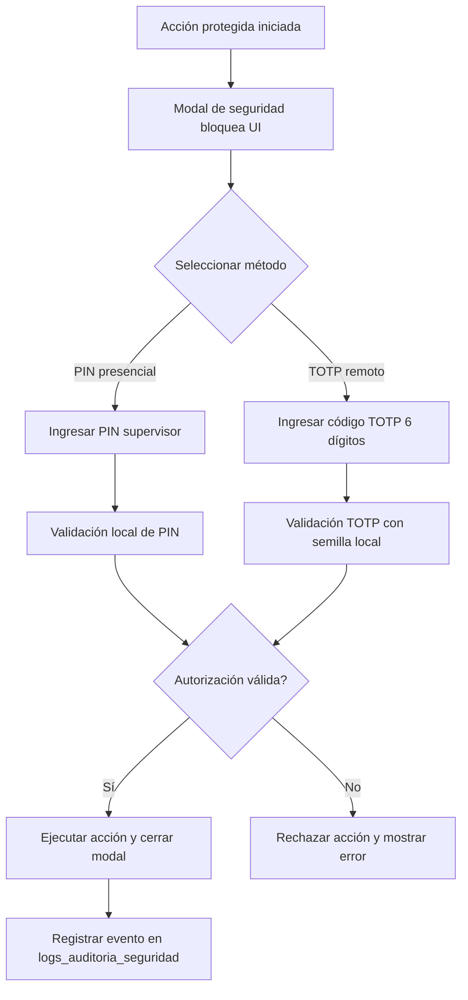

# Módulo de Identidad, Acceso y Seguridad (RBAC y Cash Control)

Este PRD define las especificaciones de seguridad, autenticación distribuida, control de acceso basado en roles (RBAC) y modelos de control de flujo de efectivo para el ecosistema FlexiPoint. Garantiza que las operaciones críticas estén protegidas y auditadas bajo esquemas híbridos, permitiendo la continuidad operativa con o sin conectividad a internet.

## 1. Arquitectura de Seguridad y Topologías de Hardware

La autenticación y el control de efectivo deben operar con tolerancia a fallos total, adaptándose a la infraestructura disponible:

### Topología A: Entorno Híbrido (Servidor Local Edge + Tablets + KDS)

- Sincronización de Credenciales: El nodo local (Local Edge) replica y mantiene en caché una base de datos local cifrada con los hashes de las credenciales de los usuarios, códigos PIN y políticas RBAC.
- Centralización del Estado de Caja: El estado de las cajas (aperturas, arqueos, cierres) se consolida en tiempo real en el servidor local vía WebSockets. Las tablets consultan al nodo local para validar si un mesero tiene una sesión de efectivo activa antes de permitirle tomar una comanda.
- Autorización Remota Local: Las solicitudes de escalación de privilegios (PIN de supervisor) se transmiten por la red local a las terminales autorizadas de manera instantánea.

### Topología B: Formato Ultra-Ligero (Smart POS / Única Tablet Autónoma)

- Criptografía Enclave Local: La tablet almacena localmente los hashes criptográficos (utilizando PBKDF2 o Argon2) de los usuarios asignados a ese dispositivo específico dentro de un almacenamiento seguro y aislado (IndexedDB cifrado / Secure Storage nativo).
- Control de Caja Autónomo: El modelo de flujo de efectivo se procesa de manera estrictamente local en el storage de la tablet. Al recuperar conexión, los eventos de auditoría, cierres de turno y logs de seguridad se transmiten en bloque con firmas criptográficas de no repudio hacia la nube.

## 2. Especificación de Componentes Core

### 1. Login Híbrido Cifrado (Online / Offline)

- Requerimiento Funcional: Permitir el inicio de sesión de cajeros, meseros y administradores sin importar el estado de la conexión a internet, previniendo la suplantación de identidad y garantizando que el cambio de turno ocurra sin fricciones.
- Mecanismo de Autenticación de Doble Vía:
  - Modo Online: La terminal envía las credenciales (Usuario/Contraseña o PIN) al API de la nube mediante HTTPS/TLS 1.3. La nube retorna un JSON Web Token (JWT) de corta duración junto con el set de permisos actualizado.
  - Modo Offline: Si el API no responde, la terminal conmuta automáticamente a validación local. El sistema procesa el PIN o contraseña ingresada aplicando el algoritmo de hashing contra el registro guardado localmente en la base de datos embebida. Si coincide, genera un token de sesión local restringido.
  - Seguridad: Queda estrictamente prohibido guardar el PIN o contraseña en texto plano en la base de datos local o en memoria.

### 2. Permisos Basados en Roles (RBAC)

- Requerimiento Funcional: Restringir las vistas, acciones y flujos del sistema FOH y BOH de acuerdo con el rol asignado al empleado. El sistema debe evaluar los permisos a nivel de interfaz de usuario (ocultar/bloquear botones) y a nivel de API/Base de datos.

| Permiso / Acción Crítica | Administrador | Supervisor | Cajero | Mesero |
| --- | --- | --- | --- | --- |
| Abrir/Cerrar Turno de Caja | ✓ | ✓ | ✓ | ✗ |
| Tomar Comandas / Enviar a Cocina | ✓ | ✓ | ✓ | ✓ |
| Aplicar Descuentos / Cortesías | ✓ | ✓ | ✗ | ✗ |
| Anular Ítems de una Cuenta Abierta | ✓ | ✓ | ✗ | ✗ |
| Anular Factura Emitida (Void Ticket) | ✓ | ✓ | ✗ | ✗ |
| Modificar Recetas e Insumos (BOH) | ✓ | ✗ | ✗ | ✗ |
| Visualizar Reportes X / Z de Caja | ✓ | ✓ | ✗ | ✗ |

### 3. Control de Flujo de Efectivo Configurable (Cash Control)

- Requerimiento Funcional: El sistema debe soportar dos modelos operativos de flujo de efectivo independientes, configurables desde el Backoffice central de acuerdo con las políticas logísticas de cada negocio:

### Modelo A: Centralizado (Caja Única / Estación de Pago)

- Las tablets (comanderas) solo registran pedidos y los envían a las cuentas en retención (mesas).
- El dinero en efectivo y las terminales de tarjetas (POS bancarios) están concentrados físicamente en una sola estación central administrada por un Cajero.
- El proceso de facturación y el arqueo se realizan exclusivamente sobre la gaveta de dinero vinculada a esa estación central.

### Modelo B: Descentralizado (Cartera de Meseros / Wallet Personal)

- Cada Mesero actúa como su propia caja registradora móvil. Abre un "Turno de Efectivo Personal" al iniciar el día con un monto de apertura (fondo/sencillo).
- El mesero toma el pedido, procesa el pago directo en la mesa (en efectivo o con Smart POS inalámbrico) y resguarda el dinero físicamente en su cartera personal.
- Al finalizar el turno, el sistema exige un proceso de Cierre de Cartera de Mesero, cruzando el total teórico cobrado frente al efectivo entregado por el empleado al administrador.

### 4. PIN de Supervisor (Override Lockout) y Autorización Remota TOTP

- Requerimiento Funcional: Cuando un cajero o mesero intenta realizar una acción restringida (ej. anular un plato ya enviado a cocina, aplicar descuento del 20%), la UI debe desplegar un modal de bloqueo (Security Lockout). El flujo se detiene hasta que se conceda la autorización correspondiente.
- Métodos de Autorización:
  - Presencial (PIN de Supervisor): El supervisor digita su código PIN de 4 o 6 dígitos directamente en la pantalla del dispositivo que solicita el permiso. El sistema valida el privilegio localmente y desbloquea la acción por una única transacción.
  - Remota (Algoritmo TOTP - Time-Based One-Time Password): Si el supervisor no se encuentra físicamente en la sucursal (común en negocios operados por sus dueños de forma remota), el administrador puede abrir una app móvil (ej. Google Authenticator) ligada a FlexiPoint. La tablet local permite ingresar el token numérico dinámico de 6 dígitos generado por el algoritmo TOTP. El sistema descifra el token usando la llave semilla local (Secret Seed) y concede el acceso sin requerir conexión a internet.

### 5. Registro Defensivo de Gaveta (Drawer Logs)

- Requerimiento Funcional: Controlar la apertura física de la gaveta de dinero conectada a la impresora térmica mediante el pulso de 24V (RJ11).
- Comportamiento de Auditoría:
  - Toda apertura de gaveta que ocurra fuera del proceso normal de imprimir una factura de venta (ej. para dar cambio a un cliente, corregir un fajo de billetes) debe requerir autorización de supervisor.
  - El sistema registrará de forma obligatoria e inmutable un evento tipo DRAWER_OPENED_MANUALLY especificando la justificación, ID de usuario, fecha, hora y el ID del supervisor que lo aprobó.

## 3. Modelo de Datos Entidad-Relación (Estructura de Seguridad)

Para garantizar el cumplimiento de RBAC, el control inmutable de sesiones de efectivo y las bitácoras de auditoría, se define el siguiente esquema relacional:

```sql
-- Catálogo de Usuarios del sistema
CREATE TABLE usuarios (
    id UUID PRIMARY KEY,
    username VARCHAR(50) UNIQUE NOT NULL,
    nombre_completo VARCHAR(150) NOT NULL,
    password_hash VARCHAR(255) NOT NULL, -- Almacena el hash Argon2/PBKDF2
    pin_seguridad_hash VARCHAR(255) NOT NULL, -- Hash del PIN de autorización rápida
    rol_id VARCHAR(30) NOT NULL, -- 'ADMIN', 'SUPERVISOR', 'CAJERO', 'MESERO'
    totp_secret_seed VARCHAR(128) NULL, -- Semilla cifrada para validación remota sin internet
    activo BOOLEAN DEFAULT TRUE
);

-- Control de Turnos y Sesiones de Efectivo (Soporta Caja Única o Cartera de Mesero)
CREATE TABLE turnos_caja (
    id UUID PRIMARY KEY,
    tipo_modelo VARCHAR(30) NOT NULL, -- 'CAJA_CENTRAL', 'CARTERA_MESERO'
    usuario_id UUID REFERENCES usuarios(id),
    terminal_id VARCHAR(50) NOT NULL,
    
    fecha_apertura TIMESTAMP NOT NULL,
    fecha_cierre TIMESTAMP,
    estado VARCHAR(20) DEFAULT 'ABIERTO', -- 'ABIERTO', 'CERRADO', 'AUDITADO'
    
    -- Montos de Control (Siempre consolidados en Córdobas - NIO)
    monto_apertura_nio NUMERIC(12,4) NOT NULL,
    monto_cierre_teorico_nio NUMERIC(12,4) DEFAULT 0.0000, -- Suma de ventas en efectivo + entradas - salidas
    monto_cierre_real_nio NUMERIC(12,4) DEFAULT 0.0000,    -- Lo que el empleado contó físicamente
    monto_diferencia_nio NUMERIC(12,4) DEFAULT 0.0000,     -- Faltante o Sobrante
    
    observaciones TEXT
);

-- Bitácora de Auditoría de Acciones Críticas (Inmutable y Forense)
CREATE TABLE logs_auditoria_seguridad (
    id BIGSERIAL PRIMARY KEY,
    fecha_evento TIMESTAMP NOT NULL,
    usuario_operador_id UUID REFERENCES usuarios(id),
    usuario_autorizador_id UUID REFERENCES usuarios(id) NULL, -- Quien puso el PIN o generó el TOTP
    
    tipo_accion VARCHAR(50) NOT NULL, 
    -- 'ANULACION_ITEM', 'FACTURA_ANULADA', 'DESCUENTO_APLICADO', 'APERTURA_GAVETA_MANUAL'
    
    modulo_origen VARCHAR(30) NOT NULL, -- 'FOH_VENTAS', 'BOH_INVENTARIO'
    documento_referencia_id UUID NOT NULL, -- ID del Ticket, Batch o Turno afectado
    
    descripcion_detallada TEXT NOT NULL,
    metodo_autorizacion VARCHAR(30) NOT NULL -- 'DIRECTO', 'PIN_PRESENCIAL', 'TOTP_REMOTO'
);
```

## 4. Matriz de Casos de Uso Críticos (Edge Cases)

| ID | Caso de Uso / Escenario | Comportamiento Esperado del Sistema |
| --- | --- | --- |
| UC-01 | Un mesero intenta aplicar un descuento del 15% a una mesa desde una tablet sin internet (Topología B). | La UI bloquea la acción y muestra la pantalla de requerimiento de credenciales. El supervisor digita su PIN. La tablet cifra el PIN, lo contrasta contra el hash en su storage local IndexedDB, confirma el permiso y desbloquea el descuento. El log guarda el evento localmente para su posterior sincronización. |
| UC-02 | El dueño del restaurante está fuera del país y el supervisor en sitio falta. El cajero necesita anular una factura mal emitida de C$3,500. | El sistema solicita autorización. El cajero llama al dueño. El dueño abre su app de autenticación y le dicta un código de 6 dígitos. El cajero lo ingresa. El motor local valida matemáticamente el TOTP usando la semilla estática guardada en la terminal. Al coincidir, procesa la anulación de forma inmediata y segura. |
| UC-03 | Bajo el modelo de Cartera de Meseros, se corta la luz a mitad de un turno y se debe realizar un arqueo manual de emergencia. | Al restablecerse el dispositivo (Smart POS con batería), el mesero ejecuta el cierre. El sistema muestra en pantalla el total acumulado cobrado en efectivo por ese usuario específico basándose en los tickets cerrados localmente en SQLite, permitiendo un cuadre exacto contra el dinero físico de su cartera. |
| UC-04 | Un cajero intenta burlar el sistema modificando la hora de la tablet local para reabrir un turno de caja del día anterior. | El sistema implementa una regla de validación cruzada cronológica: toda marca de tiempo de una transacción debe ser mayor o igual a la marca de tiempo de la última transacción registrada en la base de datos local (fecha_evento > MAX(fecha_movimiento)). Si el dispositivo reporta una hora menor, el sistema se bloquea por completo (Anti-Tampering Lock) exigiendo clave maestra. |

## 5. Requerimientos No Funcionales (NFR) de Ingeniería de Seguridad

- Inmutabilidad y No Repudio: La tabla logs_auditoria_seguridad utiliza una secuencia estricta basada en base de datos (BIGSERIAL). Cualquier brecha o salto en el orden secuencial de los IDs generará una alerta de integridad estructural automática en el Backoffice en la nube durante los procesos de auditoría nocturna.
- Velocidad de Validación de Privilegios: La resolución del PIN presencial en el modal de bloqueo FOH debe tomar menos de 30ms a nivel de motor de datos local, asegurando que el flujo de atención al cliente en la fila no se degrade durante periodos de alta transaccionalidad (Rush Hours).
- Cifrado de Datos en Reposo (At-Rest): En las tablets autónomas (Topología B), los datos sensibles de configuración (como el totp_secret_seed de la sucursal y los hashes de los PINs) deben almacenarse utilizando algoritmos de cifrado simétrico AES-256, utilizando una llave de derivación asociada al hardware único del dispositivo (Hardware-Bound Key).

## 6. Secuencia de Flujo: Flujo de Autorización de Privilegios en Pantalla

A continuación, se detalla la experiencia interactiva secuencial para la escalación de permisos táctiles durante el servicio en el FOH:

### Interacción de Seguridad en FOH



1. Activación de Restricción: El empleado realiza una acción protegida (ej. presionar el botón "Eliminar Ítem" de un plato que ya está imprimiéndose en cocina). La pantalla de la orden se difumina y emerge el modal de bloqueo táctil de seguridad.
2. Opciones de Validación: El modal presenta dos alternativas claras de ingreso de credenciales de seguridad: un teclado numérico táctil para la introducción del PIN del supervisor presencial o un campo para el código dinámico de 6 dígitos (TOTP Remoto).
3. Procesamiento Local o Desafío: El motor de seguridad local evalúa el código. Si es PIN, ejecuta el hashing inmediato y compara contra el store local; si es TOTP, corre el algoritmo matemático contrastando la marca de tiempo actual contra la semilla local.
4. Desbloqueo e Inyección de Bitácora: Al ser aprobada la credencial, el modal se cierra, la acción en el ticket se ejecuta y el sistema escribe de forma atómica e inmutable el registro en la tabla logs_auditoria_seguridad, vinculando al supervisor como autorizador responsable.

Nota de Seguridad de Campo: En caso de que se introduzca un PIN erróneo en más de 3 intentos consecutivos en un lapso menor a 60 segundos, la terminal FOH bloqueará la funcionalidad de autorización por PIN durante 5 minutos para mitigar ataques de fuerza bruta, forzando a que la siguiente validación deba realizarse exclusivamente por el método de token TOTP Remoto o mediante clave de Administrador General.
