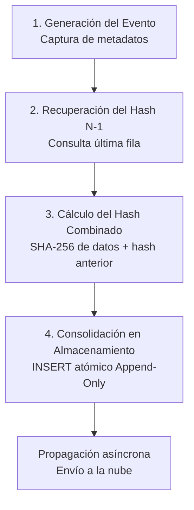

# Módulo Especializado: Auditoría y Bitácora de Eventos (Audit Trail)

Este PRD define las especificaciones técnicas, reglas de negocio y estructuras de datos para el módulo de Auditoría y Bitácora de Eventos (Audit Trail) de FlexiPoint. Este componente transversal actúa como la caja negra del sistema, registrando de forma inmutable, cronológica y con firmas criptográficas de no repudio cualquier evento crítico, operativo o de configuración, garantizando la detección temprana de fraudes tanto en esquemas locales como en la nube.

## 1. Arquitectura de Seguridad y Topologías de Resiliencia

El sistema de auditoría debe capturar eventos de forma continua, asegurando que los registros estén protegidos contra intentos de manipulación física o lógica por parte de usuarios locales:

### Topología A: Entorno Híbrido (Servidor Local Edge + Tablets + KDS)

- Centralización Local de Logs: Las tablets y el KDS transmiten en tiempo real cada evento de auditoría hacia el servidor central local (Local Edge) mediante WebSockets seguros (WSS). El nodo local consolida la bitácora en una base de datos relacional optimizada para escritura secuencial rápida.
- Sincronización Duplicada Asíncrona: El nodo local empaqueta los logs firmados digitalmente y los transmite hacia la nube mediante canales HTTPS en segundo plano. Si se pierde la conexión WAN, los logs se resguardan localmente y se prohíbe el vaciado de búferes hasta recibir el ACK de confirmación de la nube.

### Topología B: Formato Ultra-Ligero (Smart POS / Única Tablet Autónoma)

- Almacenamiento Local Cifrado de Cola Única: La tablet escribe los registros de auditoría directamente en su base de datos embebida utilizando una arquitectura de base de datos Append-Only basada en SQLite.
- Prevención de Alteración en Reposo: El archivo de base de datos local está cifrado a nivel de bloque (SQLCipher) con claves derivadas del hardware del dispositivo. Al recuperar conectividad, la tablet transmite la cola de eventos aplicando un patrón de sincronización por deltas indexados para evitar colisiones.

## 2. Especificación de Componentes Core

### 1. Registro de Acciones de Riesgo y Eventos Críticos

- Requerimiento Funcional: Capturar de forma automática y con nivel de detalle forense cualquier acción que afecte las finanzas, la configuración fiscal o la estructura de seguridad del restaurante o comercio.
- Clasificación Obligatoria de Niveles de Riesgo:
  - CRITICAL (Riesgo Fiscal/Financiero): Anulación de tickets emitidos (Voids), reapertura de turnos de caja cerrados, aplicación de exenciones de IVA manuales, modificación histórica de costos de inventario ($CPP$), y uso de tokens TOTP remotos.
  - WARNING (Riesgo Operativo): Eliminación de ítems de una cuenta retenida (Hold Ticket), apertura manual de la gaveta de dinero sin venta, cambios en los rendimientos de recetas de producción, e intentos fallidos de login o introducción de PIN de supervisor.
  - INFO (Trazabilidad Estándar): Apertura/Cierre ordinario de turnos, inicio de sesión de personal, envío de comandas a cocina y sincronización exitosa de datos.

### 2. Protección Anti-Fraude Local e Inmutabilidad de Logs

- Requerimiento Funcional: Implementar mecanismos técnicos drásticos que impidan que un usuario con privilegios elevados de administrador local (como un gerente de sucursal malintencionado) pueda borrar o modificar las trazas de sus acciones en la base de datos local.
- Mecanismos Técnicos de Blindaje:
  - Arquitectura de Datos Append-Only: La base de datos del módulo de auditoría carece por diseño de instrucciones UPDATE o DELETE. El motor solo acepta instrucciones INSERT.
  - Encadenamiento Criptográfico de Registros (Log Chaining): Cada nuevo registro de auditoría insertado debe generar un hash criptográfico (SHA-256) que combine: el contenido del evento actual + la marca de tiempo exacta + el hash del registro inmediatamente anterior (fila $N-1$). Si una fila intermedia es alterada o eliminada manualmente mediante software externo, la cadena completa se rompe y el sistema se bloquea automáticamente por violación de integridad (Tamper Detection).
  - Detección de Manipulación de Reloj (Clock Skew Protection): Si un usuario altera deliberadamente la hora del sistema operativo del dispositivo para intentar insertar un log en el pasado, el backend local rechazará la transacción si la hora enviada es menor que el timestamp del último registro de la tabla.

### 3. Bloqueo de Eliminación y Degradación de Usuarios

- Requerimiento Funcional: Impedir la destrucción de registros de identidad para proteger el histórico del histórico de transacciones. Ningún usuario dentro de FlexiPoint puede ser borrado físicamente de la base de datos.
- Reglas de Ciclo de Vida de Identidad:
  - Inactivación en lugar de Borrado: Las solicitudes de borrado se traducen lógicamente en un cambio de estado: activo = FALSE y fecha_baja = NOW(). El usuario pierde el acceso físico al sistema pero sus llaves foráneas en tickets, compras y mermas permanecen intactas.
  - Protección del Super-Administrador (Root Lock): El sistema bloqueará de forma absoluta cualquier intento de inactivar o remover permisos al usuario creador principal de la cuenta del negocio o al rol de administrador general de la sucursal, evitando bloqueos accidentales o maliciosos de la cuenta (Lockout Paradox).

### 4. Monitor de Discrepancias FOH vs BOH (Smart Reconciliation)

- Requerimiento Funcional: Un motor automatizado que analiza y cruza de manera asíncrona las bitácoras de auditoría de ventas frente a los movimientos físicos del inventario para detectar inconsistencias comunes de fraude (ej. Despacho de platillos en cocina mediante KDS que no figuran como pagados o registrados en retención en las cajas).
- Comportamiento Alerta: Generará un evento de nivel CRITICAL en la bitácora si detecta que se ejecutó un batch de producción o una comanda en el KDS sin un identificador de ticket o sesión de efectivo activo correlativo.

## 3. Modelo de Datos Entidad-Relación (Estructura de Auditoría Forense)

Para soportar la inmutabilidad basada en cadenas criptográficas de bloques y el aislamiento de datos, se define el siguiente esquema de base de datos relacional especializado:

```sql
-- Bitácora de Auditoría Maestra e Inmutable (Caja Negra)
CREATE TABLE bitacora_audit_trail (
    id BIGSERIAL PRIMARY KEY, -- Secuencial incremental estricto
    uuid_evento UUID UNIQUE NOT NULL DEFAULT gen_random_uuid(),
    
    nivel_riesgo VARCHAR(15) NOT NULL, -- 'CRITICAL', 'WARNING', 'INFO'
    tipo_evento VARCHAR(50) NOT NULL,   -- 'TICKET_VOID', 'USER_DEACTIVATED', 'DRAWER_MANUAL_OPEN'
    modulo_origen VARCHAR(30) NOT NULL, -- 'FOH_SALES', 'BOH_INVENTORY', 'RBAC_SECURITY'
    
    fecha_timestamp SERVER_TIMESTAMP NOT NULL, -- Estampado por el motor de base de datos, no por el cliente
    usuario_operador_id UUID NOT NULL, -- ID del empleado ejecutor
    usuario_autorizador_id UUID NULL,  -- ID del supervisor si requirió escalación por PIN/TOTP
    terminal_id VARCHAR(50) NOT NULL,
    sucursal_id VARCHAR(50) NOT NULL,
    
    -- Contenido en formato semiestructurado JSONB para máxima flexibilidad de metadatos
    detalles_payload_jsonb JSONB NOT NULL, 
    -- Ejemplo: {"ticket_id": "...", "monto_anulado": 1500.00, "motivo": "Error de digitación"}
    
    -- Dirección IP y MAC del hardware local para auditoría de red
    direccion_ip VARCHAR(45) NOT NULL,
    
    -- Componentes de Integridad Criptográfica Anti-Tamper
    hash_registro_actual CHAR(64) NOT NULL,   -- HASH_SHA256(todo_el_contenido_de_la_fila)
    hash_registro_anterior CHAR(64) NOT NULL  -- Copia del hash_registro_actual de la fila (id - 1)
);

-- Índice optimizado para búsquedas forenses rápidas por tipo de riesgo y fechas
CREATE INDEX idx_audit_busqueda_forense ON bitacora_audit_trail (nivel_riesgo, fecha_timestamp DESC);
```

## 4. Matriz de Casos de Uso Críticos (Edge Cases)

ID | Caso de Uso / Escenario | Comportamiento Esperado del Sistema
--- | --- | ---
UC-01 | Un gerente con acceso directo a la base de datos local SQLite de una tablet (Topología B) modifica un registro antiguo de auditoría usando un editor externo para ocultar una anulación de ticket. | "Al iniciar el sistema FlexiPoint en el siguiente turno, el servicio de verificación arranca una rutina de escaneo total. Al llegar a la fila modificada, recalcula su SHA-256. Al notar que el valor no coincide con el hash guardado ni con el hash heredado por la fila posterior (N+1), rompe la validación e inhabilita las pantallas mostrando un error crítico de corrupción, notificando inmediatamente a la nube."
UC-02 | "Un administrador de sucursal intenta eliminar el usuario de un cajero que fue despedido para ""limpiar"" el catálogo de la sucursal." | "La interfaz web o local intercepta el botón de borrado físico. El sistema despliega un mensaje informativo explicativo: ""Por regulaciones fiscales y de auditoría, los usuarios no pueden ser eliminados. El usuario se marcará como inactivo"". El sistema actualiza el estado, cierra de forma forzada cualquier sesión activa de ese empleado y registra la traza del cambio."
UC-03 | Pérdida de alimentación eléctrica total (apagón) justo en el milisegundo en que se procesaba una anulación de ticket crítica. | "La base de datos local opera bajo el principio de transacciones atómicas WAL (Write-Ahead Logging). Al reiniciar el hardware, la base de datos se recupera automáticamente: o aplica el registro completo inmutable de la bitácora junto con la anulación del ticket, o hace un rollback completo al estado previo al fallo, garantizando que nunca queden registros parciales o huerfanos."
UC-04 | Intento de alteración masiva coordinada de registros simulando ataques informáticos internos. | El sistema almacena una copia paralela simplificada de los hashes de control del Audit Trail en un almacenamiento volátil pero persistente protegido por el sistema operativo. Cualquier discrepancia masiva dispara un bloqueo de seguridad preventiva (Panic Mode) deshabilitando la comunicación de la terminal.

## 5. Requerimientos No Funcionales (NFR) e Ingeniería de Software

- Rendimiento de Escritura no Bloqueante: La inserción de los registros en la tabla bitacora_audit_trail debe ejecutarse de forma asíncrona en un hilo de ejecución secundario (Background Worker) para evitar que los cálculos de criptografía y hashing añadan latencia al flujo principal del FOH, garantizando un tiempo de respuesta de caja inferior a 10ms.
- Retención de Datos Local Extendida: Las terminales autónomas y los servidores locales mantendrán los datos comprimidos del Audit Trail localmente por un periodo mínimo obligatorio de 90 días naturales antes de permitir la purga automática de registros antiguos que ya cuenten con confirmación absoluta de respaldo en la nube.
- Políticas de No Repudio: Los payloads guardados en formato JSONB no deben contener bajo ninguna circunstancia datos sensibles expuestos de tarjetas de crédito o credenciales en texto plano (cumplimiento estricto de normas PCI-DSS).

## 6. Secuencia de Flujo: Validación y Encadenamiento del Audit Trail

El siguiente diagrama detalla la lógica secuencial matemática que ejecuta el motor de datos local en cada inserción para garantizar el blindaje criptográfico de la bitácora:

### Flujo Lógico de Inmutabilidad (Log Chaining)



1. Generación del Evento: Captura de metadatos. Ocurre la acción de riesgo en el sistema (ej. Anulación de Factura). El backend empaqueta los datos contextuales, el payload JSONB, los identificadores de terminal y el timestamp nativo inalterable de la base de datos.
2. Recuperación del Hash N-1: Enlace del bloque anterior. El motor de datos consulta la última fila insertada en la tabla (MAX(id)), lee el valor del campo hash_registro_actual del evento anterior y lo inyecta dentro del parámetro hash_registro_anterior de la nueva transacción.
3. Cálculo del Hash Combinado: Criptografía secuencial. El backend ejecuta el algoritmo hash SHA-256 sobre el bloque consolidado de datos concatenando la información del Paso 1 con el hash del Paso 2, produciendo la huella digital criptográfica única para el nuevo registro.
4. Consolidación en Almacenamiento: Inserción Append-Only. Se ejecuta el comando INSERT atómico de la fila en la tabla de auditoría local. Una vez guardado con éxito, se habilita la propagación asíncrona hacia el servicio web central en la nube, asegurando el almacenamiento duplicado.
