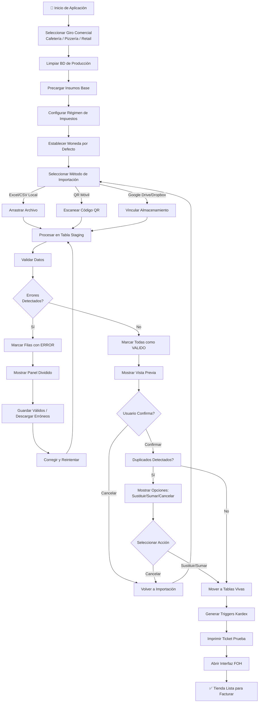

# Módulo Especializado: Automatización de Onboarding (Venta Rápida)

Este PRD define las especificaciones funcionales, técnicas y los flujos de experiencia para el módulo de Automatización de Onboarding y Configuración Acelerada de FlexiPoint. El objetivo primordial de este componente es reducir el tiempo de implementación de la plataforma a menos de 15 minutos (Zero-Friction Setup), permitiendo a nuevos comercios y restaurantes cargar sus catálogos, configurar sus recetas base y comenzar a vender inmediatamente a través del FOH, sin importar su topología de hardware.

## 1. Arquitectura de Despliegue y Topologías de Aprovisionamiento

La inicialización del sistema debe completarse con éxito tanto en escenarios con infraestructura dedicada como en configuraciones móviles simplificadas:

### Topología A: Entorno Híbrido (Servidor Local Edge + Tablets + KDS)

- Orquestación en la Nube y Despliegue Local: El proceso de onboarding se ejecuta de manera ideal en el Backoffice web en la nube debido a la comodidad de manipulación de archivos extensos (Excel/CSV). Una vez validada y procesada la importación, la nube empaqueta el estado inicial de la base de datos y lo distribuye en un solo bloque comprimido (Seed SQLite/PostgreSQL) hacia el servidor central local (Local Edge).
- Aprovisionamiento de Nodos Hijos: El servidor local inicializado distribuye las credenciales de seguridad, el catálogo de productos y el mapa impositivo a todas las tablets y pantallas de KDS de la red local mediante WebSockets en cuestión de segundos.

### Topología B: Formato Ultra-Ligero (Smart POS / Única Tablet Autónoma)

- Onboarding Nativo/Móvil: Dado que el cliente opera únicamente con una tablet, el sistema debe permitir la inicialización directa desde el dispositivo móvil.
- Importación por Canales Alternos: La tablet habilita una interfaz simplificada que acepta la carga de archivos a través de almacenamiento en la nube (Google Drive, Dropbox) o mediante la lectura de un código QR que vincula un asistente web de configuración rápida completado desde el teléfono celular del dueño del negocio. Los datos se inyectan directamente en el storage cifrado local.

## 2. Especificación de Componentes Core

### 1. Módulo de Importación Masiva e Inteligente (Excel / CSV)

- Requerimiento Funcional: Permitir a los usuarios cargar cientos de productos, categorías, precios y stock inicial mediante una plantilla estandarizada de hojas de cálculo, minimizando los errores manuales de tipado y mapeo de datos.
- Comportamiento Lógico y Resiliencia del Motor:
  - Validación Estricta en Pre-view: El sistema no debe insertar datos directamente a las tablas de producción. El archivo cargado se procesa en una tabla temporal de transiciones (staging). La interfaz gráfica muestra una pre-visualización de los datos parseados y resalta en rojo las filas que presenten errores lógicos (ej. Precios negativos, SKUs duplicados, códigos de barras inválidos, o campos impositivos sin concordancia legal con la DGI).
  - Mapeador Dinámico de Columnas: Si el cliente utiliza un formato propio exportado desde otro POS de la competencia (ej. Clover, Loyverse), la UI permite arrastrar y enlazar visualmente las columnas del archivo importado con los campos obligatorios de FlexiPoint (ej. Vincular "Item Name" con nombre_producto).

### 2. Base de Datos de Insumos Predeterminada y Librería de Plantillas

- Requerimiento Funcional: Diseñado para comercios que inician desde cero y no tienen un inventario estructurado. El sistema proveerá catálogos pre-configurados de insumos, materias primas y recetas base parametrizadas según el giro específico del negocio (ej. Cafetería, Pizzería, Hamburguesería, Tienda de Conveniencia).
- Reglas de Negocio del Repositorio:
  - Inyección Selectiva: Al seleccionar una plantilla (ej. "Cafetería Estándar"), el sistema inyecta automáticamente en el maestro de inventario los insumos típicos (Leche entera, Café en grano, Azúcar, Vasos de 8oz, Vasos de 12oz) con sus respectivas unidades de medida estandarizadas (Gramos, Mililitros, Unidades).
  - Pre-BOM Estructural: Las plantillas incluyen las relaciones del Bill of Materials (BOM) pre-armadas pero con valores de costo en cero (ej. Un "Café Latte" viene pre-configurado para descontar 18g de café en grano y 250ml de leche). El usuario solo debe ajustar el precio de venta y el costo de compra de sus proveedores para activar la rueda del inventario.

### 3. Asistente de Configuración Fiscal Dirigida (Fiscal Setup Wizard)

- Requerimiento Funcional: Para evitar multas y garantizar la legalidad operativa desde el primer ticket emitido, el onboarding incluirá un flujo secuencial obligatorio que configura el motor impositivo de Nicaragua de forma guiada y sin tecnicismos contables complejos.
- Parámetros de Inicialización:
  - El usuario selecciona su régimen de contribución (ej. Cuota Fija, Régimen General). El sistema auto-configura si las facturas deben desglosar el IVA (15%) de forma explícita o si los precios cargados ya lo incluyen de manera implícita.
  - Configuración automática del Tipo de Cambio Comercial de caja sugiriendo un diferencial estándar (ej. +0.50 Córdobas sobre el Oficial) para proteger el fondo de caja en transacciones multi-moneda desde el Día 1.

## 3. Modelo de Datos Entidad-Relación (Estructura de Onboarding)

Para procesar las importaciones de manera segura mediante capas de aislamiento y almacenar las plantillas globales del sistema, se define la siguiente arquitectura de datos relacional:

```sql
-- Catálogo Global de Plantillas de Industria (Mantenido por FlexiPoint en la Nube)
CREATE TABLE plantillas_industria (
    id VARCHAR(30) PRIMARY KEY, -- 'BAR_RESTAURANTE', 'CAFETERIA', 'RETAIL_MINIMARKET'
    nombre_industria VARCHAR(100) NOT NULL,
    descripcion TEXT
);

-- Tabla de Staging para el procesamiento intermedio de Importaciones Masivas
CREATE TABLE staging_importacion_productos (
    id BIGSERIAL PRIMARY KEY,
    token_sesion_importacion UUID NOT NULL, -- Identifica el lote del archivo subido
    
    -- Campos en crudo (Varchar) para permitir la captura de errores sin truncar la base de datos
    raw_nombre VARCHAR(255),
    raw_sku VARCHAR(100),
    raw_precio_venta VARCHAR(50),
    raw_costo_insumo VARCHAR(50),
    raw_categoria VARCHAR(100),
    raw_porcentaje_iva VARCHAR(50),
    
    -- Estado de la validación
    estado_fila VARCHAR(20) DEFAULT 'PENDIENTE', -- 'PENDIENTE', 'VALIDO', 'ERROR'
    mensaje_error_detalle TEXT NULL
);

-- Relación de Insumos base dentro de una plantilla industrial para auto-onboarding
CREATE TABLE plantilla_insumos_predeterminados (
    id UUID PRIMARY KEY,
    plantilla_id VARCHAR(30) REFERENCES plantillas_industria(id),
    nombre_insumo VARCHAR(150) NOT NULL,
    unidad_medida_sugerida VARCHAR(20) NOT NULL,
    categoria_insumo VARCHAR(50) NOT NULL
);
```

## 4. Matriz de Casos de Uso Críticos (Edge Cases)

| ID | Caso de Uso / Escenario | Comportamiento Esperado del Sistema |
| --- | --- | --- |
| UC-01 | Un usuario intenta subir un archivo Excel con 1,500 productos donde 20 filas tienen el precio con texto (ej. "C$25.00" o "Gratis") en vez de formato puramente numérico. | El motor de importación procesa el archivo completo en la tabla staging. Identifica las 1,480 filas correctas como VALIDO y las 20 erróneas como ERROR. En pantalla muestra un panel dividido: permite procesar y guardar las 1,480 correctas inmediatamente, y descarga un archivo mini-Excel únicamente con las 20 filas fallidas y una columna extra detallando el motivo exacto del error para su corrección rápida. |
| UC-02 | Inicialización del onboarding en una Tablet Autónoma (Topología B) que se queda sin cobertura celular a mitad de la importación de la plantilla de insumos. | El asistente de onboarding embebido precarga los JSON de las plantillas esenciales dentro del instalador de la app. Si la red cae, el sistema conmuta al repositorio local empaquetado, inyectando los insumos base, la configuración impositiva y los esquemas estructurales de forma offline. El comercio puede empezar a facturar de inmediato; la vinculación con la cuenta global de la nube se encola. |
| UC-03 | El usuario sube dos veces seguidas el mismo archivo de inventario por desesperación o doble clic erróneo. | El sistema valida el token de sesión y comprueba la existencia de SKUs duplicados contra la tabla activa de productos en el mismo lote de tiempo. En lugar de duplicar los registros y corromper el inventario, el sistema despliega una alerta inteligente: "Se detectaron productos ya existentes. ¿Desea sustituir la información actual, sumar el stock entrante o cancelar la operación?". |
| UC-04 | El comercio carga una plantilla predeterminada de cafetería, pero modifica radicalmente las unidades (ej. cambia de gramos a onzas) de forma manual. | El motor de integridad lógica del BOH valida que si un insumo ya está vinculado a un Pre-BOM activo en staging, el cambio de unidad gatille un recálculo automático de conversión o emita una advertencia crítica para evitar que las recetas finales ejecuten explosiones con magnitudes incompatibles. |

## 5. Requerimientos No Funcionales (NFR) e Ingeniería de Performance

- Procesamiento Chunked para Archivos Masivos: Para evitar el agotamiento de la memoria RAM del servidor local o del Smart POS móvil, los archivos de importación superiores a 500 filas deben procesarse mediante flujos por fragmentos (Chunking Streams) de máximo 100 registros por lote, garantizando que la UI nunca se congele y mantenga una animación fluida de progreso.
- Idempotencia de Procesos: La API de importación masiva debe ser estrictamente idempotente a través del uso del token_sesion_importacion. Si la transacción de carga es interrumpida por caída de red, retransmitir el mismo token no causará duplicación de registros en la base de datos bajo ninguna circunstancia.
- Velocidad de Inicialización del Entorno: La creación del esquema, inyección de catálogos predeterminados y habilitación de los permisos RBAC iniciales del administrador no debe superar un tiempo total de ejecución de 3,500ms en dispositivos con hardware de gama media.

## 6. Secuencia de Flujo: Experiencia Guiada de Configuración Rápida

A continuación, se detalla la secuencia interactiva del asistente de onboarding que ejecutará el cliente al abrir la aplicación por primera vez en cualquier terminal táctil:

### Flujograma del Proceso de Onboarding



El usuario presiona "Confirmar y Activar Tienda". El sistema mueve de forma atómica los registros aprobados de staging hacia las tablas vivas de Productos e Insumos, genera los triggers iniciales del Kardex, imprime un ticket de prueba y abre la interfaz de ventas FOH lista para facturar.

**Regla de Aislamiento del Onboarding:** El motor de aprovisionamiento de plantillas industriales debe recibir de forma obligatoria el contexto del tenant_id autenticado. Queda estrictamente prohibido el uso de comandos globales de truncado de tablas. Toda operación de inserción, actualización o limpieza previa en staging/producción debe incluir la cláusula de partición o filtrado por inquilino, garantizando un Blast Radius (radio de impacto) igual a cero para el resto de los inquilinos de la plataforma.
