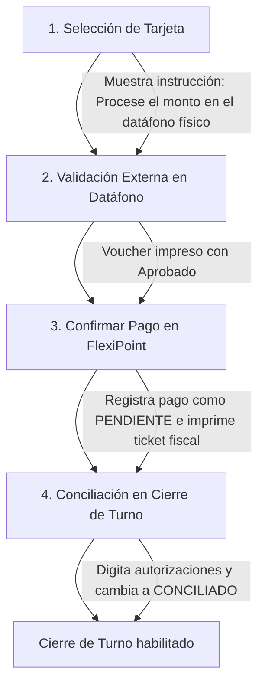

# Módulo Especializado: Procesamiento de Pagos y Datáfonos (Dos Capas)

Este PRD define las especificaciones funcionales, técnicas y de experiencia de usuario para el procesamiento de cobros con tarjetas de crédito/débito en FlexiPoint. El sistema está diseñado bajo un modelo de resiliencia operativa que optimiza el flujo en caja durante horas de alta concurrencia (Rush Hours), eliminando cuellos de botella mediante un esquema de conciliación desacoplada, apto para la infraestructura financiera de Nicaragua (BAC, BANPRO, LAFISE).

## 1. Arquitectura de Procesamiento y Topologías de Hardware

El módulo de pagos con tarjeta debe garantizar que el negocio pueda facturar rápido, adaptándose al nivel de conectividad y al equipamiento disponible:

### Topología A: Entorno Completo (All-In-One + Terminales Inalámbricas + Red Local)

- Desacoplamiento de Red: El punto de venta (POS) y el datáfono físico provisto por el banco adquirente operan en canales de comunicación independientes. El POS procesa la lógica fiscal y contable; el datáfono procesa la transacción financiera con la red de marcas (Visa/Mastercard).
- Sincronización de Estados de Venta: Las tablets comanderas mandan la cuenta a la estación central de cobro o procesan el pago directamente si cuentan con un datáfono móvil asignado.

### Topología B: Formato Ultra-Ligero (Smart POS / Única Tablet Autónoma)

- Operación Monolítica Coexistente: El cajero opera la aplicación FlexiPoint y manipula el datáfono físico de forma manual simultánea.
- Resiliencia Offline de Caja: Si la tablet se queda sin internet, el sistema permite seguir registrando los pagos con tarjeta (asumiendo que el datáfono bancario sí tiene red celular propia o línea telefónica para autorizar). FlexiPoint retiene el registro contable localmente de forma inmutable.

## 2. Especificación de Componentes Core

### 1. Flujo en Dos Capas Desacopladas (Modo Semiautomático por Defecto)

- Requerimiento Funcional: Ante la falta de APIs de integración directa y SDKs abiertos en los datáfonos de los adquirentes en Nicaragua, el sistema divide el proceso de cobro con tarjeta en dos capas aisladas: la financiera (responsabilidad del datáfono del banco) y la de registro de software (responsabilidad de FlexiPoint).

```text
+-------------------------------------------------------------------------+
|                  FLUJO EN DOS CAPAS DESACOPLADAS                        |
+-------------------------------------------------------------------------+

   [ Capa 1: Validación Financiera ]       [ Capa 2: Registro en Software ]
          (Datáfono del Banco)                       (FlexiPoint POS)
        +-----------------------+                +-----------------------+
        | Deslizar/Aproximar    |                | Seleccionar Pago      |
        | Tarjeta en Datáfono   |                | con Tarjeta en UI     |
        +-----------+-----------+                +-----------+-----------+
                    |                                        |
                    v                                        v
        +-----------------------+                +-----------------------+
        | Procesamiento de Red  |                | Almacenar Venta y     |
        |   (Visa / MasterCard) |                | Reservar Espacio de   |
        +-----------+-----------+                |  Código Voucher       |
                    |                            |-----------+-----------+
                    v                                        |
        +-----------------------+                            |
        | Emisión de Voucher    |                            v
        |   Impreso (Aprobado)  | -----------------> [ Conciliación Posterior ]
        +-----------------------+                     (Manual / Diferida / API)

```

- Comportamiento del Flujo:
  - El cajero selecciona "Tarjeta" como método de pago en FlexiPoint.
  - El sistema calcula el monto exacto (aplicando la moneda seleccionada, sea NIO o USD).
  - El cajero digita manualmente el monto en el datáfono físico del banco y procesa la tarjeta del cliente.
  - Una vez el datáfono imprime el voucher impreso de "Aprobado", el cajero presiona "Confirmar Pago" en la pantalla de FlexiPoint para cerrar la venta y liberar la orden de cocina, sin forzar el tipeo del código de autorización en ese instante.

### 2. Flexibilidad Operativa y Control de Concurrencia (Modo Fast-Checkout)

- Requerimiento Funcional: Evitar que la introducción del número de referencia o autorización del voucher físico se convierta en un retraso operativo durante picos de alta afluencia de clientes.
- Configuración Dinámica de Bloqueo (Reglas de Caja): El administrador del negocio podrá configurar tres niveles de restricción para el cierre de caja con tarjeta:
  - Nivel 1: Libre (Modo Rush Hour): El cajero cierra la venta con un solo tap. El sistema guarda la transacción con el campo codigo_autorizacion_voucher = 'PENDIENTE'. El ticket se emite de inmediato.
  - Nivel 2: Sugerido: La UI muestra un campo rápido para ingresar los últimos 4 dígitos del voucher, pero incluye un botón prominente de "Saltar / Agregar Después" que no bloquea el flujo.
  - Nivel 3: Estricto: Obliga a digitar el código de autorización antes de imprimir la factura (ideal únicamente para negocios de baja rotación o montos sumamente elevados).

### 3. Módulo de Conciliación Posterior y Cuadre de Turno (Reporte X/Z)

- Requerimiento Funcional: Proveer una herramienta eficiente al final del turno para que el cajero o supervisor asocie los códigos de los vouchers físicos acumulados con los tickets marcados como 'PENDIENTE'.
- Interfaz de Conciliación Táctica:
  - Una pantalla tipo grilla que lista únicamente los pagos con tarjeta que no tienen código asignado.
  - El cajero toma los vouchers de su gaveta (ordenados cronológicamente por el correlativo del POS) y digita consecutivamente los códigos de autorización.
  - Validación de Cierre de Caja: El sistema no permitirá realizar el Cierre de Turno definitivo (Reporte Z) si existen transacciones con tarjeta en estado 'PENDIENTE', forzando el cuadre de documentos antes de la entrega de valores al administrador.

### 4. Integración API y Automatización (Fase Posterior Certificable)

- Requerimiento Funcional: La arquitectura de software debe quedar preparada mediante interfaces de abstracción de código (Polimorfismo) para acoplar lectores de tarjetas integrados (ej. protocolos de comunicación serial RS232, TCP/IP local, Bluetooth o SDKs de SmartPOS Android) en el futuro, mutando del modo semiautomático al automático sin reescribir el core del checkout.

## 3. Modelo de Datos Entidad-Relación (Estructura de Pagos)

Para soportar los pagos en dos capas, la flexibilidad del registro diferido del voucher y la futura integración por API, se define la siguiente extensión al modelo relacional:

```sql
-- Extensión de Catálogo para identificar los Datáfonos Físicos de la tienda
CREATE TABLE datafonos_equipos (
    id UUID PRIMARY KEY,
    banco_adquirente VARCHAR(50) NOT NULL, -- 'BAC', 'BANPRO', 'LAFISE'
    numero_afiliacion VARCHAR(50) NOT NULL,
    terminal_id_banco VARCHAR(50) UNIQUE NOT NULL, -- Identificador físico del terminal
    tipo_conexion VARCHAR(30) DEFAULT 'AISLADO',   -- 'AISLADO', 'API_LOCAL', 'CLOUD_API'
    activo BOOLEAN DEFAULT TRUE
);

-- Detalle del procesamiento de tarjeta vinculado a la transacción del ticket
CREATE TABLE ticket_pagos_tarjeta (
    id UUID PRIMARY KEY,
    ticket_pago_id UUID NOT NULL, -- Relación directa con la tabla general de pagos
    datafono_id UUID REFERENCES datafonos_equipos(id) NULL,
    
    franquicia_tarjeta VARCHAR(30) NOT NULL, -- 'VISA', 'MASTERCARD', 'AMEX'
    tipo_tarjeta VARCHAR(20) NOT NULL,      -- 'CREDITO', 'DEBITO'
    
    -- Manejo del Voucher (Soporta flujo diferido/desacoplado)
    estado_conciliacion VARCHAR(20) DEFAULT 'PENDIENTE', -- 'PENDIENTE', 'CONCILIADO', 'MANUAL_OVERRIDE'
    codigo_autorizacion_voucher VARCHAR(50) NULL, -- Código de 6 dígitos del voucher del banco
    numero_lote_voucher VARCHAR(50) NULL,         -- Número de lote (Batch) del datáfono
    
    fecha_registro TIMESTAMP NOT NULL,
    fecha_conciliacion_posterior TIMESTAMP NULL,
    usuario_conciliador_id UUID NULL,
    
    -- Metadata para auditoría anti-fraude
    ultimos_cuatro_digitos CHAR(4) NULL
);

-- Índice para agilizar la pantalla de conciliación nocturna del cajero
CREATE INDEX idx_tarjetas_pendientes ON ticket_pagos_tarjeta (estado_conciliacion, fecha_registro ASC);
```

## 4. Matriz de Casos de Uso Críticos (Edge Cases)

| ID | Caso de Uso / Escenario | Comportamiento Esperado del Sistema |
| --- | --- | --- |
| UC-01 | El restaurante está lleno (Viernes por la noche), el POS está configurado en Nivel 1: Libre y el cajero cobra 15 cuentas seguidas con tarjeta. | El cajero procesa las tarjetas en el datáfono, ve el "Aprobado" físico y presiona "Confirmar" en FlexiPoint. Las facturas se imprimen al instante, la cocina despacha y los registros se guardan con estado_conciliacion = 'PENDIENTE'. La fila fluye velozmente sin retrasos de digitación. |
| UC-02 | Al cierre de caja, el cajero nota que perdió un voucher físico de una transacción de C$450. | En la pantalla de conciliación posterior, la línea de C$450 aparece pendiente. Al no tener el papel, el supervisor evalúa la bitácora y aplica un MANUAL_OVERRIDE. El sistema solicita obligatoriamente una justificación de texto y guarda el ID del supervisor en usuario_conciliador_id con fines de auditoría, liberando el bloqueo del Reporte Z. |
| UC-03 | El datáfono físico aprueba la transacción cobrando la tarjeta del cliente, pero la tablet de FlexiPoint se apaga repentinamente por falta de batería antes de presionar "Confirmar Pago". | Al encender la tablet, el sistema recupera la cuenta en espera (Hold Ticket). El cajero ve que la venta sigue abierta pero el cliente ya tiene el cobro reflejado en su banco. El cajero cierra el ticket en el POS marcándolo como tarjeta en modo diferido y guarda el voucher físico para la conciliación de la noche, evitando duplicar el cargo al cliente. |
| UC-04 | El negocio adquiere en el futuro datáfonos inteligentes con comunicación IP e implementa la "Fase de Integración API". | El administrador cambia el parámetro a tipo_conexion = 'API_LOCAL'. Al presionar cobrar con tarjeta, FlexiPoint dispara un payload JSON por red local hacia el datáfono con el monto exacto. El datáfono se activa solo. Al pasar la tarjeta con éxito, el datáfono devuelve automáticamente el código de autorización por red; FlexiPoint lo inyecta directo en la base de datos y setea el estado como CONCILIADO en 0 milisegundos, saltándose el flujo manual. |

## 5. Requerimientos No Funcionales (NFR) e Ingeniería de Operación

- Diseño UI de Teclado Numérico Optimizado: Para los modos de control Nivel 2 y Nivel 3 (donde se digita el código en el checkout), la pantalla debe invocar un teclado numérico táctil gigante nativo personalizado dentro de la app, eliminando el teclado alfanumérico genérico del sistema operativo para ahorrar un promedio de 4 segundos por transacción.
- Seguridad de Datos Financieros (PCI Compliance Excluyente): Dado que la capa financiera está totalmente aislada en el hardware del banco, FlexiPoint no lee, no procesa ni almacena números completos de tarjeta de crédito, fechas de vencimiento ni códigos CVV. Queda estrictamente denegado el almacenamiento de datos de bandas magnéticas o chips en los logs de auditoría o payloads JSONB.
- Tolerancia a Fallos Transaccionales (Idempotencia de Caja): La confirmación de un pago con tarjeta diferido debe ser una operación idempotente. Si el cajero presiona múltiples veces por error el botón táctil de confirmar debido a la prisa del turno, el sistema procesará únicamente la primera petición y bloqueará los clics subsecuentes durante 3,000ms.

## Secuencia de Flujo: Cobro Rápido en Hora Pico (Rush Hour)

El siguiente diagrama detalla la interacción optimizada entre el operario de caja, el dispositivo POS de FlexiPoint y el hardware financiero externo durante momentos de alta demanda de servicio:

### Flujo de Cobro Desacoplado Rápido


