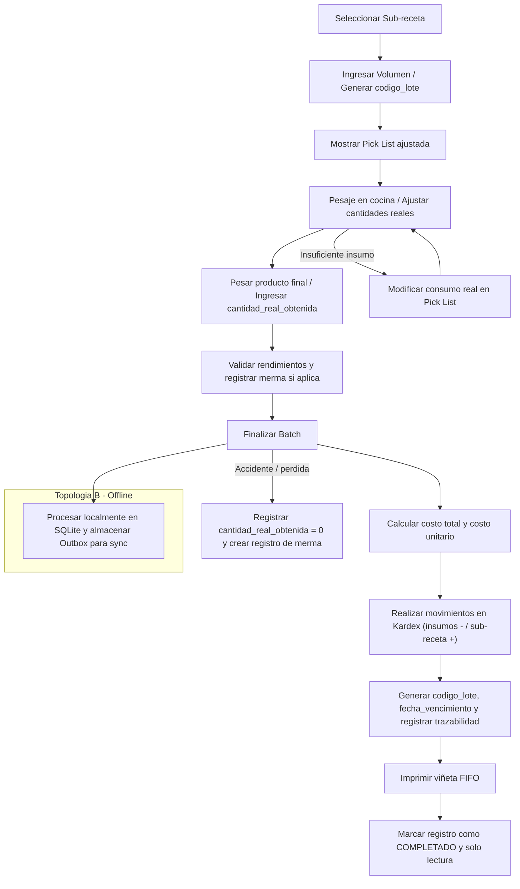

# Módulo Especializado: Producción y Pre-elaboración de Batch (BOH)

Este PRD define las especificaciones funcionales, técnicas y lógicas para el sub-módulo de Producción y Pre-elaboración de Batch (Lotes) en FlexiPoint. Este componente automatiza la transformación de materias primas brutas en sub-recetas e insumos intermedios (ej. salsas, adobos, carnes porcionadas, masas) elaborados antes del servicio, garantizando el control exacto de costos e inventario.

## 1. Arquitectura de Operación y Topologías de Hardware

La pre-elaboración de batch puede ocurrir en la cocina principal de la sucursal o en un comisariato central. El sistema adaptará su comportamiento lógico según las dos topologías de hardware de la solución:

### Topología A: Entorno Completo (Servidor Local Edge + Tablets de Producción)

- Asignación y Ejecución Local: El chef o encargado de producción utiliza una tablet o pantalla táctil en el área de preparación conectada a la red local. Las órdenes de producción se procesan en el nodo centralizador local (Local Edge).
- Explosión Local Inmediata: Al presionar "Finalizar Batch", el servidor local ejecuta instantáneamente la explosión de ingredientes, actualiza las existencias en el maestro local y genera las etiquetas de producción sin depender de una conexión activa a internet.

### Topología B: Formato Ultra-Ligero (Smart POS / Única Tablet con Impresora)

- Flujo Simplificado por Turnos: Al no haber un área de producción separada por pantallas, el registro de batch se realiza directamente en la tablet principal en periodos específicos (usualmente antes de abrir el FOH o al cierre del turno).
- Impresión de Control Directa: Las etiquetas de control de frescura y rotación (FIFO) se mandan a imprimir directamente en la impresora térmica integrada del Smart POS mediante el formato de etiquetas de 58mm/80mm adaptado.
- Sincronización por Lotes: La orden de producción completada genera un delta positivo de la sub-receta y deltas negativos de los insumos correlativos, viajando a la nube mediante el Outbox Pattern.

## 2. Especificación de Componentes Core

### 1. Órdenes de Producción e Interfaz Táctica de Cocina

- Requerimiento Funcional: Interfaz diseñada para ambientes húmedos y calientes (alto contraste, botones grandes de mínimo 60x60dp). Permite al personal seleccionar una sub-receta, definir la cantidad a preparar y visualizar la lista de selección (Pick List) de materias primas necesarias.
- Comportamiento Lógico:
  - Escalabilidad Dinámica de Recetas: Si la sub-receta base está configurada para rendir 5 Litros, y el usuario digita que producirá 22 Litros, el sistema debe recalcular proporcionalmente en tiempo real la cantidad necesaria de cada insumo.
  - Estados del Batch: El ciclo de vida obligatorio de un lote es: PLANIFICADO $\rightarrow$ EN_PROCESO $\rightarrow$ COMPLETADO (o CANCELADO).

### 2. Explosión Inversa de Insumos y Costeo de Producción

- Requerimiento Funcional: Al consolidar un batch (COMPLETADO), el sistema debe realizar un doble movimiento simultáneo y atómico en el Kardex de inventario.
- Comportamiento Matemático y Financiero:
  - Salida de Materias Primas: Se deducen del inventario todos los insumos de la Pick List calculados al Costo Promedio Ponderado ($CPP$) del instante exacto de la operación.
  - Entrada del Producto Terminado (Sub-receta): Se inyecta al inventario la cantidad neta real obtenida del batch.
  - Cálculo del Costo del Batch ($C_{batch}$): El costo unitario inicial de la sub-receta producida se determina mediante la sumatoria del costo total de los insumos consumidos:
    - $$C_{batch} = \sum_{i=1}^{n} (\text{CantidadConsumida}_i \times \text{CPP\_Insumo}_i)$$
    - $$\text{CostoUnitario\_Subreceta} = \frac{C_{batch}}{\text{CantidadNeta\_Producida}}$$
- Impacto en el CPP General: Este costo unitario calculado entra al maestro de inventario de la sub-receta y recalcula su $CPP$ histórico acumulado usando la fórmula estándar de promedio ponderado.

### 3. Registro de Variaciones de Rendimiento (Merma de Producción)

- Requerimiento Funcional: En cocina, la materia prima puede variar su rendimiento real debido a factores naturales (ej. un lote de tomates con más agua o carne con más grasa). El sistema debe registrar la variación entre el rendimiento teórico esperado y el rendimiento real obtenido.
- Reglas de Control:
  - Si la receta teórica dicta que se obtendrán 10 kg de carne marinada, pero el peso real final en báscula fue de 9.5 kg, el usuario digita 9.5 kg.
  - El sistema absorbe el costo de los 0.5 kg faltantes dentro del costo unitario de los 9.5 kg resultantes (reencareciendo el producto final), pero registra un log de Desviación de Rendimiento para auditorías de calidad si supera un umbral de tolerancia configurable (ej. $\pm 5\%$).

### 4. Trazabilidad por Lotes, Rotación (FIFO) y Fechas de Caducidad

- Requerimiento Funcional: Cada batch completado debe generar un código de lote único estructural (LOTE-AAAAMMDD-CORRELATIVO).
- Mapeo de Trazabilidad y Seguridad Alimentaria:
  - Cálculo de Expiración Automático: La base de datos lee los "Días de vida útil" configurados en la ficha de la sub-receta (ej. Salsa de tomate = 3 días) y calcula la fecha de vencimiento exacta desde el momento de la finalización del lote.
  - Impresión de Etiquetas de Control: Al completar el batch, el sistema dispara la impresión de una viñeta física con: Nombre del Producto, Código de Lote, Empleado Responsable, Fecha/Hora de Elaboración y Fecha/Hora Límite de Consumo.

## 3. Modelo de Datos Entidad-Relación (Estructura de Producción)

Para implementar el control inmutable de trazabilidad, costos de transformación y rendimientos, se añade el siguiente esquema al ecosistema relacional de FlexiPoint:

```sql
-- Extensión a la tabla de recetas/insumos del BOH para habilitar Batch
ALTER TABLE recetas ADD COLUMN dias_vida_util INT DEFAULT 2;
ALTER TABLE recetas ADD COLUMN umbral_desviacion_permitido NUMERIC(5,2) DEFAULT 5.00;

-- Cabecera de la Orden de Producción de Batch
CREATE TABLE batch_produccion (
    id UUID PRIMARY KEY,
    codigo_lote VARCHAR(50) UNIQUE NOT NULL, -- LOTE-AAAAMMDD-001
    receta_id UUID REFERENCES recetas(id),
    estado VARCHAR(20) NOT NULL, -- 'PLANIFICADO', 'EN_PROCESO', 'COMPLETADO', 'CANCELADO'
    
    fecha_creacion TIMESTAMP NOT NULL,
    fecha_inicio TIMESTAMP,
    fecha_finalizacion TIMESTAMP,
    
    -- Cantidades de Control
    cantidad_teorica_esperada NUMERIC(14,4) NOT NULL,
    cantidad_real_obtenida NUMERIC(14,4) DEFAULT 0.0000,
    unidad_medida VARCHAR(20) NOT NULL,
    
    -- Financiero Inmutable
    costo_total_insumos_nio NUMERIC(14,4) DEFAULT 0.0000,
    costo_unitario_calculado_nio NUMERIC(14,4) DEFAULT 0.0000,
    
    -- Trazabilidad Sanitaria
    fecha_vencimiento_calculada TIMESTAMP,
    usuario_productor_id VARCHAR(50) NOT NULL,
    usuario_supervisor_id VARCHAR(50) NULL,
    observaciones TEXT
);

-- Detalle del consumo real de insumos durante la ejecución del Batch
CREATE TABLE batch_produccion_insumos (
    id UUID PRIMARY KEY,
    batch_produccion_id UUID REFERENCES batch_produccion(id) ON DELETE CASCADE,
    insumo_id UUID REFERENCES insumos(id),
    
    cantidad_teorica_requerida NUMERIC(14,4) NOT NULL,
    cantidad_real_consumida NUMERIC(14,4) NOT NULL, -- Permite modificaciones si se usó más/menos insumo
    
    costo_unitario_historico_nio NUMERIC(14,4) NOT NULL, -- CPP del insumo al momento del cierre
    costo_total_linea_nio NUMERIC(14,4) NOT NULL
);
```

## 4. Matriz de Casos de Uso Críticos (Edge Cases)

| ID | Caso de Uso / Escenario | Comportamiento Esperado del Sistema |
| --- | --- | --- |
| UC-01 | El personal olvida registrar la producción de un Batch de Salsa Bolognesa por la mañana y el FOH empieza a vender platos que la consumen en la tarde. | "Al venderse en el FOH, la receta del plato final intentará descontar la Salsa Bolognesa. Como el Batch no se digitó, la Salsa entrará en stock negativo virtual. Cuando el chef digite el batch retroactivamente por la noche, el sistema inyectará el stock real y el costo calculado, regularizando las transacciones del Kardex de forma transparente." |
| UC-02 | Un lote de producción sufre un accidente (ej. Se quema una olla de 20 litros de salsa de la casa antes de envasarse). | La orden de producción se procesa como COMPLETADO ingresando una cantidad_real_obtenida = 0. El sistema descarga el 100% de los insumos del inventario y asigna todo el costo monetario de las materias primas a un registro automático en la tabla de mermas bajo el motivo: Pérdida en Proceso de Producción. |
| UC-03 | El cocinero detecta que los insumos sugeridos teóricamente por la tablet no son suficientes (ej. La harina absorbió más agua y requiere 500g extras de insumo base para dar la consistencia). | "La interfaz de la Pick List permite modificar la celda cantidad_real_consumida sumando los 500g adicionales antes de cerrar el lote. El sistema recalcula el costo real total de insumos e impacta el Kardex con el consumo real modificado, manteniendo la precisión del stock físico." |
| UC-04 | El internet falla por completo en el Smart POS autónomo (Topología B) mientras se procesan 3 batches de panadería. | La base de datos local SQLite procesa los estados y cálculos financieros de costo unitario localmente. Permite la impresión de las viñetas mediante comandos de impresión directa de texto plano por Bluetooth/Bus local. Las órdenes quedan marcadas para sincronización prioritaria con la nube al restablecerse la red. |

## 5. Requerimientos No Funcionales (NFR) de Ingeniería

- Atomicidad de Transacciones (ACID): El cierre de un batch de producción debe encapsularse en una sola transacción de base de datos. Si la deducción de alguno de los insumos de la Pick List falla o el cálculo del nuevo costo promedio genera un error de desbordamiento, la operación completa debe aplicar un ROLLBACK total, evitando dejar el inventario en un estado asimétrico.
- Bloqueo de Modificación Post-Cierre: Una vez que una orden de producción cambia al estado COMPLETADO, todos sus registros vinculados pasan a ser de Solo Lectura. Cualquier cambio posterior de stock o corrección de costos debe ser manejada mediante un documento de ajuste explícito firmado por gerencia.
- Velocidad de Renderizado en Listas de Selección: El motor de UI de la comandera/tablet de cocina debe indexar en memoria local las equivalencias de unidades de medida (ej. saber instantáneamente que 0.035 kg equivalen a 35 gramos) para que los cambios que introduzca el cocinero en la pantalla táctil reflejen los totales finales con una latencia menor a 50ms.

## 6. Prototipo de Flujo de Interfaz de Producción

Para validar la experiencia táctil antes del desarrollo de software, se detalla la secuencia interactiva estándar que ejecutará el personal de Back of House desde cualquier terminal táctil:



Regla de Operación: Si el porcentaje de desviación entre la cantidad teórica esperada y la real obtenida excede el límite configurado en la receta (ej. variación mayor al 5%), la interfaz del Paso 3 requerirá obligatoriamente que se seleccione una justificación del menú desplegable y solicitará de forma opcional un código de autorización de supervisor antes de permitir el cierre del lote.
