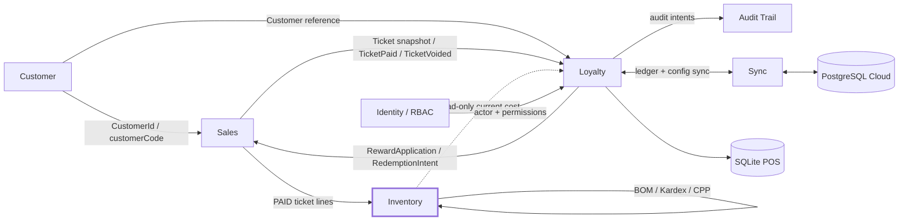
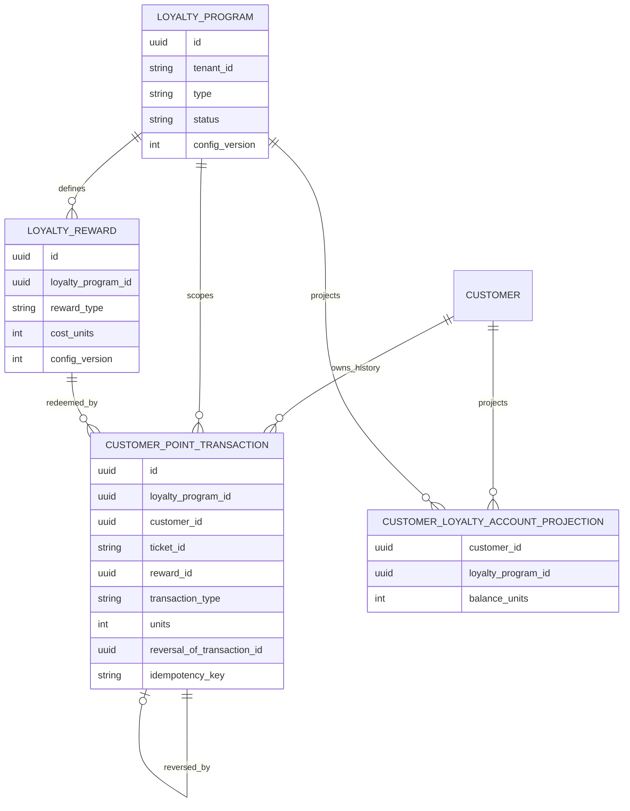
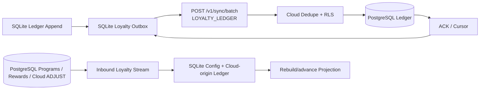
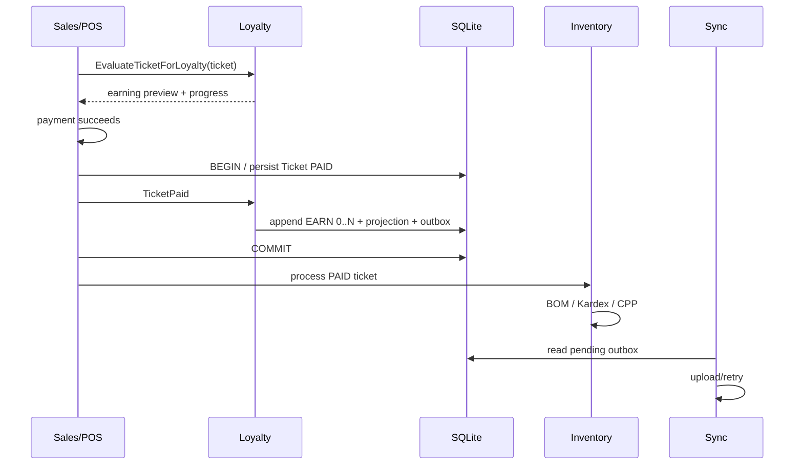
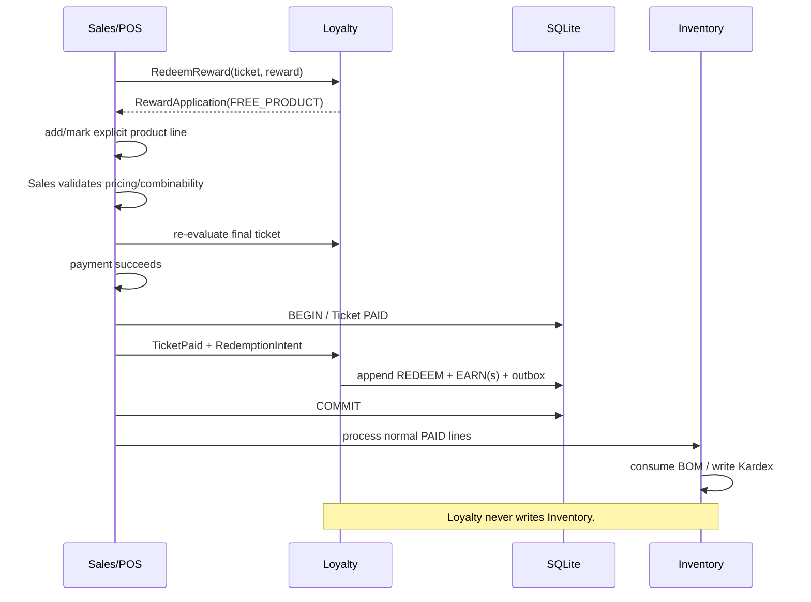
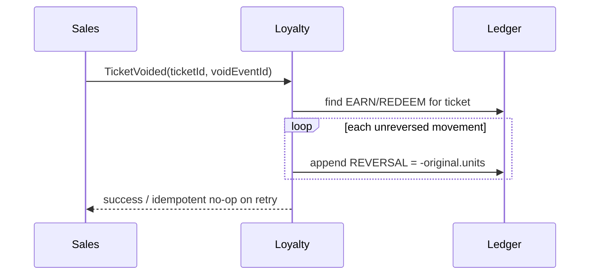

# NHILOS Loyalty V1 — Architecture Specification

**Documento:** `loyalty_architecture_spec.md`  
**Estado:** **APPROVED / ENGINEERING AUTHORITATIVE — Loyalty V1**  
**Versión:** 1.0  
**Fecha:** 2026-09-02  
**Autoridad de producto:** `prd_loyalty_v1.md` — APPROVED / AUTHORITATIVE  
**Baseline técnico:** `loyalty_gap_audit.md` — L0 CERRADO  
**Alcance fundador:** SOHO — una ubicación / un terminal, con diseño multi-tenant y preparado para expansión.

> **Invariante arquitectónica no negociable**
>
> **Loyalty nunca modifica stock, BOM, CPP ni genera movimientos de Kardex directamente.**
>
> El flujo válido es:
>
> ```text
> Loyalty
>   -> propone/aplica una recompensa al Ticket mediante Sales
> Sales
>   -> valida pricing/combinabilidad
>   -> confirma Ticket PAID
> Inventory
>   -> procesa normalmente las líneas PAID
>   -> BOM / Kardex / costo
> ```
>
> Inventory continúa siendo el único propietario del inventario. Una Reward `FREE_PRODUCT` es, desde Inventory, una línea de venta normal cuyo beneficio comercial fue originado por Loyalty.

---

## 0. Principios arquitectónicos vinculantes

1. **Un solo ledger.** El `CustomerPointTransaction` existente de Batch 14.3 evoluciona al concepto de dominio `LoyaltyTransaction`; no se crea un segundo ledger para sellos, puntos o Rewards.
2. **Append-only.** `EARN`, `REDEEM`, `ADJUST` y `REVERSAL` son movimientos inmutables. Corregir significa agregar otro movimiento, nunca editar/borrar historia.
3. **Balance derivado.** El saldo/progreso por `(tenantId, customerId, loyaltyProgramId)` se deriva del ledger. Se permite un cache/proyección reconstruible, nunca un segundo source of truth.
4. **Customer único.** Loyalty consume el `Customer` existente. No existe `LoyaltyCustomer` ni `ProgramMembership` en V1.
5. **Sales es dueño del Ticket y Pricing.** Loyalty no reimplementa promociones, impuestos, propinas, cargos de servicio ni totalización fiscal.
6. **Inventory es dueño de stock y costo.** Loyalty solo puede consultar costo de forma read-only para la métrica profit-aware.
7. **Offline-first.** Checkout no depende de WAN. Programas, Rewards, reglas y ledger necesarios para operar están disponibles en SQLite.
8. **Eventual cloud mirror.** PostgreSQL es el espejo multi-tenant y superficie del Owner Portal; no sustituye la operación local del POS.
9. **At-least-once transport, exactly-once effect.** Sync puede reenviar; las constraints/idempotency keys impiden efectos duplicados.
10. **No LWW para el ledger.** Ningún conflicto de Loyalty se resuelve enviando un `balance` absoluto ni aplicando “última escritura gana”.
11. **Semántica histórica congelada.** Cada transacción automática conserva la versión/snapshot comercial suficiente para interpretarse aunque Program/Reward cambien después.
12. **Unidades enteras para V1.** Toda nueva `LoyaltyTransaction` V1 usa unidades `INTEGER`; los datos legacy se migran sin redondeo silencioso.
13. **Una Redemption por Ticket.** Un Ticket puede generar varios EARN —uno por programa elegible— pero como máximo un REDEEM.
14. **La ventana del Program solo limita EARN.** `LoyaltyProgram.startsAt/endsAt` gobierna acumulación; una Reward puede seguir redimiéndose después de `LoyaltyProgram.endsAt` si el Program continúa `ACTIVE` y la Reward está activa/elegible.
15. **La autorización real es permission-based.** El nombre del rol provee defaults; el guard de permisos decide.
16. **Tiempo determinista.** Los instantes se persisten en UTC. Las ventanas usan intervalo semiabierto `[startsAt, endsAt)`, con límites nulos abiertos; `paidAt` es la autoridad temporal para consolidar EARN/REDEEM.
17. **Programas tenant-wide en V1.** El alcance fundador es una ubicación/un terminal; `branchId` se conserva en el ledger para trazabilidad, no como regla de targeting del Program.
18. **Combinabilidad pertenece a Sales.** Loyalty propone el beneficio; Pricing/Sales decide si puede coexistir con promociones/descuentos. Loyalty no persiste un segundo policy engine de combinabilidad.
19. **Customer activo al consolidar.** La elegibilidad se valida en preview y se revalida inmediatamente antes de `PAID`; un Customer inactivo no acumula ni redime y nunca bloquea que Sales complete la venta.
20. **PRODUCT_STAMPS opera sobre unidades discretas en V1.** No se aplica `floor` a cantidades pesables/fraccionarias; esas líneas quedan fuera de esta estrategia hasta que exista un contrato específico de unidades de venta.

### 0.1 Nota de modelado DDD

La lista de conceptos del PRD no implica que todos deban ser aggregates de escritura. En V1:

- `LoyaltyProgram`, `RewardDefinition` y cada `LoyaltyTransaction` sí tienen ownership de escritura claro dentro de Loyalty.
- `CustomerLoyaltyAccount` es una **proyección/read model reconstruible**, no un balance autoritativo.
- `Redemption` es un **workflow de checkout**: antes de `PAID` existe como intención/propuesta; el hecho durable económico es `LoyaltyTransaction(type=REDEEM)` después de `PAID`.

Esto evita dos errores estructurales: un balance paralelo y una segunda contabilidad de redenciones.

---

# 1. Context Map

## 1.1 Bounded contexts involucrados



## 1.2 Responsabilidad por contexto

| Contexto | Ownership | Loyalty puede | Loyalty NO puede |
|---|---|---|---|
| **Customer** | Identidad del consumidor, estado activo, teléfono, datos fiscales, `customerCode` | Resolver/usar `CustomerId`; consultar identidad | Crear entidad paralela de consumidor; duplicar validación fiscal |
| **Sales** | Ticket, líneas, Pricing, promociones, descuentos, impuestos, pago, `PAID`, `VOID` | Evaluar Ticket; proponer Reward; recibir `TicketPaid`/`TicketVoided` | Cambiar total por fuera del contrato de Sales; registrar pagos |
| **Loyalty** | Programas, Rewards, reglas, ledger, progreso derivado, redención y reversos de Loyalty | Evaluar, ganar, redimir, ajustar, revertir | Escribir inventario/Kardex; convertirse en motor de promociones |
| **Inventory** | Stock, BOM, Kardex, CPP/costo | Exponer lectura de costo estimado | Aceptar movimientos originados directamente desde Loyalty |
| **Identity/RBAC** | Usuario, roles, permisos, sesión | Autorizar comandos y registrar actor | Delegar autorización al nombre del rol únicamente |
| **Audit Trail** | Evidencia forense hash-chained | Registrar acciones críticas de Loyalty | Ser reemplazado por el ledger de Loyalty |
| **Sync** | Transporte, cursor, retry, ACK, dedupe de streams | Transportar eventos/config | Resolver conflictos mediante balance absoluto |

## 1.3 Contratos entre Sales y Loyalty

### `LoyaltyTicketSnapshot`

Sales expone a Loyalty una vista inmutable/determinista del Ticket. Debe contener, como mínimo:

```text
tenantId
branchId
terminalId
ticketId
status
customerId?
occurredAt
currencyContext
lines[]:
  lineId
  productId
  variantId?
  categoryId?
  quantity
  merchandiseNetNioAfterAllBenefits
  source = NORMAL | LOYALTY_REWARD
appliedPromotions[]
appliedDiscounts[]
loyaltyBenefits[]
```

**Regla:** `merchandiseNetNioAfterAllBenefits` es el neto monetario de la línea **después de que Sales/Pricing haya asignado a esa línea promociones, descuentos y beneficios Loyalty aplicables**, y excluye impuestos, propinas y cargos de servicio. Loyalty nunca prorratea descuentos globales ni reconstruye Pricing: únicamente filtra las líneas elegibles del Program y suma este valor. Las líneas `source=LOYALTY_REWARD` no generan earning.

### `RewardApplication`

Loyalty devuelve una propuesta; Sales conserva la última palabra sobre la mutación del Ticket.

```text
RewardApplication
  programId
  rewardId
  type = DISCOUNT_AMOUNT | FREE_PRODUCT
  benefit:
    DISCOUNT_AMOUNT -> amountNio
    FREE_PRODUCT    -> productId, variantId?, quantity
  source = LOYALTY
  commercialSnapshot
```

Sales debe:

- validar que el beneficio no produzca un total inválido;
- validar combinabilidad con promociones/descuentos;
- agregar o marcar la línea `FREE_PRODUCT` mediante el flujo normal de Ticket;
- marcar la línea bonificada como `source=LOYALTY_REWARD` para que Loyalty no genere earning recursivo.

### Profit-aware read port

Loyalty/Owner puede usar un puerto read-only:

```text
InventoryCostQueryPort.getCurrentEstimatedCost(productId, branchId?)
  -> MoneyNio | NOT_AVAILABLE
```

No existe ningún command port `Loyalty -> Inventory`.

---

# 2. Aggregate boundaries

## 2.1 `LoyaltyProgram` — Aggregate Root

Representa el contrato de earning de un tenant.

### Identidad

`(tenantId, loyaltyProgramId)`

### Estado mínimo

```text
id
tenantId
name
type = SPEND_POINTS | PRODUCT_STAMPS | VISIT_STAMPS
status = DRAFT | ACTIVE | INACTIVE
startsAt?
endsAt?
earningRule
eligibilityRule
configVersion
createdAt
updatedAt
```

### Invariantes

- Pertenece a un único tenant.
- `DRAFT` no es ejecutable en POS.
- `ACTIVE` puede redimir aunque `LoyaltyProgram.endsAt` haya pasado; la ventana del Program solo afecta earning.
- En V1 el Program aplica al tenant completo. No existe `branchScope`; `branchId` es metadata de trazabilidad del movimiento.
- `INACTIVE` no genera EARN ni REDEEM.
- `configVersion` aumenta de forma monotónica con cada cambio ejecutable.
- Cambiar reglas afecta solo operaciones futuras.
- `type` debe considerarse inmutable después de la primera activación/actividad; cambiar la estrategia se modela creando un nuevo Program.
- Nunca se borra físicamente un Program con historial.

### Earning rules tipadas

```text
SPEND_POINTS:
  spendBlockNio: integer > 0
  pointsPerBlock: integer > 0

PRODUCT_STAMPS:
  eligibleProductIds / eligibleCategoryIds
  unitsPerPurchasedUnit: integer > 0
  qualifyingLineQuantity: debe ser una cantidad discreta entera en V1; líneas pesables/fraccionarias no son elegibles

VISIT_STAMPS:
  minimumSpendNio?: integer >= 0
  unitsPerVisit: integer > 0   # normalmente 1
```

`eligibilityRule` y `earningRule` pueden persistirse como JSON versionado, pero deben validarse contra un discriminated union; **no** son JSON arbitrario ejecutable.

---

## 2.2 `CustomerLoyaltyAccount` — Projection / Read Model

No es una cuenta bancaria ni un aggregate autoritativo. Es una proyección por:

`(tenantId, customerId, loyaltyProgramId)`

### Estado derivado

```text
balanceUnits
nextRewardId?
nextRewardCostUnits?
eligibleRewardIds[]
lastTransactionId?
projectionVersion  # contador monotónico de movimientos de ledger incorporados
recomputedAt
```

### Fórmula de verdad

```text
balanceUnits = SUM(LoyaltyTransaction.units)
WHERE tenantId = ?
  AND customerId = ?
  AND loyaltyProgramId = ?
```

### Invariantes

- Puede ser eliminado y reconstruido sin pérdida de información.
- Puede quedar negativo por Adjustment/Reversal o por convergencia de eventos offline válidos.
- Nunca recibe un command “set balance”.
- Cualquier corrección se expresa como nueva `LoyaltyTransaction`.
- Un cache materializado se actualiza en la **misma transacción** que el append del ledger, tanto en SQLite como en PostgreSQL.
- `projectionVersion` es exclusivamente el contador monotónico de movimientos del ledger incorporados a la proyección; no representa versión de schema, cursor de sync ni `configVersion`.
- Un replay idempotente que no inserta una nueva `LoyaltyTransaction` tampoco incrementa `projectionVersion`.

---

## 2.3 `LoyaltyTransaction` — Immutable Ledger Aggregate Root

Cada movimiento es una unidad inmutable y autónoma del ledger.

### Tipos

`EARN | REDEEM | ADJUST | REVERSAL`

### Estado canónico V1

```text
id
tenantId
loyaltyProgramId
customerId
ticketId?
rewardId?
transactionType
units: integer != 0
reversalOfTransactionId?
idempotencyKey
sourceEventId?
actorUserId?
branchId?
terminalId?
reason?
programVersion?
rewardVersion?
commercialSnapshot
origin = POS | CLOUD
occurredAt
recordedAt
```

### Invariantes por tipo

| Tipo | Signo | Ticket | Reward | Actor/razón | Reversal ref |
|---|---:|---|---|---|---|
| `EARN` | `> 0` | requerido | no | no | no |
| `REDEEM` | `< 0` | requerido | requerido | actor operativo opcional en ledger; sí en audit | no |
| `ADJUST` | `!= 0` | opcional | no | **requerido** | no |
| `REVERSAL` | opuesto exacto al original | heredado/requerido para tx de ticket | heredado si aplica | no | **requerido** |

### Semántica histórica

`commercialSnapshot` debe capturar lo suficiente para reconstruir la operación original sin consultar la configuración actual. Como mínimo:

- tipo/nombre de Program relevante;
- `programVersion` y regla efectiva de earning para EARN;
- para REDEEM: `rewardVersion`, nombre, costo en unidades, tipo y beneficio aplicado;
- NIO eligible spend o unidades/productos/visita usados para el cálculo cuando corresponda;
- versión de schema del snapshot.

No se requiere duplicar todo el Program/Reward; se requiere preservar **la semántica comercial que afectó ese movimiento**.

---

## 2.4 `RewardDefinition` — Aggregate Root

Una Reward pertenece exactamente a un `LoyaltyProgram`.

### Estado mínimo

```text
id
tenantId
loyaltyProgramId
name
description?
rewardType = DISCOUNT_AMOUNT | FREE_PRODUCT
costUnits: integer > 0
benefitConfig
status = ACTIVE | INACTIVE
startsAt?
endsAt?
presentationOrder
configVersion
createdAt
updatedAt
```

### Invariantes

- `costUnits` es entero positivo.
- `DISCOUNT_AMOUNT` requiere `amountNio > 0`.
- `FREE_PRODUCT` requiere `productId`, cantidad positiva y variant si aplica.
- Reward y Program pertenecen al mismo tenant.
- Una Reward con redenciones históricas no se elimina físicamente.
- Cambios futuros incrementan `configVersion`; transacciones históricas siguen usando su snapshot.
- `ACTIVE` permite redención solo dentro de su propia ventana `[startsAt, endsAt)`; `INACTIVE` no permite nuevas redenciones. La expiración de la Reward no elimina unidades acumuladas.
- Una Reward no puede generar earning sobre la línea que ella misma bonifica.
- La combinabilidad no forma parte de `RewardDefinition`; Sales/Pricing la valida sobre el Ticket final.

---

## 2.5 `Redemption` — Checkout Workflow Aggregate

`Redemption` no es un segundo ledger. Su ciclo de vida se limita al Ticket abierto.

### Estado provisional

```text
RedemptionIntent
  id
  ticketId
  customerId
  programId
  rewardId
  costUnits
  rewardVersion
  rewardApplication
  evaluatedBalanceUnits
  createdAt
```

### Reglas

- Mientras Ticket no sea `PAID`, no existe `LoyaltyTransaction(REDEEM)`.
- Solo puede existir una `RedemptionIntent` activa por Ticket.
- Si cambia el Ticket, Sales solicita reevaluación; una intención inválida se descarta.
- La intención puede persistirse junto al Ticket en Sales para sobrevivir navegación/reinicio, pero no se contabiliza como saldo consumido.
- Al `PAID`, la intención se consolida en un `REDEEM` negativo idempotente.
- Si el pago falla, la intención puede eliminarse sin movimiento compensatorio porque nunca existió un REDEEM.

---

# 3. Domain Events

## 3.1 Catálogo

| Evento | Producer | Consumers principales | Persistencia económica |
|---|---|---|---|
| `CustomerIdentified` | Sales/Customer UX | Loyalty UI/evaluator | No |
| `TicketPaid` | Sales | Loyalty, Inventory | Sales es autoridad |
| `TicketVoided` | Sales | Loyalty, Inventory, Audit | Sales es autoridad |
| `LoyaltyEarned` | Loyalty | Receipt/UI/Sync/analytics | Sí, por `LoyaltyTransaction(EARN)` |
| `RewardUnlocked` | Loyalty projection | UI/Receipt/analytics | No; derivable |
| `RewardRedeemed` | Loyalty | Receipt/Sync/Audit | Sí, por `LoyaltyTransaction(REDEEM)` |
| `LoyaltyReversed` | Loyalty | Sync/Audit/UI | Sí, por `LoyaltyTransaction(REVERSAL)` |
| `LoyaltyAdjusted` | Loyalty | Sync/Audit/UI | Sí, por `LoyaltyTransaction(ADJUST)` |

## 3.2 `CustomerIdentified`

```text
customerIdentifiedEventId
tenantId
ticketId
customerId
method = QR | CUSTOMER_CODE | PHONE | SEARCH
occurredAt
```

- Dispara evaluación de progreso/rewards para UX.
- No crea earning.
- No crea membership.
- El método de identificación no se considera autenticación del consumidor.

## 3.3 `TicketPaid`

```text
ticketPaidEventId
tenantId
branchId
terminalId
ticketId
customerId?
paidAt
ticketVersion
```

El handler de Loyalty obtiene el snapshot PAID inmutable desde Sales y:

1. revalida que el Customer exista, pertenezca al tenant y continúe `ACTIVE`; si no, descarta cualquier `RedemptionIntent`, no genera movimientos Loyalty y Sales continúa el cierre;
2. valida la `RedemptionIntent` si existía;
3. append `REDEEM` si corresponde;
4. calcula cada Program elegible sobre el Ticket final;
5. append un `EARN` por Program elegible;
6. actualiza proyección;
7. agrega eventos/outbox en la misma unidad local de commit.

Sin Customer, el handler termina sin movimientos y **no bloquea** la venta.

## 3.4 `TicketVoided`

```text
ticketVoidedEventId
tenantId
ticketId
voidedAt
actorUserId
reason?
```

Dispara `ReverseTicketLoyalty`. No borra movimientos originales.

## 3.5 Eventos generados por Loyalty

Cada evento `LoyaltyEarned`, `RewardRedeemed`, `LoyaltyReversed`, `LoyaltyAdjusted` debe incluir el `loyaltyTransactionId` como identidad causal. No se sincroniza una copia independiente del saldo.

`RewardUnlocked` es una notificación derivada del cambio de proyección y puede recalcularse. Si se envía por outbox, su idempotency key debe ser `(transactionId, rewardId)`.

---

# 4. Command model

## 4.1 `EvaluateTicketForLoyalty`

**Tipo:** query/command determinista sin side effects económicos.

### Input

```text
LoyaltyTicketSnapshot
customerId
localConfigVersionSet
```

### Output

```text
LoyaltyEvaluation
  programs[]:
    programId
    balanceUnits
    earningPreviewUnits
    nextReward?
    eligibleRewards[]
  selectedRedemptionStillValid
  staleConfigIndicator
```

### Reglas

- Requiere Customer existente, del tenant y `ACTIVE`; si no lo está, retorna evaluación sin earning/rewards.
- Evalúa todos los programas `ACTIVE` del tenant.
- Para EARN respeta `startsAt`/`endsAt`.
- Para REDEEM ignora la ventana de earning y usa estado/ventana de Reward.
- `SPEND_POINTS` usa `floor` y NIO.
- `PRODUCT_STAMPS` ignora líneas `LOYALTY_REWARD` y solo cuenta cantidades discretas enteras; no redondea cantidades fraccionarias.
- `VISIT_STAMPS` produce como máximo una unidad lógica de visita por Program/Ticket, multiplicada solo por `unitsPerVisit` configurado.
- No escribe ledger.

## 4.2 `RedeemReward`

**Tipo:** command de checkout provisional.

### Input

```text
tenantId
ticketId
customerId
programId
rewardId
actorUserId
commandId
```

### Precondiciones

- permiso `loyalty.redeem`;
- Customer activo y del tenant;
- Program `ACTIVE`;
- Reward `ACTIVE` y disponible;
- saldo local derivado suficiente;
- Ticket no contiene otra RedemptionIntent;
- Sales acepta combinabilidad y aplicación.

### Output

`RedemptionIntent + RewardApplication`

### Side effects

- Sales actualiza el Ticket con el beneficio.
- **NO** se inserta `REDEEM` aún.

## 4.3 `ReverseTicketLoyalty`

### Input

```text
tenantId
ticketId
sourceVoidEventId
actorUserId?
```

### Algoritmo

Para cada `EARN`/`REDEEM` originado por el Ticket y aún no revertido:

```text
append REVERSAL.units = -original.units
reversalOfTransactionId = original.id
```

- Puede producir saldo negativo.
- Reintentar el mismo VOID no duplica reversals.
- Un Ticket sin movimientos Loyalty retorna éxito/no-op.

## 4.4 `AdjustLoyaltyBalance`

### Input

```text
tenantId
customerId
programId
deltaUnits: integer != 0
reason: non-empty
actorUserId
commandId
branchId?
```

### Reglas

- Requiere `loyalty.adjust`.
- No representa venta ni earning.
- Puede dejar balance derivado negativo.
- Se materializa exclusivamente como `LoyaltyTransaction(ADJUST)`.
- Debe generar Audit Trail.

## 4.5 Handler interno de `TicketPaid`

No se expone como command manual. Es el único writer automático de earning ordinario.

**Regla de consistencia local recomendada:** Sales y Loyalty participan mediante un `CheckoutCommitCoordinator`/Unit of Work de aplicación sobre la misma SQLite transaction:

```text
BEGIN SQLite TX
  Sales -> persist PAID ticket
  Loyalty -> append REDEEM (0..1)
  Loyalty -> append EARN (0..N)
  Loyalty -> update rebuildable projection
  Sync -> append outbox envelopes
COMMIT

AFTER COMMIT
  publish domain notifications
  Inventory consumes PAID ticket through its normal path
```

Cada bounded context conserva sus repositories; el coordinador no habilita que Loyalty escriba tablas de Sales/Inventory ni viceversa. Inmediatamente antes de los writes Loyalty, el coordinator revalida `Customer.isActive`; si cambió a inactivo desde el preview, descarta la intención de redención y omite EARN sin abortar la venta.

Si la implementación actual no permite una UoW compartida sin una refactorización riesgosa, el mínimo aceptable es: `TicketPaid` durable + handler local síncrono + idempotency constraints + outbox durable antes de abandonar el flujo de pago. Nunca se acepta un handler no durable “fire and forget”.

---

# 5. Idempotency model

## 5.1 Principio

Idempotencia se garantiza en tres capas:

1. **Command ID** para acciones explícitas.
2. **Business key determinística** por movimiento automático.
3. **Unique constraint en SQLite y PostgreSQL**.

No se depende de locks WAN.

## 5.2 Keys canónicas

| Movimiento | Idempotency key |
|---|---|
| EARN | `loyalty:earn:{tenantId}:{ticketId}:{programId}` |
| REDEEM | `loyalty:redeem:{tenantId}:{ticketId}` |
| REVERSAL | `loyalty:reversal:{tenantId}:{originalTransactionId}` |
| ADJUST | `loyalty:adjust:{tenantId}:{commandId}` |

La key es un contrato de dominio; el transporte puede además tener `eventId`/`batchId` propios.

## 5.3 Constraints adicionales

- `EARN`: único por `(tenant_id, ticket_id, loyalty_program_id)`.
- `REDEEM`: único por `(tenant_id, ticket_id)`.
- `REVERSAL`: único por `(tenant_id, reversal_of_transaction_id)`.
- `idempotency_key`: único por tenant.

## 5.4 Reenvío

- Mismo `idempotencyKey` + mismo payload canónico -> ACK/no-op.
- Mismo `idempotencyKey` + payload diferente -> **integrity conflict**; no overwrite, cuarentena/error y alerta.
- Doble tap de checkout, retry de app o reenvío de sync deben converger al mismo movimiento.

---

# 6. Ledger model

## 6.1 Source of truth

La tabla física existente `customer_point_transactions` se conserva y se **evoluciona**. El nombre de dominio pasa a ser `LoyaltyTransaction`, evitando crear `loyalty_transactions` en paralelo durante V1.

## 6.2 Cálculo de saldo

```text
balance(customer, program) = Σ units de todos los movimientos del programa
```

Un `REVERSAL` participa como cualquier delta; no existe lógica especial de “descontarlo de un balance guardado”.

## 6.3 Orden temporal

- `occurredAt`: momento del evento de negocio.
- `recordedAt`: momento de persistencia local/cloud.
- El saldo final es suma conmutativa; no depende del orden de llegada por sync.
- Para UI histórica: ordenar por `occurredAt`, luego `recordedAt`, luego `id` como desempate estable.

## 6.4 Qué NO es el ledger

No debe contener:

- datos sensibles de pago;
- PII en QR/customerCode;
- stock resultante;
- `pointsBalance` autoritativo;
- “reward balance”;
- snapshots completos innecesarios de Customer.

## 6.5 Proyección/cache

Se permite `customer_loyalty_account_projection` para <100 ms y UX local.

Reglas:

- se actualiza incrementalmente al append dentro de la misma transacción DB que inserta el movimiento;
- una rutina `rebuild(customerId, programId)` debe reconstruirla desde ledger; al finalizar, `projectionVersion` queda igual al número de movimientos incorporados por esa reconstrucción;
- pruebas deben comparar cache vs `SUM(ledger)`;
- un duplicate/no-op idempotente no modifica `balanceUnits`, `lastTransactionId` ni `projectionVersion`;
- si diverge, el ledger gana y la proyección se repara.

Si en una evolución futura cambia la estructura del read model, se introduce un campo separado `projectionSchemaVersion`; nunca se sobrecarga `projectionVersion` con esa responsabilidad.

---

# 7. Data model

## 7.1 ER conceptual



## 7.2 Customer extension for QR/code

`Customer` continúa siendo owner de identidad. Se añade un campo de contexto Customer:

```text
customerCode?: opaque string
```

Reglas:

- único por `(tenantId, normalizedCustomerCode)`;
- no secuencial ni predecible;
- rotatable/revocable sin cambiar `CustomerId` ni ledger;
- QR payload V1 recomendado: `NHL1:{customerCode}`;
- no contiene teléfono, cédula/RUC, email ni tenant id en texto plano.

Generación offline recomendada para V1: valor aleatorio de al menos 80 bits codificado en Crockford Base32; normalización uppercase; retry local ante colisión. PostgreSQL vuelve a imponer unicidad por tenant.

**Rotación/revocación:** el código es master data eventual. Al rotarlo en cloud, el código anterior deja de ser válido en cloud inmediatamente y deja de ser válido en cada POS cuando ese POS recibe el cambio inbound. Un terminal aislado puede seguir identificando temporalmente el código anterior con su última copia local; V1 no promete revocación instantánea sin WAN porque eso rompería offline-first. La rotación queda auditada y nunca modifica `CustomerId` ni el ledger.

## 7.3 Program config

`earning_rule_json`, `eligibility_rule_json` y `benefit_config_json` deben incluir `schemaVersion` y validarse antes de persistir/sincronizar.

Ejemplo:

```json
{
  "schemaVersion": 1,
  "type": "SPEND_POINTS",
  "spendBlockNio": 10,
  "pointsPerBlock": 1
}
```

No se evalúa código dinámico ni expresiones arbitrarias provenientes del Owner Portal.

## 7.4 Temporal semantics

Todos los instantes se almacenan como UTC. La UI convierte desde/hacia la zona horaria del tenant, pero la lógica de dominio compara instantes absolutos. En SQLite se serializan en formato ISO-8601 UTC canónico (`YYYY-MM-DDTHH:mm:ss.SSSZ`) para que orden y comparación lexical sean deterministas.

```text
withinWindow(at, startsAt?, endsAt?)
  = (startsAt == null OR startsAt <= at)
    AND (endsAt == null OR at < endsAt)
```

- Para **EARN**, la ventana del `LoyaltyProgram` se evalúa con `TicketPaid.paidAt`.
- Para **REDEEM**, la ventana de earning del Program se ignora; el Program debe estar `ACTIVE` y la propia Reward debe estar `ACTIVE` y dentro de su ventana con el mismo `paidAt`.
- El preview puede usar el reloj local para UX, pero el resultado autoritativo se revalida con `paidAt` al commit.
- Si ambos límites existen, `startsAt < endsAt` es obligatorio.

---

# 8. SQLite schema

> Schema objetivo conceptual. La migración real desde Floor/SQLite existente debe preservar nombres/IDs actuales y puede requerir `ALTER TABLE` + rebuild de tabla según las limitaciones de SQLite/Floor. La conexión debe operar con `PRAGMA foreign_keys = ON`; los tests de migración deben comprobarlo explícitamente.

## 8.1 Programs

```sql
CREATE TABLE loyalty_programs (
  id TEXT PRIMARY KEY,
  tenant_id TEXT NOT NULL,
  name TEXT NOT NULL,
  program_type TEXT NOT NULL CHECK (
    program_type IN ('SPEND_POINTS', 'PRODUCT_STAMPS', 'VISIT_STAMPS')
  ),
  status TEXT NOT NULL DEFAULT 'DRAFT' CHECK (status IN ('DRAFT', 'ACTIVE', 'INACTIVE')),
  starts_at TEXT NULL,
  ends_at TEXT NULL,
  earning_rule_json TEXT NOT NULL,
  eligibility_rule_json TEXT NOT NULL,
  config_version INTEGER NOT NULL DEFAULT 1,
  updated_at TEXT NOT NULL,
  created_at TEXT NOT NULL,
  UNIQUE (tenant_id, id),
  CHECK (config_version > 0),
  CHECK (starts_at IS NULL OR ends_at IS NULL OR starts_at < ends_at)
);

CREATE INDEX idx_loyalty_programs_tenant_status
  ON loyalty_programs (tenant_id, status);
```

**V1:** no existe `branch_scope_json`. El Program es tenant-wide; `branch_id` se captura únicamente en movimientos para trazabilidad.

## 8.2 Rewards

```sql
CREATE TABLE loyalty_rewards (
  id TEXT PRIMARY KEY,
  tenant_id TEXT NOT NULL,
  loyalty_program_id TEXT NOT NULL,
  name TEXT NOT NULL,
  description TEXT NULL,
  reward_type TEXT NOT NULL CHECK (
    reward_type IN ('DISCOUNT_AMOUNT', 'FREE_PRODUCT')
  ),
  cost_units INTEGER NOT NULL CHECK (cost_units > 0),
  benefit_config_json TEXT NOT NULL,
  status TEXT NOT NULL DEFAULT 'INACTIVE' CHECK (status IN ('ACTIVE', 'INACTIVE')),
  starts_at TEXT NULL,
  ends_at TEXT NULL,
  presentation_order INTEGER NOT NULL DEFAULT 0,
  config_version INTEGER NOT NULL DEFAULT 1,
  updated_at TEXT NOT NULL,
  created_at TEXT NOT NULL,
  UNIQUE (tenant_id, id),
  UNIQUE (tenant_id, loyalty_program_id, id),
  FOREIGN KEY (tenant_id, loyalty_program_id)
    REFERENCES loyalty_programs(tenant_id, id),
  CHECK (config_version > 0),
  CHECK (starts_at IS NULL OR ends_at IS NULL OR starts_at < ends_at)
);

CREATE INDEX idx_loyalty_rewards_program_status
  ON loyalty_rewards (tenant_id, loyalty_program_id, status, presentation_order);
```

No existe `combinability_rule_json`: Sales/Pricing decide combinabilidad al aplicar `RewardApplication`.

## 8.3 Existing ledger evolved in-place

El siguiente bloque representa la **forma transicional/objetivo**. M1 debe preservar las columnas físicas de Batch 14.3 durante dual-read; no se permite reconstruir la tabla descartando `type`, `points`, `balance_after`, `conversion_rate`, `invoice_id` o `created_at` antes de M8.

```sql
-- Required before tenant-safe composite FKs when the current Customer table
-- only has id as its declared primary key.
CREATE UNIQUE INDEX IF NOT EXISTS uq_customers_tenant_id_id
  ON customers (tenant_id, id);

CREATE TABLE customer_point_transactions (
  id TEXT PRIMARY KEY,
  tenant_id TEXT NOT NULL,
  customer_id TEXT NOT NULL,

  loyalty_program_id TEXT NULL,
  ticket_id TEXT NULL,
  invoice_id TEXT NULL, -- legacy Batch 14.3 column retained through M8
  reward_id TEXT NULL,

  transaction_type TEXT NULL CHECK (
    transaction_type IS NULL OR transaction_type IN ('EARN', 'REDEEM', 'ADJUST', 'REVERSAL')
  ),
  units INTEGER NULL,

  reversal_of_transaction_id TEXT NULL,
  idempotency_key TEXT NULL,
  source_event_id TEXT NULL,
  actor_user_id TEXT NULL,
  branch_id TEXT NULL,
  terminal_id TEXT NULL,
  reason TEXT NULL,

  program_version INTEGER NULL,
  reward_version INTEGER NULL,
  commercial_snapshot_json TEXT NULL,
  origin TEXT NULL CHECK (origin IS NULL OR origin IN ('POS', 'CLOUD')),

  occurred_at TEXT NULL,
  recorded_at TEXT NULL,
  sync_status TEXT NOT NULL DEFAULT 'pending'
    CHECK (sync_status IN ('pending', 'synced', 'error')),

  -- Physical legacy columns. Preserved exactly during migration.
  type TEXT NULL,
  points NUMERIC NULL,
  balance_after NUMERIC NULL,
  conversion_rate NUMERIC NULL,
  created_at TEXT NULL,
  legacy_imported INTEGER NOT NULL DEFAULT 0 CHECK (legacy_imported IN (0,1)),

  UNIQUE (tenant_id, id),
  FOREIGN KEY (tenant_id, customer_id)
    REFERENCES customers(tenant_id, id),
  FOREIGN KEY (tenant_id, loyalty_program_id)
    REFERENCES loyalty_programs(tenant_id, id),
  FOREIGN KEY (tenant_id, loyalty_program_id, reward_id)
    REFERENCES loyalty_rewards(tenant_id, loyalty_program_id, id),
  FOREIGN KEY (tenant_id, reversal_of_transaction_id)
    REFERENCES customer_point_transactions(tenant_id, id),

  CHECK (legacy_imported = 1 OR loyalty_program_id IS NOT NULL),
  CHECK (legacy_imported = 1 OR transaction_type IS NOT NULL),
  CHECK (legacy_imported = 1 OR units IS NOT NULL),
  CHECK (legacy_imported = 1 OR units != 0),
  CHECK (legacy_imported = 1 OR idempotency_key IS NOT NULL),
  CHECK (legacy_imported = 1 OR occurred_at IS NOT NULL),
  CHECK (legacy_imported = 1 OR transaction_type != 'EARN' OR (units > 0 AND ticket_id IS NOT NULL AND program_version IS NOT NULL AND commercial_snapshot_json IS NOT NULL)),
  CHECK (legacy_imported = 1 OR transaction_type != 'REDEEM' OR (units < 0 AND ticket_id IS NOT NULL AND reward_id IS NOT NULL AND program_version IS NOT NULL AND reward_version IS NOT NULL AND commercial_snapshot_json IS NOT NULL)),
  CHECK (legacy_imported = 1 OR transaction_type != 'ADJUST' OR (actor_user_id IS NOT NULL AND length(trim(reason)) > 0)),
  CHECK (legacy_imported = 1 OR transaction_type != 'REVERSAL' OR reversal_of_transaction_id IS NOT NULL)
);

CREATE UNIQUE INDEX uq_loyalty_tx_idempotency
  ON customer_point_transactions (tenant_id, idempotency_key)
  WHERE idempotency_key IS NOT NULL;

CREATE UNIQUE INDEX uq_loyalty_earn_ticket_program
  ON customer_point_transactions (tenant_id, ticket_id, loyalty_program_id)
  WHERE transaction_type = 'EARN' AND legacy_imported = 0;

CREATE UNIQUE INDEX uq_loyalty_redeem_ticket
  ON customer_point_transactions (tenant_id, ticket_id)
  WHERE transaction_type = 'REDEEM' AND legacy_imported = 0;

CREATE UNIQUE INDEX uq_loyalty_reversal_original
  ON customer_point_transactions (tenant_id, reversal_of_transaction_id)
  WHERE transaction_type = 'REVERSAL' AND legacy_imported = 0;

CREATE INDEX idx_loyalty_tx_customer_program_time
  ON customer_point_transactions (
    tenant_id, customer_id, loyalty_program_id, occurred_at DESC
  );

CREATE INDEX idx_loyalty_tx_ticket
  ON customer_point_transactions (tenant_id, ticket_id);
```

## 8.4 Rebuildable projection

```sql
CREATE TABLE customer_loyalty_account_projection (
  tenant_id TEXT NOT NULL,
  customer_id TEXT NOT NULL,
  loyalty_program_id TEXT NOT NULL,
  balance_units INTEGER NOT NULL DEFAULT 0,
  last_transaction_id TEXT NULL,
  projection_version INTEGER NOT NULL DEFAULT 0,
  recomputed_at TEXT NOT NULL,
  PRIMARY KEY (tenant_id, customer_id, loyalty_program_id),
  FOREIGN KEY (tenant_id, customer_id)
    REFERENCES customers(tenant_id, id),
  FOREIGN KEY (tenant_id, loyalty_program_id)
    REFERENCES loyalty_programs(tenant_id, id),
  CHECK (projection_version >= 0)
);
```

`projection_version` aumenta exactamente una vez por cada nueva `LoyaltyTransaction` que se incorpora a esa proyección. Insert ledger + update projection ocurre dentro de la misma SQLite transaction. Un duplicate/no-op idempotente no cambia ni saldo ni versión.

## 8.5 Local outbox

```sql
CREATE TABLE loyalty_outbox (
  event_id TEXT PRIMARY KEY,
  tenant_id TEXT NOT NULL,
  aggregate_id TEXT NOT NULL,
  event_type TEXT NOT NULL,
  idempotency_key TEXT NOT NULL,
  payload_json TEXT NOT NULL,
  status TEXT NOT NULL DEFAULT 'PENDING'
    CHECK (status IN ('PENDING', 'IN_FLIGHT', 'ACKED', 'ERROR')),
  attempt_count INTEGER NOT NULL DEFAULT 0,
  next_attempt_at TEXT NULL,
  created_at TEXT NOT NULL,
  acked_at TEXT NULL
);

CREATE UNIQUE INDEX uq_loyalty_outbox_idempotency
  ON loyalty_outbox (tenant_id, idempotency_key);

CREATE INDEX idx_loyalty_outbox_pending
  ON loyalty_outbox (status, next_attempt_at, created_at);
```

## 8.6 Inbound cursor

```sql
CREATE TABLE loyalty_sync_cursor (
  stream_name TEXT PRIMARY KEY,
  cursor TEXT NOT NULL,
  updated_at TEXT NOT NULL
);
```

## 8.7 Customer code

```sql
ALTER TABLE customers ADD COLUMN customer_code TEXT NULL;

CREATE UNIQUE INDEX uq_customers_tenant_customer_code
  ON customers (tenant_id, upper(customer_code))
  WHERE customer_code IS NOT NULL;
```

La aplicación normaliza siempre a uppercase antes de persistir/consultar. La expresión `upper(customer_code)` blinda unicidad aun ante un writer defectuoso que use distinto casing.

---

# 9. PostgreSQL schema

> Se reutiliza el patrón multi-tenant/RLS del backend existente. Tipos FK concretos deben coincidir exactamente con las PK actuales (`tenant_id`, branch, terminal, user, ticket).

## 9.1 Programs

```sql
CREATE TABLE loyalty_programs (
  id uuid PRIMARY KEY,
  tenant_id varchar NOT NULL,
  name varchar(160) NOT NULL,
  program_type varchar(32) NOT NULL CHECK (
    program_type IN ('SPEND_POINTS', 'PRODUCT_STAMPS', 'VISIT_STAMPS')
  ),
  status varchar(16) NOT NULL DEFAULT 'DRAFT' CHECK (status IN ('DRAFT', 'ACTIVE', 'INACTIVE')),
  starts_at timestamptz NULL,
  ends_at timestamptz NULL,
  earning_rule_json jsonb NOT NULL,
  eligibility_rule_json jsonb NOT NULL,
  config_version integer NOT NULL DEFAULT 1 CHECK (config_version > 0),
  created_at timestamptz NOT NULL DEFAULT now(),
  updated_at timestamptz NOT NULL DEFAULT now(),
  UNIQUE (tenant_id, id),
  CHECK (starts_at IS NULL OR ends_at IS NULL OR starts_at < ends_at)
);

CREATE INDEX idx_loyalty_programs_tenant_status
  ON loyalty_programs (tenant_id, status);
```

## 9.2 Rewards

```sql
CREATE TABLE loyalty_rewards (
  id uuid PRIMARY KEY,
  tenant_id varchar NOT NULL,
  loyalty_program_id uuid NOT NULL,
  name varchar(160) NOT NULL,
  description text NULL,
  reward_type varchar(32) NOT NULL CHECK (
    reward_type IN ('DISCOUNT_AMOUNT', 'FREE_PRODUCT')
  ),
  cost_units integer NOT NULL CHECK (cost_units > 0),
  benefit_config_json jsonb NOT NULL,
  status varchar(16) NOT NULL DEFAULT 'INACTIVE' CHECK (status IN ('ACTIVE', 'INACTIVE')),
  starts_at timestamptz NULL,
  ends_at timestamptz NULL,
  presentation_order integer NOT NULL DEFAULT 0,
  config_version integer NOT NULL DEFAULT 1 CHECK (config_version > 0),
  created_at timestamptz NOT NULL DEFAULT now(),
  updated_at timestamptz NOT NULL DEFAULT now(),
  UNIQUE (tenant_id, id),
  UNIQUE (tenant_id, loyalty_program_id, id),
  FOREIGN KEY (tenant_id, loyalty_program_id)
    REFERENCES loyalty_programs(tenant_id, id),
  CHECK (starts_at IS NULL OR ends_at IS NULL OR starts_at < ends_at)
);

CREATE INDEX idx_loyalty_rewards_program_status
  ON loyalty_rewards (tenant_id, loyalty_program_id, status, presentation_order);
```

No se persiste una regla Loyalty de combinabilidad; el backend/POS llama a Sales/Pricing para validar el beneficio contra el Ticket.

## 9.3 Existing ledger evolved

```sql
-- Tenant-safe parent key for Customer. Create/validate during M1 before adding FK.
CREATE UNIQUE INDEX IF NOT EXISTS uq_customers_tenant_id_id
  ON customers (tenant_id, id);

ALTER TABLE customer_point_transactions
  ADD COLUMN loyalty_program_id uuid NULL,
  ADD COLUMN ticket_id varchar NULL,
  ADD COLUMN reward_id uuid NULL,
  ADD COLUMN transaction_type varchar(16) NULL,
  ADD COLUMN units integer NULL,
  ADD COLUMN reversal_of_transaction_id uuid NULL,
  ADD COLUMN idempotency_key varchar(220) NULL,
  ADD COLUMN source_event_id varchar(220) NULL,
  ADD COLUMN actor_user_id uuid NULL,
  ADD COLUMN branch_id varchar NULL,
  ADD COLUMN terminal_id varchar NULL,
  ADD COLUMN program_version integer NULL,
  ADD COLUMN reward_version integer NULL,
  ADD COLUMN commercial_snapshot_json jsonb NULL,
  ADD COLUMN origin varchar(16) NULL,
  ADD COLUMN occurred_at timestamptz NULL,
  ADD COLUMN recorded_at timestamptz NULL,
  ADD COLUMN legacy_imported boolean NOT NULL DEFAULT false;

CREATE UNIQUE INDEX uq_customer_point_tx_tenant_id_id
  ON customer_point_transactions (tenant_id, id);

ALTER TABLE customer_point_transactions
  ADD CONSTRAINT fk_loyalty_tx_customer_tenant
    FOREIGN KEY (tenant_id, customer_id)
    REFERENCES customers(tenant_id, id) NOT VALID,
  ADD CONSTRAINT fk_loyalty_tx_program_tenant
    FOREIGN KEY (tenant_id, loyalty_program_id)
    REFERENCES loyalty_programs(tenant_id, id) NOT VALID,
  ADD CONSTRAINT fk_loyalty_tx_reward_tenant_program
    FOREIGN KEY (tenant_id, loyalty_program_id, reward_id)
    REFERENCES loyalty_rewards(tenant_id, loyalty_program_id, id) NOT VALID,
  ADD CONSTRAINT fk_loyalty_tx_reversal_tenant
    FOREIGN KEY (tenant_id, reversal_of_transaction_id)
    REFERENCES customer_point_transactions(tenant_id, id) NOT VALID,
  ADD CONSTRAINT ck_loyalty_tx_v1_shape CHECK (
    legacy_imported
    OR (
      loyalty_program_id IS NOT NULL
      AND transaction_type IN ('EARN', 'REDEEM', 'ADJUST', 'REVERSAL')
      AND units IS NOT NULL AND units <> 0
      AND idempotency_key IS NOT NULL
      AND origin IS NOT NULL
      AND occurred_at IS NOT NULL
      AND recorded_at IS NOT NULL
    )
  ) NOT VALID,
  ADD CONSTRAINT ck_loyalty_tx_type_semantics CHECK (
    legacy_imported
    OR (transaction_type = 'EARN' AND units > 0 AND ticket_id IS NOT NULL AND program_version IS NOT NULL AND commercial_snapshot_json IS NOT NULL)
    OR (transaction_type = 'REDEEM' AND units < 0 AND ticket_id IS NOT NULL AND reward_id IS NOT NULL AND program_version IS NOT NULL AND reward_version IS NOT NULL AND commercial_snapshot_json IS NOT NULL)
    OR (transaction_type = 'ADJUST' AND actor_user_id IS NOT NULL AND length(trim(reason)) > 0)
    OR (transaction_type = 'REVERSAL' AND reversal_of_transaction_id IS NOT NULL)
  ) NOT VALID;

CREATE UNIQUE INDEX uq_loyalty_tx_idempotency
  ON customer_point_transactions (tenant_id, idempotency_key)
  WHERE idempotency_key IS NOT NULL;

CREATE UNIQUE INDEX uq_loyalty_earn_ticket_program
  ON customer_point_transactions (tenant_id, ticket_id, loyalty_program_id)
  WHERE transaction_type = 'EARN' AND legacy_imported = false;

CREATE UNIQUE INDEX uq_loyalty_redeem_ticket
  ON customer_point_transactions (tenant_id, ticket_id)
  WHERE transaction_type = 'REDEEM' AND legacy_imported = false;

CREATE UNIQUE INDEX uq_loyalty_reversal_original
  ON customer_point_transactions (tenant_id, reversal_of_transaction_id)
  WHERE transaction_type = 'REVERSAL' AND legacy_imported = false;

CREATE INDEX idx_loyalty_tx_customer_program_time
  ON customer_point_transactions (
    tenant_id, customer_id, loyalty_program_id, occurred_at DESC
  );
```

**Migration safety:** las FKs/CHECKs se añaden `NOT VALID` durante expansión para no convertir el deploy en una validación destructiva de historia legacy. M0/M2 corrigen o clasifican filas; antes de cutover V1 se ejecuta `VALIDATE CONSTRAINT` para las relaciones que correspondan y se prueba que ningún vínculo cross-tenant sea posible.

**Cutover rule:** las nuevas filas V1 deben satisfacer el shape completo y las invariantes de tipo. Las columnas legacy Batch 14.3 permanecen físicamente hasta M8; no son autoridad después de M7.

## 9.4 Projection

```sql
CREATE TABLE customer_loyalty_account_projection (
  tenant_id varchar NOT NULL,
  customer_id uuid NOT NULL,
  loyalty_program_id uuid NOT NULL,
  balance_units integer NOT NULL DEFAULT 0,
  last_transaction_id uuid NULL,
  projection_version integer NOT NULL DEFAULT 0 CHECK (projection_version >= 0),
  recomputed_at timestamptz NOT NULL DEFAULT now(),
  PRIMARY KEY (tenant_id, customer_id, loyalty_program_id),
  FOREIGN KEY (tenant_id, customer_id)
    REFERENCES customers(tenant_id, id),
  FOREIGN KEY (tenant_id, loyalty_program_id)
    REFERENCES loyalty_programs(tenant_id, id)
);
```

**Atomic projection rule:** en PostgreSQL, insertar una nueva fila de ledger y aplicar su delta a `customer_loyalty_account_projection` ocurre dentro de la misma DB transaction. El writer bloquea/serializa la fila de proyección (`SELECT ... FOR UPDATE` o UPSERT equivalente) y aumenta `projection_version` exactamente una vez por movimiento nuevo. Un duplicate detectado por idempotencia retorna ACK/no-op y no vuelve a aplicar el delta.

## 9.5 Customer code

```sql
ALTER TABLE customers ADD COLUMN customer_code varchar(32) NULL;

CREATE UNIQUE INDEX uq_customers_tenant_customer_code
  ON customers (tenant_id, upper(customer_code))
  WHERE customer_code IS NOT NULL;
```

El service normaliza a uppercase antes de persistir/consultar; la expresión del índice refuerza el contrato a nivel de DB.

## 9.6 RLS

Todas las nuevas tablas cloud deben quedar bajo la misma defensa en profundidad del backend:

- `tenant_id` explícito en queries;
- RLS por `tenant_id`;
- tenant derivado exclusivamente de la identidad autenticada/contexto verificado del servidor;
- `WITH CHECK` para impedir inserts cross-tenant;
- pruebas reales con dos tenants.

Pseudopolítica:

```sql
USING (tenant_id = current_setting('app.tenant_id', true))
WITH CHECK (tenant_id = current_setting('app.tenant_id', true))
```

La sintaxis exacta debe reutilizar la convención de RLS ya establecida en el backend, no crear un segundo mecanismo de tenant isolation solo para Loyalty.

---

# 10. Sync model

## 10.1 Topología



## 10.2 Outbound transactional stream

POS -> Cloud transporta solo eventos append-only del ledger originados localmente:

- `EARN`
- `REDEEM`
- `REVERSAL`
- cualquier `ADJUST` ejecutado localmente si en el futuro se habilita

Cada fila del ledger y su outbox envelope se persisten en la misma SQLite transaction.

Delivery es **at-least-once**. PostgreSQL produce efecto **exactly-once** mediante `idempotencyKey` + unique constraints.

## 10.3 Inbound stream

Cloud -> POS debe distribuir dos clases de datos:

### Master data

- `LoyaltyProgram`
- `RewardDefinition`
- reglas/versiones
- estados/ventanas

### Ledger deltas cloud-origin

- `ADJUST` creado desde Owner Portal;
- futuros movimientos cloud-origin válidos.

**Motivo:** si un Adjustment existe solo en PostgreSQL y nunca baja al POS, el saldo/progreso local deja de ser reconstruible con el mismo ledger.

## 10.4 No echo loop

`origin` distingue `POS` y `CLOUD`:

- transacción recibida inbound con `origin=CLOUD` se inserta localmente sin crear outbound echo;
- transacción `origin=POS` ya ACKed no se reenvía por un inbound mirror como un evento nuevo.

## 10.5 Cursor y restart

- Cada inbound stream mantiene cursor durable en SQLite.
- El cursor avanza solo después de commit local exitoso.
- Crash antes de commit -> replay seguro.
- Crash después de commit pero antes de guardar ACK/cursor -> replay seguro por transaction ID/idempotency.

## 10.6 Config versioning

- Cloud es autoridad de Program/Reward config.
- POS conserva última versión válida.
- Updates aplican solo si `incoming.configVersion > local.configVersion`.
- Misma versión + payload distinto = integrity/config conflict; no aplicar silenciosamente.
- No se distribuyen Programs `DRAFT` como ejecutables al POS.
- V1 **no** introduce tablas históricas `loyalty_program_versions` / `reward_versions`. `programVersion`/`rewardVersion` dentro del ledger identifican la versión declarada por el POS, mientras `commercialSnapshot` conserva la semántica económica realmente aplicada.

## 10.7 Offline stale semantics

Si el POS opera con una versión previamente sincronizada y la nube cambió la configuración mientras estaba offline:

- el Ticket se evalúa con la última versión local válida conocida;
- el movimiento guarda `programVersion`/`rewardVersion` + `commercialSnapshot`;
- la nube **no recalcula el pasado con la versión actual para aceptarlo o rechazarlo**;
- Cloud valida únicamente identidad/tenant, referencias, shape, invariantes de signo/tipo, unidades enteras, idempotencia y presencia/coherencia mínima del snapshot;
- si esas validaciones pasan, persiste el movimiento como hecho histórico ocurrido localmente;
- si fallan, el movimiento entra en integrity conflict/quarantine y nunca se reescribe con la configuración actual.

El `commercialSnapshot` es evidencia histórica obligatoria para movimientos automáticos, no una ayuda de presentación. Esta regla evita exigir a Cloud una tabla de versiones históricas que V1 no mantiene y es necesaria para cumplir offline-first + semántica histórica.

---

# 11. Conflict resolution

## 11.1 Ledger

**Estrategia:** union de eventos inmutables + dedupe.

No existe merge de `balance`.

| Conflicto | Resolución |
|---|---|
| mismo transaction ID, mismo payload | no-op / ACK |
| misma idempotency key, mismo payload | no-op / ACK |
| misma ID/key, payload diferente | integrity conflict; quarantine/409; nunca overwrite |
| eventos distintos concurrentes | ambos se conservan; balance deriva de la suma |
| orden de llegada distinto | irrelevante para balance final; ordenar solo para visualización |

## 11.2 Configuración

- Cloud authoritative.
- `configVersion` monotónico.
- No LWW por timestamp del dispositivo.
- POS no publica edición de Program/Reward en V1.

## 11.3 Adjustment cloud vs POS offline

Caso posible:

1. POS está offline y ve saldo 100.
2. Owner registra `ADJUST -80` en cloud.
3. POS todavía offline redime 100 bajo su ledger local válido.
4. Al sincronizar, ambos eventos convergen y el saldo puede quedar negativo.

V1 **no elimina ni reescribe ninguno**. La Redemption no fue una operación “negativa” desde la perspectiva local conocida; el déficit aparece por concurrencia eventual. Después de converger:

- balance negativo queda visible;
- nuevas redenciones se bloquean;
- Owner ve los dos eventos y su causalidad;
- no se usa un balance absoluto para “corregir” la nube o el POS.

En una futura topología multi-terminal/LAN, la prevención de double-spend requiere serialización/Local Edge y queda fuera de V1.

## 11.4 Reward edit vs offline redemption

Si Reward costaba 10 en `rewardVersion=4`, POS offline redime 10 y cloud ya tiene versión 5 con costo 12:

- el REDEEM mantiene costo 10 y la semántica del beneficio en `commercialSnapshot`;
- cloud no recalcula con costo 12; acepta el hecho si pasa las validaciones estructurales/tenant/idempotencia del stream;
- nuevos Tickets usarán versión 5 después del inbound sync.

---

# 12. Offline redemption rules

1. Alcance V1: **una ubicación / un terminal**; no existe targeting por `branchScope`.
2. La configuración necesaria debe existir localmente.
3. La evaluación de saldo usa la proyección local reconstruible.
4. `customerCode`/QR se resuelve localmente dentro del tenant. Una rotación cloud es eventualmente consistente: un POS aislado puede reconocer temporalmente el código anterior hasta recibir master data.
5. `RedeemReward` crea solo una intención provisional.
6. En preview y nuevamente antes de `PAID`, Loyalty revalida que el Customer exista, pertenezca al tenant y continúe `ACTIVE`, además de saldo/eligibilidad.
7. Las ventanas se evalúan en UTC usando `[startsAt, endsAt)`; `paidAt` gobierna la decisión autoritativa.
8. En el commit `PAID`, `REDEEM` y EARN se escriben de forma idempotente; el outbox queda durable.
9. Un movimiento `pending sync` no bloquea la próxima venta.
10. Reiniciar la app no elimina ledger ni outbox pendientes.
11. El POS muestra una señal discreta de configuración desactualizada cuando aplique; no introduce un modal bloqueante si puede operar.
12. Si el saldo local es insuficiente, no se permite Redemption.
13. Un saldo negativo local bloquea Redemption.
14. `LoyaltyProgram.endsAt` no bloquea Redemption si Program sigue `ACTIVE` y Reward está `ACTIVE` dentro de su propia ventana.
15. Program `INACTIVE` sí bloquea Redemption.
16. No se implementa reserva WAN, distributed lock ni “last balance wins”.
17. Multi-terminal offline double-spend es Non-goal V1.

---

# 13. API contracts

## 13.1 Owner / Admin HTTP API

### Programs

```http
GET  /loyalty/programs?status=&type=&limit=&offset=
POST /loyalty/programs
GET  /loyalty/programs/:programId
PATCH /loyalty/programs/:programId
POST /loyalty/programs/:programId/activate
POST /loyalty/programs/:programId/deactivate
```

`POST /loyalty/programs` mínimo:

```json
{
  "name": "SOHO PUNTOS",
  "program_type": "SPEND_POINTS",
  "starts_at": null,
  "ends_at": null,
  "earning_rule": {
    "schema_version": 1,
    "spend_block_nio": 10,
    "points_per_block": 1
  },
  "eligibility_rule": {
    "schema_version": 1,
    "excluded_product_ids": [],
    "excluded_category_ids": []
  }
}
```

### Rewards

```http
GET  /loyalty/programs/:programId/rewards
POST /loyalty/programs/:programId/rewards
GET  /loyalty/rewards/:rewardId
PATCH /loyalty/rewards/:rewardId
POST /loyalty/rewards/:rewardId/activate
POST /loyalty/rewards/:rewardId/deactivate
```

`POST /loyalty/programs/:programId/rewards` crea la Reward en `INACTIVE`; se vuelve redimible únicamente mediante el endpoint explícito de activación y dentro de su ventana temporal.

Ejemplo `DISCOUNT_AMOUNT`:

```json
{
  "name": "C$50 de descuento",
  "reward_type": "DISCOUNT_AMOUNT",
  "cost_units": 100,
  "benefit": {
    "schema_version": 1,
    "amount_nio": 50
  }
}
```

Ejemplo `FREE_PRODUCT`:

```json
{
  "name": "Cappuccino gratis",
  "reward_type": "FREE_PRODUCT",
  "cost_units": 10,
  "benefit": {
    "schema_version": 1,
    "product_id": "...",
    "variant_id": null,
    "quantity": 1
  }
}
```

### Customer Loyalty read model

```http
GET /customers/:customerId/loyalty/accounts
GET /customers/:customerId/loyalty/transactions?program_id=&limit=&cursor=
```

`accounts` devuelve proyección, no un balance independiente:

```json
{
  "customer_id": "...",
  "accounts": [
    {
      "program_id": "...",
      "balance_units": 180,
      "next_reward": { "reward_id": "...", "cost_units": 200 },
      "eligible_reward_ids": ["..."],
      "as_of": "2026-09-02T...Z"
    }
  ]
}
```

### Adjustment

```http
POST /customers/:customerId/loyalty/adjustments
```

```json
{
  "program_id": "...",
  "delta_units": -20,
  "reason": "Corrección por registro duplicado verificado",
  "command_id": "uuid"
}
```

El backend obtiene `actorUserId` y `tenantId` de la identidad autenticada; no los acepta como autoridad desde el cliente.

### Profit-aware

Puede incluirse en Reward read DTO:

```json
{
  "estimated_incentive_cost_nio": 18.42,
  "cost_basis": "CURRENT_BOM_CPP"
}
```

o:

```json
{
  "estimated_incentive_cost_nio": null,
  "cost_basis": "NOT_AVAILABLE"
}
```

No se persiste esta cifra como costo histórico de la redención.

## 13.2 Customer code rotation

Ownership Customer:

```http
POST /customers/:customerId/customer-code/rotate
```

- genera nuevo código opaco y normalizado uppercase;
- invalida el anterior inmediatamente en cloud y, en cada POS, cuando llega el update inbound;
- no garantiza revocación instantánea en un terminal sin WAN;
- genera Audit Trail;
- no altera `CustomerId` ni historial Loyalty.

## 13.3 POS checkout API boundary

`EvaluateTicketForLoyalty` y `RedeemReward` son **application commands locales**, no endpoints WAN obligatorios. El POS no debe llamar al backend para decidir checkout.

## 13.4 Outbound sync

Se **extiende** el endpoint existente:

```http
POST /v1/sync/batch
```

Semántica requerida para el nuevo flow:

```json
{
  "flow_type": "LOYALTY_LEDGER",
  "batch_id": "uuid",
  "terminal_id": "...",
  "events": [
    {
      "event_id": "uuid",
      "idempotency_key": "loyalty:earn:...",
      "transaction": { "...": "canonical LoyaltyTransaction" }
    }
  ]
}
```

Los nombres exactos del envelope deben extender `SyncBatchEnvelopeDto` existente en lugar de introducir un transport paralelo.

### ACK

Debe distinguir:

- accepted;
- duplicate/previously accepted;
- rejected integrity/schema/tenant conflict.

Un duplicate válido es éxito desde el punto de vista del POS.

## 13.5 Inbound Loyalty stream

Contrato objetivo:

```http
GET /v1/sync/inbound/loyalty?cursor=:cursor&limit=:limit
```

Payload lógico:

```json
{
  "next_cursor": "...",
  "has_more": false,
  "records": [
    { "type": "PROGRAM_UPSERT", "payload": {} },
    { "type": "REWARD_UPSERT", "payload": {} },
    { "type": "LOYALTY_TRANSACTION_APPEND", "payload": {} }
  ]
}
```

Si la plataforma ya posee un inbound endpoint genérico capaz de transportar estos records con cursor/versionado, debe **reutilizarse** en vez de crear esta ruta literalmente. Lo normativo aquí es el stream y su semántica, no duplicar infraestructura.

## 13.6 Legacy API compatibility

Rutas actuales:

```text
GET  /customers/:id/points/transactions
POST /customers/:id/points/adjust
```

Plan:

- mantenerlas durante la ventana de migración como façade/deprecated;
- no exponer un balance global como source of truth;
- `points/adjust` debe recibir/derivar un `program_id` inequívoco durante transición y quedar retirado cuando todos los clientes usen `/loyalty/adjustments`;
- un request ambiguo sin Program después del cutover debe fallar, no ajustar un “saldo global”.

---

# 14. RBAC

## 14.1 Permisos de dominio

Se extiende el engine existente con:

```text
loyalty.program.read
loyalty.program.write
loyalty.reward.read
loyalty.reward.write
loyalty.customer.read
loyalty.history.read
loyalty.adjust
loyalty.redeem
```

La lectura del Audit Trail debe reutilizar el permiso transversal de auditoría existente; no se crea un permiso duplicado salvo que la matriz actual exija granularidad de dominio.

## 14.2 Defaults recomendados

| Permission | Owner | Manager | Cashier | Waiter |
|---|:---:|:---:|:---:|:---:|
| `loyalty.program.read` | ✓ | ✓ | — | — |
| `loyalty.program.write` | ✓ | policy | — | — |
| `loyalty.reward.read` | ✓ | ✓ | checkout-only projection | checkout-only projection |
| `loyalty.reward.write` | ✓ | policy | — | — |
| `loyalty.customer.read` | ✓ | ✓ | mínimo operativo | mínimo operativo |
| `loyalty.history.read` | ✓ | ✓ | restricted/optional | — |
| `loyalty.adjust` | ✓ | policy | — | — |
| `loyalty.redeem` | ✓ | ✓ | ✓ | solo si también puede cobrar |

**Norma:** “Manager policy” no significa hardcode por rol. La autorización se evalúa contra permission efectiva.

## 14.3 Tenant boundary

Todo guard se aplica después de autenticar y antes de ejecutar el command. `tenantId` utilizado por repositories proviene del contexto autenticado del servidor; un `tenant_id` enviado en body/query no puede cambiar el scope efectivo.

---

# 15. Audit Trail integration

## 15.1 Reuse

Se reutiliza el Audit Trail transversal con hash chaining. Loyalty no crea una bitácora paralela.

## 15.2 Eventos auditables

Mínimo:

```text
LOYALTY_PROGRAM_CREATED
LOYALTY_PROGRAM_UPDATED
LOYALTY_PROGRAM_ACTIVATED
LOYALTY_PROGRAM_DEACTIVATED
LOYALTY_REWARD_CREATED
LOYALTY_REWARD_UPDATED
LOYALTY_REWARD_ACTIVATED
LOYALTY_REWARD_DEACTIVATED
LOYALTY_ADJUSTMENT
LOYALTY_REDEMPTION
LOYALTY_REVERSAL
```

`EARN` automático no requiere duplicar obligatoriamente cada movimiento en Audit Trail porque el ledger ya es evidencia append-only del evento de negocio. Puede emitirse métrica/telemetría; si Compliance decide auditarlo, debe referenciar `loyaltyTransactionId`, no copiar el payload completo.

## 15.3 Metadata mínima

```text
tenantId (en contexto, no PII)
actorUserId? 
action
targetType
targetId
programId?
rewardId?
customerId?   # identificador interno; no PII descriptiva
ticketId?
loyaltyTransactionId?
commandId / sourceEventId
beforeConfigVersion?
afterConfigVersion?
reason?       # sanitizada; sin datos sensibles
```

No registrar:

- PIN/TOTP;
- token/JWT;
- datos de tarjeta;
- QR raw si no es necesario;
- teléfono/cédula/email en metadata de Loyalty.

## 15.4 Atomicidad vs latencia

Para acciones críticas de configuración/Adjustment/Redemption:

- el commit de negocio debe producir un **audit intent durable** en la misma unidad transaccional o usar el mecanismo transaccional ya garantizado por Audit Trail;
- el hash chaining/propagación puede continuar de forma asíncrona;
- no se acepta perder la evidencia porque un worker muera después del commit de negocio.

## 15.5 Correlación de VOID

`LOYALTY_REVERSAL` debe correlacionar:

- `TicketVoided.sourceEventId`;
- `reversalOfTransactionId`;
- audit `SALE_VOIDED` existente cuando esté disponible.

Así se puede reconstruir:

```text
SALE_VOIDED
  -> TicketVoided
  -> Loyalty REVERSAL(s)
```

sin mezclar ownership entre Sales y Loyalty.

---

# 16. Migration from Batch 14.3

## 16.1 Objetivo

Evolucionar el sistema existente **in-place** sin crear un segundo dominio de Loyalty y sin reinterpretar silenciosamente datos históricos.

## 16.2 Riesgos legacy confirmados

Batch 14.3 usa actualmente:

- `Customer.points_balance` global;
- `customer_point_transactions` sin `programId`;
- tipos `earn/redeem/adjust`, sin reversal;
- `invoice_id` nullable;
- `points NUMERIC(12,2)`;
- `balance_after` materializado;
- `conversion_rate`;
- earning hardcodeado `netAmount * 0.1`;
- redemption genérica, no Reward-scoped;
- sin idempotency key;
- sin sync de ledger Loyalty al backend.

Por lo tanto, **no** es válido transformar automáticamente toda historia en una Reward V1 inventada.

## 16.3 Fases

### M0 — Evidence gate / backup

Antes de migrar:

1. backup SQLite y PostgreSQL;
2. inspeccionar el schema físico real (`PRAGMA table_info` / metadata TypeORM), incluyendo nullability/defaults de `type`, `points`, `balance_after`, `conversion_rate`, `invoice_id`, `created_at` y `sync_status`;
3. contar rows por tenant/tipo;
4. reconciliar `Customer.points_balance` vs suma del ledger actual;
5. detectar rows con puntos fraccionarios;
6. detectar `invoice_id` nulo en EARN/REDEEM;
7. identificar si existen datos productivos reales o solo fixtures/dev;
8. congelar nuevos writes legacy durante cutover.

La salida M0 debe ser un receipt reproducible; cualquier columna legacy `NOT NULL` que V1 ya no vaya a poblar debe identificarse antes de M1 para relajarla mediante una migración explícita, no mediante valores ficticios.

**Bloqueo:** no redondear datos fraccionarios ni “reparar” inconsistencias sin registro explícito.

### M1 — Expand schema, compatibility-first

Añadir las nuevas columnas de negocio inicialmente nullable cuando coexistirán con historia legacy; flags técnicos seguros pueden usar defaults explícitos:

- `loyalty_program_id`;
- `ticket_id` mapeable desde `invoice_id`;
- `transaction_type` V1;
- `units`;
- `reward_id`;
- `reversal_of_transaction_id`;
- `idempotency_key`;
- actor/branch/terminal/source event;
- versions/snapshot;
- `origin`, `occurred_at`, `recorded_at`, `legacy_imported`.

Crear tablas Program/Reward/projection/outbox y customer code.

**Preservación obligatoria:** `type`, `points`, `balance_after`, `conversion_rate`, `invoice_id`, `created_at` y cualquier otra columna legacy verificada en M0 permanecen físicamente durante dual-read. Si SQLite exige rebuild para alterar constraints, el rebuild debe copiar 1:1 todas las columnas/filas legacy y probar conteos/checksums antes de reemplazar la tabla. No eliminar ni reinterpretar columnas legacy todavía.

### M2 — Classify historical rows

Por cada tenant con historia Batch 14.3, crear un `Legacy Points` Program técnico para **clasificación histórica**, no para inventar nuevas reglas V1.

```text
programType = SPEND_POINTS
status = INACTIVE por defecto
legacyMetadata = true
```

Backfill:

```text
loyalty_program_id = Legacy Points
transaction_type = uppercase legacy type
invoice_id -> ticket_id cuando exista
legacy_imported = true
idempotency_key = legacy:{tenantId}:{transactionId}
occurred_at = legacy created_at
commercial_snapshot_json = legacy conversion/rate semantics disponibles
```

### M3 — Fractional-unit gate

Para rows legacy:

- si `points` es entero exacto, `units` puede backfillearse sin pérdida;
- si existe una fracción, **no** usar `floor`, `round` ni cast silencioso.

Política:

- datos no productivos: se permite reset/migración destructiva solo con aprobación explícita de ambiente;
- datos productivos: queda `legacy_imported=true` con valor original preservado y la migración de ese saldo a un programa V1 activo requiere una decisión comercial específica.

Los nuevos movimientos V1 nunca admiten fracciones.

### M4 — Historical redemption gate

Una REDEEM legacy no posee `rewardId` y su `conversion_rate` podía representar un descuento genérico variable. V1 solo permite Rewards fijas `DISCOUNT_AMOUNT` / `FREE_PRODUCT` y una instancia por Ticket.

Por tanto:

- `reward_id` puede permanecer `NULL` únicamente para `legacy_imported=true`;
- su snapshot debe preservar `conversion_rate`/beneficio histórico disponible;
- no crear una Reward V1 ficticia que cambie retrospectivamente el significado.

Si existen saldos productivos que deban continuar redimiéndose después del cutover, Product debe aprobar una **regla de conversión de saldo legacy a un Program V1**. Esta conversión no se infiere automáticamente.

### M5 — Build and verify projection

Construir `customer_loyalty_account_projection` y verificar:

```text
projection.balance == SUM(V1 ledger units)
```

Para la clasificación legacy, ejecutar reconciliación separada contra el modelo anterior y documentar cualquier excepción.

### M6 — Dual-read compatibility

Durante una ventana corta:

- nuevas pantallas/servicios leen por Program/projection;
- legacy routes pueden seguir leyendo el ledger para compatibilidad;
- `points_balance` y `balance_after` se consideran cache/compat fields, no autoridad.

No introducir nuevas features que lean `Customer.points_balance`.

### M7 — Cutover writes

Activar:

- `TicketPaid` auto-earning por programas;
- Redemption reward-scoped;
- REVERSAL por VOID;
- idempotency constraints;
- outbox sync;
- inbound Program/Reward/config;
- cloud->POS ADJUST deltas.

Desde este punto:

- ningún writer ordinario modifica el “balance global” como verdad;
- todo cambio de unidades es append de ledger.

### M8 — Deprecate legacy APIs/fields

Después de evidencia de estabilidad:

- retirar `POST /customers/:id/points/adjust`;
- deprecar `GET .../points/transactions` en favor de `/loyalty/transactions`;
- eliminar lecturas de `Customer.points_balance`;
- eliminar lecturas de `balance_after`/`conversion_rate` como lógica de negocio;
- solo en una migración posterior, y después de retención/evidencia, evaluar drop físico de columnas legacy.

## 16.4 Migration acceptance gates

La migración se considera segura solo si:

- no se crea un segundo ledger;
- ningún row histórico se redondea o cambia semántica silenciosamente;
- todo nuevo EARN/REDEEM tiene Program y ticket;
- todo nuevo REDEEM tiene Reward;
- todo ADJUST tiene actor + razón;
- todo REVERSAL referencia original;
- `points_balance` deja de ser source of truth;
- SQLite restart conserva pending outbox;
- cloud dedupe evita duplicados;
- un evento offline creado con config stale conserva su `commercialSnapshot` y Cloud no lo recalcula con la config actual;
- inbound ADJUST reconstruye el mismo saldo en POS;
- tenant-safe FKs/RLS impiden referencias Customer/Program/Reward cross-tenant;
- dos tenants no comparten Program/Reward/ledger/customerCode;
- una FREE_PRODUCT no produce writes directos Loyalty -> Inventory;
- tests existentes de Batch 14.3 se conservan donde sigan siendo válidos y se extienden, no se sustituyen por una suite totalmente nueva sin trazabilidad.

---

# Appendix A — Critical sequences

## A.1 Earning sin Reward



## A.2 Redemption FREE_PRODUCT



## A.3 VOID



---

# Appendix B — Required verification suite

Como mínimo, la implementación debe aportar evidencia automatizada para:

1. EARN idempotente por Ticket+Program.
2. múltiples EARN / un solo REDEEM por Ticket.
3. `SPEND_POINTS` con `floor` y Eligible Spend NIO correcto.
4. PRODUCT_STAMPS ignora líneas de Reward.
5. VISIT_STAMPS genera máximo una visita por Program/Ticket.
6. `endsAt` detiene EARN pero no REDEEM.
7. pago fallido no deja REDEEM/EARN.
8. VOID crea reversals y retry no duplica.
9. Reversal puede dejar balance negativo.
10. Adjustment negativo con actor/razón y Cashier denegado.
11. restart conserva ledger/outbox pending.
12. duplicate sync produce ACK/no-op.
13. same idempotency key + payload distinto produce integrity conflict.
14. Program/Reward stale offline conserva snapshot/version histórica.
15. cloud ADJUST baja al POS y la proyección converge.
16. customerCode tenant-scoped y sin PII.
17. tenant A no puede consultar/escribir datos Loyalty de tenant B.
18. FREE_PRODUCT pasa por Sales y stock solo cambia a través de Inventory.
19. proyección reconstruida == `SUM(ledger)`.
20. evaluación local de un Ticket común < 100 ms en hardware fundador con config cargada.
21. Eligible Spend usa netos por línea ya asignados por Sales; Loyalty no prorratea descuentos/promociones globales.
22. Customer desactivado entre preview y `PAID` no genera REDEEM/EARN y la venta sí completa.
23. límites temporales son semiabiertos: `startsAt` incluye y `endsAt` excluye usando `paidAt` UTC.
24. Reward `INACTIVE` o fuera de su ventana no redime sin destruir saldo.
25. PRODUCT_STAMPS rechaza/excluye cantidades fraccionarias en V1; no aplica `floor`.
26. duplicate ledger insert no incrementa `projectionVersion`; rebuild fija versión coherente con movimientos incorporados.
27. tenant-safe FK impide vincular Reward/Program/Customer de otro tenant aun si el application filter falla.
28. rotación de `customerCode` converge por inbound sync y documenta explícitamente la ventana offline eventual.

---

# Architecture approval

**Estado de decisión:** **APPROVED / ENGINEERING AUTHORITATIVE — Loyalty V1**.

La aprobación arquitectónica queda cerrada porque este documento:

- conserva el PRD `prd_loyalty_v1.md` como autoridad de producto y no introduce un segundo ledger, Customer o motor de inventario;
- congela ownership/bounded contexts y la invariante `Loyalty -> Sales -> Inventory`;
- define ledger, idempotencia, reversos, proyección, aislamiento tenant-safe, sync, conflicto offline y migración target;
- separa explícitamente las decisiones de arquitectura de la evidencia que solo puede existir al implementar;
- establece que `CustomerLoyaltyAccount` es una proyección reconstruible y `Redemption` un workflow provisional, no fuentes contables paralelas;
- mantiene Batch 14.3 como activo a **EXTEND**, no como dominio a reemplazar.

Cualquier cambio posterior que altere estos invariantes, los tipos de Program/Reward, la semántica del ledger, la regla de una Redemption por Ticket o el ownership Sales/Inventory requiere revisión explícita del PRD y de este Architecture Spec.

## Implementation entry / cutover gates

La aprobación del documento **no implica que estos hechos ya estén implementados**. Antes de cruzar los respectivos batches/cutover deben existir receipts verificables:

| Gate | Evidencia requerida | Bloquea |
|---|---|---|
| **G1 — Sync contract** | Inspeccionar el `SyncBatchEnvelopeDto`/handlers reales y mapear `LOYALTY_LEDGER` + inbound Loyalty reutilizando la infraestructura existente, sin crear un sync paralelo. | Implementación del stream Loyalty |
| **G2 — M0 data probe** | Ejecutar M0 sobre SQLite/PostgreSQL reales: schema físico, nullability, conteos, fracciones, `invoice_id`, reconciliación de balances y clasificación prod/dev. | Migración M1/cutover |
| **G3 — Legacy migration rehearsal** | Migración de copia real con preservación 1:1 de columnas legacy, row counts/checksums y rollback probado. | M7 writes |
| **G4 — Atomic checkout proof** | Test/runtime receipt de `Ticket PAID + Loyalty ledger + projection + outbox` durable e idempotente; Customer revalidado `ACTIVE`. | Habilitar earning/redemption V1 en POS |
| **G5 — Tenant isolation proof** | PostgreSQL real con RLS + explicit predicates + tenant-safe FKs; casos negativos Customer/Program/Reward cross-tenant. | Owner/API writes y sync cloud |
| **G6 — Stale-config sync proof** | Evento POS creado offline con versión anterior se acepta por snapshot/shape sin recalcular con config actual; payload conflict queda quarantined. | Offline redemption GA |
| **G7 — Projection rebuild proof** | `projection == SUM(ledger)` en SQLite/PostgreSQL; duplicate no incrementa `projectionVersion`; rebuild reproducible. | Read model/Owner progression GA |

Estos gates son **evidence gates de implementación**, no condiciones para volver a abrir la aprobación arquitectónica salvo que la evidencia demuestre que un invariante aprobado es técnicamente inviable.

