# NHILOS — Guía de entregables para diseño

**Documento:** `nhilos_design_deliverables_guide_v0.1.md`
**Versión:** 0.1
**Estado:** `FOR DESIGN — DELIVERABLE GUIDE`
**Autoridad de origen:** `nhilos_brand_experience_principles_v1.0.md` · `nhilos_brand_identity_brief_v0.1.md` · `nhilos_design_kickoff_handover_v0.1.md`
**Audiencia:** diseñador gráfico o estudio externo, sin acceso al repositorio
**Fecha:** 2026-10-08

---

## 0. Para qué existe esta guía

Esta guía responde una sola pregunta: **¿cómo se ve una entrega que no necesita correcciones?**

No explica qué diseñar — eso está en el [brief de identidad](nhilos_brand_identity_brief_v0.1.md) y en el
[paquete de inicio](nhilos_design_kickoff_handover_v0.1.md). Explica **en qué forma** se entrega, qué
contiene cada pieza y cuándo una entrega se considera completa.

Existe porque hay una diferencia real de expectativa. Un estudio de agencia entrega normalmente
**piezas**: un logo en unos formatos, un mockup, una guía visual de pocas páginas. Nosotros
necesitamos **un sistema**: algo que otra persona pueda aplicar sin preguntarnos nada, dentro de seis
meses, sin que el diseñador esté disponible.

Esa diferencia es la causa número uno de ida y vuelta. Con esta guía la entrega llega bien la
primera vez.

---

## 1. La diferencia que hay que entender: un logo no es un sistema

| | Pieza | Sistema |
|---|---|---|
| Qué es | El archivo del logo | Las **reglas** que hacen que el logo se aplique bien siempre |
| Se lleva | `.ai`, `.png`, `.svg` | Los archivos **más** el documento que dice cómo usarlos |
| Resiste | Mientras el diseñador esté disponible | Cuando ya no lo está |
| Se aplica | Por quien lo diseñó | Por cualquier persona, sin consultar |

Nosotros necesitamos lo segundo. Si la entrega son solo archivos, el primer proveedor, el primer
vendedor o la primera imprenta que toque la marca va a improvisar — y ahí la marca se desarma.

> **Criterio que resume todo:** tu entrega está completa cuando **otra persona puede usarla sin
> llamarte**.

---

## 2. Aviso importante sobre los ejemplos de esta guía

Los ejemplos que siguen son **ejemplos de forma**: muestran *qué debe contener* la pieza y *cómo se
documenta*. **No son propuestas visuales para NHILOS.**

Vas a ver marcas de relleno y geometría neutra a propósito. No copies su estética ni su solución: eso
lo decidís vos en el [brief de identidad](nhilos_brand_identity_brief_v0.1.md), que además pide
explorar **al menos tres direcciones** antes de cerrar. Lo que sí se copia de estos ejemplos es la
**estructura del entregable**.

---

## 3. Entregable A — Sistema de identidad de marca

### 3.1 Qué hay que entregar

| # | Pieza | Qué debe contener | Formato |
|---|---|---|---|
| A1 | **Mark principal** | Versión principal, en su construcción final | `.svg` (vectorial) + `.pdf` |
| A2 | **Construcción** | Retícula de construcción sobre el mark, proporciones, unidades | Documento, con la retícula visible |
| A3 | **Variantes** | Horizontal, vertical, isotipo solo, monocromo, negativo, un color | `.svg` de cada una |
| A4 | **Lockups de producto** | `NHILOS` + `NHILOS POS` en las combinaciones aprobadas | `.svg` de cada una |
| A5 | **Área de resguardo y tamaños mínimos** | Medida de resguardo con su unidad, y tamaño mínimo por soporte | Documento, con el diagrama |
| A6 | **Usos incorrectos** | Al menos 6 ejemplos de uso incorrecto, cada uno mostrado y señalado | Documento, con las imágenes |
| A7 | **Paleta** | Cada color con nombre, HEX, RGB, CMYK y uso. Proporción de uso | Documento, con las muestras |
| A8 | **Tipografía** | Familia de marca y de producto, escala, pesos, interlineado, licenciamiento | Documento + archivos/links de la fuente |
| A9 | **Iconografía** | Sistema: retícula del ícono, grosor de trazo, familias, ejemplos | Documento, con la retícula |
| A10 | **Dirección de imagen** | Qué tipo de foto, tratamiento, qué evitar. Con referencias | Documento + referencias |
| A11 | **Retícula y layout** | Columnas, márgenes, espaciado, comportamiento por ancho | Documento, con los diagramas |
| A12 | **Derivaciones** | Favicon (16 px), ícono de app, y cualquier marca de agua o sello | `.svr`/`.png` en los tamaños + la regla de derivación |
| A13 | **Master tokens** | Color, tipografía, radios, espaciado, sombras, movimiento, en tabla | Documento, formato de tabla |
| A14 | **Reglas de expresión por producto** | Qué se hereda sin cambios y qué puede variar por producto | Documento |
| A15 | **Guía consolidada** | Todo lo anterior en un solo recorrido, con índice | Documento final |

> **A13 y A14 no son opcionales.** Son lo que convierte los archivos en un sistema, y son
> justamente las dos piezas que un encargo de agencia normalmente no pide. Si faltan, la entrega se
> devuelve.

### 3.2 Ejemplos de forma, entregable por entregable

Cada bloque muestra **una** de las piezas de la tabla, con lo que debe contener. La marca es de
relleno: mirá la estructura, no los valores.

**`A1` `A2` `A3` `A4` — El mark, su construcción, sus variantes y sus lockups.**
Los dos primeros muestran cómo está hecho el mark y cuánto aire necesita. El tercero muestra las
seis variantes obligatorias y, sobre todo, **la relación marca madre / producto**: `NHILOS` es la
marca, `NHILOS POS` es el producto, y el lockup es lo que hace visible esa arquitectura. Es la pieza
que impide que mañana aparezca un logotipo nuevo por módulo.

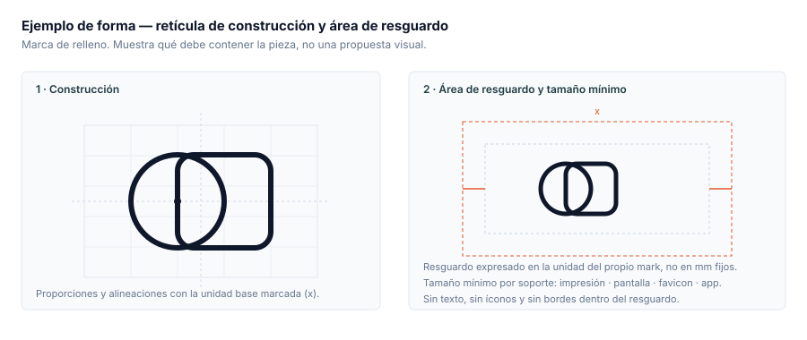

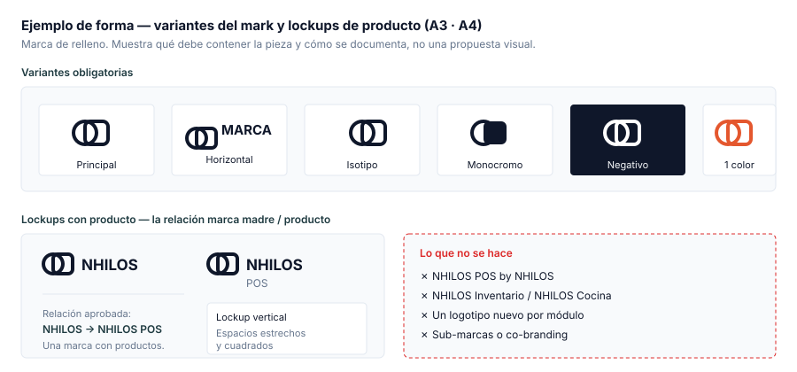

**`A5` `A6` — Resguardo, tamaños mínimos y usos incorrectos.**
No alcanza con decir "no lo deformes". Hay que **mostrarlo**, y mostrar qué hacer en cada caso.

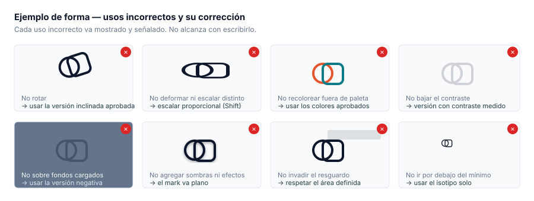

**`A7` — Paleta.**
Cada color con sus cuatro valores —porque se imprime, se ve en pantalla y se publica en redes— y una
proporción de uso, porque una paleta sin proporción termina con todo el mundo eligiendo su favorito.

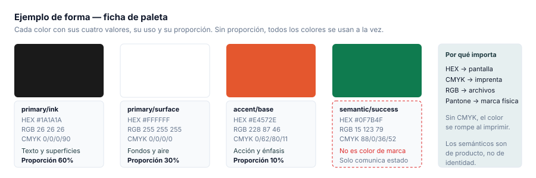

**`A8` — Tipografía.**
No "la fuente es X", sino la escala completa con tamaños, pesos, interlineado y casos de uso. Es lo
que permite que dos personas distintas compongan igual.

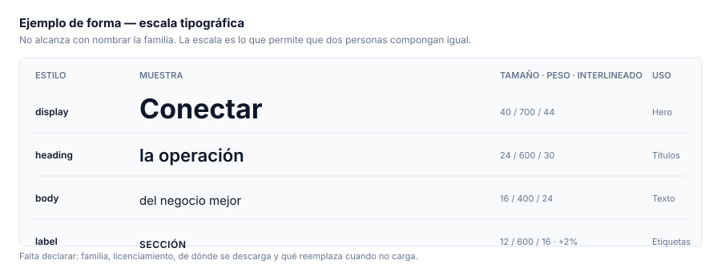

**`A9` — Iconografía.**
No es "una librería de íconos": es la retícula y las reglas que hacen que un ícono nuevo pertenezca
al sistema sin que haya que preguntar.

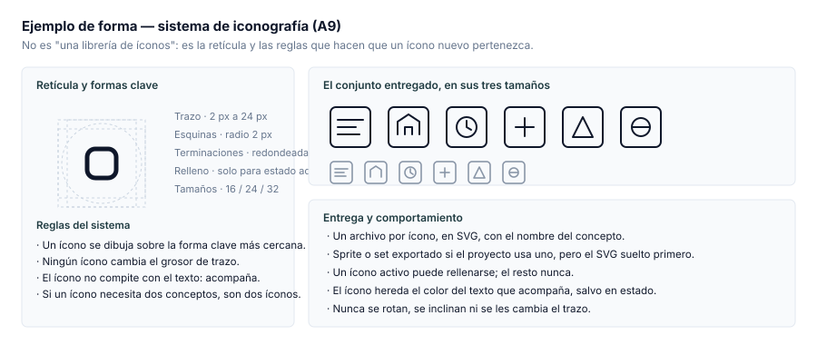

**`A10` — Dirección de imagen.**
Qué tipo de foto y qué se descarta, con referencias enlazadas. Cada referencia debe venir con la
razón por la que encaja.

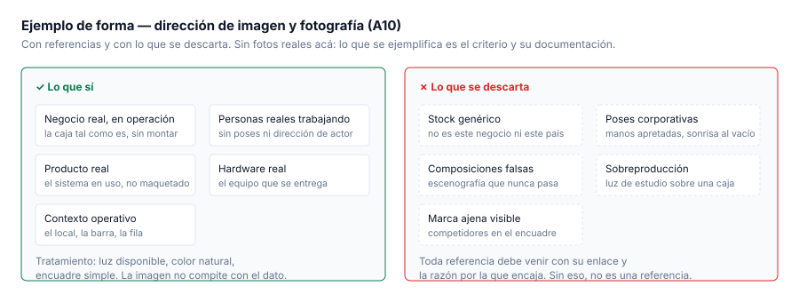

**`A11` — Retícula y layout.**
Columnas, márgenes, espaciado y comportamiento por ancho. Sin esto, cada pantalla se compone
distinto y el sistema no se sostiene.

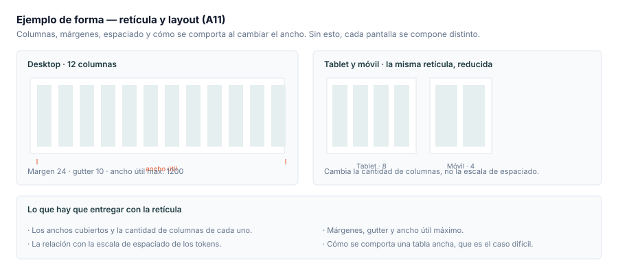

**`A12` — Derivaciones.**
Favicon, ícono de app y cualquier sello o marca de agua. Deben **derivar del mismo sistema**, no
inventarse aparte. El ejemplo de empaquetado en `§5` muestra los archivos que se esperan.

**`A13` — Master tokens.** ← *La pieza que convierte archivos en sistema.*
Es la que un encargo de agencia normalmente no pide, y por eso es la que más se omite. En tabla, no
solo en Figma, y exportada para que el equipo la consuma.

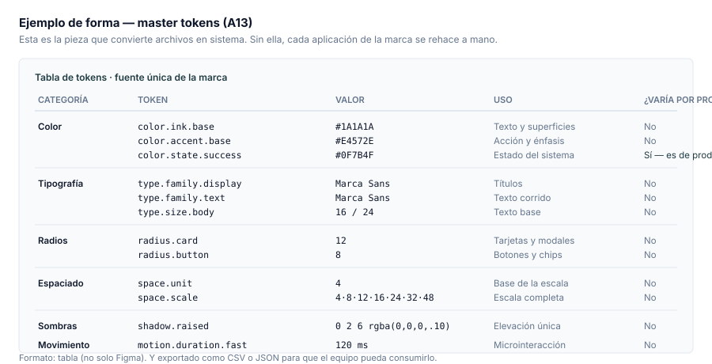

**`A14` — Reglas de expresión por producto.** ← *La segunda que más se omite.*
Define qué se hereda sin cambios y qué puede variar por producto, y con qué criterio se decide. Es
lo que permite sumar un producto sin rediseñar la marca.

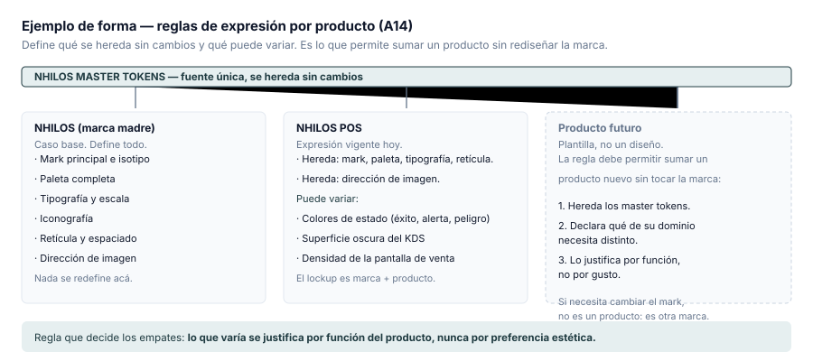

**`A15` — Guía consolidada.**
Todo lo anterior en un recorrido con índice. La estructura esperada:

| Sección | Contenido |
|---|---|
| 1 · La marca | Propósito, esencia y slogan, citados de la constitución |
| 2 · El mark | Construcción, variantes, lockups, resguardo, tamaños mínimos, usos incorrectos |
| 3 · Color | Paleta, valores, proporción, contraste |
| 4 · Tipografía | Familias, escala, licenciamiento |
| 5 · Iconografía | Retícula, reglas, el conjunto |
| 6 · Imagen | Dirección, referencias, qué evitar |
| 7 · Retícula y layout | Columnas, espaciado, comportamiento |
| 8 · Derivaciones | Favicon, ícono de app, sellos |
| 9 · Tokens | La tabla completa |
| 10 · Expresión por producto | Qué se hereda y qué varía |
| 11 · Aplicación | Ejemplos de la marca aplicada, en piezas reales |

### 3.3 Ficha de ejemplo: cómo se documenta una pieza

Así se ve una ficha de paleta completa. La marca es de relleno: mirá **la estructura**, no los
valores.

| Nombre | Uso | HEX | RGB | CMYK | Proporción |
|---|---|---|---|---|---|
| `primary/ink` | Texto principal, superficies oscuras | `#1A1A1A` | `26, 26, 26` | `0/0/0/90` | 60 % |
| `primary/surface` | Fondos, aire | `#FFFFFF` | `255, 255, 255` | `0/0/0/0` | 30 % |
| `accent/base` | Acción, énfasis puntual | `#E4572E` | `228, 87, 46` | `0/62/80/11` | 10 % |
| `semantic/success` | Estado correcto. **No es color de marca** | `#0F7B4F` | `15, 123, 79` | `88/0/36/52` | estado |

Y así una ficha de variante:

| Pieza | Archivo | Cuándo se usa | Fondo admitido |
|---|---|---|---|
| Principal | `logo-primary.svg` | Caso por defecto | Claro |
| Horizontal | `logo-horizontal.svg` | Espacios anchos y bajos | Claro |
| Isotipo | `logo-mark.svg` | Favicon, ícono de app, espacios cuadrados | Claro u oscuro |
| Negativo | `logo-negative.svg` | Sobre fondos oscuros o fotografías tratadas | Oscuro |
| Monocromo | `logo-mono.svg` | Impresión a un color, grabado, sellos | Claro u oscuro |

---

## 4. Entregable B — Diseño del sitio comercial

### 4.1 Dos fases, y el orden no se negocia

| Fase | Qué es | Cuándo | Con qué identidad |
|---|---|---|---|
| `B1` — Estructura y contenido | Arquitectura, jerarquía, flujos, copy aplicado, responsive, estados | **Ya** | **Ninguna.** Grises neutros y tipografía de sistema |
| `B2` — Piel visual | La identidad aplicada a las pantallas de `B1` | Cuando cierre el entregable A | La identidad final |

> **`B1` se prototipa en gris.** Si en `B1` fijás colores, tipografías o el logo actual, ese trabajo
> se tira cuando llegue la identidad. No es una preferencia: es la razón por la que el orden existe.

### 4.2 Qué entregar en cada fase

| # | Pieza | Qué debe contener |
|---|---|---|
| B1.1 | **Mapa del sitio** | Las rutas y su relación, con el propósito de cada una en una frase |
| B1.2 | **Wireframes por página** | Todas las rutas del alcance, con jerarquía real y contenido real |
| B1.3 | **Estados** | De componente **y** de página (ver 4.4) |
| B1.4 | **Responsive** | Los anchos definidos, con la retícula de cada uno |
| B1.5 | **Flujo de conversión** | El recorrido hasta "Solicitar una demo", incluido el formulario y sus errores |
| B2.1 | **Pantallas finales** | Las mismas de `B1`, con la identidad aplicada |
| B2.2 | **Especificación de componentes** | Cada componente acotado: medidas, espaciados y estados (ver 4.5) |
| B2.3 | **Tokens del sitio** | Los valores en tabla, con el mismo formato que `A13` |
| B2.4 | **Assets exportados** | Imágenes e íconos en los formatos y tamaños que el sitio necesita |
| B2.5 | **Evidencia de accesibilidad** | Contraste **medido**, foco visible y movimiento reducido (ver 4.6) |

### 4.3 Ejemplo de forma — mapa del sitio (`B1.1`)

Es la primera pieza de `B1` y la que ordena todo lo demás. Declara las rutas, qué página introduce y
cuál resuelve, la única ruta de conversión, y **qué no existe todavía**.

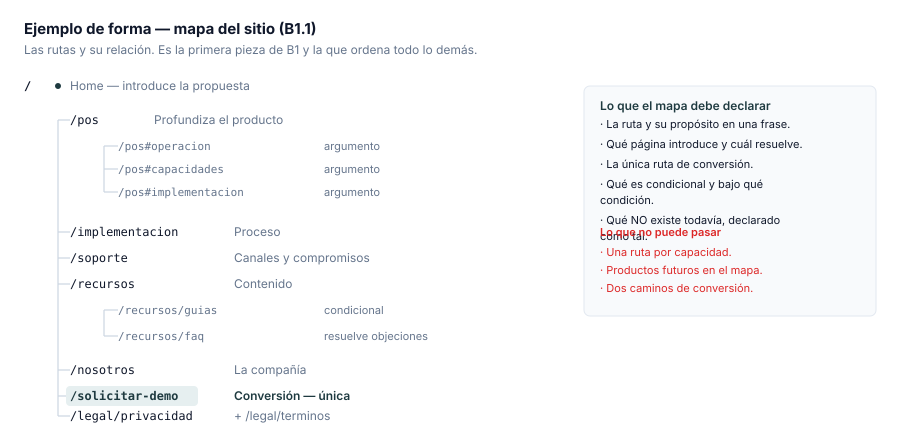

### 4.4 Ejemplos de forma — estados (`B1.3`)

Hay dos niveles y se entregan los dos. **Estados de componente**, que es el que casi todos entregan:

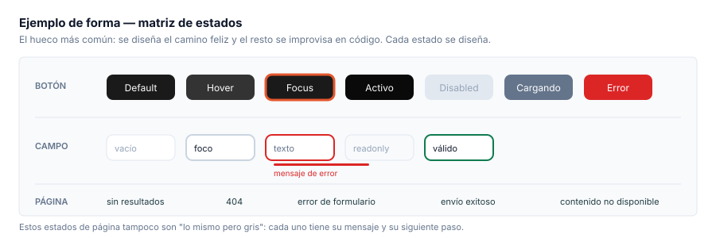

Y **estados de página**, que es el que casi todos omiten. Acá la página entera cambia y define un
siguiente paso:

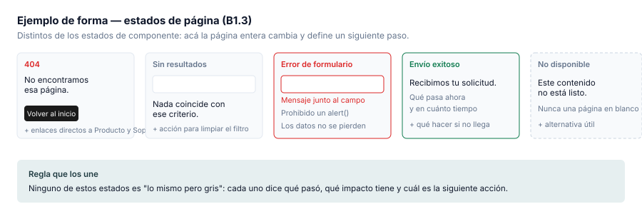

### 4.5 Ejemplo de forma — especificación de componente (`B2.2`)

Un componente no se entrega como imagen: se entrega **acotado**. Medidas, espaciados, tokens usados
y el comportamiento de cada estado. Es lo que permite que se construya sin interpretar.

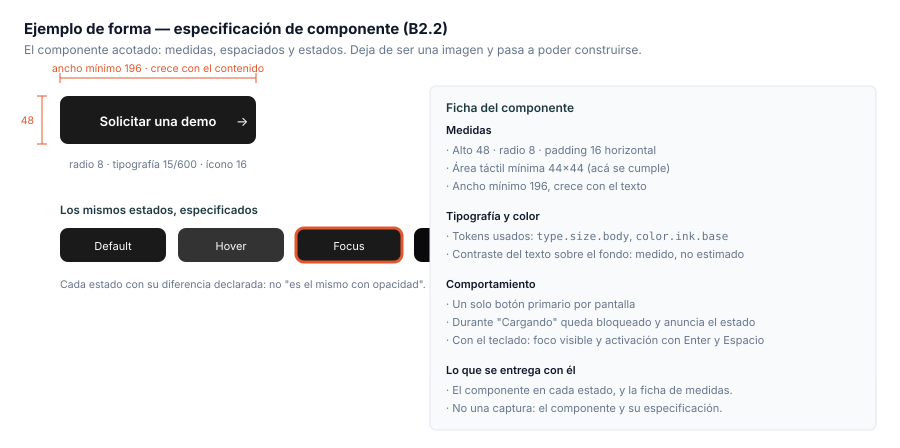

### 4.6 Ejemplo de forma — evidencia de accesibilidad (`B2.5`)

La accesibilidad es un **criterio de aceptación**, no una mejora posterior. La entrega incluye el
contraste medido por combinación, con la herramienta y la fecha. Una combinación que no se midió no
está aprobada; "se ve bien" no es evidencia.

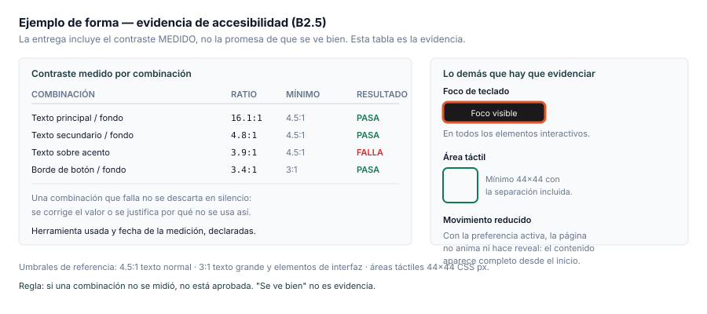

## 5. Cómo se empaqueta la entrega

El empaquetado también se devuelve si está mal. Convención:

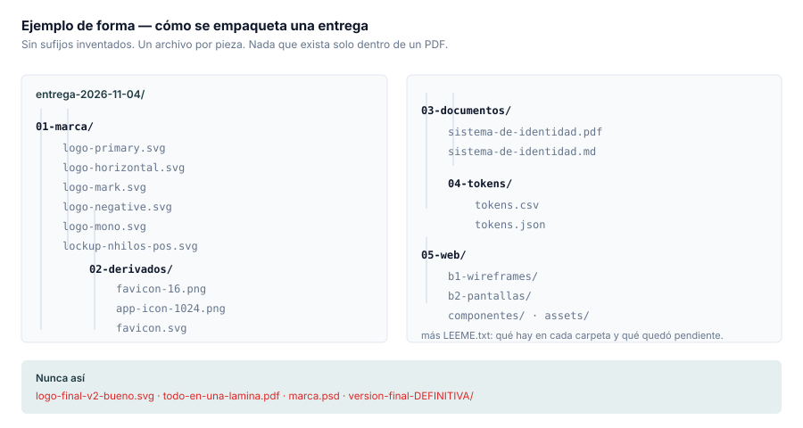

Reglas de nombre y formato:

- **Vectorial siempre que sea posible.** El `.svg` es el archivo fuente; el `.png` es una
  conveniencia, no el entregable.
- **Sin sufijos inventados** (`final`, `v2`, `bueno`, `este-si`). La versión se expresa con el
  nombre y la fecha de entrega, no con adjetivos.
- **Un archivo por pieza**, no una lámina con todas. La lámina sirve para revisar; el archivo suelto
  es lo que alguien va a usar.
- **Nada dentro de un PDF que solo exista dentro del PDF.** Si una regla está escrita, tiene que
  estar en el documento; si una pieza está dibujada, tiene que existir como archivo.

---

## 6. Checklist de autoverificación antes de entregar

Pasá esta lista antes de mandar. Si algo queda sin marcar, no está listo.

**Entregable A**
- [ ] El mark se lee **en negro puro**, sin depender del color.
- [ ] Se imprimió una prueba a tamaño de favicon (16 px) y es reconocible.
- [ ] Se imprimió una prueba en térmico monocromo y no se empasta.
- [ ] Existen las **seis** variantes: principal, horizontal, isotipo, monocromo, negativo y un color.
- [ ] Existe el **lockup de producto** (`NHILOS` + `NHILOS POS`) y la regla de relación marca madre / producto.
- [ ] El área de resguardo está expresada en una unidad del mark, no en milímetros sueltos.
- [ ] El tamaño mínimo está declarado **por soporte**: impresión, pantalla, favicon, app.
- [ ] Hay al menos 6 usos incorrectos mostrados, cada uno con su corrección.
- [ ] Cada color de la paleta tiene HEX, RGB, CMYK, uso y proporción.
- [ ] La tipografía declara familia, escala, licenciamiento y de dónde se descarga.
- [ ] La iconografía declara retícula, grosor de trazo y reglas, y entrega **un archivo por ícono**.
- [ ] La dirección de imagen trae referencias enlazadas, cada una con la razón por la que encaja.
- [ ] La retícula declara columnas, márgenes, gutter y comportamiento por ancho.
- [ ] Favicon e ícono de app **derivan** del sistema; no se inventaron aparte.
- [ ] Los **master tokens** están en tabla y cubren color, tipografía, radios, espaciado, sombras y movimiento.
- [ ] Los tokens están exportados en un formato que el equipo pueda consumir (CSV o JSON, no solo Figma).
- [ ] Las **reglas de expresión por producto** están escritas, con el criterio para decidir los empates.
- [ ] La guía consolidada tiene índice y sigue el orden de `A15` (§3.2).
- [ ] Alguien que no sos vos aplicó la marca a una pieza nueva usando solo la guía, y salió bien.

**Entregable B**
- [ ] `B1` está en gris neutro: **ningún** color, tipografía ni logo final.
- [ ] El mapa del sitio declara ruta, propósito, y qué **no** existe todavía.
- [ ] Están **todas** las rutas del alcance, no solo la home.
- [ ] Hay **una sola** ruta de conversión.
- [ ] Están todos los estados de componente (§4.4).
- [ ] Están los estados de **página**: 404, sin resultados, error de formulario, envío exitoso y contenido no disponible.
- [ ] Los anchos de pantalla están cubiertos y la retícula de cada uno es explícita.
- [ ] El caso difícil está resuelto: **una tabla ancha en pantalla chica**.
- [ ] Cada componente viene **acotado**: medidas, espaciados y tokens usados (§4.5).
- [ ] Los tokens del sitio siguen el mismo formato que `A13`.
- [ ] El contraste está **medido y anotado por combinación**, con herramienta y fecha (§4.6).
- [ ] El foco de teclado es visible en todos los elementos interactivos.
- [ ] El **movimiento reducido** está cubierto.
- [ ] Los assets están exportados con la convención de nombres de §5.
- [ ] No quedó ninguna pieza que solo exista dentro de un PDF.

---

## 7. Los ocho errores que devuelven una entrega

Están ordenados por frecuencia. Los primeros cuatro son los que realmente hacen perder tiempo.

1. **Entregar piezas sin sistema.** Archivos sin reglas escritas. → Falta `A13` y `A14`.
2. **Depender del color para leerse.** El mark no sobrevive en monocromo. → Falla `R-05` y `R-06` del brief.
3. **Diseñar solo el camino feliz.** Falta todo `4.3`.
4. **Prototipar `B1` con la estética puesta.** Se tira el trabajo cuando llega la identidad.
5. **Área de resguardo en unidades absolutas** en vez de relativas al mark. Deja de funcionar al reescalar.
6. **Paleta sin CMYK ni proporción.** Se rompe al imprimir y termina con todos los colores usados a la vez.
7. **Tipografía sin licenciamiento declarado.** El cliente descubre que no puede usarla, después.
8. **Piezas que solo existen dentro del PDF.** Nadie puede aplicarlas.

---

## 8. Qué no es parte de esta entrega

Para que no se pierda tiempo en cosas que no pedimos:

- **La estrategia de marca.** Ya está definida y aprobada en la constitución. No se rediscute.
- **El copy.** Ya existe, aprobado, en los contratos de contenido. Se aplica, no se reescribe. Si algo no funciona visualmente, se **reporta**; no se cambia en silencio.
- **Prometer capacidades del producto.** Todo lo que se afirme en una pieza pública tiene que existir en el registro de claims. Si algo no está ahí, no se comunica.
- **La implementación.** La entrega es diseño y especificación, no código.
- **El registro marcario.** Es un trámite del cliente, no una tarea de diseño.

---

## 9. Qué pasa después de que entregues

1. **Revisión contra este checklist** y contra el brief. Te devolvemos observaciones por escrito, no por chat suelto.
2. **Corrección acotada.** Se corrigen los puntos observados; no se reabre lo aprobado.
3. **Cierre.** La identidad pasa a ser el documento que gobierna la aplicación de la marca, y el sitio pasa a `B2`.

Si algo del brief no se entiende, **preguntá antes de producir**. Una pregunta temprana cuesta
minutos; una corrección tardía cuesta una semana.
