# Manual de Operación del Owner Dashboard (Portal Web)
## NHILOS POS — Backoffice Administrativo para Propietarios

**Document ID:** NH-MAN-DSH-001 (CD-12)  
**Versión:** 0.2  
**Estado:** CLIENT-READY  
**Aplica a:** Propietarios (Owners), administradores y gerentes de SOHO Café (`NH-T0001`)  
**Acceso Web:** Portal Backoffice en la Nube  

> **Cambios v0.2:** sección 6 reescrita paso a paso con capturas actualizadas; correcciones de renderizado, terminología y alineación de §3–§4 con la UI real; captura del dashboard con filtro «Este mes», imágenes nuevas para §7 (Inventario y Recetas) y §9 (Usuarios), y ruta real de Usuarios. Cierre de follow-ups: §10 reformulada con lo disponible hoy y su hoja de ruta (la ruta `Ajustes > Dispositivos` no existe en el backoffice) y §11 sin marcadores de posición, solo canales verificables y guías incluidas.

---

## 1. Acceso y Autenticación Administrativa

El Owner Dashboard es una plataforma web a la que podés acceder desde cualquier computadora, tableta o teléfono móvil con navegador web moderno (Google Chrome, Safari, Firefox o Edge):

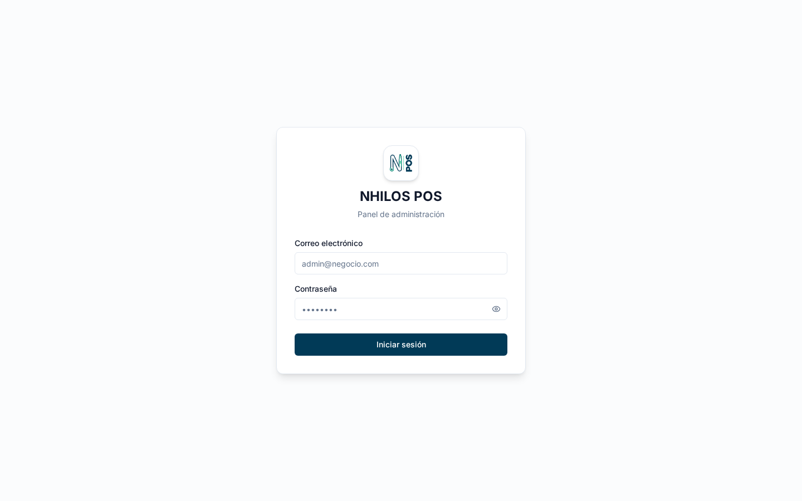

1. **Ingreso:** Navegá hacia el subdominio asignado a tu comercio (ej. `http://soho.localhost:5173` en pruebas locales o `https://soho.nhilospos.com` en producción).
2. **Credenciales:** Ingresá tu correo electrónico corporativo registrado (`admin@soho.com`) y tu contraseña segura de propietario.
3. **Cierre de Sesión:** Al finalizar tus consultas en computadoras públicas o compartidas, hacé clic en tu avatar en la esquina inferior izquierda y seleccioná **"Cerrar Sesión"**.

---

## 2. Comprensión Crítica: Datos de Caja (POS) vs. Datos en Nube (Dashboard)

> **REGLA FUNDAMENTAL DE ARQUITECTURA:**  
> **El punto de venta físico (POS) es la fuente de verdad operativa de tu negocio.**  
> El Owner Dashboard web refleja la información que **ya ha sido sincronizada a la nube** a través de internet. Si el terminal físico de SOHO Café se queda temporalmente sin señal de Wi-Fi o internet en Managua, los cajeros seguirán cobrando sin problema, pero esas ventas aparecerán en el Dashboard web recién cuando el terminal recupere conectividad y complete su subida.

En la barra superior del portal verás siempre el indicador de **Frescura de Sincronización**, que muestra la fecha y hora exactas del último reporte recibido desde la caja.

---

## 3. Vista General del Negocio (Dashboard Overview)

Al iniciar sesión, la pantalla de inicio te presenta los indicadores clave de rendimiento (KPIs) con datos sincronizados desde la terminal de caja. Para ver el negocio completo, abrí el selector de rango de fechas («Seleccionar rango de fechas») y elegí el preset **Este mes** en «Periodos Rápidos»; la captura muestra ese filtro con las ventas de octubre hasta el día 9:

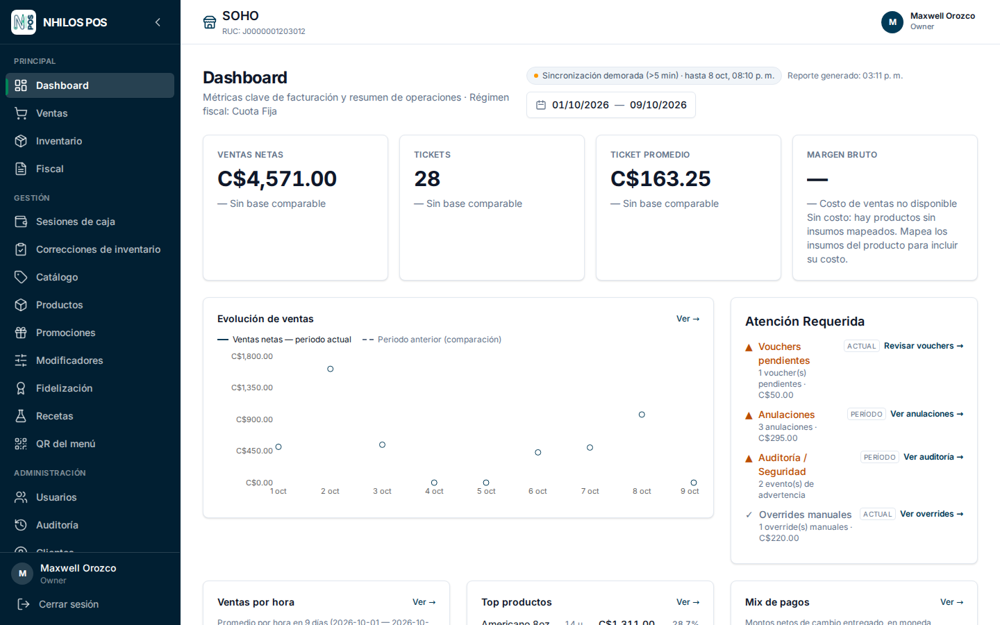

1. **Ventas Netas del Período:** Monto total facturado en Córdobas (C\$) en el rango seleccionado (con **Este mes**: C\$ 4,571.00 del 01/10/2026 al 09/10/2026; «Sin base comparable» porque el mes anterior no tiene datos cargados).
2. **Volumen de Facturas (Tickets):** Cantidad de comprobantes emitidos válidos (en la captura, 28 tickets del mes).
3. **Ticket Promedio:** Gasto medio por cliente (en la captura, C\$ 163.25).
4. **Margen Bruto Teórico:** Indicador de rentabilidad; en SOHO todavía sin base porque muestra «Costo de ventas no disponible» hasta mapear los insumos de cada producto (se resuelve al cargar recetas, sección 7).
5. **Evolución de Ventas:** Gráfica diaria del período con la serie «Ventas netas — período actual» y su comparación con el «Período anterior (comparación)» (del 1 al 9 de octubre en la captura).
6. **Ventas por Hora y Top Productos:** Promedio por hora del período («Promedio por hora en 9 días») y ranking de rotación (en la captura, *Americano 8oz* lidera con 14 unidades, C\$ 1,311.00 y 28.7% de participación).
7. **Mix de Métodos de Pago:** Desglose consolidado del dinero recibido (Efectivo NIO, USD, Tarjetas).
8. **Atención Requerida:** Resumen automático de alertas del negocio (en la captura: 1 voucher pendiente por C\$ 50.00, 3 anulaciones del período por C\$ 295.00, 2 eventos de advertencia de auditoría y 1 override manual por C\$ 220.00).

---

## 4. Módulo de Ventas y Arqueos de Turno

En la sección lateral **Ventas**:

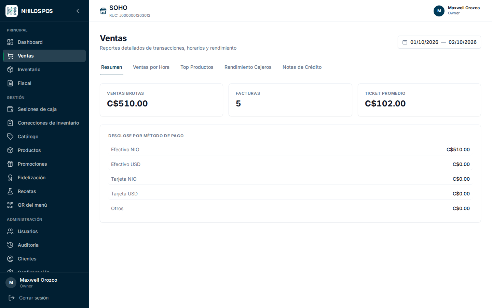

### 4.1 Reportes de Ventas (pestañas del módulo)
* **Resumen:** ventas brutas, cantidad de facturas y ticket promedio del rango seleccionado, con el desglose por método de pago (Efectivo NIO/USD, Tarjeta NIO/USD, Otros) — como muestra la captura.
* **Ventas por Hora:** distribución de la facturación a lo largo del día.
* **Top Productos:** ranking de rotación de productos.
* **Rendimiento Cajeros:** métricas por operador de caja.
* **Reconciliaciones:** listado por pago con Estado, Monto, Método, Voucher, Fecha, Operador y Terminal; con filtro de estado y paginación para cuadrar cada voucher contra el arqueo.
* **Notas de Crédito:** con el permiso de emisión, elegí una de las 50 facturas más recientes (Factura, Estado, Total, Fecha) y emití la nota desde el diálogo.

> **Nota:** el dashboard no ofrece una lista cronológica general de facturas con drill-down: el detalle a nivel factura se obtiene desde **Fiscal › Exportaciones** (Excel/CSV) y el trazado por pago desde **Reconciliaciones**.

### 4.2 Auditoría de Anulaciones (Voids)
* La auditoría de anulaciones vive en **Fiscal › Anulaciones** (no en este módulo).
* La tabla muestra **Factura, Cajero, Total, Motivo y Fecha** de cada venta anulada, con el total de anulaciones y el monto total anulado, filtrables por rango de fechas.
* La anulación ocurre en el POS con autorización de supervisor; el dashboard solo la refleja ya sincronizada.

### 4.3 Sesiones de Caja y Reportes de Cierre (Cortes Z)
En la sección **Sesiones de caja** del menú lateral:

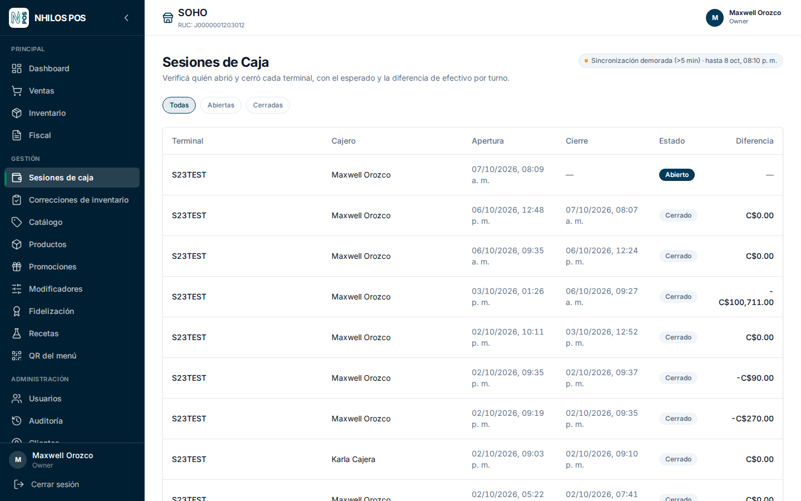

* Verificá quién abrió y cerró cada terminal de la sucursal (`S23TEST`).
* Control del tiempo de turno: fecha y hora exacta de apertura y de cierre.
* **Control de Descuadres:** Consulta de la diferencia de efectivo reportada en el arqueo ciego (ej. `-C$90.00` o `-C$270.00`) para detectar faltantes de caja de inmediato.

---

## 5. Módulo de Catálogo y Precios

En la sección **Productos** del menú lateral:

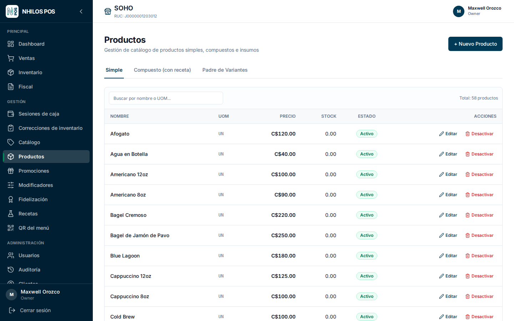

1. **Visualización de Menú:** Lista completa de los **58 productos** del menú de SOHO Café organizados en modalidad *Simple*, con su Unidad de Medida (UN), precio de venta oficial y distintivo de estado *Activo*.
2. **Búsqueda Dinámica:** Buscador integrado por nombre o categoría.
3. **Acciones:**
   * **Editar:** Permite actualizar el precio de venta de cualquier producto en pocos segundos.
   * **Desactivar:** Permite ocultar temporalmente un producto del terminal POS si se agota en barra.

---

## 6. Módulo de Modificadores y Extras (Centro de Operaciones)

En la sección **Modificadores** del menú lateral (acceso con rol **Owner** o **Manager**), el sistema ofrece un centro de control unificado para administrar opciones compartidas (leches, endulzantes, adicionales, jarabes o salsas). La pestaña **Grupos** lista todos los grupos con su regla de selección, la cantidad de opciones y su orden:

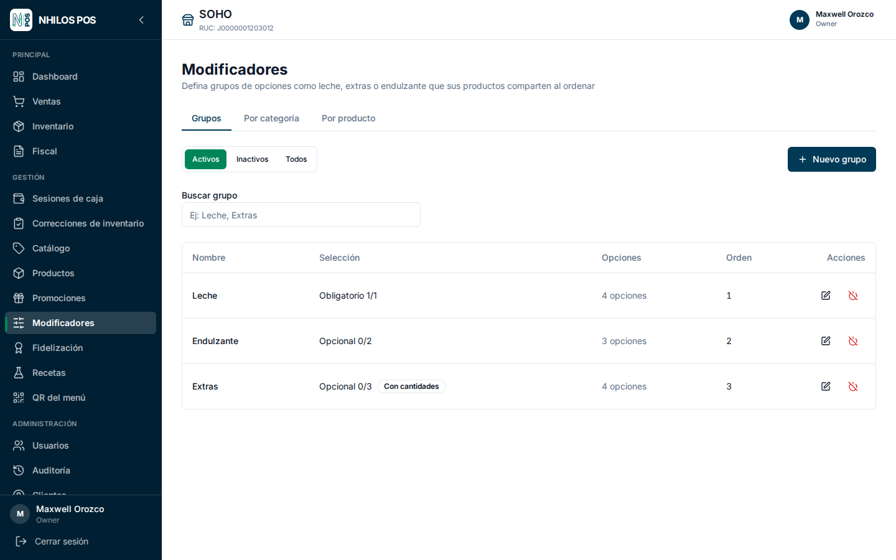

En el ejemplo de SOHO Café: **Leche** (`Obligatorio 1/1`, 4 opciones), **Endulzante** (`Opcional 0/2`, 3 opciones) y **Extras** (`Opcional 0/3` con **Con cantidades**, 4 opciones).

### 6.1 Pestaña «Grupos»: crear un grupo con sus opciones, paso a paso

**Paso 1 — Abrir el diálogo de creación.** Hacé clic en el botón **"Nuevo grupo"** (arriba a la derecha). Se abre el diálogo **«Nuevo grupo de modificadores»**, todavía vacío:

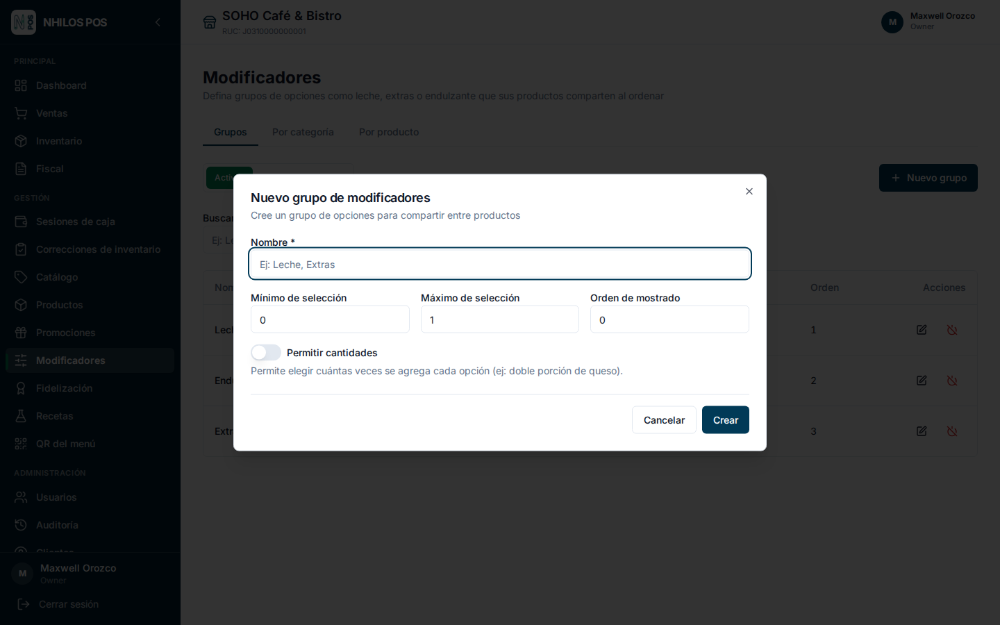

**Paso 2 — Definir las reglas del grupo.** Completá:

* **Nombre del grupo:** (ej. *Jarabes*).
* **Rango de selección:** cantidad mínima y máxima que el cliente puede elegir, con los campos **Mínimo de selección** y **Máximo de selección** (ej. `1/1` para selección única obligatoria; `0/3` para opcionales; en el ejemplo `0/2`).
* **Cantidades por opción:** activá el interruptor **Permitir cantidades** cuando el cliente pueda solicitar unidades repetidas (ej. 2 shots de espresso o 2 raciones de sirope).
* **Orden de mostrado:** el número define la posición del grupo en la pantalla de la cajera.

Guardá con **Crear**.

> **Importante:** el diálogo de creación define únicamente el nombre y las reglas. Las opciones del grupo se agregan en el paso siguiente, reabriendo el grupo desde la lista.

**Paso 3 — Agregar las opciones.** En la lista, hacé clic en el ícono de lápiz (**Editar grupo**) de tu grupo. En la sección **«Opciones del grupo»** pulsá **+ Agregar opción** una vez por cada opción y completá:

* **Nombre** de la opción (ej. *Vainilla*, *Caramelo*).
* **Precio adicional** en Córdobas (ej. `15.00` o `5.00`; usá `0.00` si la opción no cuesta nada).
* **Orden** de presentación dentro del grupo.
* **Predeterminado:** marcá la opción que aparece preseleccionada al ordenar (solo una puede ser predeterminada).

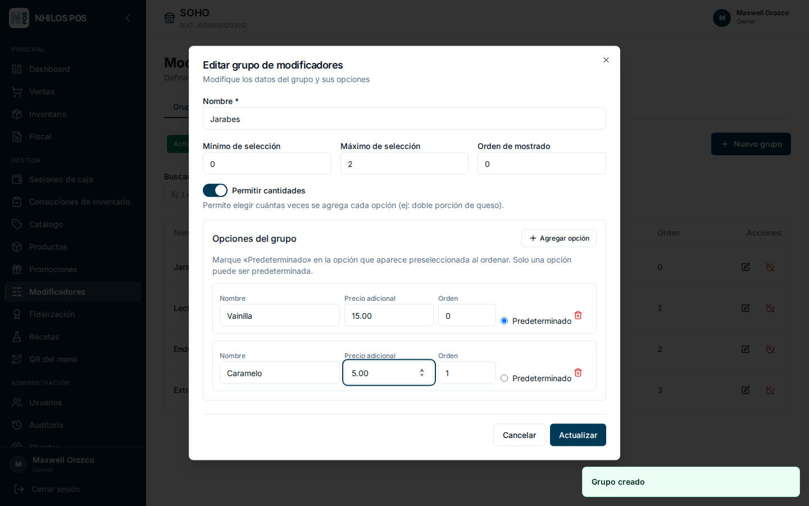

**Paso 4 — Guardar.** Pulsá **Actualizar**: el grupo queda listado con su regla (ej. «Opcional 0/2» con **Con cantidades**) y la cantidad de opciones («2 opciones»):

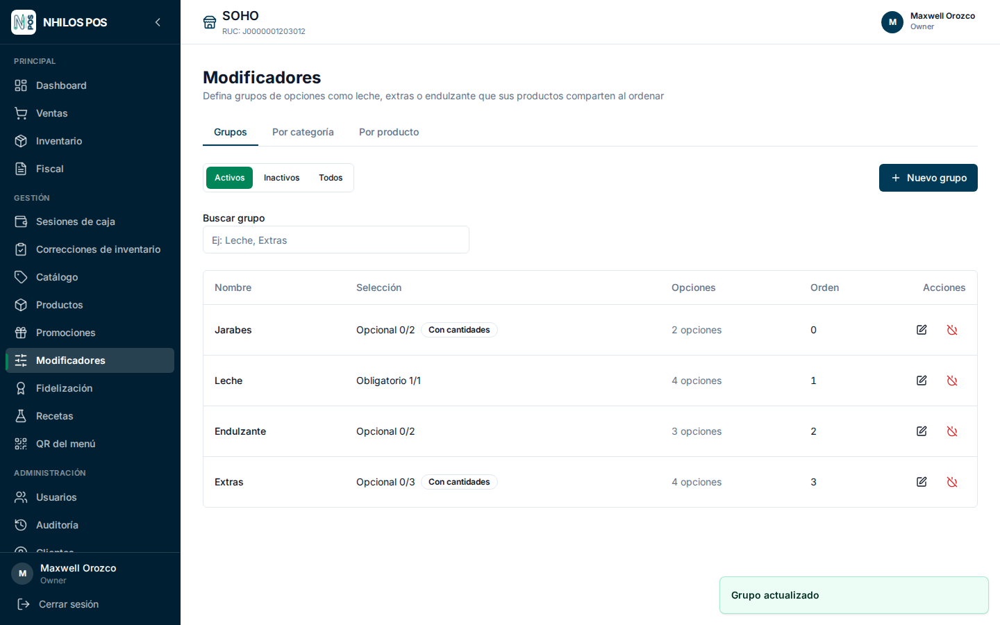

**Paso 5 — Verificar la persistencia.** Recargá la página completa (F5). El grupo y sus opciones siguen en la lista exactamente igual: esa es la prueba real de que quedó guardado en el servidor y no solo en la pantalla:

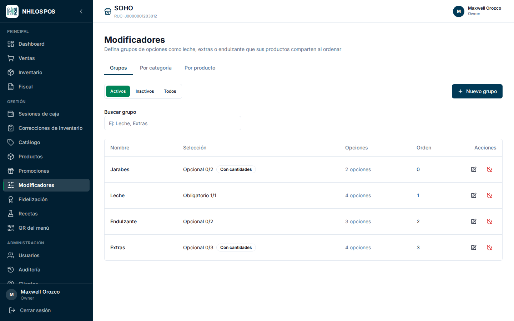

**Buscador y filtro de estados:** sobre la lista tenés un buscador rápido para filtrar grupos por nombre, y el selector de estado (**Activos**, **Inactivos**, **Todos**) que permite auditar grupos archivados y **reactivarlos** con un solo clic sin perder la parametrización histórica (ver el paso 8).

### 6.2 Pestaña «Por categoría» (Asignación Masiva)

**Paso 6 — Enganchar el grupo a una categoría.** Entrá a la pestaña **Por categoría**, elegí la categoría en el selector **Categoría** (ej. `CAFÉ CALIENTE`) y, en la sección **«Grupos disponibles»**, hacé clic en **Agregar** sobre el grupo que querés colgar (ej. *Jarabes*). El grupo pasa a la sección **«Grupos de la categoría»**:

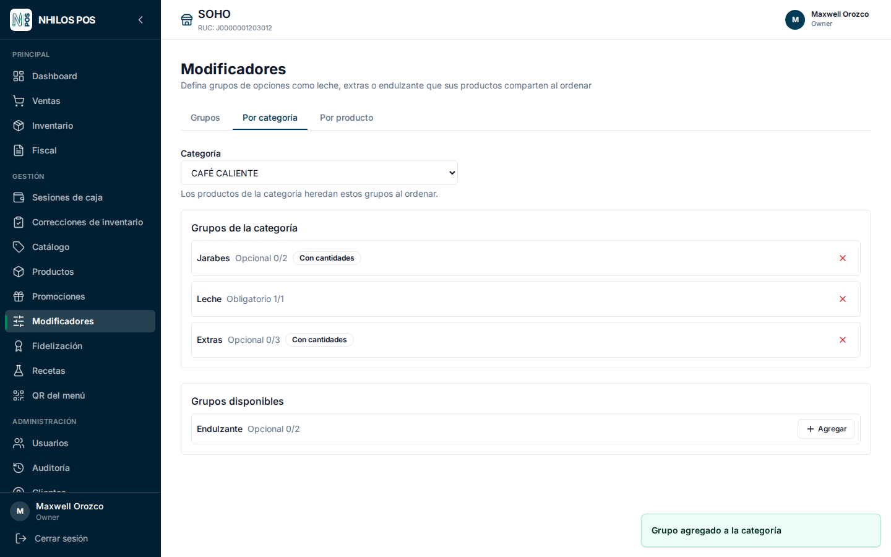

* **Herencia Automática:** Todo producto existente o futuro que pertenezca a esa categoría heredará de inmediato estos modificadores en el POS al sincronizar.
* **Orden de Presentación:** Podés definir el orden en el que aparecerán los grupos en la pantalla de la cajera (ej. 1º Leche, 2º Endulzante, 3º Extras).

### 6.3 Pestaña «Por producto» (Herencia y Excepciones)

**Paso 7 — Verificar la herencia en un producto real.** Entrá a la pestaña **Por producto**, buscá el producto en **Buscar producto** (ej. «Americano») y seleccionalo de la lista. La sección **«Heredado de la categoría»** muestra los grupos que el producto recibe por pertenecer a su categoría, cada uno con el distintivo **«Heredado»**:

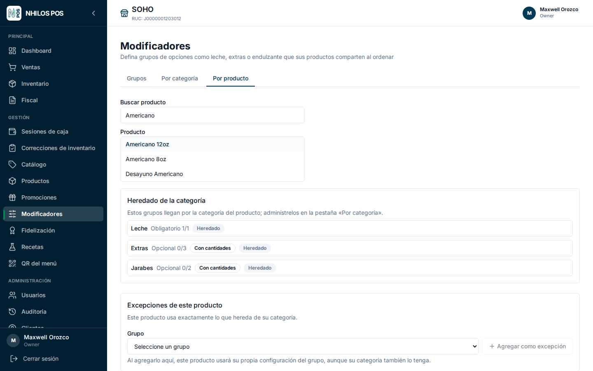

* En el ejemplo, *Americano 12oz* recibe **Leche**, **Extras** y el grupo **Jarabes** creado en esta guía, todos con el distintivo **«Heredado»**.
* Desde acá también gestionás las excepciones a nivel de producto individual:
  * **Agregar un grupo exclusivo:** en **Grupo** elegí el grupo (los ya efectivos se marcan «(ya presente)») y pulsá **Agregar como excepción**; el grupo pasa a **«Excepciones de este producto»** con el distintivo **«De este producto»** y deja de listarse como heredado: la configuración del producto gana sobre la de la categoría.
  * **Quitar una excepción:** con el ícono ✕ de la fila la eliminás y la herencia de la categoría se retoma automáticamente.

**Paso 8 — Desactivar y reactivar un grupo.** Volvé a la pestaña **Grupos** y hacé clic en el ícono de apagado del grupo (**Desactivar grupo**). Confirmá en el diálogo: el sistema nunca borra el grupo — ninguna parametrización histórica se destruye — solo lo desactiva. Con el filtro **Todos** (o **Inactivos**) lo vas a ver listado con la etiqueta **«Desactivado»** y el ícono de encendido que lo **reactiva** con un clic, conservando sus opciones y asignaciones:

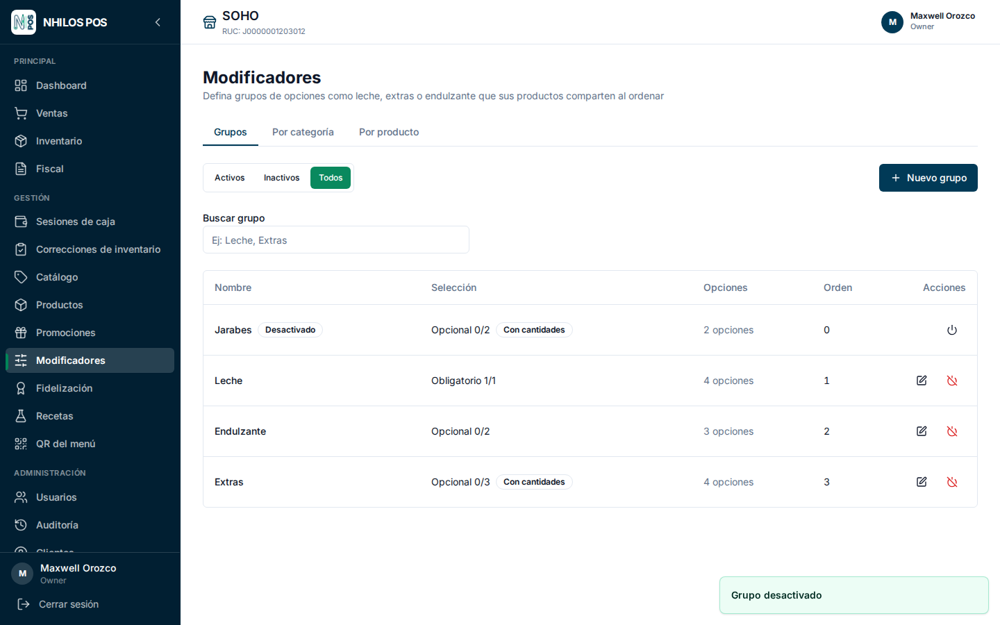

---

## 7. Módulo de Inventario, Recetas y Mermas (Fase Operativa Avanzada)

> **Nota para SOHO Día 1:** Durante la jornada inicial de puesta en marcha, el catálogo opera con productos en modalidad **SIMPLE** (solo precio y venta). Cuando se carguen las recetas e insumos, se habilitarán las siguientes capacidades analíticas:

1. **Control de Insumos (Materias Primas):** Existencia teórica en bodega de café en grano, leche, jarabes, azúcar, vasos descartables y tapas.
2. **Descuento Automático por Receta:** Cada vez que la caja vende un *Cappuccino 12oz*, el sistema descuenta matemáticamente los 18g de café, 120ml de leche, 1 vaso y 1 tapa correspondientes.
3. **Costo de Bienes Vendidos (COGS) y Margen Bruto:**
   * El sistema calcula el Costo Promedio Ponderado (CPP) de cada insumo.
   * Muestra el **margen de ganancia bruta real** de cada producto del menú (Precio de venta menos costo de ingredientes).
4. **Registro de Mermas y Ajustes:** Registro justificado de insumos caducados, leche cortada o derrames en preparación para auditar el desperdicio real del negocio.

**Estado actual (Día 1):** el módulo vive en las secciones **Inventario** y **Recetas** del menú lateral. Así se ve **Inventario** hoy, con la pestaña **Valoración** en cero hasta mapear insumos y las pestañas **Insumos**, **Compras**, **Proveedores**, **COGS / Margen**, **Kardex** y **Alertas** listas para cuando el control esté cargado:

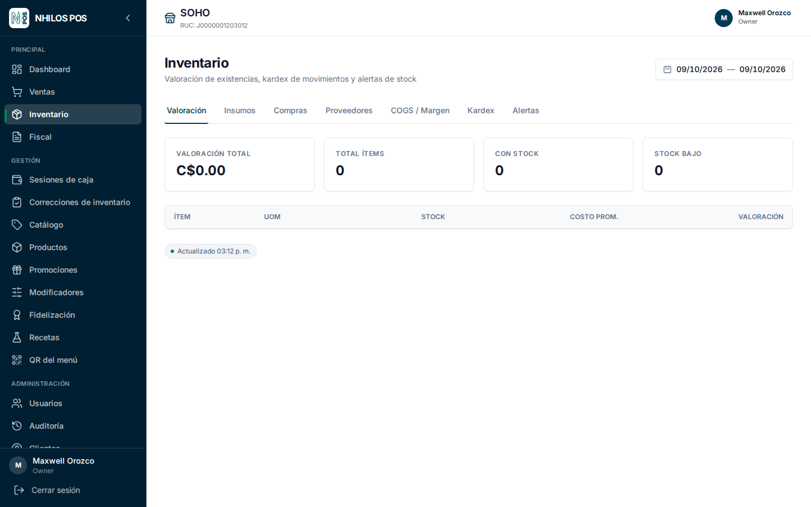

Y así **Recetas y BOM**, pidiendo productos de tipo *Compuesto* en el catálogo mientras no haya recetas cargadas:

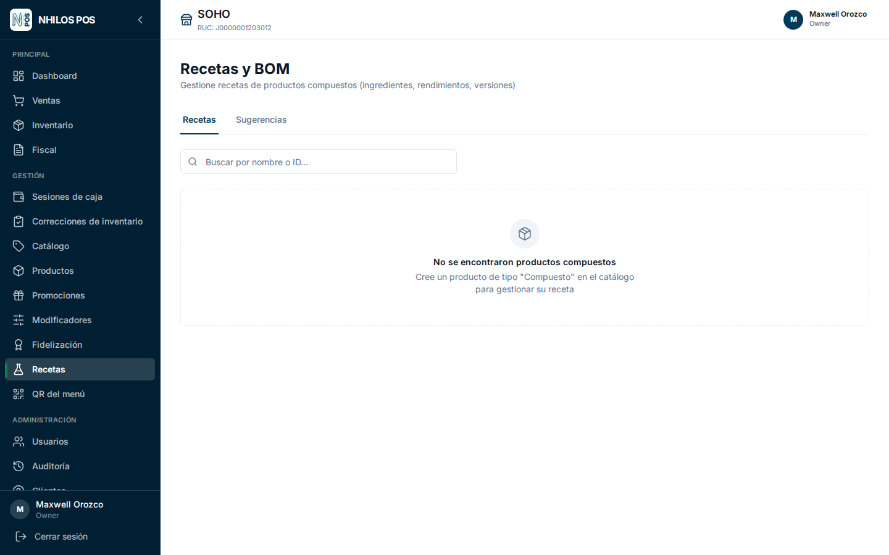

---

## 8. Módulo Fiscal y Reportes para Contabilidad

En la sección **Fiscal** del menú lateral:

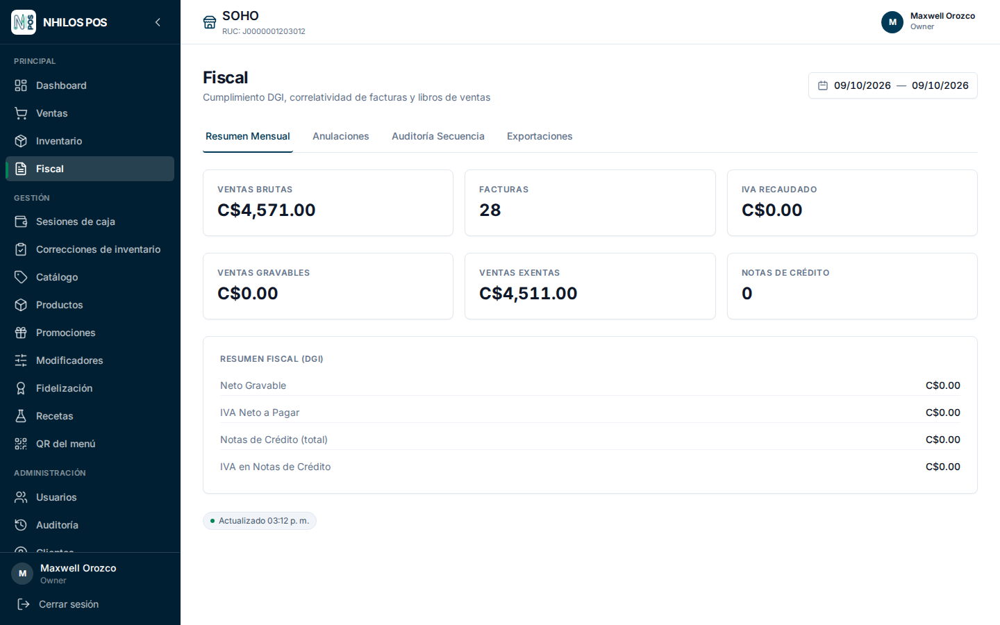

1. **Cumplimiento DGI (Disposición Técnica 09-2007):**
   * Resumen mensual de ventas brutas (C\$ 4,571.00), cantidad de facturas (28) e IVA recaudado (C\$ 0.00 bajo Cuota Fija).
   * Clasificación de ventas exentas / no sujetas y notas de crédito emitidas.
   * Pista de auditoría inalterable con la numeración secuencial ascendente de facturas.
   * Registro completo de comprobantes anulados (ningún número se salta ni se destruye).
2. **Exportación de Datos para Contador:**
   * Pestaña de **Exportaciones**: Descargá reportes consolidados mensuales en formato **Excel (.xlsx)** o **CSV** para entrega directa a la administración contable.
   * **Columna de cliente:** El archivo exportado incluye una columna que identifica a quién se le facturó cada venta:
     * En **Excel (.xlsx)** el encabezado es `Cliente / RUC`; en **CSV** el encabezado es `Cliente`.
     * Si la venta se cobró en caja con nombre o RUC/Cédula del cliente, ese dato queda grabado en la factura y **siempre** es el que aparece en la exportación.
     * Para ventas antiguas sin ese dato grabado, se usa el nombre actual del cliente en el catálogo (si existe) o, en su defecto, el texto `CONSUMIDOR FINAL`.
     * Nunca aparece un identificador interno del cliente ni una celda vacía: siempre hay un nombre legible.
   * **Nota de terminología:** El ticket térmico de caja imprime `Cliente: Contado` para las ventas sin datos del cliente, mientras que la exportación del dashboard usa `CONSUMIDOR FINAL` para el mismo caso. Ambos textos significan lo mismo (venta a un consumidor final sin datos fiscales) y hoy conviven tal cual.

---

## 9. Gestión de Usuarios, Roles y Seguridad de Acceso

En la sección **Administración > Usuarios** del menú lateral (título «Gestión de Usuarios»):

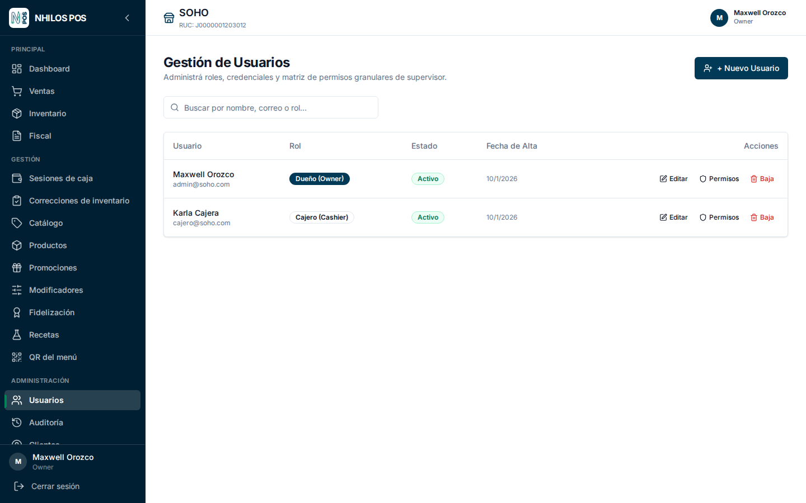

1. **Creación y Edición de Cajeros:**
   * Podés registrar a cada empleado con su nombre completo y correo electrónico desde **+ Nuevo Usuario**, y buscarlo por nombre, correo o rol en la tabla.
   * La columna **Rol** muestra los roles vigentes (en la captura, *Dueño (Owner)* y *Cajero (Cashier)* con estado *Activo*) y la acción **Permisos** abre la matriz granular de cada usuario.
2. **Asignación y Reemplazo de PINs:**
   * Si un cajero olvida su PIN o si se produce una rotación de personal, podés cambiar su código numérico (de 4 a 8 dígitos) desde la ficha de edición del usuario en pocos segundos.
3. **Matriz de Privilegios:**
   * **Cajero:** Solo puede operar la pantalla de venta física en el terminal.
   * **Supervisor / Encargado:** Puede autorizar anulaciones y cierres de turno en caja.
   * **Owner (Propietario):** Acceso total y exclusivo a métricas financieras, costos, recetas y cambios de precios.

---

## 10. Monitoreo de Terminales de Flota (en desarrollo)

Hoy **no existe la ruta `Ajustes > Dispositivos` en el backoffice**: el panel por terminal todavía no está construido, por lo que esta sección se documenta sin captura y con lo que realmente está disponible hoy:

* **Vinculación de terminal:** cada equipo MIRAY Q80 queda vinculado a su sucursal al instalar la app POS (la app lo confirma con «Terminal vinculada»); si el terminal registrado no corresponde al dispositivo, la app lo informa y bloquea el uso.
* **Revocación desde el servidor:** la plataforma puede revocar un dispositivo de forma remota — la app lo muestra como «Dispositivo revocado por el servidor. Requiere reactivación.» —. El botón de revocación autogestionada en el backoffice aún no existe: por ahora este bloqueo lo ejecuta el equipo de NHILOS cuando lo solicitás por el canal de soporte (§11).
* **Frescura de sincronización:** los módulos Fiscal, Caja, Kardex y Auditoría muestran el indicador de estado («Sincronización al día» / «Sincronización demorada») para saber si el backoffice está recibiendo información del POS.

**Hoja de ruta:** detalle por terminal en el backoffice (versión de la app, batería, dirección IP y última sincronización) y revocación desde el propio panel. Esta sección se ampliará con capturas cuando el módulo exista.

---

## 11. Canales de Asistencia y Preguntas Frecuentes

* **Correo de Soporte Técnico:** `soporte@nhilospos.com` — canal oficial de escrito de NHILOS.
* **WhatsApp de Asistencia para Propietarios:** [+505 8194 8526](https://wa.me/50581948526) — WhatsApp Business de soporte NHILOS, atención de Lunes a Sábado de 8:00 AM a 8:00 PM.
* **Horario de Atención:** Lunes a Sábado de 8:00 AM a 8:00 PM.
* **Documentación de referencia incluida:**
  * Guía de inicio rápido: [`nhilos_quick_start_guide_v0.1.md`](./nhilos_quick_start_guide_v0.1.md)
  * Manual de usuario del POS: [`nhilos_pos_user_manual_v0.1.md`](./nhilos_pos_user_manual_v0.1.md)
  * Guía de contingencia: [`nhilos_contingency_guide_v0.1.md`](./nhilos_contingency_guide_v0.1.md)

### Preguntas frecuentes

* **¿Una venta no aparece en el dashboard?** Revisá el indicador de frescura de sincronización (§10): si marca «Sincronización demorada», el POS todavía no envió la información.
* **¿Puedo borrar una factura por error?** No. Por norma DGI las facturas no se eliminan: se anulan (§4.2) y el sistema conserva el registro con numeración secuencial.
* **¿Se cortó la internet?** El POS sigue vendiendo de forma local (SQLite); al restablecer la conexión las ventas se sincronizan y el dashboard se pone al día (§2).
