# Manual de Usuario del Punto de Venta (POS)

## Changelog

| Versión | Fecha | Cambios |
|---|---|---|
| 1.0 | 2026-10-03 | Reemplazo completo de sección 6 (Cuentas Abiertas): ya no es "Retención y Recuperación de Cuentas" sino un flujo completo de cuentas abiertas con 5 secciones (crear, recuperar/editar, múltiples, abandonar, copiar). Actualización de secciones 11.1 (Corte X) y 11.2 (Corte Z) con bloqueos y listados de cuentas abiertas. |
| 0.1 | 2026-??-?? | Primera versión básica de retención y recuperación de tickets (hold simples). |

## NHILOS POS — Terminal MIRAY Q80 / iPOS

**Document ID:** NH-MAN-POS-001 (CD-11)  
**Versión:** 0.1  
**Estado:** CLIENT-READY  
**Aplica a:** Personal de caja, baristas y encargados de turno (Piloto: SOHO Café)  
**Referencia Técnica:** Terminal MIRAY Q80 / iPOS (Android 12, Impresora 80 mm)

---

## 1. Inicio de Jornada y Preparación del Equipo

Antes de abrir el turno de caja, verificá las condiciones físicas del terminal MIRAY Q80:

1. **Encendido:** Mantené presionado el botón de encendido en el lateral derecho del equipo durante 3 segundos hasta que la pantalla se ilumine.
2. **Nivel de Batería:** Comprobá en la esquina superior derecha que la batería tenga al menos un 50% de carga. Si el indicador está bajo, conectá el cable USB-C a la corriente de pared.
3. **Rollo de Papel Térmico:**
   * Abrí la compuerta superior de la impresora tirando de la palanca plástica.
   * Verificá que haya un rollo térmico estándar de **80 mm** instalado.
   * El papel debe salir desenrollándose desde la parte inferior hacia el frente.
   * Dejá asomar 2 cm de papel y cerrá la tapa con firmeza hasta oír un chasquido (*clic*).
4. **Conexión de Red:** Verificá que el ícono de Wi-Fi esté conectado a la red local del negocio. (Si no hay red, recordá que el sistema funciona perfectamente fuera de línea).

---

## 2. Acceso al Sistema mediante PIN

El acceso a NHILOS POS está protegido mediante códigos numéricos individuales para garantizar la auditoría de cada operación:

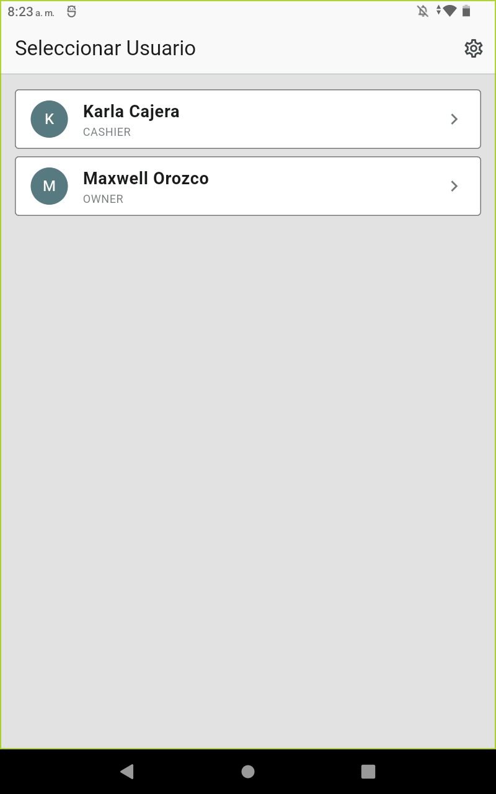

1. Al abrir la aplicación, verás la lista de usuarios autorizados del establecimiento.
2. Seleccioná tu usuario (ej. *Maxwell Orozco* o *Karla Cajera*).

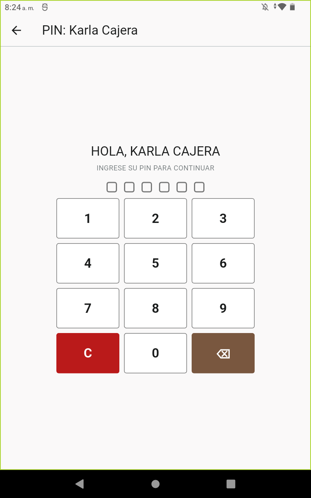

3. Ingresá tu **PIN de 4 a 6 dígitos** asignado en el teclado numérico en pantalla.
4. El sistema verificará tu identidad localmente de inmediato y cargará tu perfil asignado (Cajero, Supervisor o Administrador).

> **Seguridad:** Tu PIN es personal e intransferible. Cada ticket, anulación y cobro queda registrado a tu nombre. Nunca compartas tu código con otros compañeros.

---

## 3. Apertura de Turno de Caja

Al ingresar por primera vez en el día o al comenzar un nuevo turno de trabajo, el sistema te solicitará abrir el turno:

1. Tocá el botón **"Abrir Turno"**.
2. Ingresá el monto de **fondo inicial de efectivo** (*caja chica*) con el que arrancás el turno en Córdobas (NIO).
3. Si la barra maneja un fondo inicial en Dólares (USD), ingresalo en la casilla secundaria correspondiente.
4. Presioná **"Confirmar Apertura"**.
5. Se imprimirá un comprobante térmico con la fecha, hora, nombre del cajero y monto de apertura. Guardalo en la gaveta de dinero.

---

## 4. Registro de Ventas (Navegación por Catálogo)

La pantalla principal de venta se divide en dos áreas visuales:
* **Área Izquierda (Catálogo):** Categorías y cuadrícula de productos con nombre y precio.
* **Área Inferior / Derecha (Ticket Actual):** Barra de total y acceso al carrito de compras.

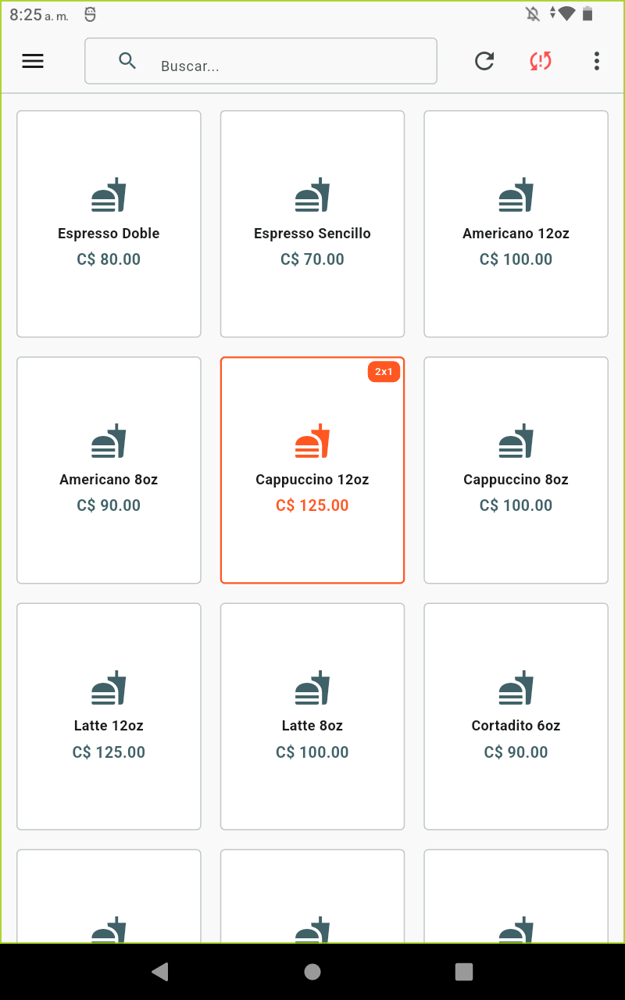

### Pasos para registrar una orden:
1. **Seleccionar Categoría:** Navegá por los productos del menú (ej. *Espresso Doble*, *Americano 12oz*, *Cappuccino 12oz* con distintivo promocional).
2. **Agregar Producto:** Tocá el producto deseado. Cada toque incrementa la cantidad en una unidad dentro del ticket.

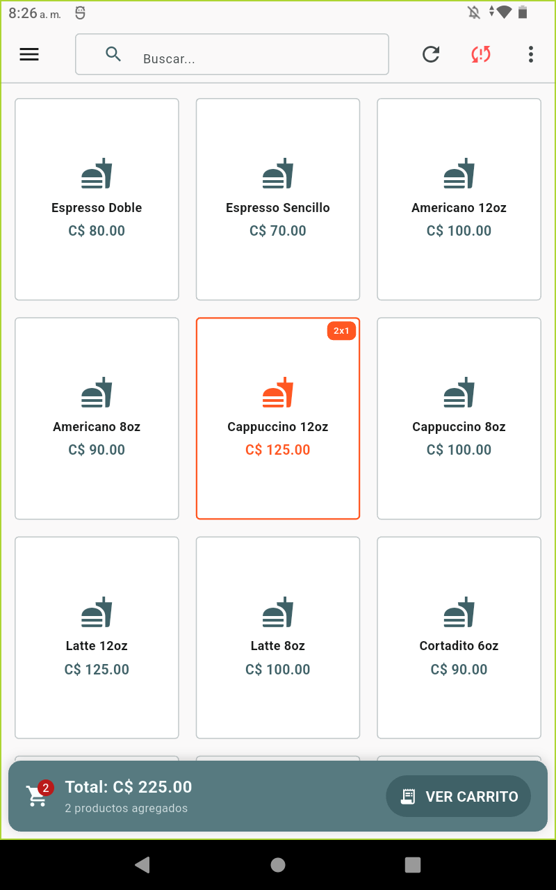

3. **Buscador Rápido:** Si tenés un catálogo amplio, podés tocar el ícono de lupa y escribir las primeras letras del producto para filtrarlo en pantalla.
4. **Ver Carrito:** Tocá el botón **"VER CARRITO"** en la barra inferior para revisar el pedido consolidado antes de cobrar.

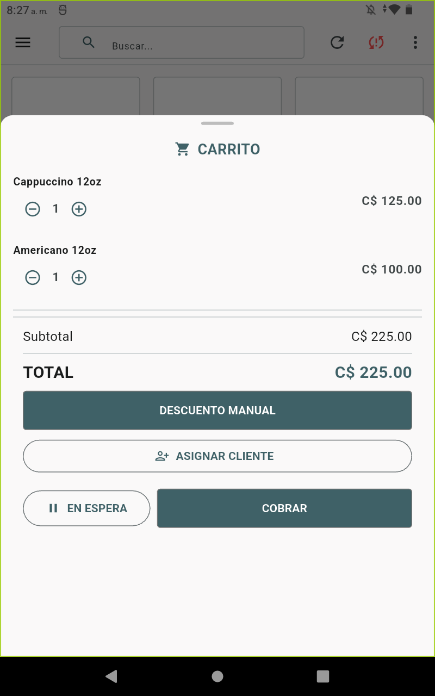

---

## 5. Manejo de Modificadores, Tamaños y Extras

En negocios gastronómicos y cafeterías de especialidad, los productos admiten personalización estructurada según las reglas configuradas en el portal de administración:

### 5.1 Selección en el Catálogo y Modal de Opciones
Al tocar cualquier producto que posea modificadores (por categoría o por producto, ej. *Americano 8oz*, *Cappuccino 12oz* o *Latte*), se despliega automáticamente el modal de configuración antes de ingresar al carrito:

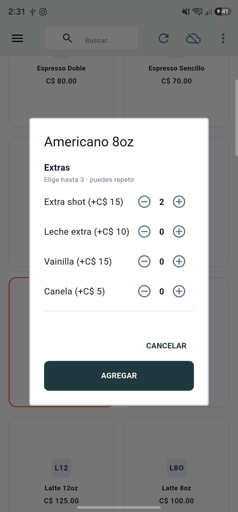

1. **Grupos con Selección Obligatoria / Exclusiva (`min=1, max=1`):**  
   * Se presentan con botones de opción tipo radio (ej. **Leche**: *Entera*, *Descremada*, *Almendras +C$20*, *Soya +C$20*).  
   * Exige elegir exactamente una opción antes de permitir agregar el ítem.
2. **Grupos Opcionales con Límite (`min=0, max=N`):**  
   * Permiten seleccionar de 0 hasta el máximo indicado (ej. **Endulzante**: *Normal*, *Sin azúcar*, *Stevia* hasta 2 opciones).
3. **Grupos con Cantidad Repetible (`allow_quantities` con steppers `+` / `-`):**  
   * Grupos como **Extras** (ej. *Extra shot +C$15*, *Leche extra +C$10*, *Vainilla +C$15*, *Canela +C$5*) permiten seleccionar unidades repetidas mediante los controles `+` y `-`.
   * El indicador muestra la cantidad acumulada por opción y respeta el tope máximo del grupo (ej. *"Elige hasta 3 · puedes repetir"*).
4. **Validación Automática:**  
   * Si no se cumplen las reglas mínimas requeridas, el botón **AGREGAR** avisa con el requisito pendiente.  
   * Presioná **AGREGAR** para consolidar el producto con sus extras al pedido, o **CANCELAR** para descartar.

### 5.2 Visualización en el Carrito de Ventas
Una vez agregado el producto, el carrito desglosa claramente la personalización:

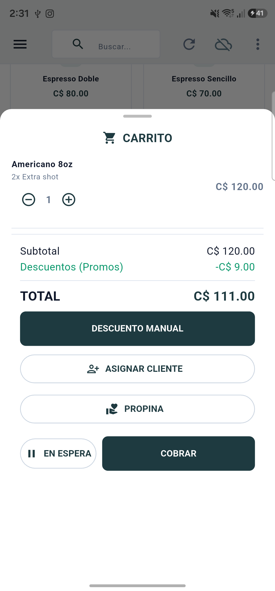

* Debajo del nombre principal se detalla la selección (ej. `Americano 8oz` seguido de `2x Extra shot`).
* El precio total de la línea refleja con exactitud la suma del precio base más los deltas de cada extra seleccionado (ej. C$ 90 base + 2×C$ 15 = **C$ 120.00**).
* Las promociones automáticas del comercio (ej. descuentos por categoría o 2x1) continúan aplicándose limpiamente sobre el subtotal.

### 5.3 Impresión en Ticket y Envío a Cocina / Barra (KDS)
* **Ticket del Cliente:** En impresoras térmicas de terminales compactos e integrados (iPOS / Nyx), los extras seleccionados se imprimen inmediatamente debajo del producto en **letra de menor tamaño (18 px)**, manteniendo el comprobante compacto, legible y profesional.
* **Comanda en Cocina / KDS:** Tanto en la comanda impresa como en la pantalla de cocina (KDS), los modificadores se transmiten resaltados con viñetas para que el barista o cocinero prepare la orden sin confusiones.

---

## 6. Cuentas Abiertas (Ventas en Espera / Hold Tickets)

El sistema permite mantener múltiples cuentas abiertas simultáneamente para atender mesas o clientes que siguen consumiendo. Cada cuenta se guarda de forma independiente con su propio nombre, lista de productos y total.

### 6.1 Crear una Cuenta Nueva

Cuando terminás de armar un pedido para un cliente que seguirá en el local:

1. **Armar el pedido** en el carrito (agregar productos como de costumbre).
2. **Abrir el Carrito:** Tocá **"VER CARRITO"** en la barra inferior.

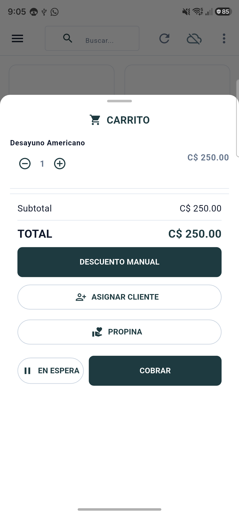

3. **Poner en Espera:** Presioná el botón **"EN ESPERA"** (con el ícono `||`) a la izquierda del botón Cobrar.
4. Se abre el diálogo "Poner Venta en Espera":
   * **Nombre / Identificador:** Escribí un nombre para la cuenta (ej: "Mesa 4", "Cliente Juan", "Terraza").
   * **Mesa Asignada (Opcional):** Seleccioná la mesa del local si se trata de una comanda.
   * **Invitados:** Cantidad de personas (opcional).
5. Presioná **"GUARDAR"**. La cuenta se guarda y el carrito queda vacío para atender al siguiente cliente.

> **Importante:** Una vez guardada, la cuenta no se puede modificar desde el catálogo. Para cambiar productos o nombre, debés recuperarla primero (sección 6.2).

### 6.2 Recuperar y Editar una Cuenta Existente

Para continuar atendiendo una cuenta abierta:

1. **Abrir Cuentas Abiertas:** Tocá el ícono de **Historial / Espera** en la barra de herramientas o el acceso de Cuentas Abiertas. Verás todas las cuentas activas con su nombre, cantidad de productos y total.

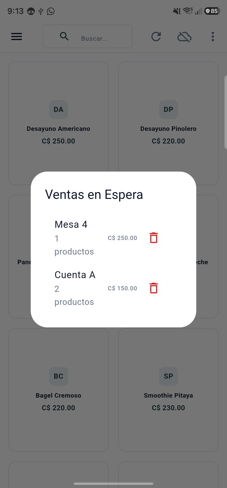

2. **Recuperar:** Presioná sobre la cuenta que querés editar (ej. `Mesa 4`). El pedido se cargará íntegramente en el carrito.
3. **Editar:** Podés agregar productos, modificar cantidades o quitar items como en cualquier venta normal.
4. **Re-guardar (Editar Nombre o Modificar Productos):** Si querés re-estacionar la cuenta con los cambios aplicados:
   * Abrí el carrito y presioná el botón **"EN ESPERA"**.
   * El diálogo cambia automáticamente su título a **"Editar Cuenta Abierta"** y presenta un banner informativo con el resumen de la modificación:

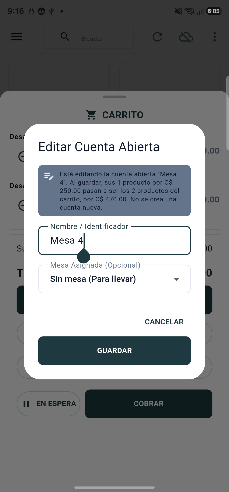

   * El banner indica con números reales: cuántos productos y total tenía la cuenta guardada, a cuántos productos y total pasará con el carrito actual, y si hubiera ítems retirados, avisará explícitamente: *\"Se pierden C$ XXX de productos que no están en el carrito.\"*
   * Podés modificar el nombre si deseás renombrarla.
   * Presioná **"GUARDAR"** para aplicar los cambios.

> **Re-guardar reemplaza, no acumula:** Cuando re-estacionás una cuenta recuperada, el contenido se **reemplaza** por completo con lo que hay en el carrito. No se duplican productos sobre la cuenta original. Esto asegura que el total refleje con exactitud matemática el consumo real.

### 6.3 Múltiples Cuentas Abiertas Simultáneas

Podés tener varias cuentas abiertas a la vez (por ejemplo, `Mesa 4` con C$ 250.00 y `Cuenta A` con C$ 150.00 conviviendo en paralelo):

* Cada cuenta se muestra de forma independiente en el listado con su respectivo identificador, líneas y saldo.
* Podés vender o cobrar en caja libremente sin que las cuentas retenidas interfieran.
* Al cobrar una de ellas, esa cuenta se liquida y **desaparece de inmediato del listado**, dejando intactas a las demás.

### 6.4 Abandonar una Cuenta (Eliminar)

Si una cuenta ya no será cobrada (ej: un comensal que desiste y se retira sin consumir):

1. Abrí el listado de Cuentas Abiertas.
2. Tocá el ícono de papelera roja **🗑️** al lado de la cuenta correspondiente.
3. El sistema despliega un diálogo de confirmación con advertencia de irreversibilidad:

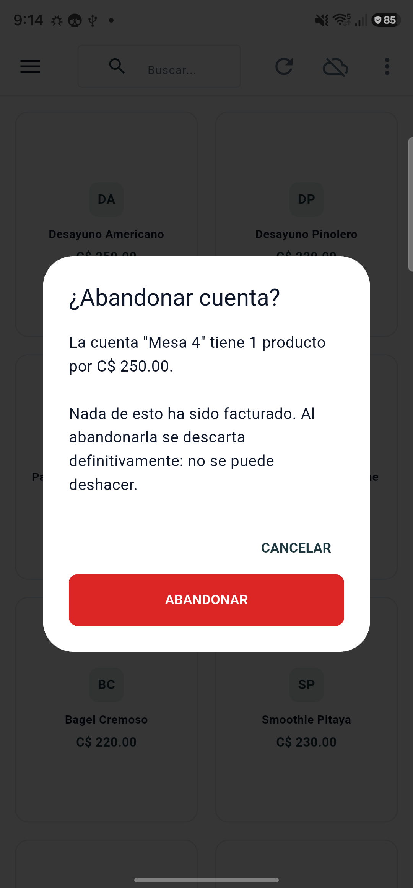

   * Informa el nombre de la cuenta, cantidad de productos y el saldo no facturado.
   * Advierte: *\"Nada de esto ha sido facturado. Al abandonarla se descarta definitivamente: no se puede deshacer.\"*
4. Presioná **"ABANDONAR"** (en botón rojo destacado) para eliminarla definitivamente. Si presionás **"CANCELAR"**, la cuenta permanece segura.

> **Seguridad Fiscal:** Una cuenta abandonada no genera factura ni requiere nota de crédito DGI, pues se trata de un pedido pre-fiscal que nunca emitió documento tributario.

### 6.5 Copiar una Cuenta

Si necesitás duplicar una cuenta existente (ej: un pedido similar para otra mesa):

1. Abrí el listado de Cuentas Abiertas.
2. Seleccioná la cuenta que querés copiar.
3. El sistema abre el diálogo para crear una nueva cuenta con los mismos productos.
4. Asignale un nuevo nombre o número de mesa y presioná **"GUARDAR"**.

> **Nota:** La cuenta copiada es independiente. Modificaciones a una no afectan a la otra.

---

## 7. Flujos de Cobro y Medios de Pago

Cuando la orden esté lista, presioná el botón verde **"COBRAR"** en la parte inferior del carrito. Se abrirá la pantalla modal de cobro y facturación:

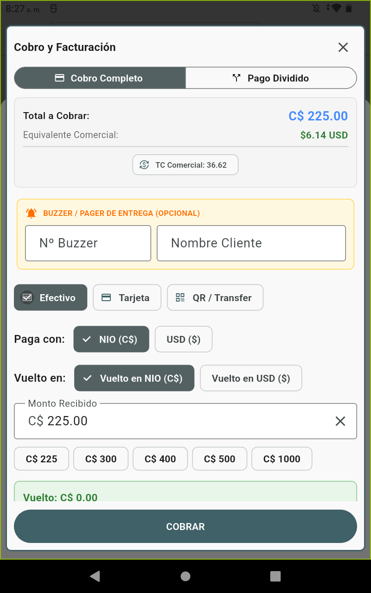

### 7.1 Cobro en Efectivo en Córdobas (NIO)
1. El total se muestra destacado en Córdobas (C$) junto con el equivalente en Dólares al tipo de cambio comercial (ej. C$ 36.62).
2. Podés asociar un número de *Buzzer / Pager* o el nombre del cliente para entrega en barra.
3. Ingresá el monto de dinero recibido usando el teclado o los botones rápidos de billetes comunes (C$ 225, C$ 300, C$ 400, C$ 500, C$ 1000).

4. La pantalla te mostrará en números grandes y claros el **VUELTO EXACTO A ENTREGAR** en verde.
5. Tocá **"COBRAR"**. La venta se registrará y el ticket se imprimirá de inmediato.

### 7.2 Cobro en Efectivo en Dólares (USD)
1. Tocá la pestaña **"USD ($)"** en la fila de *Paga con*.
2. El sistema convertirá automáticamente el saldo y mostrará botones rápidos en dólares ($6, $10, $15, $20, $50, $100).
3. Si el cliente paga con un billete de $10.00, el sistema calcula el vuelto exacto a entregar en **Córdobas (NIO)** al tipo de cambio comercial fijado.

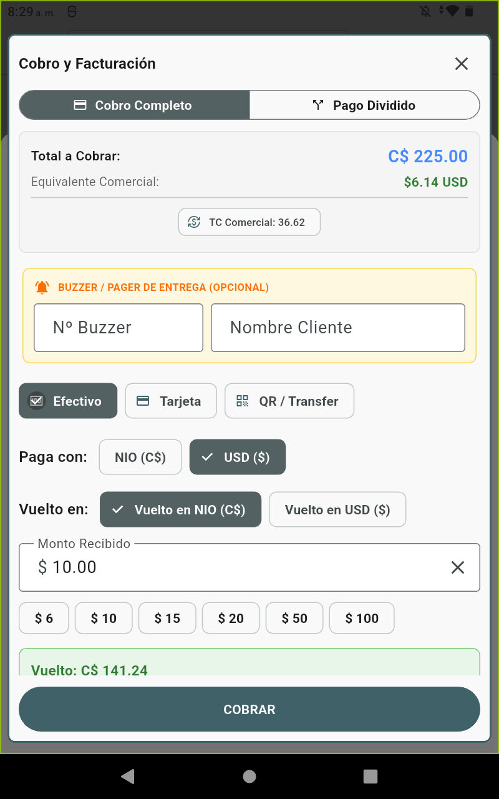

4. Tocá **"COBRAR"** para emitir el comprobante.

### 7.3 Cobro con Tarjeta de Crédito / Débito (Datáfono Externo)
1. Seleccioná la opción **"Tarjeta"**.
2. Operá el cobro en el datáfono bancario físico independiente entregado por el banco.
3. Una vez que el datáfono imprima el voucher de **"APROBADO"**, ingresá en el POS los últimos 4 dígitos de la tarjeta o el número de autorización del voucher bancario.
4. Tocá **"Confirmar Pago"**.

### 7.4 Pago Mixto / Dividido (Split Payment)
1. Si un cliente abona una parte en efectivo y el resto con tarjeta:
2. Seleccioná **"Pago Dividido"**.
3. Ingresá primero el monto en efectivo recibido (ej. C$ 100).
4. El sistema restará ese valor y mostrará el saldo restante pendiente.
5. Seleccioná **"Tarjeta"** para el saldo restante, pasá el cobro por el datáfono y confirmá la transacción.

---

## 8. Menú Lateral y Módulos del Sistema

Tocando el ícono de tres líneas horizontales (*hamburguesa*) en la esquina superior izquierda se despliega el menú lateral de operaciones:

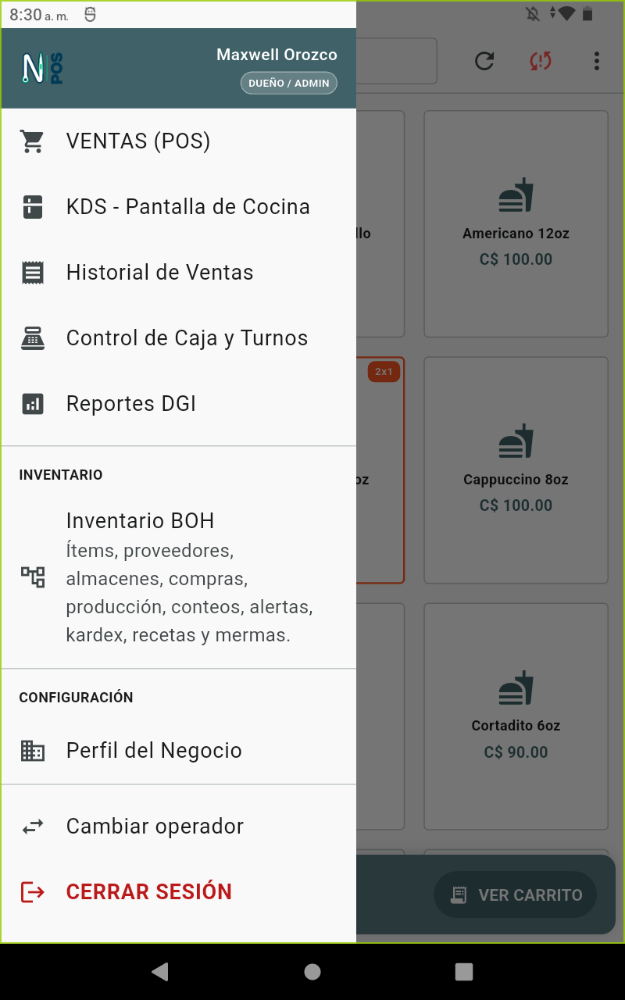

Desde aquí podés navegar rápidamente a:
* **Ventas (POS):** Pantalla principal de caja.
* **KDS - Pantalla de Cocina / Barra:** Monitor de pedidos en preparación.
* **Historial de Ventas:** Consulta y reimpresión de comprobantes anteriores.
* **Control de Caja y Turnos:** Lecturas X, movimientos y cierre Z.
* **Reportes DGI:** Auditoría tributaria y correlatividad.
* **Cambiar Operador / Cerrar Sesión:** Cambio rápido de cajero en turno.

---

## 9. Pantalla de Cocina / Barra (KDS)

Para establecimientos con estación de preparación separada de caja, NHILOS POS incluye un monitor de comandas en tiempo real:

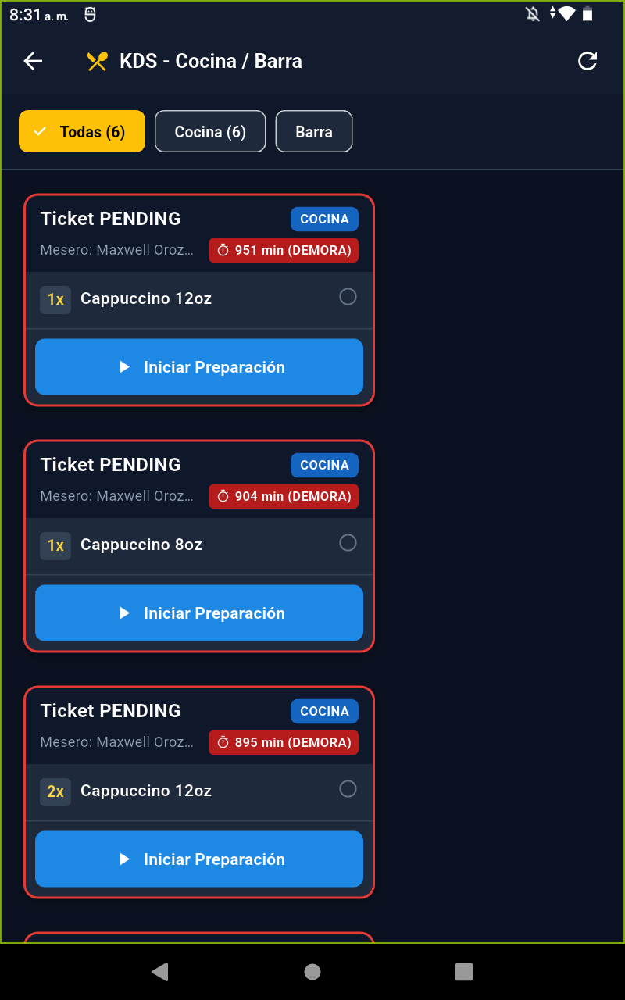

* Los pedidos pagados entran automáticamente con alerta visual y cronómetro de demora.
* El barista o cocinero puede tocar **"Iniciar Preparación"** para dar seguimiento al despacho.

---

## 10. Historial de Ventas y Anulaciones (DGI)

Por estrictas disposiciones de cumplimiento normativo (DGI de Nicaragua), **las facturas emitidas nunca se eliminan físicamente de la base de datos**; únicamente se registran como **ANULADAS**:

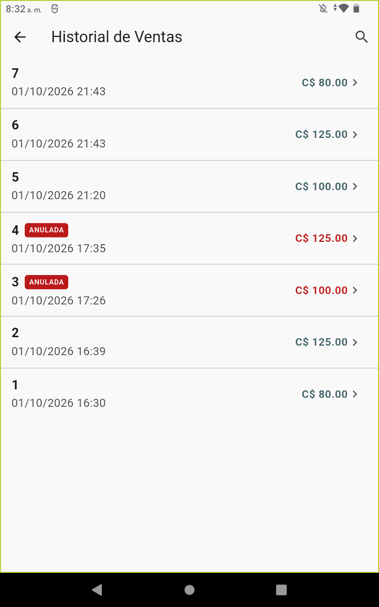

1. En el historial podés revisar la secuencia ininterrumpida de facturas (ej. facturas 1 a 7).
2. Las facturas anuladas aparecen claramente identificadas con un distintivo rojo de **ANULADA**.
3. Al tocar cualquier factura, accedés a su detalle con opciones de **Reimprimir**, **Emitir Nota de Crédito** o **Anular Factura**.

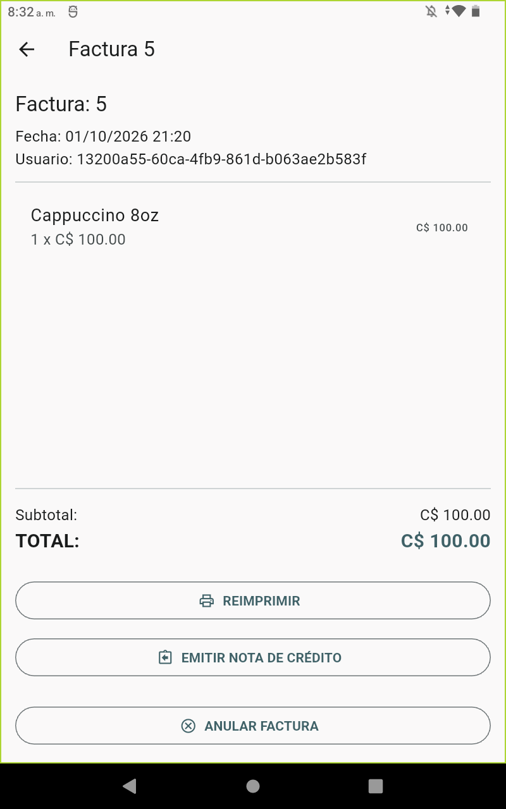

4. Al presionar **"ANULAR FACTURA"**, el sistema abre la ventana de selección de motivo formal:

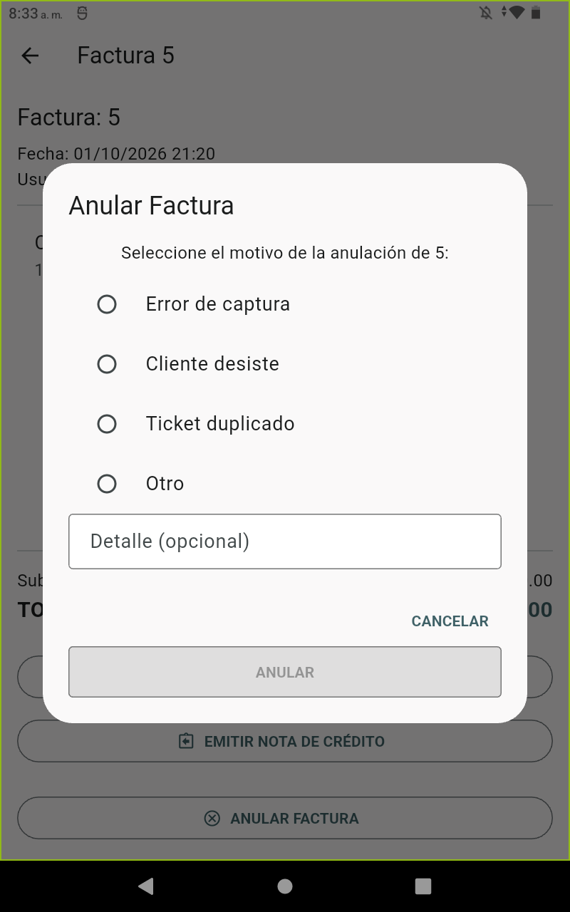

5. Seleccioná el motivo correspondiente (*Error de captura*, *Cliente desiste*, *Ticket duplicado*, *Otro*) y confirmá la acción.

---

## 11. Control de Caja, Lectura X y Cierre de Turno (Corte Z)

Al acceder a **Control de Caja y Turnos** desde el menú lateral:

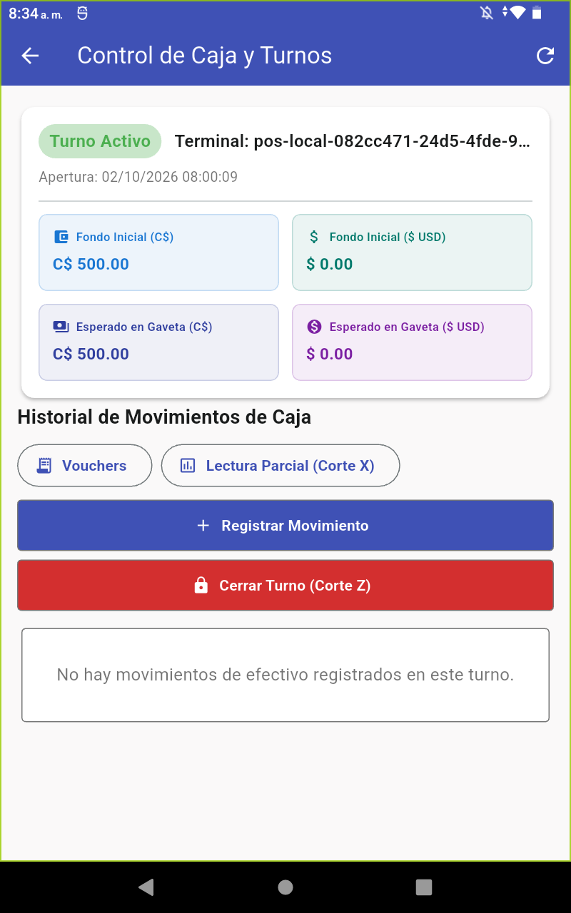

* Podés consultar el fondo inicial cargado en Córdobas y Dólares.
* Podés registrar movimientos de entrada o salida de efectivo (*Ingresos / Egresos manuales*).

### 11.1 Lectura Parcial Informativa (Corte X)
* Tocando **"Lectura Parcial (Corte X)"**, obtenés un arqueo en tiempo real del turno en curso sin cerrar la caja:

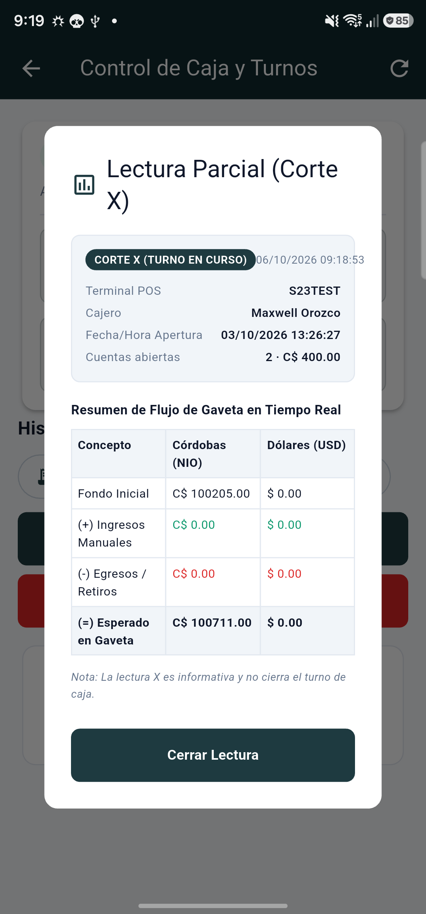

* El Corte X muestra información completa incluyendo:
  * Totales por medio de pago (efectivo, tarjeta, QR, etc.)
  * **Cuentas abiertas:** Se listan las cuentas activas con su cantidad de productos y total acumulado (ej: "Cuentas abiertas · 2 · C$ 350.00")
  * El pie del reporte aclara: *"La lectura X es informativa y no cierra el turno de caja."*

> **Importante:** Las cuentas abiertas no forman parte del ingreso bruto en el Corte X. Se muestran solo como referencia para que el cajero sepa qué pendientes quedan por cobrar.

### 11.2 Arqueo Ciego y Cierre Definitivo (Corte Z)
* Al finalizar el turno, presioná el botón rojo **"Cerrar Turno (Corte Z)"**.
* **Bloqueo de Cuentas Abiertas:** Si existieran cuentas abiertas (ventas en espera) que no se cobraron, el sistema **bloquea el cierre** y muestra un diálogo informativo enumerando cada cuenta abierta con su total:

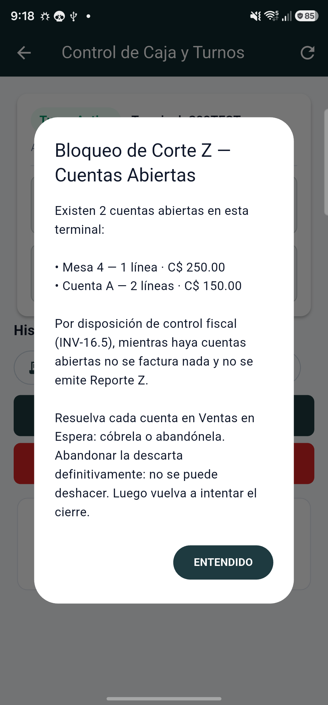

* El cierre no se inicia hasta que todas las cuentas abiertas se liquidaron (se cobraron o abandonaron).
* El cajero debe confirmar que cada cuenta se liquidó o que abandonó las que no se cobrarán.
* Una vez que no quedan cuentas pendientes, se procede con el arqueo ciego:
  1. El cajero cuenta físicamente el efectivo en gaveta.
  2. Ingresá el total sin ver los totales del sistema (arqueo ciego).
  3. Presioná **"ENTENDIDO"** para confirmar.

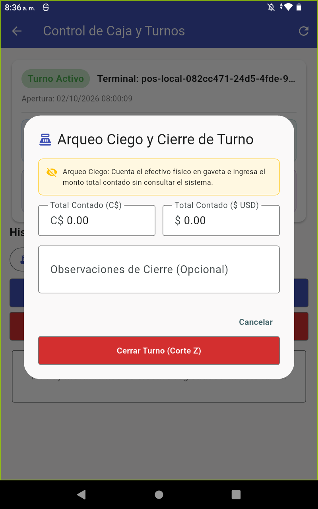

* Al confirmar, se imprime el ticket oficial de Corte Z y se bloquea el turno cerrado.

---

## 12. Soporte Técnico Directo

Si experimentás cualquier problema que no puedas resolver con esta guía o la *Guía de Contingencias*:
* **Canal Directo de WhatsApp:** [Número de WhatsApp de Soporte]
* **Correo de Soporte:** `soporte@nhilospos.com`
* **Horario de Asistencia:** Lunes a Sábado de 8:00 AM a 8:00 PM.
