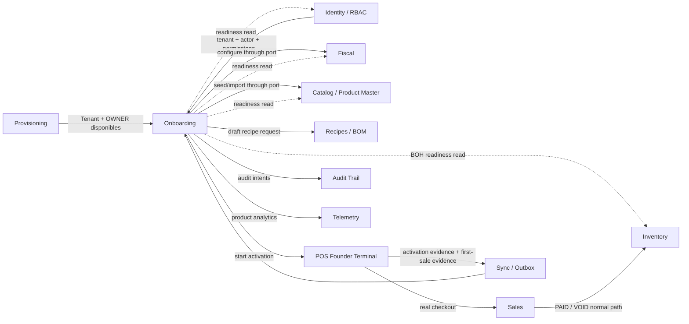
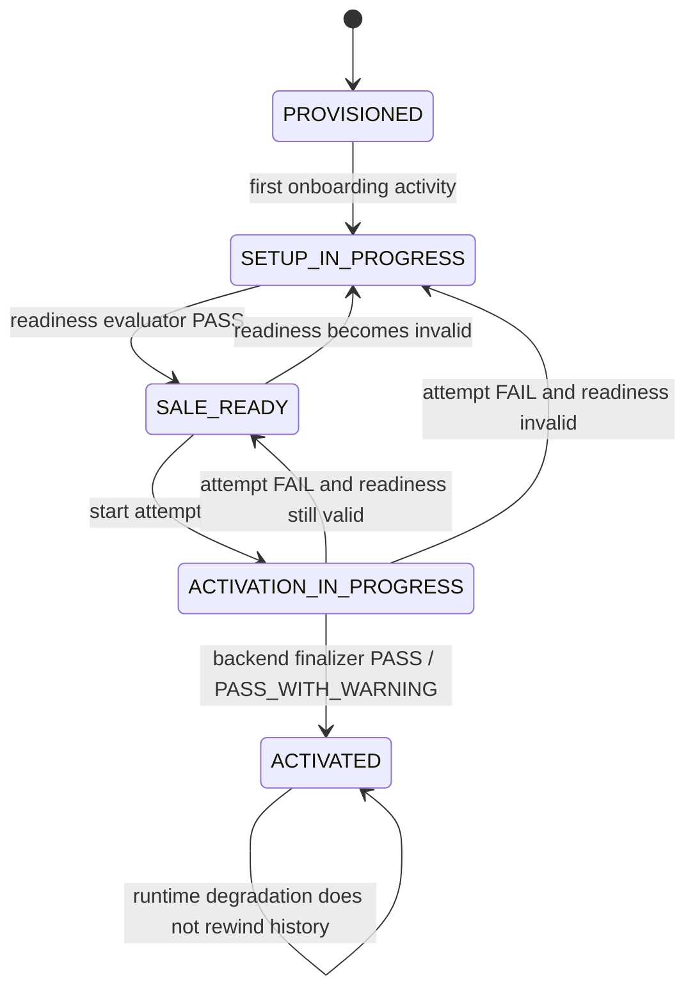
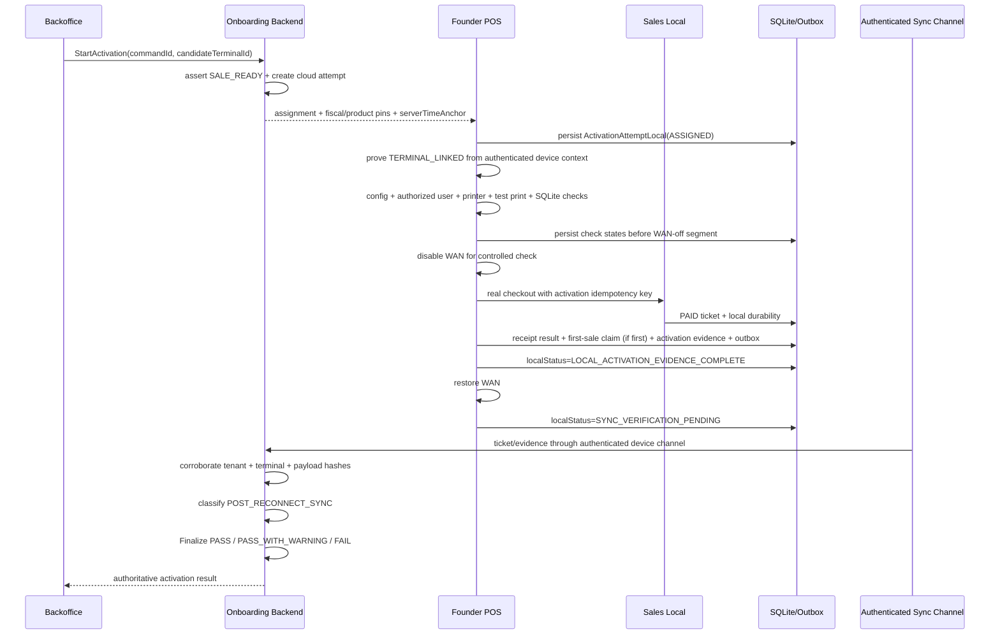

# NHILOS Client Onboarding V1 — Architecture Specification

**Documento:** `onboarding_architecture_spec.md`  
**Ubicación recomendada:** `docs/onboarding/onboarding_architecture_spec.md`  
**Estado:** **APPROVED / ENGINEERING AUTHORITATIVE**  
**Versión:** 1.0  
**Fecha:** 2026-09-03  
**Autoridad de producto:** `prd_onboarding_v2_approved.md` — **APPROVED / AUTHORITATIVE v2.1**  
**Baseline técnico:** `onboarding_gap_audit.md` — **L0 CLOSED**  
**Auditoría de aprobación de producto:** `onboarding_prd_v2_approval_audit.md` — **APPROVED / AUTHORITATIVE**  
**Auditoría de re-aprobación arquitectónica:** `onboarding_architecture_reapproval_audit.md` — **APPROVED; AR-01..AR-18 CLOSED; P0/P1/P2 = 0**  
**Superficies:** NHILOS Backoffice / Owner Dashboard + NHILOS POS durante Activation  
**Alcance fundador:** una ubicación / un terminal fundador, offline-first en operación y multi-tenant por diseño.

> ## Invariante arquitectónica no negociable
>
> **Onboarding orquesta readiness; no se convierte en dueño de Fiscal, Product Master, Inventory, Sales, Identity ni Audit Trail.**
>
> El flujo válido es:
>
> ```text
> Provisioning / Identity
>       ↓
> OnboardingSession
>       ↓
> Readiness Evaluator ──reads──> Fiscal / Catalog / Identity
>       ↓
> SALE_READY
>       ↓
> Activation Attempt
>       ↓
> POS production path ──> Sales PAID ──> local durability / printing / outbox
>       ↓
> LOCAL_ACTIVATION_EVIDENCE_COMPLETE
>       ↓
> SYNC_VERIFICATION_PENDING / evidence delivery
>       ↓
> Backend authoritative finalization
>       ↓
> ACTIVATED
> ```
>
> Si Onboarding necesita cambiar un dominio, invoca el **application service/command port del dominio propietario**. Nunca escribe sus tablas privadas para “acelerar” el setup.

---

# 0. Principios arquitectónicos vinculantes

1. **Provisioning, Client Onboarding y Activation son modelos distintos.** `Tenant.is_active` no representa readiness ni Activation.
2. **Una sesión persistente por tenant gobierna Onboarding V1.** El navegador nunca es source of truth del progreso.
3. **`onboardingStartedAt` es write-once.** Reabrir, reintentar, asistir o cambiar de dispositivo no lo reinicia.
4. **Readiness es state-based.** Un step se considera cumplido porque el estado real de los dominios satisface el contrato, no porque el usuario haya presionado “Completar”.
5. **`SALE_READY` es readiness del control plane.** No afirma que el terminal tenga la configuración local; eso se demuestra en Activation.
6. **`saleReadyFirstAt` es milestone histórico; `isSaleReadyNow` es estado actual.** Antes de Activation una configuración puede dejar de estar actualmente sale-ready sin borrar el primer milestone.
7. **`ACTIVATED` es milestone monotónico.** Una falla operacional posterior pertenece al health del bounded context responsable y no reescribe historia de onboarding.
8. **BOH no bloquea caja.** `INVENTORY_READY`, `COSTING_READY` y `OPERATIONS_READY` son readiness progresivo, no precondiciones globales de Sales.
9. **Product Import V1 solo posee Product Master.** No escribe stock, existencia, CPP, average cost ni movimientos Kardex.
10. **Inventory es el único owner de stock/costo operacional.** Cualquier futura captura de stock/costo desde onboarding deberá delegarse a commands de Inventory.
11. **Costo físico `0` no equivale a costo conocido.** Read models deben exponer estado `KNOWN | COST_PENDING | NOT_APPLICABLE` o equivalente.
12. **Templates son seeds, no side effects invisibles.** Pre-BOM de template nace `SUGGESTED / DRAFT` y no participa en Inventory hasta publicación explícita.
13. **Idempotencia se garantiza por command key + payload hash + constraint física.** Repetir transporte no repite efecto económico/estructural.
14. **Mismo idempotency key con payload distinto es integrity conflict.** Nunca “last write wins”.
15. **POS sigue siendo offline-first.** Backoffice, Railway o WAN pueden estar indisponibles sin volver dependiente el checkout ya activado.
16. **Activation usa el production checkout path.** No existe endpoint “fake sale” ni tabla paralela de ventas de prueba.
17. **`PASS_WITH_WARNING` no degrada defectos.** Solo cubre verificación de sync inconclusa por causa externa/transitoria con evidencia local íntegra.
18. **El POS nunca escribe `ACTIVATED` ni decide el resultado final.** Puede completar evidencia local y quedar `SYNC_VERIFICATION_PENDING`; el backend cloud es la única autoridad de `PASS | PASS_WITH_WARNING | FAIL` y de `activatedAt`.
19. **Autorización es permission-based.** OWNER/MANAGER son defaults de permisos; no sustituyen el guard efectivo.
20. **Toda persistencia tenant-owned incluye `tenant_id` y fail-closed isolation.** Host, slug, body o query nunca sustituyen al tenant verificado del JWT/contexto servidor.
21. **La identidad del terminal proviene del canal autenticado.** `tenantId`/`terminalId` declarados en payload de evidence son datos a corroborar, nunca autoridad de device identity.
22. **Audit Trail material y telemetry son streams distintos.** No se convierte cada click del wizard en bitácora forense.
23. **La migración no reinterpreta silenciosamente historia W9.** Datos legacy se conservan; cualquier incompatibilidad se corta de forma explícita y con receipt.
24. **No se auto-infiere `GO_LIVE_ACCEPTED`.** El acceptance contractual pertenece al deployment/Acceptance Plan, no al aggregate Onboarding.
25. **La aplicación de templates V1 usa una Unit of Work PostgreSQL tenant-bound.** En el modular monolith actual, Catalog/Inventory master-data/Recipes participan mediante ports transaction-aware; ningún side effect externo sale antes del commit.
26. **El contrato CSV tiene una sola autoridad versionada.** Template oficial, aliases, normalización y validación se derivan del mismo `ImportContractVersion`; V1 parsea el raw CSV en backend.
27. **TTFSS no depende del orden de llegada a cloud.** El terminal fundador crea un `first_successful_sale_claim` local write-once y emite únicamente ese claim.
28. **Read-through no cambia la verdad de la respuesta.** Los GET calculan readiness desde los dominios; cualquier reconciliación persistida es idempotente, trazable como `SYSTEM_RECONCILER` y no es requisito para responder correctamente.

---

# 1. Context Map y ownership



## 1.1 Matriz de responsabilidad

| Contexto | Es dueño de | Onboarding puede | Onboarding NO puede |
|---|---|---|---|
| Provisioning / Identity | Tenant, OWNER, credenciales, actor, permisos | comprobar identidad y contexto | usar `Tenant.is_active` como Activation |
| Fiscal | régimen, IVA, prices-include-tax, spread y reglas fiscales soportadas | invocar configuración y leer effective config | duplicar motor fiscal |
| Catalog / Product Master | producto vendible, nombre, precio, identidad de producto | crear/actualizar mediante port, importar catálogo | escribir stock/CPP como side effect |
| Recipes / BOM | versiones y publicación de recetas | crear drafts provenientes de template | publicar automáticamente una receta sugerida |
| Inventory | stock, Kardex, CPP, costo operacional | leer readiness/cost state; futuro command explícito | sobrescribir stock/costo directamente |
| Sales | Ticket, pricing, PAID, VOID | solicitar/observar venta de verificación | crear una “venta” fuera de Sales |
| Device / Printing | terminal enlazado, printer adapter, health local | solicitar checks de Activation | declarar impresora sana desde cloud sin evidencia local |
| Sync | outbox/inbox, reintentos, ACK, convergencia | observar estado/verificar evidence delivery | considerar “enviado” como “aplicado” sin ACK |
| Audit Trail | evidencia forense material | emitir intents correlacionables | crear bitácora paralela |
| Telemetry | analytics de producto | medir TTFSS/steps/errors | sustituir Audit Trail |

---

# 2. Modelo de dominio de Onboarding

## 2.1 `OnboardingSession` — Aggregate Root

Existe como máximo una sesión primaria de Onboarding V1 por tenant.

### Estado canónico

```text
id
 tenantId
 lifecycleState
 onboardingStartedAt?
 saleReadyFirstAt?
 activationStartedAt?
 activatedAt?
 firstSuccessfulSaleAt?
 firstCustomerSaleAt?
 lastActivityAt?
 currentActivationAttemptId?
 measurementEligible
 legacyBaseline
 optimisticVersion
 createdAt
 updatedAt
```

### Lifecycle

```text
PROVISIONED
SETUP_IN_PROGRESS
SALE_READY
ACTIVATION_IN_PROGRESS
ACTIVATED
```

### Invariantes

- `tenantId` es único.
- `onboardingStartedAt` solo puede pasar de `NULL -> timestamp`.
- `saleReadyFirstAt` solo puede pasar de `NULL -> timestamp`; el primer reconciliation que observe `SALE_READY=true` debe escribirlo atómicamente si sigue `NULL`, incluso si el tenant ya estaba configurado antes de abrir Setup Center.
- `firstSuccessfulSaleAt` solo puede pasar de `NULL -> canonicalOccurredAt` derivado del `first_successful_sale_claim` validado.
- `activatedAt` solo puede pasar de `NULL -> timestamp` por finalización autoritativa del backend.
- Una vez `activatedAt != NULL`, `lifecycleState = ACTIVATED` y no vuelve a un estado anterior.
- `lastActivityAt` es operacional y puede actualizarse; no afecta TTFSS.
- `measurementEligible=false` impide publicar TTFSS histórico inventado para tenants legacy sin timestamp confiable.
- `currentActivationAttemptId` nunca es autoridad suficiente para Activation; solo referencia el attempt cloud activo/final más reciente.
- El aggregate no contiene copias autoritativas de Fiscal/Product/Inventory; solo milestones y referencias.

## 2.2 Lifecycle actual vs milestones históricos

Onboarding separa deliberadamente:

```text
historical milestone     current readiness
--------------------     -----------------
saleReadyFirstAt         isSaleReadyNow
activatedAt              runtimeOperationalHealth
```

Antes de `ACTIVATED`, si se elimina el último producto vendible o se invalida el fiscal mínimo:

```text
SALE_READY -> SETUP_IN_PROGRESS
```

sin borrar `saleReadyFirstAt`.

Después de `ACTIVATED`, una degradación futura no modifica `OnboardingSession`; el dominio afectado reporta su health por separado.

## 2.3 Step state

Los steps no son aggregates de escritura. Son un **read model evaluado**:

```text
StepState
  code
  requirement = REQUIRED | OPTIONAL
  state = COMPLETE | INCOMPLETE | WARNING | NOT_APPLICABLE
  blockerCodes[]
  warningCodes[]
  nextAction?
  evaluatedAt
```

V1 mínimo:

```text
BUSINESS_FISCAL
SELLABLE_CATALOG
SALE_READY_REVIEW
ACTIVATION
BOH_ENRICHMENT
```

No se persiste un booleano `completed=true` como autoridad. Si un dominio cambia, el evaluator cambia el resultado.

## 2.4 `OnboardingIdempotencyRecord`

Registro transversal para commands con side effects.

```text
id
 tenantId
 idempotencyKey
 commandType
 payloadHash
 status = IN_PROGRESS | SUCCEEDED | FAILED_RETRYABLE | FAILED_FINAL
 leaseOwner?
 leaseAcquiredAt?
 leaseExpiresAt?
 attemptCount
 resultRef?
 lastErrorCode?
 createdAt
 updatedAt
 completedAt?
```

Constraint:

```text
UNIQUE (tenant_id, idempotency_key)
```

State machine:

```text
NEW
  -> IN_PROGRESS(lease)
       -> SUCCEEDED
       -> FAILED_FINAL
       -> FAILED_RETRYABLE
            -> IN_PROGRESS(new lease, same key + same payloadHash)
```

Reglas:

- mismo key + payload distinto -> `INTEGRITY_CONFLICT`;
- mismo key + mismo hash + `SUCCEEDED` -> devuelve exactamente el mismo resultado/no-op;
- mismo key + mismo hash + `FAILED_FINAL` -> devuelve el mismo failure final;
- mismo key + mismo hash + `IN_PROGRESS` con lease vigente -> `202/409` según contrato, sin segundo efecto;
- `IN_PROGRESS` con lease expirado puede ser tomado de forma atómica por otro worker **solo con el mismo `payloadHash`**;
- `FAILED_RETRYABLE` puede reentrar con el mismo key/payload y adquiere un nuevo lease incrementando `attemptCount`;
- validación de negocio no retryable termina `FAILED_FINAL`; corregir datos requiere nuevo `commandId`/key;
- cuando el business write y el registro idempotente viven en el mismo PostgreSQL/UoW deben consolidarse en una misma transacción para evitar `business committed + idempotency orphan`;
- valores concretos de lease/timeout son parámetros de ingeniería del roadmap, no semántica de producto.


## 2.5 `TemplateApplication`

Representa una aplicación confirmada de template, no el template global.

```text
id
 tenantId
 onboardingSessionId
 templateCode
 templateVersion
 selectionHash
 idempotencyKey
 status = PLANNED | APPLIED | FAILED
 appliedByUserId
 appliedAt?
 summaryJson
```

### `TemplateSeedLink`

Provenance estable entre un item global de template y la entidad creada en el tenant.

```text
id
 tenantId
 templateCode
 sourceItemId
 sourceItemType = PRODUCT | INGREDIENT | RECIPE
 targetEntityType
 targetEntityId
 firstAppliedVersion
 lastSeenVersion
 lastAppliedVersion
 lastSourceFingerprint
 createdAt
 updatedAt
```

Constraint recomendado:

```text
UNIQUE (tenant_id, template_code, source_item_id, target_entity_type)
```

`sourceItemId` conserva identidad estable entre versiones. `firstAppliedVersion` preserva provenance histórica; `lastSeenVersion/lastAppliedVersion` y `lastSourceFingerprint` permiten saber qué versión/fingerprint fue comparada y efectivamente aplicada en la última reaplicación. La reaplicación deja de depender de coincidencias por nombre.

## 2.6 `ProductImportSession`

La tabla actual `staging_importacion_productos` se conserva como staging de filas. Se añade una cabecera de sesión para controlar contrato, estado y commit.

```text
id / sessionToken
 tenantId
 onboardingSessionId?
 source = CSV_FILE | CSV_TEXT
 sourceFileName?
 sourceHash?
 parserContractVersion
 uploadStateVersion
 status = CREATED | UPLOADING | VALIDATED | READY | COMMITTING |
          COMMITTED | PARTIALLY_COMMITTED | FAILED | EXPIRED
 totalRows
 validRows
 errorRows
 committedRows
 createdByUserId
 createdAt
 committedAt?
```

Las filas de staging continúan siendo temporales y tenant-scoped.

## 2.7 `ActivationAttempt`

Cada reintento técnico de Activation es un attempt separado. `ACTIVATED` sigue siendo un milestone único de la sesión. El estado cloud nunca se adelanta a la evidencia local.

### Cloud aggregate

```text
id
 tenantId
 onboardingSessionId
 candidateTerminalId
 trustedTerminalId?
 status = CREATED | IN_PROGRESS | PASS | PASS_WITH_WARNING | FAIL
 startedByUserId
 startedAt
 completedAt?
 requiredFiscalRevision
 requiredFiscalFingerprint
 verificationProductId
 verificationProductRevision? / verificationProductFingerprint?
 verificationTicketId?
 posBuild?
 warningsCount
 failureCode?
 idempotencyKey
```

- `candidateTerminalId` es el terminal registrado/asignable elegido al iniciar.
- `trustedTerminalId` se materializa únicamente después de corroborar el canal/dispositivo autenticado.
- `PASS | PASS_WITH_WARNING | FAIL` solo los escribe el backend finalizer.
- Mientras cloud no pueda recibir/finalizar evidencia, el attempt cloud permanece `IN_PROGRESS`; el estado operativo pendiente vive en la proyección local.

### `ActivationAttemptLocal` — proyección SQLite

```text
attemptId
 tenantId
 candidateTerminalId
 localStatus = ASSIGNED | RUNNING | LOCAL_ACTIVATION_EVIDENCE_COMPLETE |
              SYNC_VERIFICATION_PENDING | EVIDENCE_ACKED
 requiredFiscalRevision
 requiredFiscalFingerprint
 verificationProductId
 verificationTicketId?
 serverTimeAnchorAt?
 anchorMonotonicTicks?
 bootSessionId?
 assignedAt
 updatedAt
```

Esta proyección, sus check results y envelopes pendientes deben sobrevivir restart del POS. Antes de cortar WAN se persisten assignment/config/checks ya realizados; durante el tramo offline, ticket, claim/evidence y outbox se consolidan en SQLite antes de restaurar conectividad.

### `ActivationCheckResult`

Cloud y local comparten la misma identidad lógica de check:

```text
id / eventId
 tenantId
 activationAttemptId
 checkCode
 required
 status = PASS | WARNING | FAIL | NOT_RUN
 evidenceType
 evidenceRef?
 occurredAt
 recordedAt
 detailsSanitizedJson
```

Constraints:

```text
UNIQUE (tenant_id, activation_attempt_id, check_code)
```

Un check puede recibir updates idempotentes de su evidence envelope, pero solo existe un resultado final por `attempt + checkCode`. Mismo event/business key con payload distinto es integrity conflict.

### Checks mínimos V1

Todos los siguientes son obligatorios en el fundador:

```text
TERMINAL_LINKED
REQUIRED_CONFIG_LOCAL
AUTHORIZED_USER_LOCAL
PRINTER_AVAILABLE
TEST_PRINT
SQLITE_DURABILITY
OFFLINE_SALE_PAID
SALE_RECEIPT_PATH
OUTBOX_DURABLE
POST_RECONNECT_SYNC
```

Semántica:

- `TERMINAL_LINKED` valida el vínculo efectivo entre el candidate y la identidad autenticada del dispositivo; no es precondición de `StartActivation`.
- `AUTHORIZED_USER_LOCAL` reemplaza cualquier lectura condicional de `OFFLINE_AUTH_READY`: el usuario autorizado debe estar disponible localmente en V1 fundador.
- todos los checks excepto `POST_RECONNECT_SYNC` terminan `PASS | FAIL`; no admiten `WARNING`.
- `POST_RECONNECT_SYNC` es el **único** check que puede terminar `WARNING`, y solo bajo la semántica normativa de causa externa/transitoria e integridad local intacta.

### `ActivationFollowUp`

Todo `PASS_WITH_WARNING` crea exactamente un follow-up persistente por warning material:

```text
id
 tenantId
 activationAttemptId
 warningCode
 status = OPEN | CLOSED
 openedAt
 openedBy = SYSTEM_FINALIZER | actorUserId
 closureEvidenceRef?
 closedAt?
 closedBy? = SYSTEM_RECONCILER | actorUserId
 closureNote?
```

Constraint recomendado:

```text
UNIQUE (tenant_id, activation_attempt_id, warning_code)
```

El warning puede cerrarse automáticamente cuando la convergencia queda demostrada o manualmente por un actor autorizado con evidencia. Cerrar el follow-up no modifica `activatedAt`.


# 3. State machine persistente



## 3.1 Reconciliation rule

`OnboardingStateReconciler` se invoca después de writes materiales y puede ejecutarse de forma idempotente tras lecturas que detecten una proyección obsoleta.

Triggers principales:

- iniciar/reanudar Setup Center;
- cambiar fiscal setup desde onboarding;
- aplicar template;
- completar import commit;
- crear/editar/desactivar productos desde la ruta de setup;
- iniciar/finalizar Activation;
- recibir first-sale/activation evidence.

Contrato de lectura:

```text
GET /onboarding/session
  -> calcula readiness actual desde los bounded contexts
  -> responde con ese snapshot aunque la proyección persisted esté stale
  -> opcionalmente ejecuta/agenda ReconcileProjection(snapshot)
```

La respuesta **nunca depende** de que el write de reconciliación tenga éxito. Si el reconciler persiste una transición derivada, usa actor lógico `SYSTEM_RECONCILER` y causation metadata (`source`, `requestId/eventId`, `previousState`, `evaluatedAt`).

Cuando `saleReady` se observa `true` por primera vez:

```text
saleReadyFirstAt = COALESCE(saleReadyFirstAt, evaluatedAt/serverNow)
```

en la misma transacción que actualiza la proyección de lifecycle y se emite `ONBOARDING_SALE_READY_GRANTED` cuando existe una transición material hacia readiness válido. Si antes de Activation el readiness pasa a `false`, se conserva `saleReadyFirstAt` y se emite `ONBOARDING_SALE_READY_REVOKED`.

No se depende exclusivamente de EventEmitter/event delivery para reconocer configuración existente.


# 4. Readiness Evaluator

## 4.1 Contrato

```text
EvaluateOnboardingReadiness(tenantId)
  -> OnboardingReadinessSnapshot
```

```text
OnboardingReadinessSnapshot
  identity
  fiscal
  catalog
  saleReady
  inventoryReady
  costingReady
  operationsReady
  blockers[]
  warnings[]
  evaluatedAt
```

## 4.2 Ports de lectura

```text
IdentityReadinessPort
FiscalReadinessPort
CatalogReadinessPort
InventoryReadinessPort
CostingReadinessPort
OperationsReadinessPort
```

Cada adapter consulta al bounded context propietario. Onboarding no reimplementa sus reglas internas.

## 4.3 `SALE_READY` exacto

```text
saleReady =
  identity.tenantExists
  AND identity.initialOwnerExists
  AND identity.ownerCanAuthenticate
  AND identity.tenantContextValid
  AND fiscal.minimumConfigurationValid
  AND catalog.sellableProductCount >= 1
```

Producto vendible mínimo:

```text
active = true
name non-empty
sellPrice > 0
```

No entran al predicado global:

```text
stock
recipe
subrecipe
cost/CPP
supplier
image
category
additional staff
```

## 4.4 Fiscal readiness

El adapter Fiscal expone una configuración efectiva, no una copia en Onboarding:

```text
EffectiveFiscalConfiguration
  businessName
  ruc?
  fiscalRegime
  taxRate
  pricesIncludeTax
  commercialFxSpread?
  configVersion:
    revision
    fingerprint
```

`phone`/`address` u otros campos que no estén persistidos end-to-end no participan en readiness.

## 4.5 BOH readiness

`INVENTORY_READY`, `COSTING_READY` y `OPERATIONS_READY` son evaluadores independientes y extensibles. Ninguno modifica `ACTIVATED`.

Para costeo, el read model debe distinguir:

```text
KNOWN(value)
COST_PENDING(reason)
NOT_APPLICABLE
```

Un `averageCost = 0` físico no es evidencia suficiente de `KNOWN(0)` sin provenance del dominio Inventory.

---

# 5. Application services / commands

## 5.1 `EnsureOnboardingStarted`

Se ejecuta al entrar explícitamente a Setup Center o antes del primer write atribuible a onboarding.

```text
input:
  tenantId
  actorUserId
  source = SETUP_CENTER | FISCAL_SETUP | TEMPLATE | PRODUCT_IMPORT | SUPPORT

behavior:
  INSERT session if absent
  SET onboardingStartedAt = now only if NULL
  lifecycle -> SETUP_IN_PROGRESS unless current readiness already SALE_READY
  update lastActivityAt
```

Debe ser atómico y tolerar carreras con `INSERT ... ON CONFLICT`/equivalente.

## 5.2 `ConfigureFiscalForOnboarding`

Onboarding no escribe `system_parameters_config` directamente.

```text
Onboarding
  -> FiscalConfigurationCommandPort.configure(...)
  -> Fiscal persists/versiona
  -> Audit material through Fiscal/Audit
  -> OnboardingStateReconciler
```

## 5.3 `ApplyIndustryTemplate`

Input mínimo:

```text
sessionId
 templateCode
 templateVersion
 selectedItemIds[]
 productPriceOverrides?
 idempotencyKey
```

### Transaction owner V1

En el modular monolith actual, **Onboarding Application Service posee una `TenantBoundPostgresUnitOfWork`** para el caso de uso. Catalog, Inventory master-data y Recipes exponen command ports transaction-aware capaces de participar en el mismo `TransactionContext`.

```text
Onboarding Application Service
  -> begin TenantBoundPostgresUnitOfWork(tenantId)
      -> CatalogCommandPort(..., tx)
      -> InventoryMasterDataPort(..., tx)
      -> RecipeDraftCommandPort(..., tx)
      -> TemplateSeedLink/Application repositories(..., tx)
      -> transactional outbox/audit intent(..., tx)
  -> COMMIT
```

No se publican eventos externos, se envía sync ni se dispara side effect fuera de PostgreSQL antes del commit. Si en el futuro estos bounded contexts se separan en servicios físicos, este contrato deberá migrarse explícitamente a saga/outbox; no se simula atomicidad distribuida.

Algoritmo:

1. validar permisos/tenant;
2. cargar template global y versión solicitada;
3. construir preview/diff con `TemplateSeedLink`;
4. validar que selection corresponde al preview;
5. adquirir idempotency lease;
6. dentro de la Unit of Work tenant-bound:
   - crear/actualizar Product Master seleccionado mediante Catalog port;
   - crear Insumo base mediante Inventory master-data port si fue seleccionado;
   - crear receta sugerida en `DRAFT`, nunca publicada;
   - crear/actualizar `TemplateSeedLink` por item;
   - crear `TemplateApplication`;
   - registrar transactional outbox/audit intent resumido;
7. commit;
8. reconciliar readiness.

Una selección conflictiva no se resuelve sobrescribiendo silenciosamente una entidad modificada por el cliente.


## 5.4 `CommitProductImport`

Input:

```text
importSessionId
 mode = VALID_ONLY | ALL_OR_NOTHING
 duplicatePolicy = REPLACE | SKIP | FAIL
 idempotencyKey
```

Regla central:

> El command DTO de commit no contiene stock ni costo.

`REPLACE` se limita a campos Product Master permitidos por el contrato activo.

## 5.5 `StartActivation`

Precondiciones:

- `isSaleReadyNow=true`;
- actor con `onboarding.activation.manage`;
- existe un **terminal candidato registrado/asignable** para el tenant; no se exige todavía que el link efectivo haya sido probado;
- no existe otro attempt activo para la sesión según constraint física.

El attempt pinnea el mínimo necesario para validar que el POS recibió una configuración coherente:

```text
requiredFiscalRevision
requiredFiscalFingerprint
verificationProductId
verificationProductRevision? / fingerprint
candidateTerminalId
serverTimeAnchorAt
```

El backend entrega `serverTimeAnchorAt`; el POS registra a la vez su monotonic clock/boot session para poder fechar ventas offline sin depender únicamente del wall clock del dispositivo.

`TERMINAL_LINKED` se ejecuta dentro del attempt y debe corroborar que el canal autenticado del POS corresponde al terminal candidato.

## 5.6 `FinalizeActivation`

`FinalizeActivation` es una operación **backend-only**. Puede dispararse por llegada de evidence/ACK o por un command interno autorizado, pero el POS nunca envía un campo autoritativo `result=PASS`.

El backend deriva `tenantId` y `trustedTerminalId` del principal/canal de sync autenticado y compara cualquier ID declarativo del envelope. Un mismatch es `FAIL`/integrity incident.

Evalúa evidencia persistida por check:

```text
all required local checks PASS
AND POST_RECONNECT_SYNC in PASS | WARNING
AND verificationTicketId references a real PAID ticket
AND ticket belongs to tenant + trusted founder terminal
AND offline/local durability evidence PASS
AND outbox evidence is durable and deduped
```

Resultado autoritativo:

```text
PASS
  -> activatedAt set if NULL
  -> lifecycle = ACTIVATED

PASS_WITH_WARNING
  -> activatedAt set if NULL
  -> lifecycle = ACTIVATED
  -> persist ActivationFollowUp(OPEN)

FAIL
  -> activatedAt unchanged
  -> lifecycle returns according to current readiness
```

Si cloud/backend no está disponible, **no existe finalización**. El POS permanece localmente en `SYNC_VERIFICATION_PENDING`; el backend clasificará `PASS | PASS_WITH_WARNING | FAIL` únicamente cuando vuelva a recibir y correlacionar la evidencia.


# 6. Idempotency model

## 6.1 Capas

1. **Command idempotency key** en Onboarding.
2. **Business uniqueness** en entidades target.
3. **Transaction boundaries** en PostgreSQL/SQLite.
4. **At-least-once sync with exactly-once effect** para evidence/events.

## 6.2 Keys canónicas recomendadas

| Acción | Key |
|---|---|
| Start session | `onboarding:start:{tenantId}` |
| Fiscal write desde Setup | `onboarding:fiscal:{tenantId}:{commandId}` |
| Template apply | `onboarding:template:{tenantId}:{commandId}` |
| Product import upload | `onboarding:import-upload:{tenantId}:{importSessionId}:{sourceHash}` |
| Product import commit | `onboarding:import-commit:{tenantId}:{importSessionId}:{commandId}` |
| Activation attempt creation | `onboarding:activation-start:{tenantId}:{commandId}` |
| Activation finalization | `onboarding:activation-finalize:{tenantId}:{attemptId}` |
| Verification sale | `onboarding:activation-sale:{tenantId}:{attemptId}` |
| First successful sale claim/evidence | `onboarding:first-sale:{tenantId}` |

## 6.3 Retry rules

- HTTP timeout después de commit -> retry con mismo key/hash retorna resultado anterior.
- Doble click -> mismo key, mismo efecto.
- Worker/outbox resend -> unique constraint evita duplicado.
- Mismo key + payload diferente -> `409 INTEGRITY_CONFLICT` y audit/alert operacional.
- `IN_PROGRESS` con lease vigente no ejecuta un segundo worker.
- `IN_PROGRESS` stale puede ser reclamado con compare-and-swap sobre `leaseExpiresAt`, mismo key y mismo `payloadHash`.
- `FAILED_RETRYABLE` reentra con el mismo key/payload y nuevo lease; `attemptCount++`.
- `FAILED_FINAL` no reentra; un intento funcional con datos corregidos usa nuevo `commandId`/key.
- Para commands dentro de la `TenantBoundPostgresUnitOfWork`, business write + idempotency terminal state se confirman de forma atómica.
- Receivers de Sync aplican at-least-once transport + exactly-once effect mediante `eventId/businessKey` y payload hash.


# 7. Fiscal configuration y sync al POS

El Gap Audit confirmó que `system_parameters_config` no llega hoy al POS. Architecture lo trata como gap estructural de Activation.

## 7.1 Contrato cloud

Fiscal expone un snapshot efectivo con una versión inequívoca:

```text
FiscalConfigVersion
  revision        # entero monotónico por tenant/config fiscal
  fingerprint     # SHA-256 del payload canónico efectivo
```

```text
FiscalConfigSnapshot
  tenantId
  businessName
  ruc?
  fiscalRegime
  taxRate
  pricesIncludeTax
  commercialFxSpread?
  configVersion: { revision, fingerprint }
  generatedAt
```

Reglas:

- `revision` solo aumenta cuando cambia la configuración efectiva;
- `fingerprint` se calcula sobre serialización canónica/versionada;
- misma `revision` con fingerprint distinto es integrity conflict;
- Activation pinnea **ambos** valores.

## 7.2 Persistencia local

POS mantiene una proyección SQLite tenant-scoped:

```text
fiscal_config_local
  tenant_id
  revision
  fingerprint
  payload
  applied_at
```

No convierte a SQLite en autoridad cloud; es la configuración operacional offline.

## 7.3 Sync

```text
Fiscal updated in cloud
  -> outbound master-data envelope
  -> POS inbox idempotent
  -> validate revision + fingerprint
  -> SQLite local projection
  -> applied version acknowledged
```

Activation exige que el terminal reporte exactamente `{requiredFiscalRevision, requiredFiscalFingerprint}` como aplicada antes de la venta offline de verificación.


# 8. Industry Templates

## 8.1 Catálogo global

`CAFETERIA`, `BAR_RESTAURANTE`, `RETAIL_MINIMARKET` y futuros templates son globales/read-only para tenants.

Cada item de template necesita un identificador estable independiente del nombre visible:

```text
templateCode
 templateVersion
 itemId
 itemType
 displayName
 suggested values
```

El nombre no es una idempotency key.

## 8.2 Preview

Preview es side-effect free y devuelve:

```text
NEW
EXISTING_LINKED
EXISTING_UNLINKED
CONFLICT
UNSUPPORTED
```

por item, más el efecto propuesto.

## 8.3 Productos

El template puede crear Product Master activo si el item confirmado satisface el contrato vendible. Precio sugerido puede ajustarse antes del commit.

## 8.4 Insumos

Un seed de insumo:

- no afirma stock físico;
- no afirma costo conocido;
- no bloquea ventas;
- queda bajo ownership Inventory/BOH después de crearse.

## 8.5 Recipes / Pre-BOM

### Contrato lógico

```text
origin = INDUSTRY_TEMPLATE
publicationState = DRAFT
suggestionState = SUGGESTED
```

Inventory solo consume recetas `PUBLISHED/ACTIVE` según el contrato del bounded context Recipes.

### Compatibilidad con schema actual

El Gap Audit confirma que hoy `RecipeVersion` se crea `is_active=true`. El cutover debe introducir un estado de draft/publicación inequívoco o una representación compatible que garantice que **una receta de template nueva no es seleccionable por el motor de deducción**.

No se acepta “crear activa y confiar en que stock 0 evita el daño”.

## 8.6 Reaplicación

- un `TemplateSeedLink` existente se reporta como ya aplicado y actualiza `lastSeenVersion`;
- `lastAppliedVersion/lastSourceFingerprint` solo cambian cuando un item es efectivamente aplicado/aceptado;
- modificaciones manuales posteriores no se sobrescriben por defecto;
- items nuevos de una nueva versión pueden agregarse;
- conflictos requieren decisión explícita o `SKIP`;
- una reaplicación idéntica con el mismo command key es no-op.

---

# 9. Product Import V1 — safe staging/cutover

## 9.1 Contrato self-service

Formato:

```text
CSV
```

Entrada:

- file picker `.csv`;
- textarea opcional como fallback.

No forman parte de V1:

```text
XLS/XLSX
Ingredient CSV
Recipe CSV
Subrecipe CSV
Subrecipe Formula CSV
visual drag-and-drop mapper
```

## 9.2 `ImportContractVersion` — autoridad canónica

V1 elige una sola autoridad: **el backend recibe el raw CSV/CSV text y realiza parsing, normalización y validación**. La UI no reimplementa aliases ni tipos.

El contrato lógico versionado contiene:

```text
ImportContractVersion
  version
  encodingPolicy
  delimiterPolicy
  columns[]
  requiredColumns[]
  HeaderAliasRegistry
  RowNormalizer
  Validator
  OfficialTemplateGenerator
```

La plantilla oficial descargable se genera desde **el mismo contrato** que usa el parser. Cualquier cambio incompatible incrementa `parserContractVersion`; una sesión conserva la versión con la que fue parseada hasta expirar o comitear.

Core V1 garantizado:

```text
nombre / name / producto / descripcion
precio_venta / precioventa / precio / price
unidad_venta / unidadventa / uom
```

Campos adicionales solo se anuncian si existe persistencia end-to-end verificada.

Regla absoluta:

```text
codigo_barras / barcode != sku
```

Si Barcode no es soportado, se marca `UNSUPPORTED_FIELD`; nunca se degrada a SKU.

La UI puede consultar metadata del contrato para labels/help, pero el backend es la autoridad del parse/normalize/validate.


## 9.3 Stock y costo

Los headers siguientes deben rechazarse o marcarse como no aplicables para el commit self-service V1:

```text
stock_inicial
stock
costo_insumo
costo_promedio
average_cost
cpp
```

No se ignoran silenciosamente si el usuario los suministra: la UI debe explicar que pertenecen a BOH Enrichment.

## 9.4 Upload, parsing y staging rows

La fuente raw se identifica por `sourceHash`. Preferencia V1: upload único/streaming al backend y parse server-side; la memoria no requiere cargar el archivo completo.

Si infraestructura obliga a upload resumable por chunks, los chunks son de **transporte raw**, no filas ya parseadas, y cada uno usa:

```text
chunkIndex
chunkHash
byteRange
```

con dedupe físico por session. El backend ensambla/verifica la fuente y parsea una sola vez con `ImportContractVersion`.

Cada staging row conserva:

```text
rowOrdinal / sourceRowNumber
raw fields
normalized fields
validation status
validation codes[]
commit status
created target product id?
rowHash?
```

Constraints mínimos:

```text
UNIQUE (tenant_id, import_session_id, row_ordinal)
UNIQUE (tenant_id, import_session_id, chunk_index)   # solo si chunked upload
```

Una row inválida nunca llega a Product Master. Reintentar upload/parse de la misma fuente no duplica staging rows.


## 9.5 Duplicate resolution

Resolución determinística y tenant-scoped:

1. si existe un identificador Product Master soportado y único (por ejemplo SKU cuando el contrato lo habilite), usarlo;
2. de lo contrario, usar la regla legacy de nombre normalizado case-insensitive;
3. si dos señales apuntan a productos distintos -> `CONFLICT`, no REPLACE automático.

Antes de confirmar `REPLACE`, el preview por fila debe exponer:

```text
matchedBy = SKU | NORMALIZED_NAME | ...
targetProductId
targetProductName
fieldsToChange[]
conflictCodes[]
```

No se permite un `REPLACE` ciego basado únicamente en “se encontró duplicado”.

### `REPLACE`

Allowlist de side effects:

```text
Product Master fields únicamente
```

Denylist absoluta:

```text
stock
existencia
Inventory movements
averageCost
CPP
Kardex
recipe publication
```

## 9.6 Commit modes

### `ALL_OR_NOTHING`

- cualquier row inválida/conflictiva -> 0 writes Product Master;
- todas las filas válidas se comitean dentro de una unidad transaccional coherente.

### `VALID_ONLY`

- filas válidas se comitean;
- inválidas/conflictivas quedan en staging;
- un retry no vuelve a comitear rows ya `COMMITTED`.

## 9.7 Error export

El endpoint de errores existente se conserva/expone en UI y genera un archivo de corrección sin incluir secretos ni datos fuera del tenant.

---

# 10. Product Master vs Inventory/Cost ownership

## 10.1 Write path permitido

```text
Onboarding
  -> ProductMasterCommandPort
       -> Product entity/master data
```

## 10.2 Write path prohibido

```text
Onboarding
  -X-> Product.stock
  -X-> Insumo.existenciaActual
  -X-> Product.averageCost
  -X-> CPP
  -X-> Kardex INSERT
```

## 10.3 Futuro stock inicial

Si una futura versión decide capturar stock durante setup:

```text
Onboarding
  -> Inventory.RecordOpeningBalance / Adjustment command
  -> Kardex append-only
  -> Inventory projection
```

Nunca se reintroduce la sobrescritura absoluta legacy.

## 10.4 Costo desconocido

Architecture no necesita borrar inmediatamente columnas físicas legacy `0`. Sí exige que cualquier read model usado por Onboarding/Owner calcule estado de conocimiento desde Inventory/provenance y no desde `value == 0`.

---

# 11. Activation Architecture

## 11.1 Principio y autoridad

Activation es una verificación distribuida con autoridad asimétrica:

- Backoffice inicia/observa;
- POS ejecuta checks locales y persiste evidencia;
- Sales produce la venta real;
- Sync transporta ticket/evidence at-least-once;
- **Onboarding Backend es el único finalizer autoritativo**.

Conceptos distintos:

```text
LOCAL_ACTIVATION_EVIDENCE_COMPLETE   # estado local, no Activation final
SYNC_VERIFICATION_PENDING            # estado local mientras falta clasificación cloud
AUTHORITATIVE_ACTIVATION_RESULT      # PASS | PASS_WITH_WARNING | FAIL, backend only
```

> **POS never sets `ACTIVATED`.**

## 11.2 Secuencia



Si WAN/cloud sigue indisponible después de restaurar conectividad, el diagrama se detiene en `SYNC_VERIFICATION_PENDING`; no se inventa un resultado local.

## 11.3 Local persistence contract

SQLite debe conservar como mínimo:

```text
activation_attempt_local
activation_check_local / evidence envelope
first_successful_sale_claim
existing outbox
```

Constraints locales recomendados:

```text
UNIQUE (tenant_id, attempt_id)
UNIQUE (tenant_id, attempt_id, check_code)
UNIQUE (tenant_id)                              # first_successful_sale_claim V1 founder scope
UNIQUE (event_id)                               # outbox/evidence
```

El POS no depende de memoria para saber qué attempt ejecutaba ni qué evidencia falta sincronizar. Restart rehidrata `ActivationAttemptLocal` y continúa/reenvía sin crear un segundo ticket.

## 11.4 Verification sale

- usa exactamente el command/use case de Sales normal;
- usa idempotency/source key derivado de `activationAttemptId`;
- alcanza `PAID` real;
- persiste SQLite antes de considerarse durable;
- recorre el receipt/printing path configurado;
- si debe revertirse, usa VOID normal; nunca DELETE;
- `ActivationAttempt.verificationTicketId` conserva correlación;
- el ticket/evidence conserva el terminal derivado del contexto local autenticado, no un ID editable de UI.

## 11.5 Evidence trust boundary

El receiver cloud dispone de un `DevicePrincipal` proveniente del mecanismo de sync autenticado:

```text
DevicePrincipal
  tenantId
  terminalId/deviceId
  credential/key identity
  authenticationContext
```

Reglas:

1. `tenantId` efectivo = `DevicePrincipal.tenantId`;
2. `trustedTerminalId` efectivo = `DevicePrincipal.terminalId`;
3. IDs declarados en envelope se comparan; no sustituyen al principal;
4. mismatch -> reject + `FAIL`/integrity audit;
5. `TERMINAL_LINKED` requiere que el trusted terminal corresponda al candidate esperado.

## 11.6 PASS

Requiere:

- todos los checks requeridos locales `PASS`;
- ticket real `PAID` correlacionado;
- outbox durable;
- `POST_RECONNECT_SYNC=PASS`;
- ACK/aplicación cloud correlacionada sin duplicación/integrity error.

## 11.7 PASS_WITH_WARNING

Solo el backend puede clasificarlo, y únicamente si:

```text
all local required checks = PASS
verification sale durable = PASS
outbox integrity = PASS
POST_RECONNECT_SYNC = WARNING
reason = external/transient unavailability
no reproducible product/sync defect
```

Debe crear/persistir `ActivationFollowUp(OPEN)` con `warningCode`, `openedAt`, `closureEvidenceRef?` y lifecycle de cierre.

Un background reconciler puede cerrar el warning cuando la convergencia quede demostrada. Cerrar el warning no cambia `activatedAt`.

## 11.8 FAIL

Cualquier caso siguiente es `FAIL`:

- terminal/config local no coincide;
- usuario autorizado no está disponible localmente;
- impresión requerida falla por causa reproducible bajo control del producto;
- SQLite/persistencia falla;
- venta no alcanza PAID;
- retry crea ticket duplicado;
- outbox pierde/duplica/conflicta;
- backend/dependencia disponible pero sync falla por defecto reproducible;
- tenant/terminal mismatch;
- evidence incompleta o inconsistente.

## 11.9 Activation monotónica

Solo el backend ejecuta:

```text
FinalizeActivation(PASS | PASS_WITH_WARNING)
  activatedAt = COALESCE(activatedAt, authoritativeCompletedAt)
  lifecycleState = ACTIVATED
```

`authoritativeCompletedAt` es timestamp server-side del finalizer; la evidencia conserva por separado sus tiempos de ocurrencia local. Un attempt posterior no puede borrar Activation histórica.


# 12. TTFSS y first-sale claim contract

## 12.1 `onboardingStartedAt`

Se registra en cloud en la primera actividad real de onboarding. Debe ocurrir dentro del mismo boundary transaccional que el primer write de onboarding cuando sea posible y es write-once por tenant.

## 12.2 Server-time anchor y clock semantics

Cuando el POS recibe un Activation Attempt o realiza una sync online previa, backend entrega:

```text
serverTimeAnchorAt
anchorId
```

El POS captura simultáneamente:

```text
anchorMonotonicTicks
bootSessionId
deviceWallClockAtAnchor
```

Para una venta offline en la misma boot session:

```text
anchoredOccurredAt = serverTimeAnchorAt + (monotonicNow - anchorMonotonicTicks)
```

Siempre se guardan también:

```text
deviceOccurredAt
serverReceivedAt        # cuando cloud recibe el claim
clockConfidence = ANCHORED | DEVICE_VALIDATED | DEGRADED
```

Si el anchor no es utilizable después de restart o existe clock skew fuera de tolerancia, el evento no se refecha silenciosamente. Se conserva la evidencia y la medición se marca `DEGRADED`; el Acceptance Plan decidirá si entra al cohort de TTFSS benchmark. Activation no se falsea para mejorar KPI.

## 12.3 `first_successful_sale_claim` local write-once

El founder POS posee una tabla/registro SQLite write-once:

```text
tenantId               # UNIQUE / PK en V1 fundador
terminalId
ticketId               # UNIQUE
activationAttemptId?
deviceOccurredAt
anchoredOccurredAt?
clockConfidence
serverTimeAnchorId?
posBuild?
outboxEventId           # UNIQUE
createdAtLocal
```

La inserción del claim se intenta en la misma unidad de consistencia local que consolida el primer ticket elegible y su evento/outbox. `INSERT ... ON CONFLICT DO NOTHING`/equivalente garantiza que una venta posterior **no puede reemplazar el claim**, aunque llegue antes a cloud.

Elegibilidad local:

```text
ticket state = PAID
SQLite commit = durable
receipt/print path = successful/capable según Activation contract
no setup failure
terminal = founder terminal
```

Solo el claim ganador emite `FIRST_SUCCESSFUL_SALE_OBSERVED`. Las ventas posteriores no emiten eventos competidores para TTFSS.

## 12.4 Cloud write-once

Payload mínimo:

```text
eventId
tenantId declarative      # corroborated, not authority
terminalId declarative    # corroborated, not authority
ticketId
deviceOccurredAt
anchoredOccurredAt?
clockConfidence
activationAttemptId?
posBuild?
```

Cloud valida `DevicePrincipal`, ticket/tenant/terminal y dedupe. Luego persiste:

```text
firstSuccessfulSaleAt = canonicalOccurredAt
firstSuccessfulSaleTicketId
firstSuccessfulSaleClockConfidence
firstSuccessfulSaleServerReceivedAt
```

solo si están `NULL`. `canonicalOccurredAt` prefiere `anchoredOccurredAt` válido; si solo existe wall clock, se conserva su confidence y se aplican sanity checks contra `onboardingStartedAt/serverReceivedAt`. Un timestamp dudoso no se corrige para “verse mejor”.

## 12.5 First Customer Sale

Si `firstSuccessfulSaleTicketId` corresponde a la venta controlada de Activation, `firstCustomerSaleAt` se observa separadamente a partir del primer ticket customer-facing posterior/no correlacionado con un Activation Attempt.

No modifica TTFSS.


# 13. API / application contract

Los paths son target logical contracts; el roadmap puede preservar endpoints W9 existentes mediante adapters/compatibility routes.

## 13.1 Session / readiness

```text
POST /onboarding/session/start
GET  /onboarding/session
GET  /onboarding/readiness
```

`GET /onboarding/session` retorna:

```text
lifecycle
milestones
steps[]
readiness
nextRecommendedAction
activeActivationAttempt?
lastActivityAt
```

## 13.2 Fiscal

Se conservan:

```text
GET  /onboarding/fiscal-setup
POST /onboarding/fiscal-setup
```

El POST debe integrarse con session start/reconcile e idempotency de command.

## 13.3 Templates

```text
GET  /onboarding/templates
GET  /onboarding/templates/:code
POST /onboarding/templates/:code/preview
POST /onboarding/templates/:code/apply
```

Si `GET :code` ya entrega suficiente preview, `POST preview` puede implementarse como application query sin duplicar datos.

## 13.4 Product import

Target:

```text
GET  /onboarding/import/products/contract
GET  /onboarding/import/products/template.csv
POST /onboarding/import/products/sessions
POST /onboarding/import/products/:sessionId/upload
GET  /onboarding/import/products/:sessionId
POST /onboarding/import/products/:sessionId/commit
GET  /onboarding/import/products/:sessionId/errors
```

`contract` y `template.csv` se generan desde el mismo `ImportContractVersion`; no existe una plantilla mantenida manualmente en paralelo.

Los endpoints actuales pueden mantenerse y delegar al nuevo application service durante compatibilidad.

## 13.5 Activation

```text
POST /onboarding/activation/attempts
GET  /onboarding/activation/attempts/:id
POST /onboarding/activation/attempts/:id/finalize        # backend/internal authority; no client PASS
GET  /onboarding/activation/attempts/:id/follow-ups
POST /onboarding/activation/follow-ups/:followUpId/close
```

La evidencia del POS viaja por el canal Sync/Outbox autenticado. El endpoint `finalize` no acepta como autoridad un `result` declarado por el POS; consume evidence persistida y aplica el finalizer server-side.

---

# 14. Persistencia y constraints

## 14.1 PostgreSQL — tablas nuevas/extendidas

Mínimo:

```text
onboarding_sessions
onboarding_idempotency_records
onboarding_template_applications
onboarding_template_seed_links
onboarding_product_import_sessions
onboarding_activation_attempts
onboarding_activation_check_results
onboarding_activation_follow_ups
legacy_onboarding_migration_receipts / equivalent evidence store
```

Se conserva:

```text
staging_importacion_productos
industry template tables
system_parameters_config
Product / Insumo / Recipe tables existentes
```

Constraints/indexes físicos mínimos:

```text
UNIQUE onboarding_sessions(tenant_id)
UNIQUE onboarding_idempotency_records(tenant_id, idempotency_key)
UNIQUE onboarding_activation_check_results(tenant_id, activation_attempt_id, check_code)
UNIQUE onboarding_activation_follow_ups(tenant_id, activation_attempt_id, warning_code)
UNIQUE staging_importacion_productos(tenant_id, import_session_id, row_ordinal)
```

Más un partial unique index equivalente a:

```text
one active activation attempt per tenant/session
WHERE status IN (CREATED, IN_PROGRESS)
```

V1 fundador no permite dos attempts concurrentes para la misma sesión, aunque provengan de tabs/actors distintos.

## 14.1.1 SQLite — persistencia mínima de Activation/TTFSS

```text
activation_attempt_local
activation_check_local
first_successful_sale_claim
existing outbox/inbox
fiscal_config_local
```

Constraints:

```text
UNIQUE (tenant_id, attempt_id)
UNIQUE (tenant_id, attempt_id, check_code)
UNIQUE (tenant_id)                  # first_successful_sale_claim, founder scope
UNIQUE (ticket_id)                  # claim ticket
UNIQUE (event_id)                   # outbox/evidence
```


## 14.2 Tenant-safe constraints

Toda tabla tenant-owned:

```text
tenant_id NOT NULL
explicit tenant predicate in repository/service
RLS USING / WITH CHECK where platform policy applies
```

Cuando sea viable, FKs tenant-owned deben impedir referencia cross-tenant mediante composite uniqueness/reference o validación transaccional equivalente.

## 14.3 Optimistic concurrency

`OnboardingSession.optimisticVersion` evita lost updates entre:

- Backoffice abierto en dos pestañas;
- soporte asistiendo;
- sync de evidence llegando mientras el Owner refresca.

Un conflict de versión dispara reconcile/retry del command, no overwrite ciego.

---

# 15. Sync / Outbox contract

## 15.1 Config inbound al POS

Mínimo para Activation:

```text
Product master required for verification
FiscalConfigSnapshot
Identity/offline credential material already supported by platform
```

## 15.2 Evidence outbound

Tipos lógicos:

```text
ACTIVATION_CHECK_RECORDED
ACTIVATION_LOCAL_EVIDENCE_COMPLETE
ACTIVATION_SALE_COMPLETED
FIRST_SUCCESSFUL_SALE_OBSERVED
```

Cada envelope:

```text
eventId unique
tenantId declarative
terminalId declarative
occurredAt
payloadVersion
payloadHash
payload
```

**Trust rule:** el receiver obtiene `tenantId` y `trustedTerminalId` del `DevicePrincipal` del canal autenticado. Los campos declarativos deben coincidir y solo sirven para detección de inconsistencia/corrupción. Payload no puede auto-atribuirse a otro terminal/tenant.


## 15.3 Exactly-once effect

- transporte: at-least-once;
- receiver: unique `eventId`/business key;
- duplicate exacto: ACK/no-op;
- mismo identity con payload distinto: integrity conflict;
- no se borra outbox antes de ACK durable.

## 15.4 Sync verification

Activation no usa “cola vacía” como única prueba. Debe poder correlacionar el `verificationTicketId`/eventos específicos y confirmar su aplicación cloud.

---

# 16. RBAC / permissions

## 16.1 Permisos V1

```text
onboarding.read
onboarding.start
onboarding.fiscal.configure
onboarding.template.apply
onboarding.product_import.manage
onboarding.activation.manage
onboarding.support.assist
```

Opcionalmente, los domains existentes conservan sus permisos propios para editar Product/Recipe fuera de Setup Center.

## 16.2 Defaults

| Actor | Defaults de onboarding |
|---|---|
| OWNER | todos los permisos de cliente |
| MANAGER | `read` + permisos de setup explícitamente concedidos por policy |
| CASHIER | ninguno de configuración; opera Sales/Activation solo si existe procedimiento técnico autorizado separado |
| WAITER | ninguno |
| Support / Implementation | `support.assist` + grant explícito al tenant, trazable y temporal/policy-scoped |

La autorización efectiva consulta permisos actuales del usuario, no solo el string de role del JWT.

## 16.3 Assisted onboarding

Un operador interno no obtiene acceso global implícito. Requiere:

```text
actor identity
explicit tenant grant/context
permission onboarding.support.assist
reason/correlation id
Audit Trail material para writes
```

---

# 17. Multi-tenant isolation

1. `tenantId` se obtiene del contexto verificado del servidor.
2. Un `tenantId` del body/query se ignora o se compara y rechaza si no coincide.
3. `sessionId`, `importSessionId`, `activationAttemptId` y target IDs se resuelven dentro del tenant actual.
4. Industry Templates globales son read-only; application/provenance siempre es tenant-owned.
5. Product/Recipe/Inventory target IDs deben verificarse contra el mismo tenant antes de escribir links/evidence.
6. RLS no sustituye filtros explícitos; filtros explícitos no sustituyen RLS donde la plataforma ya lo exige.
7. Las pruebas de aislamiento se ejecutan sobre PostgreSQL real con al menos dos tenants.

---

# 18. Audit Trail vs Telemetry

## 18.1 Audit material

Reutilizar Audit Trail transversal. Eventos mínimos recomendados:

```text
ONBOARDING_SUPPORT_WRITE
ONBOARDING_SALE_READY_GRANTED
ONBOARDING_SALE_READY_REVOKED
ONBOARDING_TEMPLATE_APPLIED
ONBOARDING_PRODUCT_IMPORT_COMMITTED
ONBOARDING_ACTIVATION_PASSED
ONBOARDING_ACTIVATION_PASSED_WITH_WARNING
ONBOARDING_ACTIVATION_FAILED
ONBOARDING_ACTIVATION_WARNING_CLOSED
ONBOARDING_LEGACY_TEMPLATE_RECIPE_REVIEWED
ONBOARDING_LEGACY_IMPORT_REMEDIATED
```

Los cambios fiscales/recipe publication/Inventory adjustments se auditan desde sus bounded contexts propietarios y se correlacionan con `onboardingSessionId`/migration receipt.

Para transiciones state-based sin actor humano directo:

```text
actor = SYSTEM_RECONCILER
causedBy = requestId | eventId | domainChangeRef
previousReadiness
newReadiness
evaluatedAt
```

Metadata mínima:

```text
tenant context
actorUserId / SYSTEM_RECONCILER
sessionId
commandId/idempotencyKey
target refs
summary counts
before/after config revision when applicable
reason code / causation metadata
```

No registrar:

```text
JWT
password
PIN/TOTP
full raw CSV
card data
unnecessary PII
```

## 18.2 Telemetry de producto

No forense; catálogo mínimo alineado con PRD:

```text
ONBOARDING_STARTED
SESSION_RESUMED
STEP_VIEWED
STEP_COMPLETED_OBSERVED
STEP_SKIPPED
TEMPLATE_PREVIEWED
TEMPLATE_APPLY_RESULT
IMPORT_STARTED
IMPORT_VALIDATED
IMPORT_COMMIT_RESULT
IMPORT_FAILED
SALE_READY_REACHED
ACTIVATION_STARTED
ACTIVATION_CHECK_FAILED
ACTIVATION_WARNING
ACTIVATION_RESULT
FIRST_SUCCESSFUL_SALE
FIRST_CUSTOMER_SALE
BOH_READINESS_CHANGED
```

`STEP_SKIPPED` solo representa una capacidad opcional/postergable; nunca permite saltar un blocker requerido.

Telemetry puede incluir duraciones, counts y códigos de error sanitizados. No controla lifecycle ni sustituye Audit Trail.


# 19. Failure, retry y recovery

## 19.1 Backoffice refresh/crash

No pierde nada confirmado. La UI reconstruye desde `GET /onboarding/session` + domain state.

## 19.2 Template apply crash

- antes de DB commit -> rollback completo;
- después de commit y antes de response -> retry con mismo key retorna el mismo application result.

## 19.3 Import crash

- raw upload/staging puede reanudarse por session/source hash;
- retry de un chunk usa `chunkIndex + chunkHash` y no duplica bytes/rows;
- `rowOrdinal` único impide staging duplicado tras timeout;
- `COMMITTED` rows no se vuelven a crear;
- `ALL_OR_NOTHING` nunca deja Product Master parcial por un error interno;
- `VALID_ONLY` deja parcial únicamente por diseño visible.

## 19.4 Activation crash/restart POS

- `ActivationAttemptLocal`, checks y evidence se conservan SQLite;
- verification sale usa key determinística;
- restart no crea segunda venta ni segundo check final;
- `first_successful_sale_claim` no puede ser reemplazado por una venta posterior;
- outbox pending se reenvía al volver WAN.

## 19.5 Cloud unavailable durante Activation

Si los checks locales pasan y outbox es íntegro:

```text
localStatus = LOCAL_ACTIVATION_EVIDENCE_COMPLETE
restore WAN
localStatus = SYNC_VERIFICATION_PENDING
```

No se produce `PASS_WITH_WARNING` local. La venta sigue siendo durable localmente y el POS muestra **verificación de Activation pendiente**. Cuando cloud/backend vuelve, el finalizer recibe/correlaciona evidencia y recién entonces determina `PASS | PASS_WITH_WARNING | FAIL`; si resulta warning crea su follow-up persistente.

## 19.6 Defecto de sync

Nunca se convierte en warning. Si al volver el backend/dependencia necesaria está disponible y existe pérdida, duplicación, mismatch o defecto reproducible, el finalizer marca `FAIL`, conserva evidence y permite corregir/reintentar sin borrar la venta.

## 19.7 Rollback de feature

El rollback seguro deshabilita Setup Center/Activation orchestration nueva sin:

- borrar Product/Fiscal ya válidos;
- despublicar ventas;
- truncar staging globalmente;
- borrar Audit Trail;
- reescribir Kardex.

---

# 20. Migration / cutover desde W9 actual

## M0 — Evidence gate

Antes de cambios:

1. backup PostgreSQL y SQLite fundador;
2. capturar schema físico de tablas onboarding/template/staging/recipe/product/system parameters;
3. contar staging sessions pendientes/committed;
4. identificar si existen tenants con templates aplicados y recipes activas;
5. confirmar exactamente qué fields de Product son consumidos por Inventory/Sync;
6. capturar tests W9 actuales como baseline;
7. documentar versión de POS/backend/Owner.

**No se migra conducta destructiva sin receipt.**

## M1 — Expand session/idempotency schema

Añadir:

```text
OnboardingSession
IdempotencyRecord
Activation tables
TemplateApplication/SeedLink
ProductImportSession header
```

Sin cambiar todavía comportamiento W9 visible.

## M2 — State-based Setup Center

- `GET session/readiness` reconstruye fiscal/catalog existente;
- UI W9 deja de depender de `useState` como progreso;
- entrar a Setup Center ejecuta `EnsureOnboardingStarted` idempotente.

### Tenants legacy

No fabricar métricas.

Si no existe evidencia fiable del inicio histórico:

```text
legacyBaseline = true
measurementEligible = false
onboardingStartedAt = NULL
```

El tenant puede completar Activation V1, pero no se publica un TTFSS histórico ficticio.

## M3 — Template safe cutover

- nuevas aplicaciones usan stable item IDs + `TemplateSeedLink`;
- nuevas recetas de template nacen `DRAFT/SUGGESTED`;
- ejecutar un `LegacyTemplateRecipeScan` antes del cutover;
- por cada recipe activa con provenance confiable de Industry Template crear un `LegacyTemplateRecipeReview`/receipt.

Decisión obligatoria:

```text
legacy active recipe + reliable template provenance
        -> KEEP_PUBLISHED
        OR MOVE_TO_DRAFT
        -> receipt + Audit Trail
```

Reglas de seguridad:

- tenant operativo / recipe con uso histórico -> **nunca** mutar silenciosamente; requiere decisión explícita de OWNER o Support con tenant grant y razón;
- tenant aún no operativo y recipe sin uso -> una migración automática a `DRAFT` puede permitirse solo con rule documentada + receipt auditable;
- `KEEP_PUBLISHED` reconoce explícitamente que la recipe continuará operativa;
- `MOVE_TO_DRAFT` usa el command/lifecycle de Recipes, nunca un update ad hoc que destruya historial;
- provenance no confiable -> no mutar; emitir `UNKNOWN_PROVENANCE` para revisión, sin afirmar que la recipe proviene del template.

**No se considera M3 cerrado con “report only” cuando la provenance es confiable.**

## M4 — Import safety cutover

**Orden obligatorio:** backend guard antes que UI nueva.

1. modificar commit service para impedir stock/costo;
2. retirar alias `codigo_barras -> sku`;
3. introducir `ImportContractVersion` y parser backend canónico;
4. añadir `rowOrdinal`/constraints y dedupe de upload;
5. expirar/rechazar staging legacy no comiteado cuyo contrato incluya stock/costo incompatible y exigir re-upload;
6. desplegar file picker + plantilla oficial generada + error export;
7. generar `LegacyImportIntegrityReport` para imports legacy ya comiteados que pudieron escribir stock/costo fuera de Kardex;
8. preservar evidencia histórica; no “reparar” columnas directamente.

`LegacyImportIntegrityReport` mínimo:

```text
tenantId
legacyImportRefs[]
affectedProduct/InventoryRefs[]
observedDirectStockOrCostWrites[]
kardexEvidencePresent?
status = CLEAN | REVIEW_REQUIRED | REMEDIATED | ACCEPTED_AS_IS
createdAt
reviewedBy?
remediationRefs[]
```

Si hay discrepancia material, la única remediación permitida es un command del dominio Inventory (`Adjustment/OpeningBalance` o equivalente) que genere Kardex/audit receipt. Onboarding nunca corrige stock/CPP mediante update directo.

También se genera receipt de sesiones staging legacy incompatibles expiradas/rechazadas.


## M5 — Fiscal sync to POS

- añadir local projection;
- añadir inbound config stream;
- probar revision/fingerprint equality;
- solo entonces usar `REQUIRED_CONFIG_LOCAL` como Activation blocker.

## M6 — Activation runner

- persistencia SQLite de `ActivationAttemptLocal` + check/evidence;
- partial unique constraints de attempt/check;
- `DevicePrincipal` trust boundary en sync receiver;
- blocking checks completos incluido `AUTHORIZED_USER_LOCAL`;
- printer/SQLite/offline sale checks;
- `first_successful_sale_claim` write-once + server-time anchor/clock confidence;
- sync de evidence;
- `SYNC_VERIFICATION_PENDING` cuando cloud no finaliza;
- finalizer backend-only;
- `ActivationFollowUp` para warnings;
- TTFSS event derivado exclusivamente del claim local ganador.

## M7 — UI cutover

Reemplazar las tres pestañas aisladas de W9 por Setup Center progresivo, conservando links hacia configuración avanzada.

## M8 — Legacy retirement

Después de estabilidad:

- deprecar rutas/components que duplican orchestration;
- mantener compatibility adapters solo mientras consumidores reales los necesiten;
- eliminar campos/import behavior legacy únicamente en migración separada y reversible.

---

# 21. Non-goals arquitectónicos V1

No introducir durante este Architecture Spec:

- importadores self-service de insumos/recetas/subrecetas;
- XLS/XLSX;
- drag-and-drop mapper;
- QR/Drive/Dropbox para setup;
- multi-terminal activation consensus;
- LAN Broker/multi-device topology futura;
- Product CSV que gestione stock/costo;
- auto-publicación de Pre-BOM;
- un segundo motor fiscal;
- un segundo Audit Trail;
- `GO_LIVE_ACCEPTED` como field administrado por `OnboardingSession`;
- “reset onboarding” que borre timestamps para mejorar KPI;
- hard delete/truncate de producción como parte de setup.

---

# 22. Verification suite mínima de arquitectura

Estas pruebas no sustituyen el futuro Acceptance Plan; son las condiciones mínimas para declarar que la arquitectura fue implementada correctamente.

## 22.1 Session / lifecycle

1. primer acceso crea/asegura session sin duplicar;
2. dos requests concurrentes generan un solo `onboardingStartedAt`;
3. refresh reconstruye progreso;
4. configuración existente marca step complete sin click artificial;
5. primer reconciliation con readiness ya válido setea `saleReadyFirstAt` una sola vez;
6. retirar último producto antes de Activation degrada current readiness sin borrar `saleReadyFirstAt`;
7. grant/revoke de `SALE_READY` genera audit material con `SYSTEM_RECONCILER` cuando corresponde;
8. `ACTIVATED` nunca revierte por health futuro.

## 22.2 Idempotency

9. mismo key/hash `SUCCEEDED` devuelve mismo result;
10. mismo key con payload distinto -> integrity conflict;
11. lease vigente impide segundo worker;
12. stale `IN_PROGRESS` admite takeover atómico con mismo hash;
13. `FAILED_RETRYABLE` reentra sin duplicar business effect;
14. `FAILED_FINAL` exige nuevo key para un intento corregido.

## 22.3 Template

15. preview es side-effect free;
16. selección parcial se respeta end-to-end;
17. reapply idéntico no duplica;
18. stable item provenance no depende de nombre;
19. `firstAppliedVersion/lastSeenVersion/lastAppliedVersion` evolucionan correctamente;
20. cross-context apply hace rollback total si falla Catalog/Inventory-master/Recipes antes del commit;
21. no sale side effect externo antes del UoW commit;
22. template recipe nueva queda DRAFT/SUGGESTED;
23. draft recipe no genera BOM/Kardex al vender;
24. insumo seed no afirma stock/costo.

## 22.4 Import

25. template oficial y parser reportan el mismo `parserContractVersion`;
26. file CSV y textarea producen el mismo normalized contract;
27. reupload/chunk retry no duplica `rowOrdinal`;
28. Barcode no termina en SKU;
29. stock/cost input no llega a Product/Inventory;
30. `VALID_ONLY` comitea solo válidos;
31. `ALL_OR_NOTHING` revierte todo ante error;
32. `REPLACE` no toca stock/cost/Kardex;
33. duplicate preview muestra `matchedBy`, target y fieldsToChange antes de confirmar;
34. duplicate retry no crea segundo Product;
35. error export contiene solo filas del tenant/session.

## 22.5 Fiscal / POS

36. fiscal `{revision,fingerprint}` cloud llega a SQLite;
37. same revision + different fingerprint -> integrity conflict;
38. duplicate inbound config es no-op;
39. stale/mismatched config bloquea Activation, no `SALE_READY` cloud.

## 22.6 Activation

40. StartActivation acepta terminal candidato registrable aunque el link aún deba probarse;
41. `TERMINAL_LINKED` valida contra authenticated `DevicePrincipal`; forged payload terminalId no cambia autoridad;
42. `AUTHORIZED_USER_LOCAL` es blocker obligatorio;
43. local attempt/check evidence sobrevive restart;
44. no existen dos attempts activos para la sesión ni dos resultados finales del mismo check;
45. real offline checkout alcanza PAID y persiste tras restart;
46. retry del mismo attempt no crea segundo verification ticket;
47. printer/SQLite/local auth blocker fail -> Activation FAIL;
48. outbox loss/duplication/integrity conflict -> FAIL;
49. cloud inaccesible después del tramo offline -> local `SYNC_VERIFICATION_PENDING`, **no `ACTIVATED`**;
50. al volver cloud, backend es el único que clasifica PASS/WARNING/FAIL;
51. `POST_RECONNECT_SYNC` es el único check que puede WARNING;
52. PASS_WITH_WARNING crea follow-up OPEN y su cierre no modifica `activatedAt`;
53. backend disponible + reproducible sync defect -> FAIL;
54. VOID de verification sale conserva TTFSS histórico;
55. Activation PASS setea `activatedAt` una sola vez.

## 22.7 TTFSS

56. primera venta elegible crea un solo `first_successful_sale_claim` local;
57. una venta posterior que sincroniza primero no puede ganar TTFSS;
58. same claim resend es no-op cloud;
59. server-time anchor + monotonic elapsed produce `anchoredOccurredAt`;
60. clock skew/restart no refecha silenciosamente el evento y marca confidence degradada cuando corresponda.

## 22.8 Security / audit / telemetry

61. Tenant A no lee/escribe session/import/activation de B en PostgreSQL real;
62. forged tenant body/query no cambia scope;
63. forged evidence tenant/terminal no sustituye `DevicePrincipal`;
64. usuario sin permission recibe deny aunque su UI exponga el CTA;
65. support write requiere tenant grant y queda auditado;
66. telemetry no contiene secretos/raw CSV;
67. audit material es correlacionable con session/command/target;
68. catálogo telemetry emite equivalentes para STEP_SKIPPED/TEMPLATE_PREVIEWED/IMPORT_STARTED/IMPORT_FAILED/ACTIVATION_CHECK_FAILED/ACTIVATION_WARNING.

## 22.9 Migration

69. staging legacy incompatible no puede volver a escribir stock/costo después del cutover;
70. recipe legacy con provenance confiable no queda en “report only”: existe receipt `KEEP_PUBLISHED | MOVE_TO_DRAFT`;
71. tenant operativo nunca recibe `MOVE_TO_DRAFT` silencioso;
72. `LegacyImportIntegrityReport` identifica/remedia discrepancias solo vía Inventory command/Kardex;
73. tenants legacy no reciben TTFSS inventado;
74. W9 baseline tests relevantes siguen verdes o tienen reemplazo explícito documentado.


# 23. Definition of Done del Architecture Spec

Este documento podrá pasar a **APPROVED / ENGINEERING AUTHORITATIVE** únicamente cuando la auditoría final confirme que:

```text
Ownership boundaries                         CLOSED
OnboardingSession model                      CLOSED
Lifecycle + milestone semantics              CLOSED
State-based readiness                        CLOSED
SALE_READY reconciliation/audit              CLOSED
Idempotency lease/recovery                    CLOSED
Template draft lifecycle                     CLOSED
Template provenance/reapply                  CLOSED
Template cross-context UoW                   CLOSED
Canonical CSV contract/template              CLOSED
Upload/chunk/row dedupe                      CLOSED
Product import safety                        CLOSED
Product vs Inventory ownership               CLOSED
Fiscal revision + fingerprint                CLOSED
Activation local persistence                 CLOSED
Device evidence trust boundary               CLOSED
Cloud/local Activation authority split       CLOSED
PASS/WARNING/FAIL semantics                  CLOSED
PASS_WITH_WARNING follow-up                  CLOSED
First-sale claim + clock semantics           CLOSED
RBAC permissions                             CLOSED
Tenant isolation                             CLOSED
Audit vs telemetry completeness              CLOSED
Legacy template migration receipts           CLOSED
Legacy stock/cost reconciliation             CLOSED
Verification suite                           CLOSED
Open P0 architecture blockers                0
Open P1 architecture blockers                0
```

v1.0 integra las correcciones AR-01..AR-18 validadas formalmente por `onboarding_architecture_reapproval_audit.md`. El documento es **APPROVED / ENGINEERING AUTHORITATIVE**.


# 24. Jerarquía de autoridad

En caso de conflicto:

1. `prd_onboarding_v2_approved.md` gobierna comportamiento de producto y scope.
2. Una vez aprobado, `onboarding_architecture_spec.md` gobierna ownership técnico, state machine, idempotencia, persistencia, sync, RBAC, aislamiento y migración.
3. `onboarding_gap_audit.md` gobierna el baseline de código real y qué existe hoy.
4. `onboarding_prd_v2_approval_audit.md` gobierna las invariantes que permitieron aprobar el PRD v2.1.
5. `onboarding_architecture_approval_audit.md` documenta los hallazgos AR-01..AR-18 que v0.2 debe cerrar y sirve de baseline para la re-auditoría.
6. `owner_dashboard_execution_roadmap.md` gobierna dependencias y disciplina transversal del Backoffice.
7. `master_execution_roadmap.md` conserva contexto de Batch 11 y capacidades plataforma.
8. `PROVISIONING.md` gobierna el boundary de alta técnica `Tenant + OWNER` mientras no sea sustituido por una spec posterior.
9. `DESIGN_BACKOFFICE.md` gobierna UI/UX del Setup Center.
10. `DESIGN.md` gobierna experiencia del POS durante Activation.
11. El futuro `onboarding_execution_roadmap.md` ordenará implementación sin reabrir este contrato.
12. El futuro `onboarding_acceptance_plan.md` gobernará la evidencia de completitud sin redefinir producto/arquitectura.

---

# 25. Decisiones que deliberadamente se dejan al roadmap, no a producto

El roadmap podrá decidir el slicing exacto de PRs, nombres físicos finales de migrations/entities y compatibilidad temporal de endpoints, siempre que no viole estas invariantes:

- sesión persistente y reanudable;
- readiness state-based;
- no stock/costo desde Product CSV;
- no Barcode->SKU;
- templates con recipes no operativas por defecto;
- Activation por production path y backend-only authoritative finalization;
- `SYNC_VERIFICATION_PENDING` en POS mientras cloud no clasifica;
- exactly-once effect por idempotencia con lease/recovery;
- `first_successful_sale_claim` local write-once;
- PASS_WITH_WARNING normativo + follow-up persistente;
- permisos efectivos + tenant isolation + authenticated device identity;
- canonical `ImportContractVersion`;
- template apply dentro de tenant-bound PostgreSQL UoW;
- migración con receipts y sin reinterpretación destructiva.

