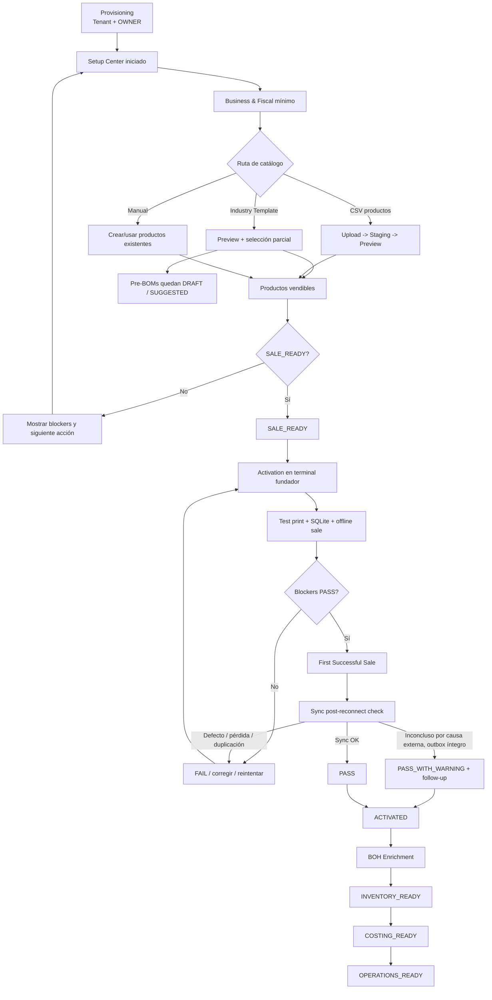

# NHILOS Client Onboarding V1 — Product Requirements Document

**Documento:** `prd_onboarding_v2.md`  
**Estado:** **APPROVED / AUTHORITATIVE**  
**Versión:** 2.1  
**Fecha:** 2026-09-03  
**Reemplaza:** `docs/PRDs/prd_onboarding.md`  
**Baseline técnico:** `docs/onboarding/onboarding_gap_audit.md` — `L0 CLOSED`  
**Superficie principal:** NHILOS Backoffice / Owner Dashboard  
**Alcance fundador:** una ubicación / un terminal fundador, offline-first en operación y multi-tenant por diseño.

> **Propósito del documento**
>
> Este PRD redefine Onboarding V1 alrededor de una sola pregunta:
>
> **¿Qué necesita realmente un negocio para pasar de tenant provisionado a ejecutar su primera venta exitosa con NHILOS POS, sin obligarlo a modelar todo su BOH antes de vender?**
>
> El objetivo de producto no es “completar todos los formularios”.
>
> El objetivo es reducir fricción, conservar integridad y alcanzar una operación vendible, verificable y recuperable lo antes posible.

---

# 0. Decisiones vinculantes de producto

Las siguientes decisiones gobiernan Onboarding V1 y sustituyen los supuestos incompatibles del PRD anterior.

1. **Provisioning, Client Onboarding y Activation son responsabilidades distintas.**
   - Provisioning crea la identidad técnica inicial del tenant.
   - Client Onboarding configura lo mínimo necesario para operar.
   - Activation demuestra que la configuración puede vender correctamente en el terminal real.

2. **La métrica primaria es `Time to First Successful Sale` (TTFSS).**
   - Onboarding no se optimiza para “porcentaje de campos configurados”.
   - Se optimiza para conseguir una venta válida por el flujo real de producción lo antes posible.

3. **`SALE_READY` no significa `BOH_COMPLETE`.**
   Un negocio puede vender aunque todavía no haya terminado:
   - stock inicial;
   - recetas;
   - subrecetas;
   - CPP/costeo;
   - proveedores;
   - imágenes;
   - categorías completas;
   - staff adicional.

4. **BOH se enriquece progresivamente.**
   Inventario, recetas, costos y operación avanzada continúan después de `SALE_READY` y pueden continuar después de Activation.

5. **Las Industry Templates aceleran; nunca deben introducir efectos operativos peligrosos.**
   - Productos seleccionados pueden quedar vendibles cuando sus datos mínimos son válidos.
   - Insumos pueden quedar como datos de enriquecimiento.
   - Toda receta sugerida por template debe permanecer `DRAFT / SUGGESTED` hasta confirmación explícita.
   - Una receta de template nunca debe empezar a descontar inventario automáticamente por el solo hecho de aplicar el template.

6. **El onboarding self-service V1 importa productos, no un grafo completo de BOH.**
   - `plantilla_productos.csv` permanece como importación self-service.
   - insumos, recetas, subrecetas y fórmulas de subrecetas quedan fuera del flujo self-service normal de V1.
   - esas cargas pueden existir como tooling asistido de soporte/migración, pero no como requisito para el cliente.

7. **CSV es el formato self-service de V1.**
   - Se admite carga de archivo CSV y puede conservarse pegado manual como fallback.
   - XLS/XLSX, Google Drive, Dropbox, QR de setup y mapeador drag-and-drop no son requisito de V1.

8. **Los aliases conocidos sustituyen al “mapper dinámico” de V1.**
   No se construirá un editor visual de mapeo de columnas mientras un conjunto explícito de aliases cubra el caso objetivo.

9. **El stock inicial no es requisito de `SALE_READY`.**
   Si se captura stock durante onboarding, nunca puede convertirse en una sobrescritura silenciosa que evite las invariantes del dominio Inventory/Kardex.

10. **Costo desconocido no significa costo cero.**
    La ausencia de costo debe representarse como `UNKNOWN / COST_PENDING` a nivel de experiencia y reporting. Onboarding no debe provocar márgenes ficticios del 100% presentando un costo no configurado como dato económico real.

11. **Staff adicional no bloquea la primera venta.**
    El `OWNER` provisionado puede operar el terminal fundador. Cajeros, meseros y managers adicionales son enriquecimiento posterior.

12. **El POS no será una segunda superficie de administración de onboarding en V1.**
    La configuración estratégica ocurre en Backoffice. El POS consume configuración y demuestra operación.

13. **Activation no es equivalente a `Tenant.is_active`.**
    El tenant puede estar técnicamente activo para autenticación antes de estar operacionalmente `ACTIVATED`.

14. **Activation es evidence-based.**
    Se alcanza mediante checks verificables sobre terminal, impresión, persistencia local, operación offline y una venta controlada por el flujo real.

15. **Ningún flujo de onboarding puede limpiar o truncar datos globalmente.**
    La operación `"Limpiar BD de Producción"` desaparece del contrato de producto.

16. **Onboarding nunca “genera triggers Kardex”.**
    Kardex pertenece a Inventory y conserva su modelo append-only. Onboarding puede iniciar configuración, pero no redefine el mecanismo contable de movimientos.

17. **Todo write de onboarding es tenant-scoped y auditable.**
    La comodidad del setup nunca puede reducir aislamiento, RBAC o trazabilidad.

18. **El progreso de onboarding debe sobrevivir refresh, cierre de navegador y reanudación posterior.**
    Una sesión de setup no puede existir únicamente en estado React efímero.

---

# 1. Visión

NHILOS Client Onboarding V1 es el flujo guiado que transforma un tenant técnicamente provisionado en un negocio capaz de ejecutar su primera venta verificable desde NHILOS POS.

La experiencia debe sentirse como un **Setup Center progresivo**, no como un proyecto de implementación contable.

El Owner debe poder:

```text
recibir su acceso
  -> completar lo fiscal mínimo
  -> disponer de productos vendibles
  -> llegar a SALE_READY
  -> validar el terminal
  -> ejecutar una primera venta exitosa
  -> quedar ACTIVATED
  -> continuar enriqueciendo inventario, costos y recetas sin frenar caja
```

La plataforma debe recordar el progreso, explicar qué es obligatorio y qué puede hacerse después, y evitar que configuraciones incompletas de BOH produzcan efectos operativos falsos o peligrosos.

---

# 2. Resultado comercial esperado

Onboarding V1 debe hacer posible que un negocio nuevo alcance una primera venta exitosa con la menor cantidad de trabajo manual necesaria.

## 2.1 Métrica primaria — Time to First Successful Sale

```text
TTFSS
  = firstSuccessfulSaleAt - onboardingStartedAt
```

### `onboardingStartedAt`

Es un timestamp **inmutable por tenant** y se registra en la primera actividad real de onboarding posterior a `PROVISIONED`, independientemente de quién la ejecute.

Cuenta como inicio la primera de estas acciones:

- un usuario autorizado abre/inicia explícitamente el Setup Center;
- un usuario autorizado de soporte/implementación realiza el primer write de setup para ese tenant;
- se inicia la primera importación, aplicación de template o configuración fiscal atribuible al onboarding.

No se utiliza la fecha de creación interna del tenant, porque Provisioning puede ocurrir anticipadamente sin que haya comenzado trabajo de implementación.

Reiniciar, reabrir o crear un nuevo intento de setup **no puede resetear `onboardingStartedAt`**. El KPI no debe mejorar artificialmente porque una implementación haya sido asistida o porque el usuario haya abandonado y retomado el proceso.

### `firstSuccessfulSaleAt`

Se registra cuando el terminal fundador completa por primera vez un ticket mediante el flujo real de Sales que:

- alcanza estado equivalente a `PAID`;
- persiste localmente;
- puede producir una impresión válida por el path configurado;
- no falla por un problema de setup.

Una venta controlada de Activation puede constituir el `First Successful Sale` si recorre exactamente el mismo production path. Si posteriormente se aplica un VOID legítimo a esa venta de verificación, el timestamp histórico de TTFSS no se reescribe ni se elimina.

Onboarding no puede crear un “fake checkout” que maquille la métrica.

### Target de producto V1

El objetivo histórico `< 15 min` se conserva como **target medible del reference path**, no como afirmación ya demostrada:

```text
Reference TTFSS target: <= 15 minutos
```

El Acceptance Plan deberá demostrar posteriormente bajo qué fixture, hardware, volumen de catálogo y condiciones se cumple.

## 2.2 Métricas secundarias

Onboarding debe instrumentar como mínimo:

- tiempo hasta `SALE_READY`;
- tiempo desde `SALE_READY` hasta `ACTIVATED`;
- `Time to First Customer Sale` como métrica observacional separada cuando el First Successful Sale fue una venta controlada de Activation;
- duración por step;
- tasa de reanudación después de abandonar el setup;
- tasa de abandono por step;
- errores de import por sesión;
- porcentaje de filas válidas / inválidas;
- uso de `VALID_ONLY` vs `ALL_OR_NOTHING`;
- aplicación de Industry Template vs CSV vs configuración manual;
- resultado de Activation: `PASS`, `PASS_WITH_WARNING`, `FAIL`;
- progreso posterior hacia `INVENTORY_READY`, `COSTING_READY` y `OPERATIONS_READY`.

V1 no fija targets numéricos adicionales hasta disponer de evidencia real de piloto.

---

# 3. Boundary funcional

## 3.1 Provisioning

Provisioning precede al onboarding y es responsable de:

- crear Tenant;
- crear OWNER inicial;
- establecer identidad y contexto tenant;
- producir credenciales iniciales;
- dejar infraestructura mínima accesible.

Provisioning **no** implica que el negocio esté listo para vender ni que haya sido activado.

## 3.2 Client Onboarding / Setup Center

Setup Center es responsable de:

- perfil comercial mínimo;
- configuración fiscal mínima;
- catálogo vendible;
- elección/aplicación opcional de Industry Template;
- carga CSV opcional de productos;
- información de readiness;
- guía de configuración del terminal;
- progreso persistente y reanudable.

## 3.3 Activation / Go-Live

Activation es responsable de verificar que lo configurado funciona en operación real:

- terminal enlazado;
- impresora disponible;
- impresión de prueba;
- persistencia local;
- venta controlada offline;
- recuperación/reconexión;
- resultado final de Activation.

## 3.4 BOH Enrichment

Después de `SALE_READY`, y sin bloquear la caja, el cliente puede completar:

- insumos;
- UOMs;
- stock inicial;
- costos;
- proveedores;
- recetas;
- subrecetas;
- producción;
- staff adicional;
- imágenes/categorías enriquecidas;
- configuración avanzada.

---

# 4. Modelo de readiness y lifecycle

Onboarding V1 usa **dos ejes distintos**: lifecycle de onboarding y readiness operacional.

## 4.1 Lifecycle de onboarding

```text
PROVISIONED
    ↓
SETUP_IN_PROGRESS
    ↓
SALE_READY
    ↓
ACTIVATION_IN_PROGRESS
    ↓
ACTIVATED
```

### PROVISIONED

Tenant + OWNER existen y pueden autenticarse en la superficie correspondiente.

### SETUP_IN_PROGRESS

El Owner inició Setup Center y existe progreso persistente.

### SALE_READY

El negocio tiene el contrato mínimo de configuración necesario para intentar una venta en el terminal.

### ACTIVATION_IN_PROGRESS

Se están ejecutando o reejecutando checks del hardware y del flujo real.

### ACTIVATED

Los blockers de Activation están resueltos y la primera venta/verificación operativa se completó según este PRD.

## 4.2 Readiness operacional progresivo

Los niveles de BOH no sustituyen el lifecycle de onboarding:

```text
SALE_READY
    ↓
INVENTORY_READY
    ↓
COSTING_READY
    ↓
OPERATIONS_READY
```

Un tenant puede estar `ACTIVATED` mientras continúa avanzando por estas etapas.

### INVENTORY_READY

La configuración necesaria para que los artículos que el negocio decidió trackear tengan estructura de inventario utilizable.

### COSTING_READY

Los artículos incluidos en el alcance de costeo tienen fuentes de costo suficientemente configuradas para evitar representar `UNKNOWN` como `0`.

### OPERATIONS_READY

El negocio completó el conjunto de capacidades BOH/operacionales que decidió utilizar en su operación normal.

**Regla:** `INVENTORY_READY`, `COSTING_READY` y `OPERATIONS_READY` no son blockers globales de ventas.

---

# 5. Personas

## 5.1 NHILOS Operator / Provisioner

Responsable de dar de alta técnicamente al cliente.

Puede:

- ejecutar provisioning;
- entregar acceso al OWNER;
- consultar estado de onboarding cuando el soporte lo requiera;
- asistir migraciones fuera del self-service.

No debe realizar writes dentro de un tenant sin autorización y trazabilidad.

## 5.2 Owner

Actor principal de Onboarding V1.

Puede:

- iniciar y reanudar Setup Center;
- completar configuración fiscal;
- elegir template;
- importar productos;
- revisar errores;
- preparar Activation;
- continuar BOH enrichment.

## 5.3 Manager

Puede participar si posee permisos de configuración. El PRD no presupone que todo Manager tenga automáticamente autoridad total.

## 5.4 Support / Implementation Specialist

Puede asistir carga compleja de insumos, recetas y subrecetas usando tooling interno o procesos separados del self-service.

## 5.5 Cashier / Waiter

No son usuarios de Setup Center en V1. Pueden ser creados posteriormente y operar el POS según permisos.

---

# 6. Setup Center

## 6.1 Experiencia general

El Owner Dashboard debe presentar Onboarding como un flujo guiado y reanudable con:

- estado global;
- siguiente acción recomendada;
- pasos obligatorios;
- pasos opcionales;
- progreso;
- warnings;
- acceso a configuración avanzada sin forzarla antes de tiempo.

No se requiere un wizard modal rígido que impida navegar por Backoffice.

El patrón preferido de producto es un **Setup Center** con pasos cerrables y estado persistente.

## 6.2 Pasos mínimos

### Step A — Business & Fiscal

Configurar como mínimo:

- `businessName`;
- RUC cuando aplique al régimen/operación;
- régimen fiscal soportado;
- tratamiento de precios con impuestos;
- spread/tipo de cambio comercial configurado cuando aplique.

Campos que el backend actual acepte pero no persista no deben presentarse como “guardados exitosamente” hasta que exista contrato real de persistencia.

### Step B — Catálogo vendible

El Owner puede iniciar por cualquiera de estas rutas y combinarlas secuencialmente:

1. **Industry Template**
2. **CSV de productos**
3. **Configuración manual / catálogo existente**

No se obliga a usar importación masiva ni existe lock-in a una sola ruta.

Si la configuración existente ya satisface el contrato mínimo, Setup Center debe reconocerla automáticamente y marcar el requisito como cumplido sin exigir una acción artificial del usuario.

### Step C — Review de `SALE_READY`

Setup Center muestra:

- checks completados;
- blockers;
- opcionales pendientes;
- warnings BOH;
- CTA para preparar Activation.

### Step D — Activation

El flujo guía los checks sobre el terminal fundador y registra resultados.

### Step E — BOH Enrichment

Después de `SALE_READY` / Activation, Setup Center sigue disponible como checklist progresivo sin bloquear la operación.

---

# 7. Contrato de `SALE_READY`

Un tenant puede alcanzar `SALE_READY` cuando todos los requisitos mínimos siguientes están satisfechos.

## 7.1 Identidad

- Tenant existe.
- OWNER inicial existe.
- El OWNER puede autenticarse.
- El contexto tenant es válido.

## 7.2 Fiscal mínimo

La configuración mínima exigida por la operación actual está presente:

- nombre comercial/fiscal utilizado por el sistema;
- régimen fiscal soportado;
- política `prices include tax`;
- tasa/regla global derivada según régimen;
- spread/tipo de cambio comercial cuando aplique.

La configuración avanzada de series/resoluciones pertenece al bounded context fiscal correspondiente. Onboarding puede mostrarla como dependencia de Activation cuando sea necesaria, pero no duplica ese dominio.

## 7.3 Catálogo mínimo

Debe existir al menos un producto activo y vendible con:

- identificador válido;
- nombre;
- precio de venta válido `> 0`.

No son requisitos globales de `SALE_READY`:

- categoría;
- SKU;
- barcode;
- imagen;
- stock inicial;
- insumos;
- receta;
- CPP;
- proveedor;
- subrecetas.

## 7.4 Reglas de no-bloqueo

La ausencia de BOH no impide `SALE_READY`.

`SALE_READY` expresa que el **control plane** posee el mínimo de identidad, fiscal y catálogo requerido. No afirma todavía que el terminal fundador haya recibido correctamente esa configuración. La disponibilidad local, credenciales offline, impresión y operación sin WAN se prueban en Activation.

Antes de Activation, si una modificación invalida fiscal mínimo o elimina el último producto vendible, el tenant deja de estar actualmente `SALE_READY` hasta corregirlo. Después de `ACTIVATED`, una degradación futura se expresa como health/configuration issue del dominio correspondiente y no reescribe el milestone histórico de Activation.

Si el producto no tiene receta:

```text
venta permitida
inventario: sin explosión BOM
setup: warning/enrichment pending
```

Si el producto no tiene costo:

```text
venta permitida
cost state: UNKNOWN / COST_PENDING
reporting: no presentar 0 como costo económico confirmado
```

---

# 8. Industry Templates

## 8.1 Objetivo

Permitir que un negocio que inicia desde cero llegue rápidamente a un catálogo utilizable sin digitar todo manualmente.

V1 conserva los templates de industria existentes y puede ampliarlos posteriormente.

## 8.2 Preview obligatorio

Antes de aplicar un template, el Owner debe poder conocer al menos:

- nombre del template;
- descripción;
- cantidad de productos;
- cantidad de insumos sugeridos;
- cantidad de recetas sugeridas;
- lista o preview de ítems seleccionables.

## 8.3 Selección parcial

El Owner debe poder elegir qué elementos desea incorporar.

No se admite el comportamiento “todo o nada porque el backend ignora opciones” como contrato final de V1.

## 8.4 Semántica de productos

Un producto seleccionado puede quedar activo si:

- posee nombre;
- posee precio válido;
- el Owner confirma su inclusión.

El Owner debe poder ajustar precios sugeridos antes o después de aplicar el template, siempre antes de depender de ellos para `SALE_READY`.

## 8.5 Semántica de insumos

Los insumos del template:

- pueden incorporarse como base de BOH;
- inician sin afirmar stock real;
- inician sin afirmar costo real;
- no deben bloquear venta.

## 8.6 Semántica de Pre-BOM

Toda receta proveniente de template se crea conceptualmente como:

```text
SUGGESTED / DRAFT
```

Mientras permanezca en ese estado:

- no participa en deducción de inventario;
- no afecta Kardex;
- no afecta COGS;
- no altera stock;
- puede ser revisada/ajustada por Owner/Manager autorizado.

Solo una acción explícita de publicación/activación de receta puede volverla operativa.

## 8.7 Reaplicación

Reaplicar un mismo template no debe crear duplicados económicos o estructurales silenciosos.

La experiencia debe informar:

- elementos ya existentes;
- elementos nuevos;
- elementos omitidos;
- conflictos que requieran decisión.

La garantía técnica concreta de idempotencia se define en Architecture Spec.

---

# 9. Bulk Import de productos

## 9.1 Alcance V1

Self-service V1 soporta:

```text
Product CSV
```

No soporta como contrato obligatorio:

```text
Ingredient CSV
Recipe CSV
Subrecipe CSV
Subrecipe Formula CSV
XLS/XLSX
```

## 9.2 Métodos de entrada

La UI debe permitir:

- seleccionar/subir un archivo `.csv`;
- opcionalmente conservar el textarea actual como fallback.

No se requiere drag-and-drop.

## 9.3 Plantilla oficial

Setup Center debe exponer una descarga directa de la plantilla oficial de productos compatible con el parser **y con el commit real** de V1.

Contrato mínimo de la plantilla oficial:

```text
nombre          REQUIRED
precio_venta    REQUIRED
unidad_venta    OPTIONAL
```

`sku`, `categoria`, `barcode`, `es_preparado`, `tiene_variantes`, `porcentaje_iva` u otros campos solo pueden figurar como importables si existe persistencia end-to-end verificada hasta el modelo vivo correspondiente.

La plantilla oficial V1 **no presentará `stock_inicial` ni costo/CPP como parte del commit de catálogo self-service**. Esos datos pertenecen a BOH Enrichment.

La documentación entregada al cliente, la plantilla descargable, el parser, staging y el commit real deben coincidir.

## 9.4 Aliases

V1 utiliza aliases declarados para headers conocidos.

Ejemplos compatibles pueden incluir:

```text
nombre / name / producto / descripcion
precio_venta / precioventa / precio / price
sku / codigo
categoria / category / rubro
unidad_venta / unidadventa / uom
```

Los aliases deben conservar significado. En particular, `codigo_barras` / `barcode` **no se mapeará a `sku`**. Si Barcode no forma parte del contrato end-to-end importable de V1, se informa como campo no aplicado en lugar de degradarlo a otro dato.

El sistema debe mostrar claramente cuando una columna no fue reconocida o cuando fue reconocida pero no forma parte del contrato persistible de V1.

**No se implementa un mapper interactivo visual en V1.**

## 9.5 Staging y preview

El archivo debe pasar por staging antes de commit.

La UI debe mostrar como mínimo:

- filas totales;
- filas válidas;
- filas con error;
- motivo por fila;
- preview de datos normalizados;
- estado de la sesión.

Una fila inválida nunca puede aparecer silenciosamente en producción.

## 9.6 Commit

V1 debe conservar ambos modos:

### `VALID_ONLY`

Comitea filas válidas y conserva las inválidas para corrección.

### `ALL_OR_NOTHING`

No comitea ninguna fila si existe un error.

## 9.7 Errores

La UI debe permitir descargar el reporte de errores de la sesión para corrección y reintento.

## 9.8 Duplicados

V1 conserva decisiones explícitas:

```text
REPLACE
SKIP
FAIL
```

El Owner debe entender el efecto antes de confirmar.

`REPLACE` solo puede sustituir campos que formen parte del contrato de **Product Master** de esta importación. No puede modificar stock, existencia, CPP ni costo vivo como efecto colateral.

La Architecture Spec deberá revisar que el criterio de identidad no dependa únicamente de comparaciones frágiles por nombre cuando exista una clave más segura.

## 9.9 Campos no confiables / no persistidos

La UI no debe prometer que un dato fue incorporado si el contrato vivo no lo persiste.

Especialmente:

- SKU;
- categoría;
- porcentaje IVA;
- variantes;
- barcode;
- cualquier otro campo que el backend capture en staging pero no materialice correctamente.

El refactor debe alinear template, DTO, staging, commit y modelo vivo antes de mostrar dichos campos como “importados”.

## 9.10 Stock inicial — decisión V1 cerrada

`stockInicial` no participa en `SALE_READY` y **no se aplica desde el commit del Product CSV self-service V1**.

Si un archivo legacy contiene `stock_inicial`:

- la UI informa que el dato no será aplicado por el importador de catálogo;
- el valor puede derivarse a un flujo posterior de BOH Enrichment únicamente si existe un contrato explícito de Inventory;
- el commit de productos jamás sobrescribe directamente `Product.stock` para simular una entrada de inventario.

Toda incorporación real de stock debe ocurrir a través del bounded context de Inventory y generar la evidencia/Kardex que corresponda.

## 9.11 Costos — decisión V1 cerrada

Costo/CPP no forma parte del commit del Product CSV self-service V1.

Si un archivo legacy contiene costo:

- la UI informa que no será aplicado como costo vivo durante el import de catálogo;
- el dato puede ser tratado posteriormente por BOH Enrichment / Costing mediante su contrato autorizado;
- el producto permanece `COST_PENDING / UNKNOWN` mientras no exista costo válido.

La ausencia de costo nunca se convierte en una afirmación económica real `0.00`.

---

# 10. Assisted BOH Migration

Los siguientes archivos dejan de ser parte del onboarding self-service normal:

- `plantilla_insumos.csv`;
- `plantilla_recetas_productos.csv`;
- `plantilla_subrecetas.csv`;
- `plantilla_recetas_subrecetas.csv`.

## 10.1 Uso permitido

Pueden permanecer como:

- material de recopilación;
- formato de migración asistida;
- tooling interno;
- insumo para soporte técnico.

## 10.2 Regla de experiencia

Setup Center no debe presentar “Sube 5 archivos para empezar” como camino recomendado.

El cliente debe poder alcanzar `SALE_READY` sin comprender:

- claves relacionales;
- dependencias de subrecetas;
- nombres exactos cruzados;
- orden de carga de BOM;
- conversiones BOH avanzadas.

## 10.3 Integridad referencial

Cuando estas migraciones se automaticen en una versión futura, no deben depender de joins ambiguos por cadenas de texto libre como identidad principal.

---

# 11. Fiscal Setup

## 11.1 Objetivo

Convertir el formulario fiscal existente en un paso integrado del Setup Center.

## 11.2 Comportamiento

El sistema debe:

- explicar el impacto de la selección;
- prellenar defaults seguros cuando estén soportados;
- validar los valores antes de marcar el paso como completo;
- mostrar qué información pertenece al setup mínimo y cuál a configuración fiscal avanzada.

## 11.3 Persistencia honesta

Un campo que no se persiste no puede:

- marcarse como completado;
- reaparecer como si estuviera guardado;
- formar parte de un readiness check.

## 11.4 Sincronización al POS

La configuración necesaria para que el terminal opere debe llegar al POS por el contrato de sincronización correspondiente antes de Activation.

Si un parámetro solo existe en cloud y el POS utiliza otro source of truth, Setup Center debe reflejar esa realidad hasta que Architecture unifique el contrato.

---

# 12. Staff inicial

## 12.1 OWNER suficiente

El OWNER provisionado es suficiente para alcanzar `SALE_READY` y ejecutar Activation en el alcance fundador.

## 12.2 Staff adicional

Crear:

- CASHIER;
- WAITER;
- MANAGER;

es opcional para la primera venta.

Setup Center puede recomendarlo después de Activation, especialmente antes de operación real con múltiples empleados.

## 12.3 Offline login

Antes de aceptar la operación offline, el usuario que realizará la prueba debe haber completado el flujo necesario para disponer de credenciales locales válidas.

---

# 13. Terminal readiness y Activation

Activation se ejecuta contra el hardware fundador aceptado.

## 13.1 Blocking checks

Los siguientes checks bloquean Activation:

1. Terminal ID registrado/enlazado.
2. Impresora configurada y accesible.
3. Test print exitoso.
4. Persistencia SQLite local operativa.
5. Catálogo mínimo disponible localmente.
6. Usuario autorizado disponible localmente.
7. Venta controlada completada sin WAN mediante el flujo real.
8. Ticket resultante imprimible por el path real.

## 13.2 Warning checks y resultado de Activation

La sincronización posterior a reconexión debe verificarse.

Estados normativos:

### `PASS`

Todos los blocking checks pasan y, al restaurar conectividad, el flujo pendiente sincroniza correctamente sin duplicación.

### `PASS_WITH_WARNING`

Todos los blocking checks pasan, la venta local es durable y el outbox/evidencia pendiente permanece íntegro, pero la comprobación de sync no puede concluir por una condición externa o transitoria —por ejemplo indisponibilidad temporal de WAN/cloud— que no demuestra defecto ni pérdida de datos.

`PASS_WITH_WARNING` **puede alcanzar `ACTIVATED`**, pero crea un follow-up obligatorio y visible.

### `FAIL`

Activation falla si:

- falla cualquier blocking check;
- la venta local no queda durable;
- se pierde el outbox o la operación pendiente;
- existe duplicación/integrity conflict;
- tras restablecer conectividad y estar disponible el backend, el producto no puede completar su sync por un defecto reproducible.

El warning nunca puede ocultarse ni utilizarse para convertir un defecto conocido de integridad/sync en un PASS.

## 13.3 Informational checks

No bloquean Activation V1:

- gaveta RJ11;
- scanner/cámara;
- hardware periférico no requerido por el negocio.

## 13.4 Venta controlada

La venta de Activation debe utilizar el mismo path que una venta ordinaria.

No se acepta:

- una simulación solo de UI;
- insertar directamente un ticket en DB;
- saltarse persistencia;
- saltarse impresión;
- depender de WAN para vender.

Si la venta de verificación debe revertirse, se utiliza el mecanismo normal de VOID/corrección del dominio Sales. Nunca se elimina historia para “limpiar” la prueba.

## 13.5 Activation record

Activation debe conservar:

- fecha/hora;
- terminal;
- usuario ejecutor;
- checks;
- warnings;
- resultado;
- referencia de la venta de verificación;
- versión/build cuando aplique.

La estructura técnica se define en Architecture Spec.


## 13.6 Product Activation vs contractual Go-Live

`ACTIVATED` demuestra que el tenant/terminal fundador superó el contrato técnico de onboarding de este PRD.

No equivale por sí mismo a:

```text
GO_LIVE_ACCEPTED
```

cuando el contrato comercial, Acceptance Plan o plan de implementación del cliente exige entregables adicionales.

Ejemplos de gates deployment-specific que pueden existir fuera de este PRD:

- inventario inicial cargado;
- recetas/consumo de ingredientes configurados;
- costeo/margen disponibles;
- portal Owner accesible;
- respaldos verificados;
- capacitación;
- checklist bilateral de aceptación.

Esos requisitos no deben contaminar el camino genérico hacia `SALE_READY`, pero tampoco pueden ser omitidos para declarar aceptado un deployment que contractualmente los requiera.

---

# 14. Persistencia y reanudación del onboarding

## 14.1 Requisito

El avance no puede depender únicamente de `useState`.

Cerrar el navegador, recargar o cambiar de dispositivo web no debe destruir el estado ya confirmado.

## 14.2 Comportamiento esperado

Al volver a Setup Center, el Owner ve:

- estado actual;
- paso recomendado;
- pasos completados;
- pasos opcionales omitidos;
- blockers pendientes;
- última actividad;
- readiness alcanzado.

## 14.3 Reintentos

Las acciones con efectos de negocio deben tolerar retry sin duplicar:

- aplicación de template;
- upload/commit de import;
- finalización de steps;
- Activation;
- registro de first successful sale.

La estrategia técnica de idempotency keys pertenece a Architecture Spec.

---

# 15. BOH Enrichment progresivo

## 15.1 Inventory Ready

Setup Center puede marcar `INVENTORY_READY` cuando el alcance de inventario elegido por el negocio tiene configuración suficiente para operar de manera coherente.

No significa que todos los productos del tenant deban tener inventario.

## 15.2 Costing Ready

`COSTING_READY` exige que los artículos incluidos en el alcance de costeo no dependan de un costo desconocido presentado como cero real.

Estados de experiencia permitidos:

```text
KNOWN
COST_PENDING
NOT_APPLICABLE
```

El Architecture Spec puede usar otras denominaciones equivalentes.

## 15.3 Operations Ready

Puede incluir, según el negocio:

- staff;
- recetas publicadas;
- subrecetas;
- stock inicial;
- producción;
- categorías;
- imágenes;
- proveedores;
- configuraciones operativas adicionales.

No constituye requisito para que Onboarding V1 sea exitoso si el negocio ya está `ACTIVATED`.

---

# 16. Multi-tenant, RBAC y auditoría

## 16.1 Tenant isolation

Toda lectura y escritura de onboarding pertenece exactamente a un tenant.

Un actor del Tenant A no puede:

- consultar progreso del Tenant B;
- aplicar template al Tenant B;
- cargar staging para Tenant B;
- commitear staging del Tenant B;
- ver errores del Tenant B;
- modificar fiscal setup del Tenant B;
- ejecutar Activation del Tenant B.

El tenant nunca se toma como autoridad desde un UUID arbitrario enviado por el cliente.

## 16.2 RBAC

La autorización de writes de onboarding es **permission-based**.

Contrato de producto:

- OWNER recibe por defecto la capacidad de administrar onboarding de su tenant;
- MANAGER solo puede administrar onboarding cuando posee explícitamente la capacidad equivalente a `onboarding.manage`;
- CASHIER y WAITER no reciben esa capacidad por defecto y no administran Setup Center;
- tooling interno de soporte requiere una autorización separada, tenant-scoped y auditable.

El nombre técnico final del permission puede variar en Architecture, pero no puede degradarse a un simple `role == MANAGER` cuando exista una matriz granular de permisos.

## 16.3 Auditoría forense mínima

El Audit Trail se reserva para efectos materiales de configuración y seguridad. Deben quedar trazables al menos:

- fiscal setup modificado;
- template aplicado con su selección;
- import commit;
- resolución de duplicados con modo aplicado;
- transición material que otorgue o quite `SALE_READY` antes de Activation;
- Activation ejecutada, fallida o completada;
- overrides o reapertura administrativa de una decisión crítica.

Eventos de navegación o analytics como `ONBOARDING_STARTED`, `ONBOARDING_RESUMED`, preview de template o abandono de step pertenecen a **telemetría de producto**, no necesariamente a la bitácora forense append-only.

No se deben registrar secretos, passwords, PINs en claro ni contenido sensible innecesario.

---

# 17. Offline-first

## 17.1 Qué significa en Onboarding V1

El Setup Center web puede requerir conectividad.

Lo obligatorio offline es la **operación resultante**.

Antes de Activation se debe demostrar que el POS puede:

- autenticarse según el contrato offline disponible;
- leer catálogo local;
- construir el ticket;
- cobrar;
- persistir;
- imprimir;
- conservar la operación hasta que vuelva WAN.

## 17.2 Qué no significa

V1 no requiere:

- ejecutar el wizard completo offline dentro del POS;
- incluir templates industriales embebidos en el instalador;
- importar archivos desde Google Drive/Dropbox en la tablet;
- configurar el tenant mediante QR móvil.

---

# 18. Observabilidad de producto

Como mínimo deben existir eventos o evidencia equivalente para:

```text
ONBOARDING_STARTED
ONBOARDING_RESUMED
ONBOARDING_STEP_COMPLETED
ONBOARDING_STEP_SKIPPED
FISCAL_SETUP_COMPLETED
TEMPLATE_PREVIEWED
TEMPLATE_APPLIED
IMPORT_STARTED
IMPORT_VALIDATED
IMPORT_COMMITTED
IMPORT_FAILED
SALE_READY_REACHED
ACTIVATION_STARTED
ACTIVATION_CHECK_FAILED
ACTIVATION_WARNING
FIRST_SUCCESSFUL_SALE
ACTIVATION_COMPLETED
INVENTORY_READY_REACHED
COSTING_READY_REACHED
OPERATIONS_READY_REACHED
```

Los nombres técnicos finales pueden variar, pero la capacidad de medir el funnel y TTFSS es obligatoria.

---

# 19. Non-goals V1

Queda explícitamente fuera de Onboarding V1:

- onboarding administrativo completo dentro del Flutter POS;
- Google Drive / Dropbox;
- QR para transferir el setup entre dispositivos;
- templates offline embebidos en la app POS;
- XLS/XLSX self-service;
- mapper visual drag-and-drop de columnas;
- importador self-service de insumos;
- importador self-service de recetas;
- importador self-service de subrecetas;
- importador self-service de fórmulas de subrecetas;
- obligación de configurar staff adicional antes de vender;
- obligación de configurar stock antes de vender;
- obligación de configurar CPP antes de vender;
- obligación de configurar recetas antes de vender;
- auto-publicar Pre-BOMs de Industry Templates;
- limpiar/truncar bases de producción como parte del setup;
- generar “triggers Kardex” desde onboarding;
- convertir `Tenant.is_active` en sustituto de Activation;
- duplicar el motor fiscal dentro de onboarding;
- resolver la topología multi-terminal/LAN del futuro;
- automatizar cualquier dato que pueda producir stock/costo falso sin confirmación;
- ocultar configuraciones desconocidas presentándolas como `0`.

---

# 20. Riesgos de producto

| Riesgo | Impacto | Mitigación de producto |
|---|---|---|
| Cliente abandona por exceso de datos BOH | Alto | separar `SALE_READY` de enriquecimiento |
| Template activa recetas con stock 0 | Crítico | `SUGGESTED/DRAFT` obligatorio |
| Costos faltantes aparentan margen 100% | Alto | `UNKNOWN/COST_PENDING` |
| Import “acepta” campos que no persiste | Alto | contrato/UI honesto y alineación DTO→commit |
| Stock inicial sobrescribe inventario sin Kardex | Crítico | diferir o pasar por Inventory |
| Refresh pierde setup | Alto | sesión persistente y reanudable |
| TTFSS no puede medirse | Alto | instrumentar start/sale-ready/first-sale |
| Tenant activo se confunde con activated | Alto | lifecycle separado |
| Importadores complejos consumen roadmap sin mejorar first sale | Alto | assisted migration, no self-service |
| Activation pasa con UI mocks | Crítico | venta por production path + hardware |
| Multi-tenant blast radius | Crítico | tenant-scoped writes + pruebas negativas |
| Soporte termina digitando todo | Medio/Alto | template + CSV de producto + quick/manual path |

---

# 21. Acceptance Criteria

## AC-01 — Boundary de Provisioning

Dado un tenant recién creado, cuando termina Provisioning, el sistema lo reconoce como `PROVISIONED` y no como `ACTIVATED`.

## AC-02 — Inicio de onboarding

Dado un tenant `PROVISIONED`, cuando ocurre la primera actividad real de onboarding —por Owner o por un operador autorizado de implementación— se registra una sola vez `onboardingStartedAt` y el estado pasa a `SETUP_IN_PROGRESS`.

## AC-03 — Resume

Dado un onboarding incompleto, cuando el Owner recarga, cierra el navegador y vuelve posteriormente, el progreso confirmado reaparece sin tener que empezar desde cero.

## AC-04 — Fiscal mínimo

Dado un Owner que completa correctamente los campos fiscales mínimos soportados, el paso queda completado y puede reconstruirse al reabrir Setup Center.

## AC-05 — Campo no persistido

Dado un campo que el backend no persiste, la UI no lo marca como guardado ni lo utiliza para readiness.

## AC-06 — Catálogo mínimo

Dado un tenant con al menos un producto activo con nombre e importe de venta válido mayor a cero, el requisito de catálogo para `SALE_READY` puede cumplirse.

## AC-07 — BOH incompleto no bloquea

Dado un producto vendible sin stock, receta, CPP, proveedor o imagen, el tenant todavía puede alcanzar `SALE_READY`.

## AC-08 — Costo desconocido

Dado un producto sin costo configurado, las superficies de setup/reporting lo tratan como `UNKNOWN / COST_PENDING` o equivalente, no como una confirmación económica de costo cero.

## AC-09 — Template preview

Dado un Industry Template, antes de aplicarlo el Owner puede conocer qué productos, insumos y recetas sugeridas contiene.

## AC-10 — Template selección parcial

Dado un template con múltiples elementos, el Owner puede excluir elementos antes de aplicar sin que el backend ignore silenciosamente su selección.

## AC-11 — Pre-BOM draft

Dada una receta proveniente de template, aplicarlo no la convierte automáticamente en receta operativa para Inventory.

## AC-12 — Template sin stock ficticio

Dado un insumo de template, aplicarlo no afirma que existe stock físico real ni costo real si el negocio no los ha configurado.

## AC-13 — Template retry

Dado un retry/reaplicación del mismo template, no se crean duplicados silenciosos de los elementos ya incorporados.

## AC-14 — CSV file upload

Dado un Owner con `plantilla_productos.csv`, puede seleccionar/subir el archivo desde Setup Center y procesarlo sin copiar manualmente todo el contenido a un textarea.

## AC-15 — CSV fallback

Si se conserva el textarea, pegar CSV sigue siendo un fallback y usa el mismo contrato de validación.

## AC-16 — Aliases

Dado un header dentro del catálogo de aliases soportado, el importador lo normaliza al campo esperado.

## AC-17 — Columna desconocida

Dado un header no soportado, el sistema informa que no fue reconocido; no descarta silenciosamente un dato que la UI haya presentado como importable.

## AC-18 — Staging

Dada una fila inválida, permanece fuera de tablas vivas y muestra la razón de error.

## AC-19 — Commit parcial

Dado un archivo con filas válidas e inválidas, `VALID_ONLY` puede comitear únicamente las válidas.

## AC-20 — All or nothing

Dado un archivo con al menos un error, `ALL_OR_NOTHING` evita el commit total.

## AC-21 — Error export

Dada una sesión con errores, el Owner puede descargar el reporte de filas fallidas.

## AC-22 — Official template

Desde Setup Center existe acceso a la plantilla oficial de productos que corresponde al contrato real del importador.

## AC-23 — Duplicados

Dado un producto ya existente, antes del commit el flujo aplica de manera explícita la política `REPLACE`, `SKIP` o `FAIL`.

## AC-24 — Stock/costo fuera del Product CSV V1

Dado un Product CSV legacy que contiene `stock_inicial` o costo, el commit de catálogo no modifica stock, existencia, CPP ni costo vivo. La UI informa que esos datos pertenecen a BOH Enrichment.

## AC-25 — Assisted BOH

Un tenant puede completar todo el onboarding self-service V1 sin subir los cuatro CSV complejos de insumos/recetas/subrecetas.

## AC-26 — Staff opcional

Un tenant con solo el OWNER inicial puede alcanzar `SALE_READY`.

## AC-27 — Sale Ready

Cuando identidad, fiscal mínimo y catálogo mínimo cumplen sus checks, el sistema registra `SALE_READY` aunque existan pendientes BOH opcionales.

## AC-28 — Sale Ready explicable

El Owner puede ver por qué está o no está `SALE_READY`, diferenciando blockers, warnings y opcionales.

## AC-29 — Activation hard blockers

Activation no puede completar si falla Terminal ID, persistencia local, impresora/test print o la venta offline controlada.

## AC-30 — Activation sync warning

Una falla de sincronización post-reconexión se muestra y registra explícitamente; no se convierte silenciosamente en PASS.

## AC-31 — Controlled first sale

La venta de Activation utiliza el production checkout path y alcanza `PAID`/persistencia/impresión según el contrato real.

## AC-32 — No cleanup destructivo

Si la venta de verificación debe corregirse, se utiliza el mecanismo fiscal/operativo de Sales; no se elimina directamente el ticket.

## AC-33 — Activation record

Cada intento de Activation produce un registro trazable con checks, resultado, actor, terminal y referencia de la venta cuando aplique.

## AC-34 — Activated independiente de is_active

Un tenant puede tener `is_active=true` para acceso y seguir sin estado `ACTIVATED`.

## AC-35 — TTFSS

Al producirse la primera venta exitosa, el sistema puede calcular TTFSS a partir de timestamps persistidos y no de datos inferidos manualmente.

## AC-36 — Backoffice ownership

El Owner realiza configuración estratégica desde Backoffice; la ausencia de un wizard equivalente en Flutter POS no invalida Onboarding V1.

## AC-37 — Offline operation gate

Con WAN desconectada, el terminal fundador puede completar el flujo de venta exigido por Activation con configuración previamente sincronizada.

## AC-38 — Tenant isolation

Un actor autenticado del Tenant A no puede leer ni modificar sesión, fiscal setup, staging, template application o Activation del Tenant B.

## AC-39 — Audit

Los cambios materiales de onboarding y Activation quedan asociados al actor y al tenant sin exponer secretos.

## AC-40 — Inventory Ready posterior

Un tenant `ACTIVATED` puede continuar avanzando a `INVENTORY_READY` sin que ese progreso revoque su capacidad de vender.

## AC-41 — Costing Ready posterior

Un tenant `ACTIVATED` puede permanecer con `COST_PENDING` y vender; `COSTING_READY` se alcanza cuando el alcance de costo elegido queda suficientemente configurado.

## AC-42 — No mobile setup scope creep

La ausencia de Google Drive, Dropbox, QR setup, onboarding móvil nativo o templates embebidos offline no invalida Onboarding V1.

## AC-43 — No dynamic mapper scope creep

La ausencia de un mapper visual drag-and-drop no invalida V1 si aliases soportados, validación y feedback de columnas son funcionales.

## AC-44 — No complex self-service imports

La ausencia de importadores self-service de insumos/recetas/subrecetas no invalida V1.

## AC-45 — No recipe side effects

Ninguna receta `SUGGESTED / DRAFT` generada por onboarding produce movimientos de Inventory hasta activación explícita en el bounded context de Recipes/Inventory.

## AC-46 — No global truncate

Ninguna acción del Setup Center puede ejecutar o semánticamente equivaler a una limpieza global de datos de producción del sistema.

## AC-47 — Idempotent retries

Reintentar acciones confirmables de onboarding no produce duplicación económica o estructural silenciosa.

## AC-48 — First sale with minimal catalog

Un tenant con un único producto vendible, fiscal mínimo y terminal correctamente activable puede completar First Successful Sale sin tener recetas, stock inicial o staff adicional.


## AC-49 — State-based setup

Dado un tenant que ya posee fiscal mínimo o catálogo válido antes de abrir Setup Center, el sistema reconoce ese estado y no obliga al Owner a repetir el write para completar el step.

## AC-50 — Rutas combinables

Dado un Owner que aplicó un Industry Template, todavía puede importar CSV o crear productos manualmente en el mismo onboarding sin reiniciar ni invalidar el progreso.

## AC-51 — Aliases semánticamente seguros

Dado un CSV con columna `codigo_barras`/`barcode`, el importador no la transforma en `sku`. Si Barcode no es persistible en V1, la UI la reporta como no aplicada.

## AC-52 — REPLACE limitado a Product Master

Dado un duplicado resuelto con `REPLACE`, solo cambian campos del Product Master incluidos en el contrato de importación; stock y CPP/costo permanecen intactos.

## AC-53 — PASS_WITH_WARNING normativo

Dada una venta offline durable y blocking checks correctos, si el sync no puede verificarse por indisponibilidad externa/transitoria pero el outbox permanece íntegro, Activation puede finalizar `PASS_WITH_WARNING` y alcanzar `ACTIVATED` con follow-up registrado.

## AC-54 — Sync defect es FAIL

Dada conectividad restaurada y backend disponible, si la sincronización falla por un defecto reproducible, duplicación, pérdida de outbox o conflicto de integridad, Activation termina en `FAIL`; no puede degradarse a warning.

## AC-55 — Activation monotónica

Dado un tenant `ACTIVATED`, una falla posterior de impresora, WAN o configuración operacional no borra ni revierte el milestone histórico de onboarding; el bounded context responsable expone el nuevo health/blocking state.

## AC-56 — Product Activation no sustituye aceptación contractual

Dado un deployment cuyo contrato exige entregables adicionales al Activation técnico, `ACTIVATED` no permite marcar `GO_LIVE_ACCEPTED` hasta que el Acceptance Plan contractual correspondiente cierre sus gates.

## AC-57 — TTFSS no reiniciable

Dado un onboarding iniciado y posteriormente abandonado, reabierto o asistido por soporte, `onboardingStartedAt` conserva el primer timestamp y TTFSS no se recalcula desde un inicio posterior.

---

# 22. Flujo canónico de producto



---

# 23. Criterio de cierre del PRD

Este PRD queda:

```text
APPROVED / AUTHORITATIVE
```

para **NHILOS Client Onboarding V1**.

La ronda de auditoría de producto cerró las ambigüedades normativas sobre:

- `onboarding_gap_audit.md` como baseline;
- límites Provisioning / Setup / Activation;
- `SALE_READY` como readiness de control plane previo a Activation;
- configuración existente reconocida state-based;
- rutas de catálogo combinables;
- semántica `SUGGESTED / DRAFT` de templates;
- Product CSV self-service limitado a Product Master;
- exclusión normativa de stock/costo del commit de catálogo;
- aliases semánticamente seguros;
- lifecycle y resultados `PASS / PASS_WITH_WARNING / FAIL`;
- `ACTIVATED` como milestone histórico;
- TTFSS inmutable y sensible a trabajo asistido;
- multi-tenant, permission-based RBAC y separación Audit/Telemetry;
- separación entre Product Activation y `GO_LIVE_ACCEPTED` contractual.

No quedan decisiones de producto abiertas que bloqueen Architecture Spec.

Una implementación no será conforme si:

- obliga a cargar los cinco CSV para vender;
- activa Pre-BOMs automáticamente;
- pierde progreso al refrescar;
- usa `Tenant.is_active` como sustituto de Activation;
- llama “costo 0” a un costo desconocido;
- aplica stock o CPP/costo desde el Product CSV self-service;
- permite que `REPLACE` modifique stock/costo como side effect;
- mapea Barcode a SKU para “hacerlo compatible”;
- marca `SALE_READY` sin fiscal/catálogo mínimo;
- exige BOH completo para habilitar la primera venta;
- declara éxito mediante una simulación que no recorre el checkout real;
- convierte un defecto reproducible de sync/integridad en `PASS_WITH_WARNING`;
- resetea `onboardingStartedAt` para mejorar TTFSS;
- usa Product Activation para ignorar un gate contractual de Go-Live;
- depende de limpiar datos de producción;
- rompe aislamiento tenant para simplificar el setup.

---

# 24. Siguiente artefacto

Una vez aprobado este PRD, el siguiente documento es:

```text
docs/onboarding/onboarding_architecture_spec.md
```

Debe bajar este contrato a ingeniería, incluyendo especialmente:

- `OnboardingSession`;
- state machine persistente;
- resumability;
- idempotencia;
- ownership entre Onboarding / Fiscal / Catalog / Inventory / Sales;
- lifecycle `SUGGESTED / DRAFT` para Pre-BOMs;
- safe application de stock/costo;
- Activation Gate;
- event/telemetry contract para TTFSS;
- tenant isolation;
- RBAC;
- audit trail;
- sync/readiness entre cloud y POS;
- migration/cutover desde W9 actual.

Después:

```text
onboarding_execution_roadmap.md
onboarding_acceptance_plan.md
```

---

# 25. Fuentes autoritativas

1. `docs/onboarding/onboarding_gap_audit.md` — baseline técnico L0.
2. `docs/PRDs/prd_onboarding.md` — intención previa sustituida por este V2.
3. `docs/plans/master_execution_roadmap.md` — Batch 11 y contexto de plataforma.
4. `docs/plans/owner_dashboard_execution_roadmap.md` — ownership Backoffice/W9.
5. `docs/PROVISIONING.md` — boundary de provisioning.
6. `docs/DESIGN_BACKOFFICE.md` — experiencia visual y accesibilidad del Setup Center.
7. `docs/DESIGN.md` — experiencia del POS usada durante Activation.
