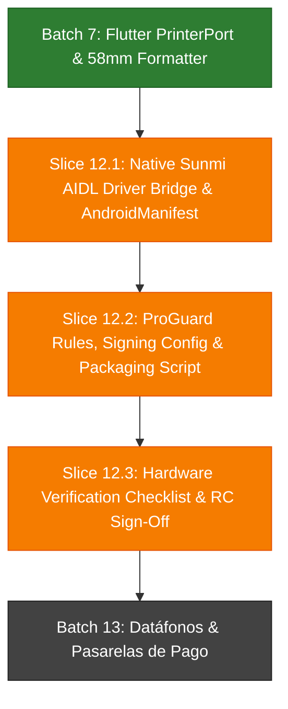

# Batch 12: Packaging & Release Candidate APK para Sunmi V2s

## 1. Authority & Traceability

- **PRD / Vision**: `docs/PRDs/Product_Requirement_Document.md`, `GEMINI.md`, `AGENTS.md` (Offline-first, DGI DT 09-2007 compliance, Food Park Pilot on physical Sunmi V2s handhelds).
- **Architecture & Design**:
  - `docs/plans/sales/batch_07_sunmi_v2s_hardware_printing.md` (Batch 7: Responsividad $360\times 720\text{dp}$, `PrinterPort`, `Receipt58mmFormatter`, `SunmiPrinterAdapter`).
  - `apps/pos_app/lib/data/adapters/printer/sunmi_printer_adapter.dart` (MethodChannel `com.omnifood.pos/sunmi_printer`).
- **Master Roadmap**: `docs/plans/master_execution_roadmap.md` (Bloque 12: Release Candidate APK para Sunmi V2s).

---

## 2. Assumptions, Decisions & Owners

- **DEC-12.1 (Sunmi Native Driver Protocol)**: Connect the Flutter MethodChannel `com.omnifood.pos/sunmi_printer` to the official Sunmi Printer Service AIDL / SDK (`com.sunmi:printerlibrary` or AIDL binding) in Kotlin, supporting `getPrinterStatus`, `printRawBytes`, `printText`, and `openDrawer`.
- **DEC-12.2 (Build Matrix & Target Architecture)**: Sunmi V2s devices run 32-bit/64-bit Android (SUNMI OS / Android 7.1 to 11 on ARM). We produce both architecture-specific APKs (`armeabi-v7a`, `arm64-v8a`) and a Universal Release Candidate APK.
- **DEC-12.3 (ProGuard / R8 Safety Invariant)**: In release builds (`--release`), ProGuard rules must preserve Floor SQLite DB, Freezed generated models, and Sunmi AIDL interfaces without breaking reflection or serialization.
- **DEC-12.4 (Offline-First Deployment Baseline)**: The packaged APK must be self-contained, operate 100% offline out-of-the-box, and allow backend endpoint configuration without recompiling where applicable.
- **Owner**: Lead Architect / Mobile Release Engineer.

---

## 3. Dependency DAG & Critical Path

- **Critical Path**: S12.1 (Native AIDL Bridge) $\rightarrow$ S12.2 (Release Configuration & Build Automation) $\rightarrow$ S12.3 (Physical Sunmi V2s Verification & Runbook).
- **Parallel Work**: Writing packaging scripts and drafting hardware verification runbooks can proceed alongside native bridge wiring.

---

## 4. Milestone Roadmap

| Milestone | Outcome | Dependencies | Entry Gate | Exit Gate / Evidence |
|---|---|---|---|---|
| **M12.1: Native Driver Bridge** | Native Kotlin Sunmi AIDL service binding on `com.omnifood.pos/sunmi_printer` | Batch 7 Flutter contracts | Batch 7 tests passing | Android compilation & mock channel verification |
| **M12.2: Production Packaging** | Automated build script, R8/ProGuard rules, release signing profile, ARM/Universal APKs | M12.1 | Native bridge verified | Successful `flutter build apk --release` & artifact validation |
| **M12.3: Hardware Pilot Sign-Off** | Step-by-step physical validation checklist for printer, drawer, screen, scanner, offline sales | M12.2 | Release APK generated | Hardware verification report signed off |

---

## 5. Detailed Execution Batches (Slices)

### Batch 12.1: Native Android Sunmi Service Bridge & Driver Integration (Kotlin AIDL)

- **Goal:** Implement the native Android side of MethodChannel `com.omnifood.pos/sunmi_printer` using Sunmi AIDL / SDK to enable direct hardware communication with the integrated 58mm thermal printer and cash drawer.
- **Traceability:** PRD Section 4.3; `batch_07_sunmi_v2s_hardware_printing.md`; `SunmiPrinterAdapter`.
- **Prerequisites and dependencies:** Batch 7 completed.
- **In scope:**
  - Sunmi Printer SDK dependency / AIDL binding in `apps/pos_app/android/app/build.gradle.kts`.
  - Implementation of `SunmiPrinterMethodHandler` in Kotlin attached to `MainActivity`.
  - Methods: `getPrinterStatus` (mapping Sunmi status codes), `printRawBytes` (ESC/POS byte stream), `printText`, `openDrawer`.
  - AndroidManifest updates (queries for Sunmi service, USB/Printer permissions).
- **Out of scope:** Payment terminal / Datáfono integration (reserved for Batch 13).
- **Touched domains/contracts/data/operations:**
  - `apps/pos_app/android/app/src/main/kotlin/com/omnifood/pos_app/MainActivity.kt`
  - `apps/pos_app/android/app/src/main/kotlin/com/omnifood/pos_app/printer/SunmiPrinterHandler.kt`
  - `apps/pos_app/android/app/build.gradle.kts`
  - `apps/pos_app/android/app/src/main/AndroidManifest.xml`
- **Acceptance criteria:**
  - Native Kotlin handler responds to all 4 MethodChannel calls.
  - Non-Sunmi devices gracefully handle unhandled service calls without crashing (fallback safe).
  - Android project compiles cleanly with `./gradlew assembleDebug`.
- **Tests and linked evidence:**
  - MethodChannel unit/integration test harness.
  - Clean Android build validation.
- **Rollback/recovery:** Revert Kotlin files and Gradle changes; Flutter fallback remains operational.
- **Observability:** Structured Android Logcat logging tags (`[OmniFoodSunmiNative]`).
- **Estimate:** ~220 changed lines; Medium risk (native Android interop).
- **Commit/PR boundary:** `feat(pos_app): implement native Sunmi V2s AIDL printer channel bridge`
- **Entry gate:** Batch 7 Flutter tests passing.
- **Exit gate:** Android build passes with native bridge integrated.

---

### Batch 12.2: Production Build Profiles, ProGuard Rules & Packaging Automation

- **Goal:** Configure release build profiles, ProGuard/R8 retention rules, signing configurations, and provide an automated release script (`scripts/build_sunmi_apk.sh`) to build optimized ARM/ARM64 and Universal Release Candidate APKs.
- **Traceability:** PRD Operational Readiness; `GEMINI.md`.
- **Prerequisites and dependencies:** Batch 12.1.
- **In scope:**
  - ProGuard rules (`android/app/proguard-rules.pro`) for Floor, Freezed, Sqflite, Sunmi AIDL.
  - Release build types and signing configuration templates in `build.gradle.kts`.
  - App metadata: App name "OmniFood POS", versioning alignment in `pubspec.yaml`.
  - Packaging script: `scripts/build_sunmi_apk.sh` supporting `--release`, `--split-per-abi`, and target output directory with SHA-256 checksum generation.
- **Out of scope:** Backend Docker packaging (already in place).
- **Touched domains/contracts/data/operations:**
  - `apps/pos_app/android/app/proguard-rules.pro`
  - `apps/pos_app/android/app/build.gradle.kts`
  - `apps/pos_app/pubspec.yaml`
  - `scripts/build_sunmi_apk.sh`
- **Acceptance criteria:**
  - `scripts/build_sunmi_apk.sh` executes code generation, runs tests, and produces signed/release APKs.
  - R8 minification does not strip Floor database models, Freezed serialization, or Sunmi AIDL classes.
  - SHA-256 checksums generated alongside output APKs.
- **Tests and linked evidence:**
  - Successful execution of packaging script.
  - APK integrity and size inspection ($< 35\text{MB}$ per ABI split).
- **Rollback/recovery:** Remove packaging script and revert `build.gradle.kts` signing configs.
- **Observability:** Script terminal logs with step timestamps and checksum outputs.
- **Estimate:** ~180 changed lines; Low risk.
- **Commit/PR boundary:** `chore(pos_app): configure production release build profile and packaging automation`
- **Entry gate:** Batch 12.1 completed.
- **Exit gate:** Release Candidate APK generated and verified.

---

### Batch 12.3: Physical Hardware Verification Checklist & Runbook

- **Goal:** Provide a comprehensive physical device verification runbook and checklist for validating the Release Candidate APK on real Sunmi V2s hardware prior to Food Park pilot rollout.
- **Traceability:** PRD Section 7 (Pilot Readiness); `GEMINI.md` Golden Rules.
- **Prerequisites and dependencies:** Batch 12.2.
- **In scope:**
  - `docs/operations/sunmi_v2s_hardware_verification_checklist.md` covering:
    1. UI Responsiveness on $360\times 720\text{dp}$ screen.
    2. Physical 58mm thermal receipt printing (Facturas DGI, Comandas KDS, Cortes X/Z).
    3. RJ11 Cash Drawer physical trigger.
    4. Offline SQLite transaction resilience during power-off / WiFi loss.
    5. Bidirectional cloud synchronization on WiFi recovery.
  - Troubleshooting guide for Sunmi Printer Service, ADB over USB/WiFi, and cleartext network security.
- **Out of scope:** Cloud server infrastructure provisioning.
- **Touched domains/contracts/data/operations:**
  - `docs/operations/sunmi_v2s_hardware_verification_checklist.md`
  - `docs/plans/master_execution_roadmap.md`
- **Acceptance criteria:**
  - Complete verification matrix with clear pass/fail criteria and remediation actions.
  - Master roadmap updated with Batch 12 completion status upon physical sign-off.
- **Tests and linked evidence:**
  - Comprehensive documentation review and verification runbook.
- **Rollback/recovery:** N/A (Documentation/Operations).
- **Observability:** Physical inspection logs and QA sign-off sheet.
- **Estimate:** ~150 changed lines; Low risk.
- **Commit/PR boundary:** `docs(pos_app): add Sunmi V2s physical hardware verification runbook`
- **Entry gate:** Batch 12.2 completed and APKs available.
- **Exit gate:** Runbook ready for pilot execution.

---

## 6. Milestone-Level Deferred Backlog

- **Batch 13 (Pasarelas & Datáfonos)**: BAC Credomatic / Banpro MPOS SDK integration, transaction reversal, and batch settlement.
- **Batch 14 (Loyalty & Discounts)**: Customer loyalty points, promotional discounts, and frequent client profiles.

---

## 7. Risks, Mitigations & Rollback

| Risk | Impact | Mitigation | Rollback Plan |
|---|---|---|---|
| **R1**: Sunmi AIDL service binding fails on newer Android/SUNMI OS versions | Thermal printing fails | Use official Sunmi `printerlibrary` with fallback to direct AIDL bind and soft degradation | Revert to Flutter fallback simulator |
| **R2**: R8 / ProGuard minification strips SQLite or Freezed entities | App crashes at runtime in `--release` | Explicit `-keep` rules for `com.omnifood.**`, Floor DAOs, and Freezed models | Disable minification temporarily via `isMinifyEnabled = false` |
| **R3**: Network Cleartext Policy blocks local backend IP in production | Cannot sync with local backend | `android:usesCleartextTraffic="true"` configured in AndroidManifest for local dev/pilot LAN | Configurable HTTPS reverse proxy |

---

## 8. Line-Budget & PR Forecast

| Slice | Target Lines | Reviewer Burden | Expected PR Structure |
|---|---|---|---|
| **Slice 12.1** | ~220 lines | Moderate (Kotlin Android) | 1 PR: Native Sunmi AIDL bridge & Android build setup |
| **Slice 12.2** | ~180 lines | Low (Gradle, ProGuard, Bash) | 1 PR: Build profiles, ProGuard, and `build_sunmi_apk.sh` |
| **Slice 12.3** | ~150 lines | Low (Docs / Checklist) | 1 PR: Hardware verification runbook & roadmap sync |
| **Total** | **~550 lines** | **3 small, reviewable PRs** | Sequential execution |

---

## 9. Traceability & Evidence Update Plan

- Upon completion of Slice 12.1: Android compilation log and unit test evidence logged in memory and PR.
- Upon completion of Slice 12.2: APK generation output, SHA-256 hashes, and size metrics documented.
- Upon completion of Slice 12.3: `master_execution_roadmap.md` updated to mark Batch 12 as verified.

---

## 10. Recommended Next Action

**Proceed to implement Slice 12.1: Native Android Sunmi Service Bridge & Driver Integration (Kotlin AIDL)** in `apps/pos_app`.
