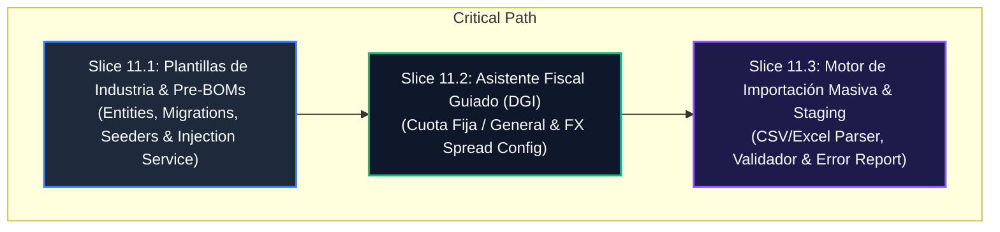

# Batch 11: Automatización de Onboarding, Plantillas de Industria & Carga Masiva

---

## 1. Authority & Traceability

- **PRD Reference**: [`docs/PRDs/prd_onboarding.md`](file:///home/octavio_morales/omnifood-ni/docs/PRDs/prd_onboarding.md) (Módulo Especializado: Automatización de Onboarding — Venta Rápida <15min).
- **PRD v2 Architecture**: [`docs/PRDs/Product_Requirement_Document_v2.md`](file:///home/octavio_morales/omnifood-ni/docs/PRDs/Product_Requirement_Document_v2.md).
- **Parent Milestone**: Master Execution Roadmap (Batch 11).
- **Core Constraints**:
  - **Offline-First & Zero-Friction Setup**: Initial setup and catalog provisioning executable under 15 minutes.
  - **DGI Fiscal Compliance (Nicaragua)**: Strict automated tax configuration (`CUOTA_FIJA` vs `REGIMEN_GENERAL` con 15% IVA desglosado o implícito).
  - **Strict Multi-Tenant Isolation**: Multi-tenant data segregation by `tenant_id` across PostgreSQL RLS and staging tables.
  - **No `any` Policy**: Strict TypeScript types across all DTOs, entities, and services.

---

## 2. Assumptions, Invariants & Architectural Decisions

### Invariants
- **INV-11.1 (Multi-Tenant Segregation)**: Global industry templates (`plantillas_industria`, `plantilla_insumos_predeterminados`) are read-only public reference catalogs, while tenant-injected products, insumos, and staging records are strictly isolated by `tenant_id`.
- **INV-11.2 (Staging Isolation & Non-Destructive Ingestion)**: Raw file imports NEVER insert directly into live production tables (`products`, `insumos`, `recipes`). Data must first transit through `staging_importacion_productos` for validation, syntax sanitization, and error flagging.
- **INV-11.3 (Idempotent Import Sessions)**: Every batch import requires a unique `token_sesion_importacion` (UUID). Re-submitting or re-processing the same token is strictly idempotent and must never produce duplicate entries or corrupted inventory.
- **INV-11.4 (BOM Magnitude Integrity)**: Pre-BOM templates and converted UOMs must strictly comply with valid inventory conversion dimensions (e.g. `MASS: KG <-> G`, `VOLUME: L <-> ML`, `UNIT: UN`).

### Decisions
- **DEC-11.1 (Industry Template Archetypes)**: Support 3 core archetypes in Slice 11.1:
  1. `CAFETERIA` (Espresso, Latte, Capuchino, Granos, Leche entera, Vasos descartables 8oz/12oz).
  2. `BAR_RESTAURANTE` (Hamburguesa Clásica, Cerveza Nacional, Ron, Pan brioche, Torta de carne, Queso cheddar).
  3. `RETAIL_MINIMARKET` (Gaseosa 500ml, Agua purificada 1L, Snacks, Cigarrillos).
- **DEC-11.2 (Fiscal Regime Mapping)**:
  - `CUOTA_FIJA`: Facturación sin desglose explícito de IVA 15% en el ticket fiscal.
  - `REGIMEN_GENERAL`: Facturación formal DGI con desglose explícito del 15% IVA y subtotal gravado/exento.
  - Commercial FX Spread default: +C$0.50 sobre la tasa oficial BCN.
- **DEC-11.3 (Chunked Processing & Error Diagnostics)**:
  - Max chunk size: 100 rows per transaction chunk.
  - Failed rows generate structured diagnostics with column name, raw input, and human-readable explanation in Spanish.

---

## 3. Dependency DAG & Critical Path

---

## 4. Detailed Slices Specification (Batch 11)

### 🔹 Slice 11.1: Plantillas de Industria & Pre-BOMs Estructurales

- **Goal**: Implement global industry template definitions, seeders, and selective catalog injection service for rapid tenant initialization.
- **Prerequisites**: Batch 6a-c (Inventory entities: `Product`, `Insumo`, `Recipe`, `RecipeItem`, `CatalogValue`).
- **Touched Surfaces**:
  - `apps/admin_backend/src/modules/onboarding/entities/industry-template.entity.ts`
  - `apps/admin_backend/src/modules/onboarding/entities/template-insumo.entity.ts`
  - `apps/admin_backend/src/modules/onboarding/entities/template-product.entity.ts`
  - `apps/admin_backend/src/modules/onboarding/entities/template-recipe-item.entity.ts`
  - `apps/admin_backend/src/migrations/1787000000000-CreateIndustryTemplatesAndDefaults.ts`
  - `apps/admin_backend/src/modules/onboarding/services/industry-template.service.ts`
  - `apps/admin_backend/src/modules/onboarding/controllers/industry-template.controller.ts`
  - `apps/admin_backend/src/modules/onboarding/dto/apply-template.dto.ts`
  - `apps/admin_backend/src/modules/onboarding/onboarding.module.ts`
  - `apps/admin_backend/test/onboarding/industry-template.e2e-spec.ts`
- **Acceptance Criteria**:
  - `GET /onboarding/templates`: Returns the 3 available industry templates with descriptions and item counts.
  - `POST /onboarding/templates/:id/apply`: Injects all template insumos, products, and Pre-BOM recipe links into the target tenant idempotently.
  - Re-applying a template does not duplicate existing insumos/products (matches by name/code).
- **Test Evidence**:
  - Unit tests for `IndustryTemplateService` and seeder data.
  - Integration tests for transactional injection into `insumos`, `products`, and `recipes`.
  - E2E tests validating 401, 403, and 201 responses with multi-tenant isolation.

---

### 🔹 Slice 11.2: Asistente de Configuración Fiscal Guiada (Nicaragua DGI)

- **Goal**: Implement guided fiscal setup wizard configuring tax rules, receipt breakdown behavior, and commercial exchange rate spread.
- **Prerequisites**: Slice 11.1, `SystemParametersConfig`, `Tenant`.
- **Touched Surfaces**:
  - `apps/admin_backend/src/modules/onboarding/dto/fiscal-setup.dto.ts`
  - `apps/admin_backend/src/modules/onboarding/services/fiscal-setup.service.ts`
  - `apps/admin_backend/src/modules/onboarding/controllers/fiscal-setup.controller.ts`
  - `apps/admin_backend/test/onboarding/fiscal-setup.e2e-spec.ts`
- **Acceptance Criteria**:
  - `POST /onboarding/fiscal-setup`: Accepts `{ regime: 'CUOTA_FIJA' | 'REGIMEN_GENERAL', ruc?: string, businessName: string, commercialFxSpread: number, pricesIncludeTax: boolean }`.
  - Updates `Tenant` entity (`ruc`, `name`, etc.).
  - Configures `sys_parametros_config` with fiscal settings:
    - `FISCAL_REGIME`: `'CUOTA_FIJA'` or `'REGIMEN_GENERAL'`.
    - `TAX_RATE_IVA`: `0.15` (General) or `0.00` (Cuota Fija).
    - `PRICES_INCLUDE_TAX`: `boolean`.
    - `COMMERCIAL_FX_SPREAD`: `number` (e.g. `0.50`).
  - Emits audit log `ONBOARDING_FISCAL_SETUP_COMPLETED`.
- **Test Evidence**:
  - Unit tests validating regime logic and system parameter versioning.
  - E2E tests verifying fiscal configuration persistence and parameter queries.

---

### 🔹 Slice 11.3: Motor de Importación Masiva (CSV / Excel) con Staging & Validación

- **Goal**: Implement staging engine for mass import of products, categories, sale prices, initial costs, and tax settings with error diagnostics.
- **Prerequisites**: Slice 11.1, Slice 11.2.
- **Touched Surfaces**:
  - `apps/admin_backend/src/modules/onboarding/entities/import-staging.entity.ts`
  - `apps/admin_backend/src/migrations/1788000000000-CreateImportStagingTable.ts`
  - `apps/admin_backend/src/modules/onboarding/dto/import-staging.dto.ts`
  - `apps/admin_backend/src/modules/onboarding/services/import-staging.service.ts`
  - `apps/admin_backend/src/modules/onboarding/controllers/import-staging.controller.ts`
  - `apps/admin_backend/test/onboarding/import-staging.e2e-spec.ts`
- **Acceptance Criteria**:
  - `POST /onboarding/import/upload`: Receives batch rows (or parsed CSV/JSON), creates session token, populates `staging_importacion_productos` in chunks of $\le 100$ rows, runs syntax/domain validations, and returns summary `{ totalRows, validRows, errorRows, sessionToken, errors: [...] }`.
  - `POST /onboarding/import/commit`: Takes `{ sessionToken, mode: 'VALID_ONLY' | 'ALL_OR_NOTHING' }`. Injects valid staging rows into `products` and `categories`, updating session status to `COMMITTED`.
  - `GET /onboarding/import/errors/:sessionToken`: Exports failed rows with detailed reasons for user correction.
  - Non-numeric prices or negative values flagged as `ERROR` with diagnostic messages.
- **Test Evidence**:
  - Unit tests for row validation (UC-01 text price rejection, negative cost rejection, missing category fallback).
  - Idempotency tests (UC-03 duplicate upload resilience).
  - E2E tests for upload $\rightarrow$ validate $\rightarrow$ commit lifecycle.

---

## 5. Risk Assessment, Line Budget & Mitigation

| Risk | Impact | Mitigation |
|---|---|---|
| Large file uploads exhausting memory | High | Chunked processing ($\le 100$ rows per stream chunk), staging buffer in DB. |
| Duplicate SKUs or names corrupting catalog | High | Upsert or conflict resolution flags in staging commit (`REPLACE`, `SKIP`, `FAIL`). |
| Incompatible units in Pre-BOM templates | Medium | Pre-BOMs strictly bounded to standard base UOMs (`KG`, `G`, `L`, `ML`, `UN`). |
| Non-tenant isolation in shared templates | Critical | Templates are static read-only definitions; live product generation strictly stamps `tenant_id`. |

### Line Budget & Reviewability
- **Slice 11.1**: ~350 LOC (Entities, migrations, seeders, service, e2e spec).
- **Slice 11.2**: ~250 LOC (DTOs, fiscal setup service, controller, e2e spec).
- **Slice 11.3**: ~380 LOC (Staging entity, migration, parser/validator service, e2e spec).

---

## 6. One Next Action

Avanzar con la implementación del **Slice 11.1: Plantillas de Industria & Pre-BOMs Estructurales** mediante TDD estricto (RED $\rightarrow$ GREEN $\rightarrow$ Refactor).
