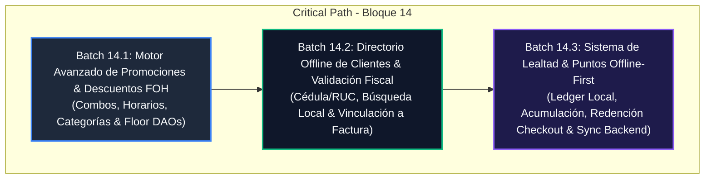

# OmniFood NI — Execution Plan: Bloque 14
## Fidelización, Descuentos Promocionales & Clientes Frecuentes (Offline-First)

---

## 1. Authority & Traceability

- **PRD Reference**:
  - [`docs/PRDs/prd_modulo_ventas.md`](file:///home/octavio_morales/omnifood-ni/docs/PRDs/prd_modulo_ventas.md) (Secciones 2.5 Checkout, 2.6 Motor de Impuestos, 3.0 Modelo ER FOH).
  - [`docs/PRDs/Product_Requirement_Document_v2.md`](file:///home/octavio_morales/omnifood-ni/docs/PRDs/Product_Requirement_Document_v2.md) (Sección FOH & Descuentos).
  - [`docs/PRDs/Done/prd_gestion_identidad_acceso_y_auditoria.md`](file:///home/octavio_morales/omnifood-ni/docs/PRDs/Done/prd_gestion_identidad_acceso_y_auditoria.md) (`sales:discount_override` & S-RBAC-02).
- **Parent Milestone**:
  - [`docs/plans/master_execution_roadmap.md`](file:///home/octavio_morales/omnifood-ni/docs/plans/master_execution_roadmap.md) (Bloque 14: Fidelización, Descuentos Promocionales & Clientes Frecuentes).
- **Core Constraints**:
  - **Offline-First or Muerte**: El cálculo de promociones, búsqueda de clientes y acumulación/redención de puntos debe operar 100% desconectado en SQLite local.
  - **Cumplimiento DGI (Nicaragua - Disposición Técnica 09-2007)**: Los descuentos afectan la base imponible del IVA 15% proporcionalmente; los datos del cliente (Cédula/RUC) quedan inmutables en la factura emitida.
  - **Multi-Tenant Scalability**: Tablas de clientes, reglas de promociones y transacciones de puntos aisladas por `tenant_id` con PostgreSQL RLS en backend.
  - **Floor & Freezed Conventions**: Métodos `@transaction` en Floor DAOs con parámetros exclusivamente posicionales. Modelos inmutables con `@freezed`.
  - **Zero `any`**: Tipado estricto en NestJS y Flutter.

---

## 2. Assumptions, Invariants & Architectural Decisions

### Invariants
- **INV-14.1 (Determinismo de Promociones)**: Dado un carrito y un instante de tiempo $T$, la evaluación de promociones activas produce un resultado determinista sin efectos secundarios en el estado del catálogo.
- **INV-14.2 (Prioridad de Descuentos & Base Imponible DGI)**: Las promociones automáticas se aplican antes que los descuentos manuales de supervisor. El IVA (15%) se calcula sobre el subtotal gravado neto resultante de deducir el descuento proporcional por línea de producto.
- **INV-14.3 (Inmutabilidad del Cliente en Factura Emitida)**: Al cerrar una venta, los datos del cliente (`customer_id`, `customer_name`, `customer_tax_id` / Cédula / RUC) y los puntos acumulados/redimidos se graban de forma estática en la entidad `Invoice` y en el ticket fiscal.
- **INV-14.4 (Ledger Inmutable de Puntos de Lealtad)**: Los puntos de lealtad nunca se mutan con un simple UPDATE directo; se registran como movimientos de débito/crédito en un ledger local (`customer_point_transactions`) con sincronización eventual bidireccional.
- **INV-14.5 (Piso de Descuento)**: El total de descuentos (promocionales + manuales + redención de puntos) jamás puede exceder el subtotal bruto del carrito ($Total_{Descuentos} \le Subtotal_{Bruto}$).

### Decisions
- **DEC-14.1 (Taxonomía de Reglas de Promoción)**:
  1. `BUY_X_GET_Y` (Ej: 2x1, 3x2 en el mismo SKU o grupo).
  2. `CATEGORY_PERCENTAGE` (Ej: 15% de descuento en la categoría "Bebidas Frías").
  3. `TIME_WINDOW_COMBO` / Happy Hour (Ej: 20% de descuento de Lunes a Viernes entre 16:00 y 18:00).
  4. `MIN_SPEND_FIXED` (Ej: C$ 50 de descuento por compras mayores a C$ 500).
- **DEC-14.2 (Formato de Identificación Fiscal en Nicaragua)**:
  - Cédula nicaragüense (formato: `001-000000-0000X`, 14 caracteres alfanuméricos).
  - RUC nicaragüense (formato: `J0000000000000`, 14 caracteres para personas jurídicas/comerciales).
  - Cliente Genérico ("Cliente Ocasional" / "Consumidor Final") como fallback por defecto.
- **DEC-14.3 (Tasa de Conversión de Fidelización)**:
  - Ratio de acumulación configurable por tenant (Default: 1 punto por cada C$ 10 NIO gastados).
  - Ratio de redención configurable por tenant (Default: 100 puntos = C$ 10 NIO de descuento en checkout).

---

## 3. Dependency DAG & Critical Path

---

## 4. Milestone Roadmap

| Batch | Capability / Outcome | Target Surface | Test Evidence | Budget (Lines) |
|---|---|---|---|---|
| **Batch 14.1** | Motor Avanzado de Promociones (2x1, combos, horarios, descuentos por categoría) | POS (`pos_app`) + Backend Entity | Unit tests de cálculo + DAO specs + SaleViewModel integration | ~360 líneas |
| **Batch 14.2** | Directorio Offline de Clientes Frecuentes, Validador Cédula/RUC & Integración Factura FOH | POS (`pos_app`) + Backend API | Customer DAO tests + Fiscal validator tests + Invoice linkage tests | ~340 líneas |
| **Batch 14.3** | Puntos de Lealtad Offline-First, Redención en Checkout & Sincronización Bidireccional | POS (`pos_app`) + Backend Sync | Points Ledger tests + Checkout redemption tests + Sync E2E spec | ~380 líneas |

---

## 5. Detailed Contracts for Batches 14.1 – 14.3

### Batch 14.1: Motor Avanzado de Promociones & Descuentos FOH

- **Goal:** Implementar un motor determinista de evaluación de promociones avanzadas en FOH (2x1, combos, porcentajes por categoría, ventanas horarias de Happy Hour) compatible con SQLite y Floor.
- **Traceability:** PRD Ventas §2.6, Master Roadmap Bloque 14 (Slice 14.1).
- **Prerequisites and dependencies:** Floor Database `AppDatabase`, `ProductEntity`, `CartItem`, `SaleViewModel`.
- **In scope:**
  - Enriquecer `PromotionEntity` y `Promotion` domain model (`startDate`, `endDate`, `startTime`, `endTime`, `daysOfWeek`, `targetCategoryId`, `minSpend`, `discountPercentage`, `fixedDiscountAmount`).
  - Actualizar `PromotionDao` con queries por categoría, producto y vigencia activa.
  - Implementar `PromotionEngineService` en POS que evalúe el carrito contra las reglas temporales y categóricas.
  - Integrar el cálculo en `SaleViewModel` respetando el desglose de IVA y prioridades.
  - Sincronización de catálogo de promociones en `PromotionEntity` (Backend Entity + Migration).
- **Out of scope:** Redención de puntos de lealtad (Batch 14.3), interfaz de administración visual avanzada en backend web.
- **Touched surfaces:**
  - `apps/pos_app/lib/domain/models/sales/promotion.dart`
  - `apps/pos_app/lib/data/models/sales/promotion_entity.dart`
  - `apps/pos_app/lib/data/daos/sales/promotion_dao.dart`
  - `apps/pos_app/lib/domain/services/sales/promotion_engine_service.dart`
  - `apps/pos_app/lib/presentation/features/sales/view_models/sale_view_model.dart`
  - `apps/pos_app/test/domain/services/sales/promotion_engine_service_test.dart`
  - `apps/admin_backend/src/modules/sales/entities/promotion.entity.ts`
- **Acceptance criteria:**
  1. Si un producto tiene promoción de categoría (ej. 10% en Bebidas), el descuento se aplica automáticamente a todos los ítems de esa categoría.
  2. Las promociones con ventana horaria (ej. 16:00 a 18:00) solo aplican si la hora local del dispositivo está dentro del rango.
  3. Las promociones 2x1 (`BUY_X_GET_Y`) descuentan exactamente las unidades gratuitas correspondientes a los paquetes completos.
  4. El IVA 15% se recalcula de forma justa sobre la base neta post-promoción.
- **Tests and linked evidence:**
  - `promotion_engine_service_test.dart`: Cobertura de todos los tipos de promoción (2x1, categoría %, monto fijo, horario, días de semana, carrito mixto).
  - `sale_view_model_test.dart`: Verificación de que `totalDiscounts`, `subtotal`, `totalTax` y `total` reflejan las promociones aplicadas en tiempo real.
- **Rollback/recovery:** Las promociones son reglas no destructivas; en caso de inconsistencia, un flag `is_active = 0` desactiva la promoción sin afectar la venta estándar.
- **Observability:** Logs estructurados de promociones aplicadas por ticket en `SaleViewModel`.
- **Estimate:** ~360 líneas | Riesgo: Bajo.
- **Commit/PR boundary:** `feat(sales): advanced promotion engine and happy hour scheduling for foh`

---

### Batch 14.2: Directorio Offline de Clientes Frecuentes & Vinculación Fiscal DGI

- **Goal:** Crear la infraestructura de almacenamiento y búsqueda rápida offline de clientes frecuentes en SQLite, validación de Cédula/RUC nicaragüense e inserción inmutable en la factura FOH.
- **Traceability:** PRD Ventas §2.5 & §3.0, DGI Disposición Técnica 09-2007.
- **Prerequisites and dependencies:** Batch 14.1, `InvoiceEntity`, `InvoiceDao`.
- **In scope:**
  - Entidad Floor `CustomerEntity` (`id`, `name`, `tax_id`, `phone`, `email`, `address`, `points_balance`, `created_at`, `updated_at`, `sync_status`).
  - DAO `CustomerDao` con búsqueda predictiva indexada por nombre, teléfono y cédula/RUC en <50ms.
  - Validador fiscal nicaragüense (`NicaraguaFiscalValidator`: formato de Cédula 14 dígitos con letra final y RUC jurídico `J0000000000000`).
  - Modal táctil FOH en Flutter para selección/creación express de cliente sin salir del flujo de venta.
  - Vínculo inmutable en `InvoiceEntity` (`customer_id`, `customer_name`, `customer_tax_id`).
  - Entidad y CRUD en Backend `apps/admin_backend/src/modules/customers/` con PostgreSQL RLS.
- **Out of scope:** Redención de puntos de fidelización (Batch 14.3).
- **Touched surfaces:**
  - `apps/pos_app/lib/domain/models/customer/customer.dart`
  - `apps/pos_app/lib/data/models/customer/customer_entity.dart`
  - `apps/pos_app/lib/data/daos/customer/customer_dao.dart`
  - `apps/pos_app/lib/core/utils/nicaragua_fiscal_validator.dart`
  - `apps/pos_app/lib/presentation/features/sales/widgets/customer_select_dialog.dart`
  - `apps/pos_app/lib/presentation/features/sales/view_models/sale_view_model.dart`
  - `apps/admin_backend/src/modules/customers/` (Controller, Service, Entity, DTOs)
  - `apps/pos_app/test/core/utils/nicaragua_fiscal_validator_test.dart`
  - `apps/pos_app/test/data/daos/customer_dao_test.dart`
- **Acceptance criteria:**
  1. El cajero puede buscar un cliente por cédula, RUC, teléfono o nombre en menos de 50ms en modo offline.
  2. Posibilidad de registrar un cliente nuevo directamente desde la caja con validación de formato fiscal.
  3. Al seleccionar un cliente, su información se asocia al ticket activo y se imprime en el encabezado de la factura fiscal.
  4. Soporta modo anónimo ("Consumidor Final") sin bloquear el checkout.
- **Tests and linked evidence:**
  - `nicaragua_fiscal_validator_test.dart`: Validación exhaustiva de cédulas válidas, RUCs válidos y rechazo de formatos corruptos.
  - `customer_dao_test.dart`: Inserción, búsqueda rápida, paginación local y actualización.
  - `customer_select_dialog_test.dart`: Widget test de interacción táctil y búsqueda reactiva.
- **Rollback/recovery:** La base de datos local crea la tabla `customers` mediante migración segura Floor; el campo `customer_id` en `invoices` es nullable.
- **Observability:** Registro de búsquedas y altas de clientes en consola/logs locales.
- **Estimate:** ~340 líneas | Riesgo: Bajo.
- **Commit/PR boundary:** `feat(customers): offline frequent customer directory and nicaragua fiscal validation`

---

### Batch 14.3: Sistema de Lealtad & Puntos Offline-First (Ledger Local & Sync)

- **Goal:** Implementar el ledger local de puntos de lealtad, acumulación automática por compra, redención como descuento/medio de pago en checkout y sincronización bidireccional asíncrona con el backend.
- **Traceability:** PRD Ventas §2.5, Master Roadmap Bloque 14 (Slice 14.2).
- **Prerequisites and dependencies:** Batch 14.1, Batch 14.2, `BidirectionalSyncService` (Batch 8).
- **In scope:**
  - Entidad Floor `CustomerPointTransactionEntity` (`id`, `customer_id`, `invoice_id`, `type`: `ACCRUAL` | `REDEMPTION` | `ADJUSTMENT`, `points`, `nio_equivalent_value`, `timestamp`, `sync_status`).
  - DAO `CustomerPointTransactionDao` con cálculo de balance por agregación y transacciones atómicas.
  - Reglas de acumulación en `SaleViewModel`: acumula puntos automáticamente al completar checkout si hay cliente asignado.
  - Modal/Widget de redención de puntos en `MultiCurrencyCheckoutDialog`: opción "Canjear Puntos" que descuenta del saldo a pagar y genera el movimiento de débito.
  - Backend Points Ledger (`CustomerPointTransaction` entity en TypeORM + reconciliación de balance).
  - Extensión del protocolo de sincronización Batch 8 para enviar y recibir deltas de puntos entre POS y Cloud.
- **Out of scope:** Tarjetas plásticas físicas con chip RFID (se usará identificación por Cédula/Teléfono/QR).
- **Touched surfaces:**
  - `apps/pos_app/lib/domain/models/customer/customer_point_transaction.dart`
  - `apps/pos_app/lib/data/models/customer/customer_point_transaction_entity.dart`
  - `apps/pos_app/lib/data/daos/customer/customer_point_transaction_dao.dart`
  - `apps/pos_app/lib/domain/services/loyalty/loyalty_service.dart`
  - `apps/pos_app/lib/presentation/features/sales/widgets/redeem_points_dialog.dart`
  - `apps/pos_app/lib/presentation/features/sales/view_models/sale_view_model.dart`
  - `apps/admin_backend/src/modules/customers/entities/customer-point-transaction.entity.ts`
  - `apps/admin_backend/src/modules/customers/services/loyalty-sync.service.ts`
  - `apps/pos_app/test/domain/services/loyalty/loyalty_service_test.dart`
- **Acceptance criteria:**
  1. Al facturar C$ 500 con cliente asignado (ratio 1 pto / C$ 10), se acreditan +50 puntos en el ledger local sin conexión a internet.
  2. Si el cliente tiene 200 puntos (equivalente a C$ 20), el cajero puede canjearlos parcial o totalmente en el checkout.
  3. No se permite sobregirar puntos: la validación local bloquea canjes que superen el saldo actual.
  4. Al recuperar la conexión a internet, los registros de `CustomerPointTransaction` pendientes se sincronizan idempotentemente al backend vía Outbox.
- **Tests and linked evidence:**
  - `loyalty_service_test.dart`: Acumulación, redención parcial, redención total, rechazo por saldo insuficiente.
  - `customer_point_transaction_dao_test.dart`: Inmutabilidad del ledger y consistencia del balance acumulado.
  - `loyalty_sync_e2e_spec.ts`: Sincronización bidireccional y resolución de conflictos de puntos entre múltiples tablets.
- **Rollback/recovery:** Operaciones respaldadas en transacciones ACID locales de SQLite; balance reconstruible mediante replay del ledger.
- **Observability:** Bitácora de puntos en auditoría de seguridad y recibo impreso con detalle de "Puntos ganados" y "Saldo de puntos".
- **Estimate:** ~380 líneas | Riesgo: Medio.
- **Commit/PR boundary:** `feat(loyalty): offline-first points accrual, checkout redemption and cloud sync`

---

## 6. Milestone-Level Deferred Backlog

- **Tiered Loyalty Levels (Bronce / Plata / Oro)**: Segmentación avanzada por volumen acumulado anual (reservado para expansión multi-sucursal en Bloque 16).
- **Cupones Digitales & Campañas SMS/Email**: Envío automático de cupones de cumpleaños por WhatsApp/SMS (requiere integración con pasarelas de mensajería).
- **Portal Web de Autoservicio de Clientes**: Portal web donde el comensal consulta su saldo de puntos mediante escaneo de QR del ticket.

---

## 7. Risks, Mitigations & Rollback Strategy

| Riesgo | Probabilidad | Impacto | Mitigación |
|---|---|---|---|
| **Doble redención de puntos en modo offline con múltiples tablets** | Media | Medio | El backend procesa las transacciones con timestamps secuenciales. En caso de colisión que deje balance negativo, se genera una alerta forense y ajuste administrativo automático en el cierre de turno. |
| **Colisión de promociones superpuestas** | Baja | Medio | `PromotionEngineService` aplica orden de precedencia estricto (Mayor descuento monetario gana, o acumulación no combinable configurable). |
| **Degradación de rendimiento en búsqueda de clientes (>10,000 registros)** | Baja | Alto | Índices SQLite dedicados en `CustomerEntity` (`idx_customer_search` sobre `name`, `tax_id`, `phone`) y límite de 20 resultados por consulta reactiva. |
| **Alteración de la base fiscal del IVA** | Baja | Crítico | Las fórmulas matemáticas de prorrateo de descuento e IVA 15% están blindadas con tests unitarios basados en la Disposición Técnica 09-2007 de la DGI. |

---

## 8. Line-Budget & PR Forecast

- **Batch 14.1**: ~360 líneas netas (Dart + TS). 1 PR.
- **Batch 14.2**: ~340 líneas netas (Dart + TS). 1 PR.
- **Batch 14.3**: ~380 líneas netas (Dart + TS). 1 PR.
- **Total Bloque 14**: ~1,080 líneas distribuidas en 3 PRs autónomos y estrictamente acotados (<400 líneas c/u).

---

## 9. Traceability & Evidence Update Plan

1. Actualizar [`docs/plans/master_execution_roadmap.md`](file:///home/octavio_morales/omnifood-ni/docs/plans/master_execution_roadmap.md) marcando el desglose de los 3 Slices de Bloque 14.
2. Cada batch implementado debe vincular sus evidencias de tests unitarios y de integración directamente en el roadmap principal.
3. Persistir decisiones arquitectónicas y descubrimientos en Engram persistent memory.

---

## 10. Recommended Next Action

👉 **Ejecutar Batch 14.1**: Implementar el **Motor Avanzado de Promociones & Descuentos FOH** (`apps/pos_app` domain models, Floor DAOs, `PromotionEngineService` y tests de verificación).
