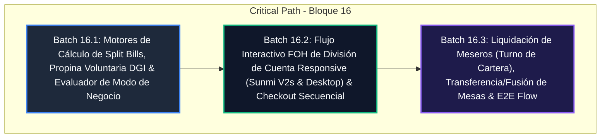

# OmniFood NI — Execution Plan: Bloque 16
## Gestión Avanzada de Salón, División de Cuentas (Split Bills) & Propinas (Offline-First)

---

## 1. Authority & Traceability

- **PRD Reference**:
  - [`docs/PRDs/prd_modulo_ventas.md`](docs/PRDs/prd_modulo_ventas.md) (Secciones 2.1 Interfaz Adaptativa y Táctica, 2.3 Retención de Cuentas, 2.5 Checkout Multi-Moneda y Pagos Divididos, 2.6 Motor de Impuestos).
  - [`docs/PRDs/Product_Requirement_Document_v2.md`](docs/PRDs/Product_Requirement_Document_v2.md) (Sección FOH & Salon Management).
  - [`docs/PRDs/Done/prd_gestion_identidad_acceso_y_auditoria.md`](docs/PRDs/Done/prd_gestion_identidad_acceso_y_auditoria.md) (Turnos de mesero, transferencias de mesa y autorizaciones).
- **Parent Milestone**:
  - [`docs/plans/master_execution_roadmap.md`](docs/plans/master_execution_roadmap.md) (Bloque 16: Gestión Avanzada de Salón, División de Cuentas & Propinas).
- **Core Constraints**:
  - **Offline-First or Muerte**: El cálculo de propinas, división de cuentas (partes iguales o por ítem) y gestión de salón opera 100% desconectado en SQLite local.
  - **Cumplimiento Fiscal DGI (Nicaragua - Disposición Técnica 09-2007)**: La propina voluntaria (10% sugerida o personalizada) **NO es gravable con el 15% de IVA** (no incrementa la base imponible del IVA). Se desglosa en el ticket y en la factura inmutable.
  - **Multi-Tenant & Business Operation Modes**: Evaluación estricta de `TenantOperationMode` (`FOODPARK_QSR`, `RESTAURANT`, `HYBRID`):
    - `FOODPARK_QSR`: Mostrador rápido con buzzer/pager. No requiere gestión de mesas ni split comensal de salón; checkout directo.
    - `RESTAURANT`: Gestión completa de salón (áreas y mesas), retención de comandas por mesa/mesero, división de cuentas (iguales o por ítem) y propina voluntaria sugerida (10%).
    - `HYBRID`: Operación multimodal (permite órdenes de mostrador con buzzer y órdenes de mesa con comanda, split y propinas).
  - **Floor & Freezed Conventions**: DAOs Floor con métodos `@transaction` usando parámetros exclusivamente posicionales. Modelos inmutables con `@freezed`.
  - **Zero `any`**: Tipado estricto en NestJS y Flutter.

---

## 2. Invariants & Architectural Decisions

### Invariants
- **INV-16.1 (No Gravabilidad DGI de la Propina)**: La propina voluntaria ($Tip$) jamás se suma a la base imponible del IVA ($IVA = Subtotal_{Gravado} \times 0.15$). El total a pagar es $Total = Subtotal_{Neto} + IVA + Tip - Descuentos$.
- **INV-16.2 (Conservación de Centavos en Split Igualitario)**: Al dividir una cuenta de $T$ córdobas entre $N$ partes ($N \ge 1$), la suma exacta de las $N$ partes debe ser idéntica a $T$ ($\sum_{i=1}^N P_i = T$). Los residuos por redondeo de centavos ($T \pmod N$) se distribuyen deterministamente entre las primeras partes.
- **INV-16.3 (Integridad de Ítems en Split por Selección)**: En una división por ítems, la unión disjunta de ítems de todas las sub-cuentas debe ser exactamente igual a los ítems del ticket original. Ningún ítem puede duplicarse ni omitirse.
- **INV-16.4 (Aislamiento de Modos Operativos)**: En modo `FOODPARK_QSR`, las acciones de salón (asignar mesa, dividir cuenta por comensales, propina sugerida de salón) se inhabilitan para optimizar la velocidad táctica del mostrador. En modo `HYBRID`, la activación de mesa habilita dinámicamente el motor de salón.

### Decisions
- **DEC-16.1 (Taxonomía de Propinas)**:
  1. `SUGGESTED_10_PERCENT`: 10% calculado sobre el subtotal neto de consumo.
  2. `CUSTOM_PERCENTAGE`: Porcentaje libre definido por el cliente/cajero (ej. 5%, 15%, 20%).
  3. `FIXED_AMOUNT`: Monto fijo en córdobas (NIO) o dólares (USD) convertido con el tipo de cambio comercial.
  4. `NONE`: Sin propina (0.00).
- **DEC-16.2 (Estructura de División de Cuentas)**:
  - *Equal Split (Por Comensales)*: Divide subtotal, IVA, propina y total equitativamente entre $N$ vouchers/recibos.
  - *Itemized Split (Por Ítems)*: Asigna ítems específicos a $M$ sub-comandas, calculando impuestos y propina proporcional o individual.

---

## 3. Dependency DAG & Critical Path

---

## 4. Milestone Roadmap

| Batch | Capability / Outcome | Target Surface | Test Evidence | Status |
|---|---|---|---|---|
| **Batch 16.1** | Motores de Cálculo de Split Bills (Partes Iguales + Por Ítems), Propina Voluntaria (10% DGI Non-Taxable) & Evaluador de Modo Operativo (FoodPark QSR vs Restaurant vs Hybrid) | POS (`pos_app`) Domain & Core | `tip_engine_test.dart` (7 tests) + `split_bill_engine_test.dart` (7 tests) + `business_mode_evaluator_test.dart` (4 tests) + `split_bill_integration_flow_test.dart` (3 tests) + `salon_split_bill_responsive_e2e_test.dart` (3 tests) | **COMPLETADO ✅** |
| **Batch 16.2** | Diálogo y Flujo Táctico de Split Bill Responsive (Sunmi V2s <500dp / Tablet >=500dp), Selección de Ítems, Asignación de Propina & Pago Secuencial | POS (`pos_app`) UI / Presentation | `split_bill_dialog_test.dart` (5 tests) + `responsive_split_checkout_test.dart` (2 tests) | **COMPLETADO ✅** |
| **Batch 16.3** | Liquidación de Mesero (`carteraMesero`), Transferencia/Fusión de Mesas con Recálculo y Auditoría Forense FOH + E2E Suite | POS (`pos_app`) Domain + UI + E2E | `waiter_settlement_service_test.dart` (3 tests) + `table_transfer_merge_test.dart` (3 tests) + `restaurant_split_tip_e2e_test.dart` (1 complete flow) | **COMPLETADO ✅** |

---

## 5. Batch Detailed Contracts & Verification

- **Batch 16.1**: Implementó `TipEngine`, `SplitBillEngine` y `BusinessModeEvaluator` respetando las normativas DGI de propina no gravable y conservación determinista de centavos.
- **Batch 16.2**: Implementó `SplitBillDialog` con diseño responsive optimizado para handhelds Sunmi V2s (<500dp) y tablets (>=500dp), selectores de propina voluntaria (10%, 15%, 20%, Sin Propina) y asignación por ítem.
- **Batch 16.3**: Implementó `WaiterSettlementService` con la invariante `INV-16.5` (bloqueo de cierre de turno si existen mesas abiertas asignadas), transferencia y fusión de mesas con protección de concurrencia optimista y flujo E2E completo de ciclo de vida en restaurante.

